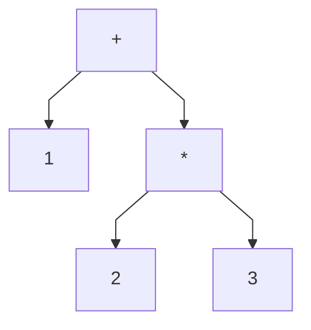
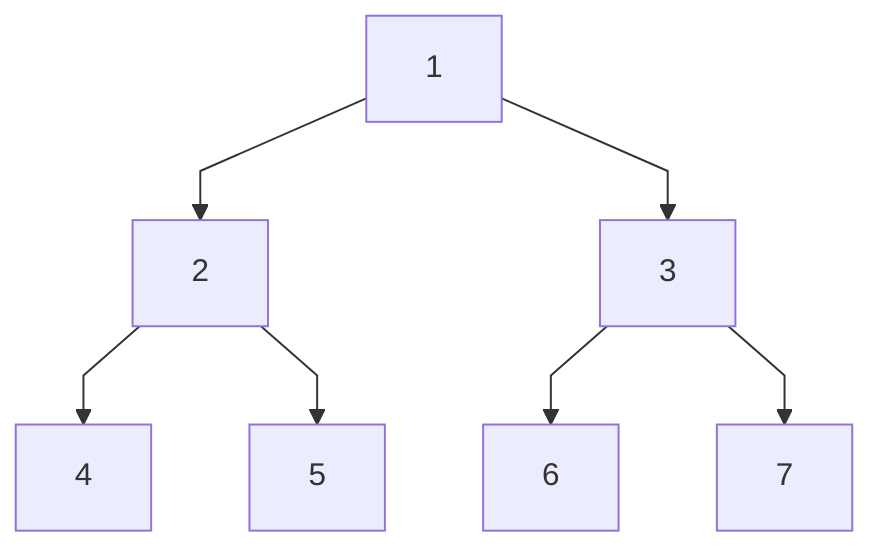

# type declarations
- in haskell, a new name for an existing type can be defined using a type declaration
```hs
type String = [Char]
```
- type declarations can be used to make other types easier to read
```hs
type Pos = (Int, Int)
-- define var
origin :: Pos
origin = (0, 0)

left :: Pos -> Pos
left (x, y) = (x - 1, y)
```
- similar to function definitions, type declarations can also have `parameters`
```hs
type Pair a = (a, a)

mult :: Pair Int -> Int
mult (m, n) = m * n

copy :: a -> Pair a
copy x = (x, x)
```

# data declarations
- a completely new type can be defined by specifying its values by using data declaration
```hs
data Bool = False | True
-- bool is a new type, with two new values False and True
```
- the values `False` and `True` are called the `constructor` for the type `Bool`
- type and constructor names must always begin with an `upper case letter`
- data declaration are similar to content free grammar
  - the former specifies the value of a type, the latter the sentences of a language
- values of new types can be used in the same way as those of the built types
```hs
data Answer = Yes | No | Unknown

answers :: [Answer]
flip :: Answer -> Answer
flip Yes = No
flip No = Yes
flip Unknown = Unknown
```
- the constructor in data declaration can also have parameters
```hs
data Shape = Circle Float | Rect Float Float

square :: Float -> Shape
square n = Rect n n 

area :: Shape -> Float
area (Circle r) = pi * r * r
area (Rect x y) = x * y
```
- shapes has the values of the form:
  - `Circle r` where `r` is a float
  - `Rect x y` where `x` and `y` are floats
- `Circle` and `Rect` can be viewed as functions that construct values of type `Shape`
```hs
Circle :: Float -> Shape
Rect :: Float -> Float -> Shape
```
- data declarations themselves can also hbave parameters
- `data Maybe a = Nothing | Just a`

# recursive types
- new types can be declared in terms of themselves
```hs
data Nat = Zero | Succ Nat
```
  - `Nat` is a new type with constructors `Zero :: Nat` and `Succ :: Nat -> Nat`
  - a value of type `Nat` is neither `Zero`, or of the form `Succ n` where `n :: Nat`
    - `Nat` contains the following infinite sequence of values:
      - `Zero`
      - `Succ Zero`
      - `Succ (Succ Zero)`

## arithmetic expressions
- consider a simple form of expressions built up from integers using addition and multiplication

- using recursion, a suitable new type to represent such an expression can be declared:
```hs
data Expr = Val Int
  | Add Expr Expr
  | Mul Expr Expr
```
- then, we could write the above tree as `Add (Val 1) (Mul (Val 2) (Val 3))`
- using recursion, it is easy to define functions that convert between values of type `Nat` and `Int`:
```hs
size :: Expr -> Int
size (Val n) = 1
size (Add x y) = size x + size y
size (Mul x y) = size x + size y

eval :: Expr -> Int
eval (Val n) = n
eval (Add x y) = eval x + eval y
eval (Mul x y) = eval x * eval y
```

## binary tree
- often usesful to store data in a two-way branching structure, or a binary tree

- using recursion, a suitable new type to represent binary trees can be declared by:
```hs
data Tree a = Leaf a | Node (Tree a) a (Tree a)
t :: Tree Int
```