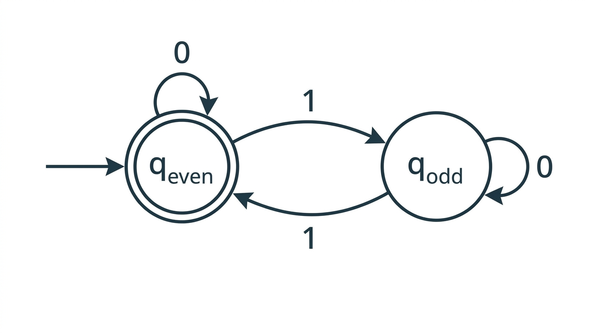

# DFAs & Regular Languages — COMP0003 Automata

*Lecture-style notes covering Automata Lectures 1–2. **Automata theory** studies abstract machines (DFAs, PDAs, Turing machines) and the classes of languages they recognise. We begin with the simplest model — the **deterministic finite automaton (DFA)** — and the **regular languages** it defines. Mastery of the formal 5-tuple, transition tracing, and **closure proofs** (complement, union via product construction) is essential for everything that follows.*

---

## 1. COMPLETE TOPIC SUMMARY

### What automata theory is about

Automata theory classifies **computational models** by the languages they can recognise:

| Machine | Language class |
|---------|---------------|
| **DFA / NFA** | Regular languages |
| **PDA** (pushdown automaton) | Context-free languages |
| **Turing machine** | Recursively enumerable languages |

A central question throughout the module: *given a language, what is the simplest machine that recognises it?*

---

### Data structures review

The formal definitions ahead rely on standard mathematical objects. A quick reference:

- **Set.** An unordered collection of distinct elements, e.g. $\{a, b, c\}$. The **empty set** is $\emptyset$.
- **Tuple.** An ordered, fixed-length sequence, e.g. $(q_0, a)$. A **$k$-tuple** has $k$ components.
- **Cartesian product.** $A \times B = \{(a, b) \mid a \in A,\; b \in B\}$. Generalises to $A_1 \times \cdots \times A_k$.
- **Power set.** $\mathcal{P}(A)$ is the set of all subsets of $A$. If $|A| = n$ then $|\mathcal{P}(A)| = 2^n$.
- **Function.** A mapping $f : A \to B$ assigns exactly one element of $B$ to each element of $A$. A **total** function is defined on every element of its domain.
- **Alphabet.** A finite, non-empty set of symbols, conventionally denoted $\Sigma$.
- **String.** A finite sequence of symbols from $\Sigma$. The **empty string** is denoted $\varepsilon$ (length 0).
- **Language.** Any set of strings over $\Sigma$ (may be finite or infinite). The set of **all** strings over $\Sigma$ (including $\varepsilon$) is $\Sigma^*$.
- **Graph.** A set of **nodes** (vertices) and **edges** (directed or undirected). DFAs are naturally drawn as directed graphs — states are nodes, transitions are labelled directed edges.

---

### How a DFA works — intuition

*A DFA with two states that accepts strings containing an even number of 1s. The double circle marks the accept state; the arrow from nowhere marks the start state.*

A DFA reads an input string **one symbol at a time**, left to right. It maintains a single **current state**. On reading a symbol, it follows the unique outgoing edge labelled with that symbol to a new state. After the last symbol, the DFA **accepts** if the current state is an **accept state** and **rejects** otherwise.

Key properties:

- **Deterministic:** exactly one transition per (state, symbol) pair — no choices.
- **Finite:** finitely many states, no auxiliary storage.
- **No backtracking:** reads each symbol once, never revisits.

---

### Examples of DFAs

**Example 1 — even number of 1s** over $\Sigma = \{0, 1\}$.

Two states: $q_{\text{even}}$ (start, accept) and $q_{\text{odd}}$. Reading a $1$ toggles between them; reading a $0$ stays put. The empty string $\varepsilon$ is accepted (zero 1s is even).

**Example 2 — the string is exactly "abb"** over $\Sigma = \{a, b\}$.

Four states tracing the progress through the characters $a$, $b$, $b$, plus a **trash state** that absorbs any deviation. Only the state reached after reading exactly $a$, $b$, $b$ (with no further input) is accepting.

**Example 3 — contains "abac"** over $\Sigma = \{a, b, c\}$.

States track the longest prefix of "abac" matched so far ($0, 1, 2, 3, 4$ characters matched). Once all four are matched, the machine stays in the accept state regardless of further input.

**Example 4 — ends in "cc" or "cba"** over $\Sigma = \{a, b, c\}$.

States remember the relevant suffix of the input seen so far. Multiple accept states correspond to the two patterns.

---

### Formal definition of a DFA

> A **deterministic finite automaton** is a 5-tuple $M = (Q,\; \Sigma,\; \delta,\; q_0,\; F)$ where:
>
> 1. $Q$ is a **finite** set of states.
> 2. $\Sigma$ is a **finite** alphabet.
> 3. $\delta : Q \times \Sigma \to Q$ is the **transition function** (total).
> 4. $q_0 \in Q$ is the **start state**.
> 5. $F \subseteq Q$ is the set of **accept** (final) states.

**Important:** $\delta$ must be **total** — defined for every $(q, a) \in Q \times \Sigma$. If a diagram leaves a transition "undefined," a **trash state** (also called a **sink** or **dead state**) is implicitly present to absorb that input. The trash state has all transitions looping back to itself and is **not** an accept state.

---

### Transition function as a table

For the "even number of 1s" DFA with $Q = \{q_e, q_o\}$, $\Sigma = \{0, 1\}$, $q_0 = q_e$, $F = \{q_e\}$:

| | $0$ | $1$ |
|---|---|---|
| $q_e$ | $q_e$ | $q_o$ |
| $q_o$ | $q_o$ | $q_e$ |

Every cell is filled — this is what makes $\delta$ total.

---

### Trash / sink states

When a DFA diagram omits an edge — say state $q$ has no arrow for symbol $a$ — the **formal** DFA includes a non-accepting **trash state** $q_{\text{trap}}$ with:

$$\delta(q, a) = q_{\text{trap}} \qquad \text{and} \qquad \delta(q_{\text{trap}}, x) = q_{\text{trap}} \;\;\forall\, x \in \Sigma$$

This ensures $\delta$ is total. In diagrams the trash state is often suppressed for clarity, but it must appear in any formal 5-tuple answer.

---

### DFA acceptance — formal definition

> A DFA $M = (Q, \Sigma, \delta, q_0, F)$ **accepts** a string $w = w_1 w_2 \cdots w_n$ (each $w_i \in \Sigma$) if and only if there exists a **sequence of states** $r_0, r_1, \ldots, r_n \in Q$ such that:
>
> 1. $r_0 = q_0$ &ensp;(start in the start state),
> 2. $r_{i+1} = \delta(r_i,\, w_{i+1})$ for $i = 0, 1, \ldots, n-1$ &ensp;(follow transitions), and
> 3. $r_n \in F$ &ensp;(end in an accept state).

If $w = \varepsilon$ (length 0), the sequence is just $r_0 = q_0$; the DFA accepts $\varepsilon$ iff $q_0 \in F$.

---

### Language of a DFA

> The **language recognised** (or accepted) by a DFA $M$ is:
>
> $$L(M) = \{ w \in \Sigma^* \mid M \text{ accepts } w \}$$

$L(M)$ may be **finite** (e.g. $\{abb\}$), **infinite** (e.g. all strings with an even number of 1s), or **empty** ($\emptyset$, if no string leads to an accept state).

**Set-builder notation** is the standard way to describe languages:

$$L = \{ w \in \{0,1\}^* \mid \text{the number of 1s in } w \text{ is even} \}$$

---

### The empty string

$\varepsilon$ denotes the string of length zero. It belongs to $\Sigma^*$ for every alphabet $\Sigma$. Whether a DFA accepts $\varepsilon$ depends solely on whether the start state is an accept state: $\varepsilon \in L(M) \iff q_0 \in F$.

---

### Regular languages

> A language $L$ is called **regular** if there exists some DFA $M$ such that $L(M) = L$.

Equivalently, the **regular languages** are exactly the class of languages recognisable by DFAs. Later we show that NFAs and regular expressions define the same class.

---

### Closure properties of regular languages

"Closed under an operation" means: applying the operation to regular language(s) always yields a regular language.

#### Closure under complement

**Theorem.** If $L$ is regular, then $\overline{L} = \Sigma^* \setminus L$ is regular.

**Proof.** Let $M = (Q, \Sigma, \delta, q_0, F)$ be a DFA recognising $L$. Construct

$$N = (Q,\; \Sigma,\; \delta,\; q_0,\; Q \setminus F)$$

$N$ is identical to $M$ except the accept and non-accept states are **swapped**. For any string $w$, the state sequence in $N$ is exactly the same as in $M$ — only the acceptance criterion is inverted. Therefore $L(N) = \overline{L}$, which is recognised by a DFA and hence regular. $\blacksquare$

**Why $\delta$ must be total:** If $\delta$ were partial (some transitions missing), a string that "gets stuck" would be rejected by $M$. Flipping accept states would not correctly capture that string as accepted by $N$, because $N$ would also get stuck. Totality of $\delta$ ensures every string reaches a definite state in both machines.

---

#### Closure under union (product construction)

**Theorem.** If $L_1$ and $L_2$ are regular, then $L_1 \cup L_2$ is regular.

**Proof.** Let $M_1 = (Q_1, \Sigma, \delta_1, q_1, F_1)$ and $M_2 = (Q_2, \Sigma, \delta_2, q_2, F_2)$ be DFAs for $L_1$ and $L_2$ respectively (assume the same alphabet $\Sigma$; if not, take $\Sigma = \Sigma_1 \cup \Sigma_2$ and add trash-state transitions).

Construct the **product DFA**:

$$N = (Q,\; \Sigma,\; \delta,\; q_0,\; F)$$

where:

- $Q = Q_1 \times Q_2$ — each state is a **pair** $(q_i, q_j)$ tracking both machines simultaneously.
- $q_0 = (q_1, q_2)$.
- $\delta\big((r_1, r_2),\, a\big) = \big(\delta_1(r_1, a),\; \delta_2(r_2, a)\big)$ for every $(r_1, r_2) \in Q$ and $a \in \Sigma$.
- $F = \{(r_1, r_2) \in Q \mid r_1 \in F_1 \;\text{or}\; r_2 \in F_2\}$.

$N$ simulates $M_1$ and $M_2$ in parallel. After reading $w$, $N$ is in state $(\delta_1^*(q_1, w),\; \delta_2^*(q_2, w))$ and accepts iff **at least one** component is accepting. Therefore $L(N) = L_1 \cup L_2$. $\blacksquare$

**Intersection.** Changing the accept condition to $F = \{(r_1, r_2) \mid r_1 \in F_1 \;\text{and}\; r_2 \in F_2\}$ gives $L_1 \cap L_2$, proving closure under intersection by the same construction.

**Size.** The product DFA has $|Q_1| \times |Q_2|$ states — potentially large but always finite.

---

#### Closure under concatenation — teaser

$L_1 \circ L_2 = \{xy \mid x \in L_1,\; y \in L_2\}$ is also regular, but the proof requires **nondeterministic finite automata (NFAs)**, covered in the next lecture. The difficulty is that a DFA cannot "guess" where to split the input between the $L_1$ part and the $L_2$ part.

---

## 2. EXAM-STYLE QUESTIONS (WITH MODEL ANSWERS)

### Q1 — Formal 5-tuple from a DFA description

**Question.** A DFA over $\Sigma = \{0, 1\}$ has states $\{q_0, q_1, q_2\}$, start state $q_0$, and accept state $q_1$. The transitions are: $\delta(q_0, 0) = q_0$, $\delta(q_0, 1) = q_1$, $\delta(q_1, 0) = q_2$, $\delta(q_1, 1) = q_0$, $\delta(q_2, 0) = q_1$, $\delta(q_2, 1) = q_2$. Give the formal 5-tuple.

**Model answer.**

$$M = \big(\{q_0, q_1, q_2\},\;\; \{0, 1\},\;\; \delta,\;\; q_0,\;\; \{q_1\}\big)$$

where $\delta$ is defined by:

| | $0$ | $1$ |
|---|---|---|
| $q_0$ | $q_0$ | $q_1$ |
| $q_1$ | $q_2$ | $q_0$ |
| $q_2$ | $q_1$ | $q_2$ |

All transitions are specified, so $\delta$ is total. $Q = \{q_0, q_1, q_2\}$, $\Sigma = \{0, 1\}$, $q_0$ is the start state, $F = \{q_1\}$.

---

### Q2 — Trace a DFA on an input string

**Question.** Using the DFA $M$ from Q1, trace the computation on the input string $w = 01101$. Does $M$ accept or reject $w$?

**Model answer.** The state sequence $r_0, r_1, \ldots, r_5$:

| Step | Symbol read | Current state | Transition |
|------|------------|---------------|------------|
| 0 | — | $q_0$ | (start) |
| 1 | $0$ | $q_0$ | $\delta(q_0, 0) = q_0$ |
| 2 | $1$ | $q_1$ | $\delta(q_0, 1) = q_1$ |
| 3 | $1$ | $q_0$ | $\delta(q_1, 1) = q_0$ |
| 4 | $0$ | $q_0$ | $\delta(q_0, 0) = q_0$ |
| 5 | $1$ | $q_1$ | $\delta(q_0, 1) = q_1$ |

Final state: $r_5 = q_1 \in F = \{q_1\}$. **$M$ accepts $w = 01101$.**

---

### Q3 — Construct a DFA for a given language

**Question.** Construct a DFA over $\Sigma = \{a, b\}$ that recognises the language $L = \{ w \in \{a, b\}^* \mid w \text{ contains the substring } ab \}$.

**Model answer.** Three states tracking progress toward seeing $ab$:

- $q_0$: have not yet seen any relevant prefix. (Start state.)
- $q_1$: the most recent symbol was $a$ (we are "ready" for a $b$).
- $q_2$: we have seen $ab$. (Accept state; stay here forever.)

Transition table:

| | $a$ | $b$ |
|---|---|---|
| $q_0$ | $q_1$ | $q_0$ |
| $q_1$ | $q_1$ | $q_2$ |
| $q_2$ | $q_2$ | $q_2$ |

Formal 5-tuple: $M = (\{q_0, q_1, q_2\},\; \{a, b\},\; \delta,\; q_0,\; \{q_2\})$.

**Correctness argument.** Before seeing $ab$, the machine remembers whether the last symbol was $a$ (state $q_1$) or not ($q_0$). Once $b$ follows an $a$, we move to the absorbing accept state $q_2$. Any string containing $ab$ eventually reaches $q_2$; any string not containing $ab$ never does.

---

### Q4 — Prove complement closure formally

**Question.** Prove that the class of regular languages is closed under complement.

**Model answer.**

Let $L$ be a regular language. Then there exists a DFA $M = (Q, \Sigma, \delta, q_0, F)$ with $L(M) = L$.

Define $N = (Q, \Sigma, \delta, q_0, Q \setminus F)$.

$N$ is a valid DFA: $Q$ is finite, $\Sigma$ is finite, $\delta$ is the same total transition function, $q_0 \in Q$, and $Q \setminus F \subseteq Q$.

For any string $w \in \Sigma^*$, let $r$ be the state reached by both $M$ and $N$ after reading $w$ (they share the same $\delta$ and $q_0$, so the computation is identical).

- If $w \in L$, then $r \in F$, so $r \notin Q \setminus F$, so $N$ rejects $w$.
- If $w \notin L$, then $r \notin F$, so $r \in Q \setminus F$, so $N$ accepts $w$.

Therefore $L(N) = \Sigma^* \setminus L = \overline{L}$. Since $N$ is a DFA, $\overline{L}$ is regular. $\blacksquare$

**Critical note:** This proof relies on $\delta$ being **total**. If $\delta$ were partial, strings that cause $M$ to "get stuck" would be rejected by $M$ but would also get stuck in $N$ (and thus be rejected, not accepted as required).

---

### Q5 — Product DFA for union of two DFAs

**Question.** Let $M_1$ recognise $L_1 = \{ w \in \{0,1\}^* \mid w \text{ ends in } 0 \}$ with states $\{s_0, s_1\}$, start $s_0$, accept $\{s_1\}$, and transitions $\delta_1(s_0, 0) = s_1$, $\delta_1(s_0, 1) = s_0$, $\delta_1(s_1, 0) = s_1$, $\delta_1(s_1, 1) = s_0$.

Let $M_2$ recognise $L_2 = \{ w \in \{0,1\}^* \mid w \text{ has an odd number of 1s} \}$ with states $\{t_0, t_1\}$, start $t_0$, accept $\{t_1\}$, and transitions $\delta_2(t_0, 0) = t_0$, $\delta_2(t_0, 1) = t_1$, $\delta_2(t_1, 0) = t_1$, $\delta_2(t_1, 1) = t_0$.

Construct the product DFA $N$ for $L_1 \cup L_2$.

**Model answer.**

$Q = Q_1 \times Q_2 = \{(s_0, t_0),\; (s_0, t_1),\; (s_1, t_0),\; (s_1, t_1)\}$

$q_0 = (s_0, t_0)$

$F = \{(r_1, r_2) \mid r_1 \in \{s_1\} \text{ or } r_2 \in \{t_1\}\} = \{(s_0, t_1),\; (s_1, t_0),\; (s_1, t_1)\}$

Transition table for $\delta$:

| | $0$ | $1$ |
|---|---|---|
| $(s_0, t_0)$ | $(s_1, t_0)$ | $(s_0, t_1)$ |
| $(s_0, t_1)$ | $(s_1, t_1)$ | $(s_0, t_0)$ |
| $(s_1, t_0)$ | $(s_1, t_0)$ | $(s_0, t_1)$ |
| $(s_1, t_1)$ | $(s_1, t_1)$ | $(s_0, t_0)$ |

**Verification on** $w = 10$: $(s_0,t_0) \xrightarrow{1} (s_0,t_1) \xrightarrow{0} (s_1,t_1)$. Final state $(s_1,t_1) \in F$. Correct: $10$ ends in $0$ and has an odd number of 1s.

**Verification on** $w = \varepsilon$: stay at $(s_0, t_0) \notin F$. Correct: $\varepsilon$ does not end in $0$ and has zero (even) 1s.

$$N = \big(\{(s_0,t_0),(s_0,t_1),(s_1,t_0),(s_1,t_1)\},\;\{0,1\},\;\delta,\;(s_0,t_0),\;\{(s_0,t_1),(s_1,t_0),(s_1,t_1)\}\big)$$

---

## 3. MUST-KNOW KEY POINTS

- A **DFA** is a 5-tuple $(Q, \Sigma, \delta, q_0, F)$ where $\delta : Q \times \Sigma \to Q$ must be **total** — every (state, symbol) pair has exactly one transition.
- A DFA **accepts** $w = w_1 \cdots w_n$ iff the unique run $r_0, r_1, \ldots, r_n$ (with $r_0 = q_0$ and $r_{i+1} = \delta(r_i, w_{i+1})$) ends in an accept state: $r_n \in F$.
- The **language** of $M$ is $L(M) = \{ w \in \Sigma^* \mid M \text{ accepts } w \}$; it can be finite, infinite, or empty.
- A language is **regular** iff some DFA recognises it.
- **Complement closure:** flip accept/non-accept states. Requires $\delta$ to be total.
- **Union closure (product construction):** $Q = Q_1 \times Q_2$, simulate both DFAs in parallel, accept if **either** component accepts. Changing "or" to "and" in $F$ gives **intersection**.
- **Trash / sink states** make $\delta$ total by absorbing undefined transitions in a non-accepting loop.
- The **empty string** $\varepsilon \in L(M)$ iff $q_0 \in F$.

---

## 4. HIGH-PRIORITY TOPICS

### 🔴 Must Know

- **Formal 5-tuple** $(Q, \Sigma, \delta, q_0, F)$ and what each component is.
- **Transition function** $\delta$ — why it must be **total**, how to represent it as a table.
- **Acceptance definition** with the state-sequence formulation ($r_0 = q_0$, $r_{i+1} = \delta(r_i, w_{i+1})$, $r_n \in F$).
- **Tracing** a DFA on a string: produce the state sequence and determine accept/reject.
- **Regular language** definition: recognised by some DFA.
- **Complement closure proof:** construct $N = (Q, \Sigma, \delta, q_0, Q \setminus F)$; argue correctness; emphasise totality of $\delta$.
- **Product construction** for union: $Q_1 \times Q_2$ state space, simultaneous simulation, $F$ uses "or."

### 🟡 Important

- **Trash / sink states:** when they are needed, how to add them formally.
- **Product construction for intersection:** same as union but $F$ uses "and."
- **Set-builder notation** for describing languages.
- **DFA construction** for specific languages: substrings, suffixes, parity of symbol counts.

### 🟢 Useful but Lower Priority

- **Concatenation closure** preview: needs NFAs because a DFA cannot guess the split point.
- **Cartesian product and power set** definitions — used later in subset construction.
- The automata hierarchy overview (DFA → NFA → PDA → TM) as a roadmap for the module.

---

## 5. TOPIC INTERCONNECTIONS & BIGGER PICTURE

- **NFAs** (Lectures 3–4) generalise DFAs by allowing multiple transitions per symbol and $\varepsilon$-transitions. Crucially, NFAs recognise exactly the same class — regular languages — proven via the **subset construction** ($2^{|Q|}$ states, using the power set of $Q$).
- **Regular expressions** (Lectures 5–6) provide a declarative notation for regular languages. The equivalence DFA $\leftrightarrow$ NFA $\leftrightarrow$ regex is a cornerstone of the module.
- **The pumping lemma** (Lecture 7) is the main tool for proving a language is **not** regular, complementing the closure proofs here that show languages **are** regular.
- **Pushdown automata** (later lectures) extend DFAs with a **stack**, recognising context-free languages. The formal-definition style $(Q, \Sigma, \Gamma, \delta, q_0, F)$ directly mirrors the DFA 5-tuple.
- **Turing machines** complete the hierarchy; every concept (states, transitions, acceptance) echoes the DFA formalism but with an infinite read/write tape, making the class of decidable languages strictly larger.

---

## 6. EXAM STRATEGY TIPS

- **Always give the full 5-tuple** when a question asks you to "define" or "describe" a DFA. Missing $q_0$ or $F$ loses marks even if the diagram is correct.
- **Make $\delta$ total.** If your diagram has missing edges, explicitly include a trash state in the formal answer. Markers will check this, especially in complement proofs.
- **For tracing questions**, write out a table with columns for step number, symbol read, and resulting state. This is much less error-prone than a narrative paragraph, and it earns method marks even if the final answer is wrong.
- **Product construction questions** have a pattern: define $Q$, $q_0$, $\delta$, $F$ symbolically first, then fill in the table. Verify on one or two short strings (including $\varepsilon$) as a sanity check.
- **Closure proofs** should state the DFA for $L$ exists (by assumption of regularity), construct the new DFA explicitly, and argue its language equals the target. A one-line "just flip accept states" without justification is insufficient.

---

*These notes align with COMP0003 Automata (Yuzuko Nakamura); follow your lecturer's conventions if they differ.*
