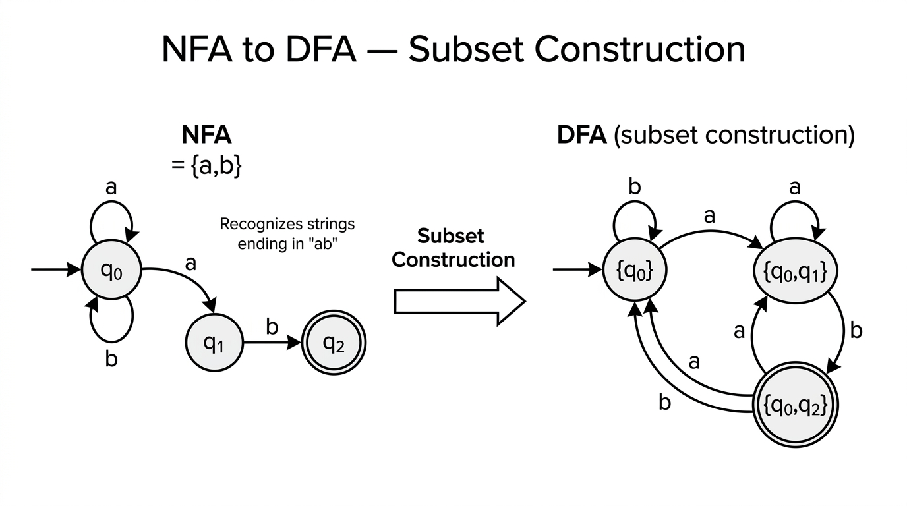

# NFAs & DFA Equivalence — COMP0003 Automata

*Lecture-style notes. A **nondeterministic finite automaton (NFA)** relaxes the DFA model by allowing **ε-transitions**, **multiple transitions** on the same symbol, and **missing transitions** — yet NFAs recognise **exactly the same** class of languages as DFAs. The **subset (powerset) construction** that converts any NFA to an equivalent DFA is one of the most important algorithms in the theory of computation.*

---

## 1. COMPLETE TOPIC SUMMARIES

### NFAs — convenience features over DFAs

A **nondeterministic finite automaton** is like a DFA with three relaxations:

1. **ε-transitions:** the machine may change state **without consuming** any input symbol.
2. **Multiple arrows on the same symbol:** from a single state, reading one symbol may lead to **several** different states simultaneously.
3. **Missing arrows:** a state need **not** have a transition for every symbol in **$\Sigma$**. If no arrow exists, that branch of computation simply **dies** (no crash — the branch is silently abandoned).

These features make NFAs **much easier to design** for many languages, while — as we prove below — adding **no extra recognition power** over DFAs.

---

### Example 1 — optional "baba" prefix + even number of b's

**Language.** $\Sigma = \{a, b\}$. Accept strings that **optionally** begin with "baba" and then contain an **even number** of **b**'s (in the remainder).

**NFA idea.** Use an **ε-transition** from the start state to branch:

- One path reads the prefix "baba" (states $q_0 \to q_1 \to q_2 \to q_3 \to q_4$ on inputs $b, a, b, a$) and then ε-transitions into the "even-b" counter.
- The other path goes directly (via ε) to the "even-b" counter (two states toggling on **b**, self-looping on **a**).

The ε-arrow lets the machine **choose** without seeing any input whether the prefix is present — nondeterminism handles both cases at once.

---

### Example 2 — substring "hello" detection

**Language.** $\Sigma = \{A, \ldots, Z, a, \ldots, z, 0, \ldots, 9\}$. Accept any string containing **"hello"** as a substring.

**NFA idea.** A start state $q_0$ has a **self-loop** on every symbol in $\Sigma$ **and** an arrow on **h** to $q_1$. Then a deterministic chain: $q_1 \xrightarrow{e} q_2 \xrightarrow{l} q_3 \xrightarrow{l} q_4 \xrightarrow{o} q_5$, with $q_5$ accepting and self-looping on every symbol.

This is **not** a valid DFA because $q_0$ has **two** transitions on **h** (the self-loop and the arrow to $q_1$). As an NFA it works perfectly: the machine nondeterministically "guesses" when the substring begins. No backtracking is needed.

---

### Nondeterminism — two equivalent intuitions

1. **Parallel-paths view:** the machine explores **all** possible branches simultaneously; it accepts if **any** branch reaches an accept state.
2. **"Somehow knows" view:** at each nondeterministic choice, the machine **magically picks** the right option — it accepts if there **exists** a sequence of choices that leads to acceptance.

Both views are equivalent. Neither requires physically trying all paths one by one; the definition of acceptance handles it existentially.

---

### Formal definition of an NFA

An NFA is a **5-tuple** $N = (Q,\; \Sigma,\; \delta,\; q_0,\; F)$, where:

| Component | Meaning |
|-----------|---------|
| $Q$ | Finite set of **states** |
| $\Sigma$ | Finite **alphabet** (input symbols) |
| $\delta : Q \times \Sigma_\varepsilon \to \mathcal{P}(Q)$ | **Transition function** — returns a **set** of states |
| $q_0 \in Q$ | **Start state** |
| $F \subseteq Q$ | Set of **accept (final) states** |

Here $\Sigma_\varepsilon = \Sigma \cup \{\varepsilon\}$, and $\mathcal{P}(Q)$ is the **power set** of $Q$ (the set of all subsets of $Q$).

**Key difference from a DFA:** the DFA transition function is $\delta : Q \times \Sigma \to Q$ (exactly **one** next state, no ε). The NFA transition function maps to a **subset** of $Q$ and also accepts **ε** as input.

---

### NFA acceptance

NFA $N = (Q, \Sigma, \delta, q_0, F)$ **accepts** input string $w = w_1 w_2 \cdots w_n$ (where each $w_i \in \Sigma_\varepsilon$) if **there exists** a sequence of states $r_0, r_1, \ldots, r_n$ such that:

1. $r_0 = q_0$ — start in the start state.
2. $r_{i+1} \in \delta(r_i,\; w_{i+1})$ for $i = 0, \ldots, n-1$ — each transition is valid.
3. $r_n \in F$ — end in an accept state.

The word **"exists"** is critical: it suffices that **one** valid path through the NFA leads to acceptance. Other paths may die or reject — that does not matter.

> **Note on ε in strings:** the strings $abb$, $\varepsilon abb$, and $a\varepsilon b\varepsilon b\varepsilon\varepsilon$ all represent the **same** input because ε contributes nothing.

---

### Equivalent power of NFAs and DFAs

**Theorem.** A language $L$ is recognised by some NFA **if and only if** $L$ is recognised by some DFA.

The proof has two directions:

| Direction | Difficulty | Idea |
|-----------|-----------|------|
| **DFA → NFA** | Trivial | Every DFA is already a valid NFA (syntactically) |
| **NFA → DFA** | Non-trivial | **Subset / powerset construction** |

---

### DFA → NFA (the easy direction)

Given a DFA $M = (Q, \Sigma, \delta, q_0, F)$, define NFA $N = (Q, \Sigma, \delta', q_0, F)$ where:

$$
\delta'(q, a) = \{\delta(q, a)\} \quad \text{for each } q \in Q,\; a \in \Sigma
$$
$$
\delta'(q, \varepsilon) = \emptyset \quad \text{for each } q \in Q
$$

That is, **wrap each DFA output in a singleton set** and add empty ε-transitions. The resulting NFA accepts exactly the same language.

---

### NFA → DFA conversion (subset / powerset construction)

*An NFA recognizing strings ending in "ab" (left) and the equivalent DFA produced by the subset construction (right). Each DFA state is a set of NFA states that the machine could be in simultaneously.*

This is the core construction. Given NFA $N = (Q, \Sigma, \delta, q_0, F)$, we build an equivalent DFA $M' = (Q', \Sigma, \delta', q_0', F')$.

#### ε-closure

For a set of NFA states $S \subseteq Q$, the **ε-closure** is:

$$
E(S) = S \;\cup\; \{q \in Q \mid q \text{ is reachable from some state in } S \text{ by following one or more } \varepsilon\text{-transitions}\}
$$

Computed by repeatedly expanding: start with $E(S) = S$, then add any state reachable via ε from a state already in $E(S)$, until no new states appear (fixed point).

#### Construction

| DFA component | Definition |
|---------------|------------|
| $Q' = \mathcal{P}(Q)$ | Each DFA state is a **subset** of NFA states |
| $\Sigma' = \Sigma$ | Alphabet unchanged |
| $q_0' = E(\{q_0\})$ | Start state is the ε-closure of the NFA start state |
| $F' = \{R \in Q' \mid R \cap F \neq \emptyset\}$ | Accept if the subset contains **any** NFA accept state |
| $\delta'(R, a) = \displaystyle\bigcup_{r \in R} E\big(\delta(r, a)\big)$ | For each NFA state in the current set, follow **a**, then take ε-closure; union the results |

Equivalently:

$$
\delta'(R,\, a) = \{q \in Q \mid q \in E(\delta(r, a)) \text{ for some } r \in R\}
$$

#### Why it works

The DFA state $R \subseteq Q$ tracks **exactly** which NFA states the NFA could be in after reading the input so far. On each new symbol **a**, we update $R$ to all states reachable from $R$ via **a** and then any number of ε-transitions. The DFA accepts iff $R$ contains an NFA accept state — matching the NFA's existential acceptance condition.

#### Size blow-up

$|Q'| = |\mathcal{P}(Q)| = 2^{|Q|}$. In the **worst case** the DFA can be **exponentially** larger than the NFA. In practice, many subsets are unreachable and can be pruned; the **lazy** construction only builds reachable states.

---

### Worked example — step-by-step NFA → DFA conversion

Consider the NFA for **"optionally starts with baba, then even number of b's"** with states $\{q_0, q_1, q_2, q_3, q_4, q_5\}$:

- $q_0$ is the start state, with ε-transitions to both $q_1$ (prefix path) and $q_4$ (skip-prefix path).
- $q_1 \xrightarrow{b} q_2 \xrightarrow{a} q_3 \xrightarrow{b} q_4'\xrightarrow{a} q_4$ reads "baba" then ε to $q_4$.
- $q_4$ (even-b, **accept**) loops on **a**, goes to $q_5$ on **b**.
- $q_5$ (odd-b) loops on **a**, goes to $q_4$ on **b**.

**Step 1 — Start state.** Compute $E(\{q_0\})$. From $q_0$, ε-transitions reach $q_1$ and $q_4$. So $q_0' = \{q_0, q_1, q_4\}$. This set contains $q_4 \in F$, so it is an **accept** state.

**Step 2 — Transitions from $\{q_0, q_1, q_4\}$.**

- **On a:** $\delta(q_0, a) = \emptyset$, $\delta(q_1, a) = \emptyset$, $\delta(q_4, a) = \{q_4\}$. Union: $\{q_4\}$. ε-closure: $E(\{q_4\}) = \{q_4\}$. New DFA state: **$\{q_4\}$** (accept).
- **On b:** $\delta(q_0, b) = \emptyset$, $\delta(q_1, b) = \{q_2\}$, $\delta(q_4, b) = \{q_5\}$. Union: $\{q_2, q_5\}$. ε-closure: $E(\{q_2, q_5\}) = \{q_2, q_5\}$. New DFA state: **$\{q_2, q_5\}$** (not accept).

**Step 3 — Transitions from $\{q_4\}$.**

- **On a:** $\{q_4\}$ (accept, self-loop).
- **On b:** $\{q_5\}$ (not accept).

**Step 4 — Transitions from $\{q_2, q_5\}$.**

- **On a:** $\delta(q_2, a) = \{q_3\}$, $\delta(q_5, a) = \{q_5\}$. Result: $E(\{q_3, q_5\}) = \{q_3, q_5\}$ (not accept).
- **On b:** $\delta(q_2, b) = \emptyset$, $\delta(q_5, b) = \{q_4\}$. Result: $E(\{q_4\}) = \{q_4\}$ (accept, already seen).

Continue until all reachable DFA states have complete transition tables. The result is a valid DFA that accepts exactly the same language as the original NFA. Unreachable subsets of $\mathcal{P}(Q)$ are never generated.

---

## 2. EXAM-STYLE QUESTIONS (WITH MODEL ANSWERS)

### Q1 — NFA formal definition

**Question.** Write down the formal definition of an NFA. Explain precisely how the transition function $\delta$ differs from that of a DFA, and state what $\Sigma_\varepsilon$ means.

**Model answer.** An NFA is a 5-tuple $(Q, \Sigma, \delta, q_0, F)$ where $Q$ is a finite set of states, $\Sigma$ is a finite alphabet, $q_0 \in Q$ is the start state, $F \subseteq Q$ is the set of accept states, and $\delta : Q \times \Sigma_\varepsilon \to \mathcal{P}(Q)$ is the transition function. Here $\Sigma_\varepsilon = \Sigma \cup \{\varepsilon\}$, so $\delta$ also takes the empty string as input. Unlike a DFA's $\delta : Q \times \Sigma \to Q$, which returns a **single** state and is defined for every symbol, the NFA's $\delta$ returns a **set** of states (possibly empty), allowing nondeterministic branching and ε-moves.

---

### Q2 — Tracing NFA execution

**Question.** Consider an NFA over $\Sigma = \{0, 1\}$ with states $\{q_0, q_1, q_2\}$, start state $q_0$, accept state $q_2$, and transitions:

| | 0 | 1 | ε |
|---|---|---|---|
| $q_0$ | $\{q_0\}$ | $\{q_0, q_1\}$ | $\emptyset$ |
| $q_1$ | $\emptyset$ | $\{q_2\}$ | $\emptyset$ |
| $q_2$ | $\emptyset$ | $\emptyset$ | $\emptyset$ |

Trace the execution of this NFA on input **"0110"**. Does the NFA accept?

**Model answer.** Track the set of states after each symbol:

- **Start:** $\{q_0\}$.
- **Read 0:** from $q_0$ on 0 → $\{q_0\}$. Active: $\{q_0\}$.
- **Read 1:** from $q_0$ on 1 → $\{q_0, q_1\}$. Active: $\{q_0, q_1\}$.
- **Read 1:** from $q_0$ on 1 → $\{q_0, q_1\}$; from $q_1$ on 1 → $\{q_2\}$. Union: $\{q_0, q_1, q_2\}$.
- **Read 0:** from $q_0$ on 0 → $\{q_0\}$; from $q_1$ on 0 → $\emptyset$; from $q_2$ on 0 → $\emptyset$. Active: $\{q_0\}$.

Final set $\{q_0\}$ does not contain $q_2$, so the NFA **rejects** "0110". The string is not accepted because the accepting branch (reaching $q_2$ after the second 1) dies on the trailing 0. This NFA recognises strings whose **second-to-last** symbol is 1.

---

### Q3 — NFA to DFA conversion with ε-closure

**Question.** Convert the following NFA to an equivalent DFA using the subset construction. The NFA has $Q = \{q_0, q_1, q_2\}$, $\Sigma = \{a, b\}$, start state $q_0$, accept state $q_2$, and transitions:

| | a | b | ε |
|---|---|---|---|
| $q_0$ | $\{q_0\}$ | $\emptyset$ | $\{q_1\}$ |
| $q_1$ | $\emptyset$ | $\{q_2\}$ | $\emptyset$ |
| $q_2$ | $\emptyset$ | $\emptyset$ | $\emptyset$ |

**Model answer.**

**ε-closures:** $E(\{q_0\}) = \{q_0, q_1\}$, $E(\{q_1\}) = \{q_1\}$, $E(\{q_2\}) = \{q_2\}$.

**DFA start state:** $q_0' = E(\{q_0\}) = \{q_0, q_1\}$.

**Build reachable states:**

| DFA state | On **a** | On **b** | Accept? |
|-----------|----------|----------|---------|
| $\{q_0, q_1\}$ | $E(\{q_0\}) = \{q_0, q_1\}$ | $E(\{q_2\}) = \{q_2\}$ | No |
| $\{q_2\}$ | $E(\emptyset) = \emptyset$ | $E(\emptyset) = \emptyset$ | **Yes** ($q_2 \in F$) |
| $\emptyset$ | $\emptyset$ | $\emptyset$ | No (dead/trap state) |

Working for $\{q_0, q_1\}$ on **a**: $\delta(q_0, a) = \{q_0\}$, $\delta(q_1, a) = \emptyset$. Union: $\{q_0\}$. ε-closure: $E(\{q_0\}) = \{q_0, q_1\}$.

Working for $\{q_0, q_1\}$ on **b**: $\delta(q_0, b) = \emptyset$, $\delta(q_1, b) = \{q_2\}$. Union: $\{q_2\}$. ε-closure: $E(\{q_2\}) = \{q_2\}$.

**Result DFA:** 3 states $\{\{q_0, q_1\}, \{q_2\}, \emptyset\}$; start $\{q_0, q_1\}$; accept $\{q_2\}$. It accepts strings of the form $a^*b$ (any number of a's followed by exactly one b).

---

### Q4 — Constructing an NFA for a given language

**Question.** Construct an NFA over $\Sigma = \{0, 1\}$ that recognises the language $L = \{w \mid w \text{ contains the substring } 101\}$. Your NFA should have at most 5 states.

**Model answer.** Use 4 states $\{q_0, q_1, q_2, q_3\}$ with start state $q_0$ and accept state $q_3$:

- $q_0$: self-loop on **0** and **1** (wait for the substring to begin). Transition to $q_1$ on **1**.
- $q_1$: transition to $q_2$ on **0**.
- $q_2$: transition to $q_3$ on **1**.
- $q_3$: accept; self-loop on **0** and **1** (once substring found, accept everything).

**Transition table:**

| | 0 | 1 |
|---|---|---|
| $q_0$ | $\{q_0\}$ | $\{q_0, q_1\}$ |
| $q_1$ | $\{q_2\}$ | $\emptyset$ |
| $q_2$ | $\emptyset$ | $\{q_3\}$ |
| $q_3$ | $\{q_3\}$ | $\{q_3\}$ |

The nondeterminism at $q_0$ on **1** is the key: the NFA guesses whether this particular 1 is the start of "101". If the guess is wrong, that branch dies; if correct, it reaches $q_3$ and accepts.

---

### Q5 — Proving NFA/DFA equivalence

**Question.** Outline the proof that every language recognised by an NFA is also recognised by some DFA. State the key idea and explain why the constructed DFA accepts a string if and only if the original NFA does.

**Model answer.** Given NFA $N = (Q, \Sigma, \delta, q_0, F)$, construct DFA $M' = (Q', \Sigma, \delta', q_0', F')$ via the subset construction: $Q' = \mathcal{P}(Q)$, $q_0' = E(\{q_0\})$, $F' = \{R \in Q' \mid R \cap F \neq \emptyset\}$, and $\delta'(R, a) = \bigcup_{r \in R} E(\delta(r, a))$.

**Correctness (sketch).** By induction on the length of the input string $w = w_1 \cdots w_n$, we prove that after reading $w_1 \cdots w_k$, the DFA is in state $R_k$ where $R_k$ is **exactly** the set of NFA states reachable from $q_0$ after reading $w_1 \cdots w_k$ (including ε-moves).

- **Base case ($k = 0$):** DFA starts in $E(\{q_0\})$, which is exactly the set of NFA states reachable from $q_0$ via ε-transitions before any input.
- **Inductive step:** Assume $R_k$ is correct after reading $w_1 \cdots w_k$. On symbol $w_{k+1}$, the DFA moves to $\delta'(R_k, w_{k+1}) = \bigcup_{r \in R_k} E(\delta(r, w_{k+1}))$, which is exactly the set of NFA states reachable after reading $w_1 \cdots w_{k+1}$.
- **Acceptance:** The DFA accepts iff $R_n \in F'$, i.e. $R_n \cap F \neq \emptyset$, which holds iff **some** NFA state reachable after reading $w$ is an accept state — precisely the NFA's acceptance condition.

Hence $L(M') = L(N)$.

---

## 3. MUST-KNOW KEY POINTS

- **NFA relaxations:** ε-transitions, multiple arrows on same symbol, missing arrows allowed — all absent in DFAs.
- **Formal definition:** $\delta : Q \times \Sigma_\varepsilon \to \mathcal{P}(Q)$; DFA has $\delta : Q \times \Sigma \to Q$.
- **Acceptance is existential:** NFA accepts if **there exists** a valid path to an accept state; DFA accepts if **the** (unique) path ends in an accept state.
- **NFAs = DFAs in power:** every NFA has an equivalent DFA and vice versa.
- **DFA → NFA:** trivial — wrap δ outputs in singleton sets, add empty ε-transitions.
- **NFA → DFA (subset construction):** DFA states are **subsets** of NFA states; $q_0' = E(\{q_0\})$; $\delta'(R, a) = \bigcup_{r \in R} E(\delta(r, a))$; accept if subset intersects $F$.
- **ε-closure $E(S)$:** all states reachable from $S$ by zero or more ε-transitions; must be applied **after every move**.
- **Worst-case blow-up:** $|Q'| = 2^{|Q|}$ — exponential, but often many states are unreachable.
- **"Syntactic sugar":** NFAs make design **easier** and **cleaner** but add no new expressive power.

---

## 4. HIGH-PRIORITY TOPICS

### 🔴 Must Know

- **NFA formal definition** — 5-tuple with $\delta : Q \times \Sigma_\varepsilon \to \mathcal{P}(Q)$; difference from DFA's δ.
- **NFA acceptance definition** — existential: some valid path reaches $F$.
- **ε-closure** — definition, how to compute it (fixed-point expansion), when to apply it (start state + after every symbol).
- **Subset construction** — full procedure: $Q' = \mathcal{P}(Q)$, $q_0' = E(\{q_0\})$, $\delta'(R, a)$ formula, $F'$ definition.
- **Tracing NFA execution** on a string — tracking the set of active states symbol by symbol.
- **Equivalence theorem** — statement and proof sketch (induction on input length).
- **Designing NFAs** for substring/pattern matching (nondeterministic "guess" where a pattern starts).

### 🟡 Important

- **DFA → NFA direction** — wrapping δ in singletons; why it's trivial.
- **Exponential blow-up** — worst case $2^{|Q|}$ states; practical pruning of unreachable states (lazy construction).
- **Worked conversion examples** — being able to produce the full DFA transition table from a given NFA.
- **Closure properties using NFAs** — union, concatenation, Kleene star constructions become much simpler with nondeterminism.

### 🟢 Useful but Lower Priority

- **Formal induction proof** of subset construction correctness (full base case + inductive step write-up).
- **Examples where the exponential blow-up is tight** (e.g. language "the $k$-th symbol from the end is 1" requires $2^k$ DFA states from a $(k+1)$-state NFA).
- **History and terminology:** nondeterminism in complexity theory vs. automata; Rabin & Scott's original 1959 result.

---

## 5. TOPIC INTERCONNECTIONS & BIGGER PICTURE

- **Closure properties become easy.** With NFAs, proving that regular languages are closed under **union**, **concatenation**, and **Kleene star** is elegant: add a new start state with ε-transitions. This is far simpler than the Cartesian-product DFA construction needed for union with DFAs alone.
- **Regular expressions ↔ NFAs.** The standard proof that regular expressions and finite automata are equivalent goes through NFAs: every regex is converted to an NFA (Thompson's construction), and every NFA can be converted to a regex (via state elimination or the GNFA method). NFAs are the bridge.
- **Subset construction as a general technique.** The idea of tracking a **set of configurations** as a single deterministic state reappears in **LR parser construction** (sets of items), **model checking** (reachability in product automata), and **regex engines** (NFA simulation).
- **Minimisation.** After converting NFA → DFA, the resulting DFA may have many unreachable or equivalent states. **DFA minimisation** (Myhill–Nerode, Hopcroft's algorithm) produces the unique minimal DFA — connecting to **Lecture 2's** equivalence-class ideas.
- **Beyond regular languages.** NFAs and DFAs both characterise exactly the **regular languages**. Later in the course, **pushdown automata** (PDAs, also nondeterministic) recognise **context-free languages** — strictly more powerful. Interestingly, **deterministic PDAs ≠ nondeterministic PDAs**, unlike the finite automaton case.
- **Complexity implications.** The exponential blow-up from NFA to DFA is a concrete example of the **nondeterminism gap** — a theme that resurfaces in **P vs NP** in computational complexity.

---

## 6. EXAM STRATEGY TIPS

- **Subset construction is the highest-yield exam topic here.** Practise converting small NFAs (3–5 states) to DFAs end-to-end; you must be fast and accurate with ε-closures.
- **Always compute $E(\{q_0\})$ first** — forgetting the initial ε-closure is the most common error.
- **Use a table** for the DFA transition function: rows are reachable subsets, columns are alphabet symbols. This keeps the construction organised and prevents missed states.
- **Label DFA states clearly** as sets (e.g. $\{q_0, q_2\}$) so the marker can follow your working.
- **When designing an NFA**, exploit nondeterminism to "guess" — e.g. where a substring starts or which branch to follow. State explicitly that the machine nondeterministically branches.
- **For the equivalence proof**, the key sentence is: "The DFA state after reading $w_1 \cdots w_k$ is exactly the set of NFA states reachable after reading $w_1 \cdots w_k$." If you state and justify this invariant, you have the core of the proof.
- **Don't forget the dead state $\emptyset$:** in the DFA, the empty set is a valid (non-accepting, trap) state. All transitions from $\emptyset$ go back to $\emptyset$.
- **Distinguish "NFA rejects" from "no valid transition":** in an NFA, a missing transition kills that branch but other branches survive. Rejection happens only when **all** branches die or none reaches an accept state.
- **Time management:** if asked to convert a large NFA, only build **reachable** states. State that unreachable subsets exist but are omitted — this saves time and is mathematically correct.

---

*These notes align with COMP0003 Automata (Yuzuko Nakamura); follow your lecturer's conventions if they differ.*
