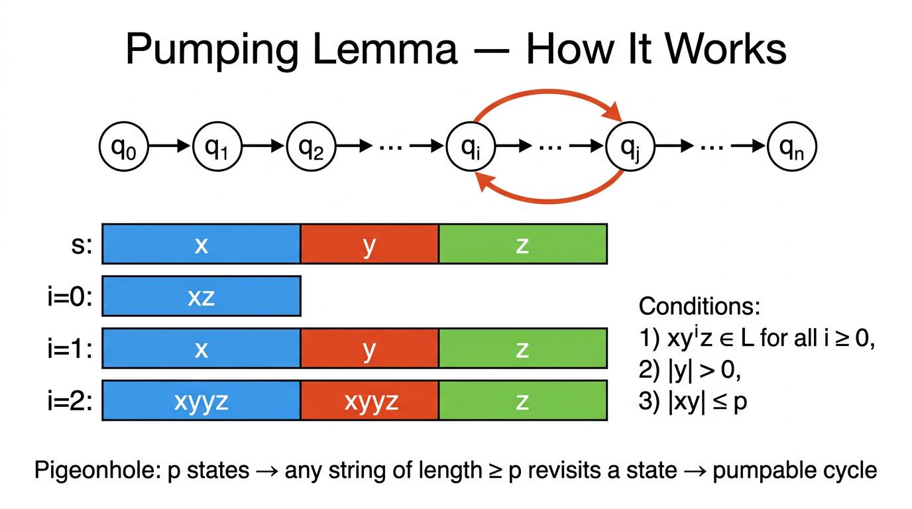

# Pumping Lemma for Regular Languages — COMP0003 Automata

*Lecture-style notes. The **pumping lemma** is the standard tool for proving a language is **not regular**. It formalises the intuition that a DFA with finitely many states **must revisit** a state on any sufficiently long input — creating a loop that can be **"pumped"** (repeated or removed). The contrapositive turns this into a proof technique: exhibit a string that **cannot be pumped** without leaving the language, and regularity is refuted.*

---

## 1. COMPLETE TOPIC SUMMARIES

### Limits of finite automata

A DFA has a **fixed, finite** number of states. If a language requires the machine to "remember" an **unbounded quantity** — for example, the exact number of $0$s seen so far in order to later match it with $1$s — no finite state set suffices. The language $\{0^n 1^n \mid n \geq 0\}$ is the textbook example: to accept $0^p 1^p$ the machine would need to distinguish $p+1$ different counts, so for arbitrary $p$ no single DFA works.

The pumping lemma captures this limitation precisely.

---

### The pumping lemma — statement

*A DFA with p states must revisit a state on any input of length ≥ p (Pigeonhole Principle). The cycle between states q_i and q_j creates the pumpable segment y. The string s = xyz can be pumped (y repeated or removed) and still accepted.*

**Theorem (Pumping Lemma for Regular Languages).** If $A$ is a regular language, then there exists an integer $p \geq 1$ (the **pumping length**) such that every string $s \in A$ with $|s| \geq p$ can be split into three parts $s = xyz$ satisfying **all three** of the following conditions:

1. $xy^i z \in A$ for every $i \geq 0$ — the middle piece $y$ can be **repeated** any number of times (including zero) and the result stays in $A$.
2. $|y| > 0$ — the pumped piece is **non-empty** (pumping actually changes the string).
3. $|xy| \leq p$ — $x$ and $y$ together lie within the **first $p$** characters of $s$.

> **Important:** the lemma says **"there exists some $p$"** and **"there exists some split $xyz$."** You do **not** get to choose $p$ or the split when applying the lemma.

---

### Proof sketch — pigeonhole on DFA states

Let $M$ be a DFA for $A$ with $n$ states. Set $p = n$.

Take any $s = s_1 s_2 \cdots s_m \in A$ with $m \geq p$. Processing $s$ visits $m + 1$ states (including the start state): $q_0, q_1, \ldots, q_m$, where $q_j = \delta(q_{j-1}, s_j)$.

Since $m + 1 > n$ (pigeonhole principle), some state $q_r$ appears **twice**: there exist indices $0 \leq j < k \leq p$ with $q_j = q_k$.

Define the split:

$$
x = s_1 \cdots s_j, \quad y = s_{j+1} \cdots s_k, \quad z = s_{k+1} \cdots s_m
$$

Then:

- **Condition 1:** The sub-path for $y$ is a **cycle** from $q_j$ back to $q_j$. Traversing it $i$ times (or zero times) still leads to $q_j$, then the DFA reads $z$ and reaches the same accept state. So $xy^i z \in A$.
- **Condition 2:** $k > j$, so $|y| = k - j \geq 1$.
- **Condition 3:** $k \leq p$, so $|xy| = k \leq p$.

---

### Using the contrapositive to prove non-regularity

The pumping lemma's logical structure is:

$$
A \text{ is regular} \;\Longrightarrow\; \exists\, p\;\; \forall\, s \in A,\; |s| \geq p\;\; \exists\, xyz \text{ split with conditions 1–3}
$$

The **contrapositive** is:

$$
\neg(\exists\, p \;\;\forall\, s \;\;\exists\, xyz \text{ with conditions 1–3}) \;\Longrightarrow\; A \text{ is not regular}
$$

Flipping the quantifiers:

$$
\forall\, p \;\;\exists\, s \in A,\; |s| \geq p \;\;\text{s.t.}\;\; \forall\, xyz \text{ splits}, \;\text{some condition fails} \;\Longrightarrow\; A \notin \text{RL}
$$

**Proof template (assume-for-contradiction):**

1. **Assume** $A$ is regular. Then the pumping lemma gives some $p$.
2. **Choose** a clever "evil string" $s \in A$ with $|s| \geq p$.
3. **For every** valid split $s = xyz$ (respecting $|y| > 0$ and $|xy| \leq p$), show that **some** $xy^i z \notin A$ for a particular $i$.
4. **Contradiction:** the pumping lemma is violated, so $A$ cannot be regular.

The art is in **step 2** — picking the right evil string — and **step 3** — arguing over all possible splits.

---

### Example 1 — 0^n 1^n (n ≥ 0) is not regular

**Proof.** Assume for contradiction that $A = \{0^n 1^n \mid n \geq 0\}$ is regular with pumping length $p$.

**Evil string:** $s = 0^p 1^p$. Clearly $s \in A$ and $|s| = 2p \geq p$.

Consider any split $s = xyz$ with $|y| > 0$ and $|xy| \leq p$.

Since $|xy| \leq p$, both $x$ and $y$ consist **entirely of $0$s** (the first $p$ characters are all $0$).

Write $x = 0^a$, $y = 0^b$ with $b \geq 1$, $z = 0^{p - a - b} 1^p$.

Pump with $i = 2$: $xy^2 z = 0^{a} 0^{2b} 0^{p-a-b} 1^p = 0^{p+b} 1^p$.

Since $b \geq 1$, there are **more $0$s than $1$s**, so $xy^2 z \notin A$. **Contradiction.**

---

### Example 2 — equal numbers of 0s and 1s is not regular

**Proof.** Let $A = \{w \in \{0,1\}^* \mid \#_0(w) = \#_1(w)\}$. Assume $A$ is regular with pumping length $p$.

**Evil string:** $s = 0^p 1^p \in A$, $|s| = 2p \geq p$.

By condition 3, $|xy| \leq p$, so $y$ lies entirely within the block of $0$s: $y = 0^b$ with $b \geq 1$.

Pump with $i = 2$: $xy^2 z$ has $p + b$ zeros and $p$ ones. Since $b \geq 1$, the counts are unequal, so $xy^2 z \notin A$. **Contradiction.**

> **Key observation:** Condition 3 ($|xy| \leq p$) is critical here — it forces $y$ into the all-$0$ prefix and eliminates cases where $y$ might straddle both blocks.

---

### Proof structure checklist

Every pumping-lemma non-regularity proof should include:

| Step | What to write |
|------|---------------|
| **Assume** | "$A$ is regular; let $p$ be its pumping length." |
| **Evil string** | State $s \in A$, verify $\|s\| \geq p$. |
| **All splits** | "Consider any $s = xyz$ with $\|y\| > 0$, $\|xy\| \leq p$." |
| **Derive contradiction** | Pick a specific $i$ (often $i = 0$ or $i = 2$) and show $xy^i z \notin A$. |
| **Conclude** | "Contradiction with the pumping lemma, so $A$ is not regular." |

---

## 2. EXAM-STYLE QUESTIONS (WITH MODEL ANSWERS)

### Q1 — State the pumping lemma

**Question.** State the pumping lemma for regular languages precisely, including all three conditions.

**Model answer.** For every regular language $A$ there exists an integer $p \geq 1$ such that every string $s \in A$ with $|s| \geq p$ can be written as $s = xyz$ where: (1) $xy^i z \in A$ for all $i \geq 0$; (2) $|y| > 0$; (3) $|xy| \leq p$.

---

### Q2 — Prove 0^n 1^n (n ≥ 0) is not regular

**Question.** Using the pumping lemma, prove that the language $L = \{0^n 1^n \mid n \geq 0\}$ is not regular.

**Model answer.** Assume for contradiction $L$ is regular with pumping length $p$. Choose $s = 0^p 1^p \in L$ with $|s| = 2p \geq p$. For any split $s = xyz$ with $|y| > 0$ and $|xy| \leq p$, condition 3 forces $y = 0^b$ ($b \geq 1$) since the first $p$ characters are all $0$. Then $xy^2 z = 0^{p+b} 1^p \notin L$ because $p + b \neq p$. This contradicts the pumping lemma, so $L$ is not regular.

---

### Q3 — Why does condition 3 matter?

**Question.** In the pumping lemma, condition 3 states $|xy| \leq p$. Explain why this condition is useful and give an example where it simplifies a non-regularity proof.

**Model answer.** Condition 3 constrains $y$ to lie within the first $p$ characters of the string. Without it, we would need to consider splits where $y$ could be anywhere, making case analysis much harder. For instance, when proving $\{w \mid \#_0(w) = \#_1(w)\}$ is not regular with evil string $0^p 1^p$, condition 3 forces $y$ to consist entirely of $0$s. This immediately means pumping adds or removes only $0$s, breaking the equal-count property — no further case analysis is needed.

---

### Q4 — Prove ww (same word twice) is not regular

**Question.** Prove that $L = \{ww \mid w \in \{0,1\}^*\}$ is not regular.

**Model answer.** Assume $L$ is regular with pumping length $p$. Choose $s = 0^p 1 0^p 1 \in L$ (here $w = 0^p 1$), with $|s| = 2p + 2 \geq p$. By condition 3, $|xy| \leq p$, so $y = 0^b$ ($b \geq 1$) lies entirely in the first block of $0$s. Pump down ($i = 0$): $xz = 0^{p-b} 1 0^p 1$. For this to be in $L$ it must equal $uu$ for some $u$, meaning $|xz| = 2p + 2 - b$ must be even and the two halves must match. The first half has $p - b$ zeros then a $1$; the second half starts with zeros but has $p$ of them. Since $b \geq 1$, the two halves differ, so $xz \notin L$. Contradiction.

---

### Q5 — Pigeonhole and the pumping length

**Question.** Explain how the proof of the pumping lemma uses the pigeonhole principle. Why is the pumping length related to the number of DFA states?

**Model answer.** If a DFA has $n$ states, processing a string of length $m \geq n$ visits $m + 1$ states. By the pigeonhole principle, at least two of these must be the same state — say at positions $j$ and $k$ with $j < k \leq n$. The substring between positions $j$ and $k$ therefore traces a **cycle** in the DFA. This cycle can be traversed any number of times (including zero), giving the pumping behaviour. The pumping length $p$ is set to $n$ (the number of states) to guarantee the pigeonhole condition triggers within the first $p$ characters (ensuring condition 3: $|xy| \leq p$).

---

## 3. MUST-KNOW KEY POINTS

- **Pumping lemma:** every regular language has a pumping length $p$; any string $s \in A$ with $|s| \geq p$ splits as $s = xyz$ with (1) $xy^i z \in A$ for all $i \geq 0$, (2) $|y| > 0$, (3) $|xy| \leq p$.
- **Proof basis:** pigeonhole principle on DFA states — $n$ states + string of length $\geq n$ → repeated state → cycle → pumpable loop.
- **Contrapositive usage:** to prove $A \notin \text{RL}$, for **every** $p$, exhibit $s \in A$ ($|s| \geq p$) such that **no** valid $xyz$ split satisfies all three conditions.
- **Evil string choice:** pick $s$ that makes the all-splits argument easy; $0^p 1^p$ is the classic choice for counting-based languages.
- **Condition 3 is your friend:** $|xy| \leq p$ pins $y$ to the first $p$ characters, often eliminating most cases.
- **Pumping down** ($i = 0$) removes $y$; **pumping up** ($i = 2, 3, \ldots$) duplicates $y$ — use whichever gives the clearest contradiction.
- The pumping lemma is a **necessary** condition for regularity, **not sufficient** — passing the test does not prove a language is regular.

---

## 4. HIGH-PRIORITY TOPICS

### 🔴 Must Know

- **Full statement** of the pumping lemma with all three conditions and the correct quantifier order ($\exists\, p$, $\forall\, s$, $\exists\, xyz$).
- **Proof structure** for non-regularity: assume regular → pick evil string → consider all splits → derive contradiction.
- **Worked proof** for $\{0^n 1^n \mid n \geq 0\}$: evil string $0^p 1^p$, condition 3 forces $y$ into the $0$-block, pumping breaks the count.
- **Pigeonhole argument:** $n$ states, $\geq n$ transitions → repeated state → cycle.
- **Role of condition 3** ($|xy| \leq p$): constrains $y$ to the first $p$ characters of the string.

### 🟡 Important

- **Proof** for $\{w \mid \#_0(w) = \#_1(w)\}$: same evil string, same condition-3 argument.
- **Quantifier flipping** in the contrapositive: $\forall\, p\;\exists\, s\;\forall\, xyz$ some condition fails.
- **Pumping down** ($i = 0$) vs **pumping up** ($i \geq 2$) — choosing the right $i$.
- The pumping lemma is **necessary but not sufficient** for regularity.

### 🟢 Useful but Lower Priority

- Finite regular languages satisfy the pumping lemma **vacuously** (pumping length exceeds all string lengths).
- More exotic evil strings (e.g. $0^p 1 0^p 1$ for $\{ww\}$) and multi-case proofs.
- Myhill–Nerode theorem as an alternative (and complete) characterisation of regularity.

---

## 5. TOPIC INTERCONNECTIONS & BIGGER PICTURE

- **DFA structure** is the foundation: the pumping lemma is a direct consequence of finite-state machines having finitely many states and deterministic transitions.
- **Closure properties** of regular languages (union, intersection, complement) can sometimes substitute for the pumping lemma — if $A$ were regular, then $A \cap 0^*1^*$ would be regular, but that intersection is $\{0^n 1^n\}$, which we already know is not regular.
- **Context-free languages** have their own pumping lemma (five-part split $s = uvxyz$) — the proof idea generalises from DFA states to parse-tree paths, and a PDA's stack is the key structural upgrade over a DFA.
- **Pushdown automata** (next topic) overcome the DFA limitation: the stack provides unbounded memory for matching patterns like $0^n 1^n$.
- The **Chomsky hierarchy** places regular languages strictly inside context-free languages; the pumping lemma is the standard tool for proving the strict containment.

---

## 6. EXAM STRATEGY TIPS

- **Memorise the template:** "Assume $A$ is regular with pumping length $p$. Choose $s = \ldots \in A$ with $|s| \geq p$. Consider any split $s = xyz$ with $|y| > 0$, $|xy| \leq p$. Then $xy^i z = \ldots \notin A$. Contradiction."
- **Always state** $|s| \geq p$ explicitly — it is a precondition of the lemma and examiners check for it.
- **Use condition 3 early** to restrict where $y$ can be. Write "since $|xy| \leq p$, $y$ lies entirely within [some block]" before doing any case work.
- **Don't confuse quantifiers:** you choose $s$; the adversary chooses the split. You must handle **all** valid splits, not just one.
- **Pumping up ($i = 2$) is usually simplest** — it adds characters, making length-mismatch arguments straightforward.
- **Check $i = 0$ as well** if pumping up is awkward: removing $y$ can also break membership.
- If asked "is the pumping lemma sufficient to prove regularity?" the answer is **no** — some non-regular languages happen to be pumpable.

---

*These notes cover Automata Lecture 6 material on the pumping lemma for regular languages. For the formal definition and examples of DFAs/NFAs that motivate the finite-state limitation, see earlier lecture notes.*
