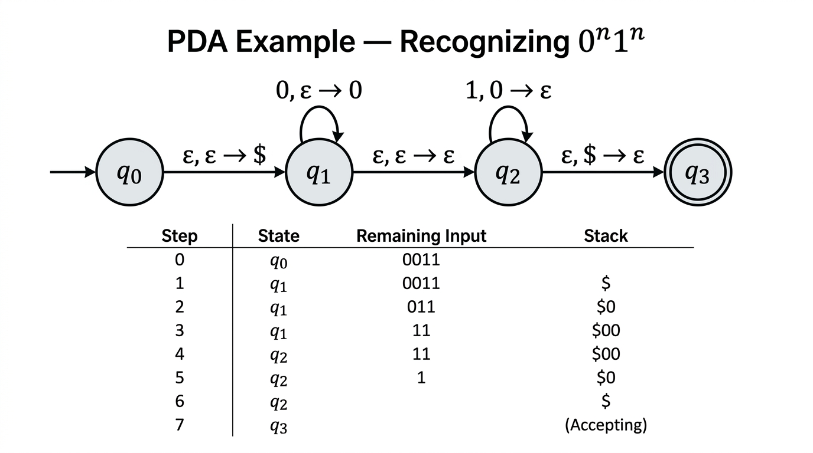

# Pushdown Automata — COMP0003 Automata

*Lecture-style notes. A **pushdown automaton** (PDA) extends a finite automaton with an **infinite stack**, giving it the ability to recognise languages that require **unbounded memory** — such as $\{0^n 1^n\}$. PDAs are **nondeterministic** by default, and unlike the DFA/NFA equivalence, **deterministic PDAs are strictly weaker** than nondeterministic ones. The languages recognised by (nondeterministic) PDAs are precisely the **context-free languages**.*

---

## 1. COMPLETE TOPIC SUMMARIES

### From finite automata to pushdown automata

*A PDA that recognizes the language {0^n 1^n | n ≥ 0}. The state diagram shows transitions with stack operations (input, pop → push). The trace table below shows the stack growing as 0s are read and shrinking as 1s are matched.*

A DFA has **no memory** beyond its current state. The pumping lemma showed this is insufficient for languages like $\{0^n 1^n \mid n \geq 0\}$ — you need to "count" an arbitrary number of $0$s and later verify the same count of $1$s.

A **pushdown automaton** solves this by attaching an **infinite stack** to an NFA:

- The machine can **push** symbols onto the stack and **pop** symbols off the top.
- The stack provides **unbounded** storage, but access is restricted to the **top** element only (last-in, first-out).
- Transitions can depend on the **current state**, the **next input symbol** (or $\varepsilon$), and the **top of the stack**.

---

### Formal definition

A **(nondeterministic) pushdown automaton** is a 6-tuple $M = (Q, \Sigma, \Gamma, \delta, q_0, F)$ where:

| Component | Meaning |
|-----------|---------|
| $Q$ | Finite set of **states** |
| $\Sigma$ | **Input alphabet** (finite) |
| $\Gamma$ | **Stack alphabet** (finite; may differ from $\Sigma$) |
| $\delta$ | **Transition function**: $\delta : Q \times \Sigma_\varepsilon \times \Gamma_\varepsilon \to \mathcal{P}(Q \times \Gamma_\varepsilon)$ |
| $q_0 \in Q$ | **Start state** |
| $F \subseteq Q$ | Set of **accept states** |

Here $\Sigma_\varepsilon = \Sigma \cup \{\varepsilon\}$ and $\Gamma_\varepsilon = \Gamma \cup \{\varepsilon\}$.

The transition function maps a **(state, input symbol or $\varepsilon$, stack-top symbol or $\varepsilon$)** triple to a **set** of **(new state, symbol to push or $\varepsilon$)** pairs. The set-valued output is what makes the PDA **nondeterministic**.

---

### Transition notation

A single transition is written:

$$
a,\; X \to Y
$$

meaning: **read** input symbol $a$ (or $\varepsilon$ for no input), **pop** $X$ from the stack (or $\varepsilon$ for no pop), and **push** $Y$ onto the stack (or $\varepsilon$ for no push).

**Special cases:**

| Transition | Effect |
|------------|--------|
| $a,\; X \to Y$ | Read $a$, pop $X$, push $Y$ (replace top) |
| $a,\; \varepsilon \to Y$ | Read $a$, push $Y$ (push only, no pop) |
| $a,\; X \to \varepsilon$ | Read $a$, pop $X$ (pop only, no push) |
| $\varepsilon,\; \varepsilon \to Y$ | No input read, push $Y$ |
| $\varepsilon,\; X \to \varepsilon$ | No input read, pop $X$ |

---

### Formal acceptance (computation)

PDA $M = (Q, \Sigma, \Gamma, \delta, q_0, F)$ **accepts** input $w = w_1 w_2 \cdots w_n$ (each $w_i \in \Sigma_\varepsilon$) if there exist:

- a sequence of **states** $r_0, r_1, \ldots, r_n$ with $r_i \in Q$, and
- a sequence of **stack contents** $s_0, s_1, \ldots, s_n$ with $s_i \in \Gamma^*$,

satisfying:

1. $r_0 = q_0$ and $s_0 = \varepsilon$ — start in the start state with an **empty stack**.
2. For each $i = 0, \ldots, n-1$: $(r_{i+1}, b) \in \delta(r_i, w_{i+1}, a)$ where $s_i = ax$ and $s_{i+1} = bx$ for some $x \in \Gamma^*$ — each step follows a valid transition, modifying only the **top** of the stack.
3. $r_n \in F$ — end in an **accept state**.

> **Note:** the stack does **not** need to be empty at the end of computation (though specific PDA designs may enforce this).

---

### Example 1 — recognising 0^n 1^n (n ≥ 0)

**Strategy:** Push a bottom-of-stack marker $\$$, then push a $0$ for each $0$ read. When $1$s start, pop a $0$ for each $1$. Accept when $\$$ is popped (stack is empty and all $1$s matched).

**States:** $q_0$ (start), $q_1$ (reading $0$s), $q_2$ (matching $1$s), $q_3$ (accept).

**Transitions:**

| From | To | Label | Meaning |
|------|----|-------|---------|
| $q_0$ | $q_1$ | $\varepsilon,\; \varepsilon \to \$$ | Push bottom marker |
| $q_1$ | $q_1$ | $0,\; \varepsilon \to 0$ | Read $0$, push it |
| $q_1$ | $q_2$ | $\varepsilon,\; \varepsilon \to \varepsilon$ | Guess: done with $0$s |
| $q_2$ | $q_2$ | $1,\; 0 \to \varepsilon$ | Read $1$, pop a $0$ |
| $q_2$ | $q_3$ | $\varepsilon,\; \$ \to \varepsilon$ | Pop $\$$, accept |

**Trace of $w = 0011$:**

The input is expanded with $\varepsilon$-steps: $\varepsilon, 0, 0, \varepsilon, 1, 1, \varepsilon$.

| Step | Read | State after | Stack (top → bottom) | Action |
|------|------|-------------|----------------------|--------|
| 0 | — | $q_0$ | (empty) | Start |
| 1 | $\varepsilon$ | $q_1$ | $\$$ | Push $\$$ |
| 2 | $0$ | $q_1$ | $0\;  \$$ | Push $0$ |
| 3 | $0$ | $q_1$ | $0\; 0\; \$$ | Push $0$ |
| 4 | $\varepsilon$ | $q_2$ | $0\; 0\; \$$ | Guess: switch to matching |
| 5 | $1$ | $q_2$ | $0\; \$$ | Pop $0$ |
| 6 | $1$ | $q_2$ | $\$$ | Pop $0$ |
| 7 | $\varepsilon$ | $q_3$ | (empty) | Pop $\$$, accept |

All three acceptance conditions are met: started in $q_0$ with empty stack, followed valid transitions, ended in accept state $q_3$.

---

### Example 2 — equal number of 0s and 1s

**Idea:** Use the stack to track the **imbalance** between $0$s and $1$s. Push $+$ when a $1$ is read and the top is not a $-$ (or stack is $\$$); push $-$ when a $0$ is read symmetrically. If the top matches the opposite sign, pop instead.

More concretely, one standard construction:

- Push $\$$ initially.
- On reading $0$: if top is $+$, pop it (a $1$ is now balanced); otherwise push $-$.
- On reading $1$: if top is $-$, pop it (a $0$ is now balanced); otherwise push $+$.
- Accept when $\$$ is on top and input is exhausted (pop $\$$ and go to accept state).

The stack height represents the current imbalance; it returns to just $\$$ exactly when $\#_0 = \#_1$.

---

### Nondeterminism in PDAs

A PDA is nondeterministic: for a given (state, input, stack-top) triple, $\delta$ may return **multiple** possible (state, push) pairs. The PDA accepts if **any** computation branch reaches an accept state.

This is fundamentally the same concept as NFA nondeterminism, but now it also applies to stack operations — the PDA can "guess" what to do with the stack.

---

### Deterministic vs nondeterministic PDAs

This is a critical difference from finite automata:

| Finite automata | Pushdown automata |
|----------------|-------------------|
| DFA $\equiv$ NFA (same power) | DPDA $\subsetneq$ NPDA (strictly different power) |

**Deterministic PDAs** (DPDAs) are strictly less powerful than nondeterministic PDAs (NPDAs). There exist context-free languages that no DPDA can recognise — for example, $\{ww^R \mid w \in \{0,1\}^*\}$ (palindromes over $\{0,1\}$) requires nondeterministic guessing of the midpoint.

The class of languages recognised by **NPDAs** is exactly the **context-free languages** (equivalently, the languages generated by context-free grammars).

---

### Context-free languages and the bigger picture

$$
\text{Regular languages} \subsetneq \text{DPDA languages} \subsetneq \text{Context-free languages (= NPDA languages)}
$$

Every regular language can be recognised by a DFA, which is a special case of a DPDA (just ignore the stack). But PDAs can also recognise non-regular languages like $\{0^n 1^n\}$.

The equivalence $\text{CFL} = \text{NPDA languages}$ is proved by showing:

- **CFG → PDA:** every context-free grammar can be converted to a PDA (next lecture).
- **PDA → CFG:** every PDA can be converted to a context-free grammar (next lecture).

---

## 2. EXAM-STYLE QUESTIONS (WITH MODEL ANSWERS)

### Q1 — Formal definition

**Question.** Give the formal definition of a nondeterministic PDA, specifying each component and the type of the transition function.

**Model answer.** A PDA is a 6-tuple $(Q, \Sigma, \Gamma, \delta, q_0, F)$ where $Q$ is a finite set of states, $\Sigma$ is the input alphabet, $\Gamma$ is the stack alphabet, $\delta : Q \times \Sigma_\varepsilon \times \Gamma_\varepsilon \to \mathcal{P}(Q \times \Gamma_\varepsilon)$ is the transition function, $q_0 \in Q$ is the start state, and $F \subseteq Q$ is the set of accept states. Here $\Sigma_\varepsilon = \Sigma \cup \{\varepsilon\}$ and $\Gamma_\varepsilon = \Gamma \cup \{\varepsilon\}$.

---

### Q2 — Design a PDA for 0^n 1^n

**Question.** Design a PDA that recognises $L = \{0^n 1^n \mid n \geq 0\}$. List the states, transitions, and trace the computation on $w = 001$.

**Model answer.** States: $q_0, q_1, q_2, q_3$ (accept: $q_3$). Transitions: $q_0 \xrightarrow{\varepsilon,\, \varepsilon \to \$} q_1$; $q_1 \xrightarrow{0,\, \varepsilon \to 0} q_1$; $q_1 \xrightarrow{\varepsilon,\, \varepsilon \to \varepsilon} q_2$; $q_2 \xrightarrow{1,\, 0 \to \varepsilon} q_2$; $q_2 \xrightarrow{\varepsilon,\, \$ \to \varepsilon} q_3$. On $w = 001$: push $\$$, push $0$, push $0$, guess switch, pop one $0$ for the $1$, but one $0$ remains — no valid continuation to $q_3$. So $001 \notin L$ (no accepting branch).

---

### Q3 — Interpret a transition label

**Question.** A PDA transition is labelled $\varepsilon,\; 0 \to \varepsilon$. What does this mean in terms of input consumption and stack operations?

**Model answer.** The machine reads **no input** ($\varepsilon$ in the input position), **pops** $0$ from the top of the stack (the "read $0$ from stack" part), and **pushes nothing** ($\varepsilon$ in the push position). Net effect: the top $0$ is removed from the stack without consuming any input character.

---

### Q4 — DPDA vs NPDA

**Question.** Explain why deterministic PDAs are strictly less powerful than nondeterministic PDAs. Give an example of a language recognised by an NPDA but not by any DPDA.

**Model answer.** For DFAs and NFAs, the subset construction shows they are equivalent. No analogous construction exists for PDAs because the stack cannot be "merged" across nondeterministic branches — each branch may have a different stack contents, and there is no finite way to track all possibilities simultaneously. The language $\{ww^R \mid w \in \{0,1\}^*\}$ (even-length palindromes) requires guessing the midpoint to switch from pushing to popping; a DPDA cannot make this guess deterministically since the midpoint is not marked in the input.

---

### Q5 — Acceptance conditions

**Question.** State the three conditions for a PDA to accept a string. Does the stack need to be empty at the end?

**Model answer.** A PDA accepts $w$ if there exist a state sequence $r_0, \ldots, r_n$ and stack sequence $s_0, \ldots, s_n$ such that: (1) $r_0 = q_0$ and $s_0 = \varepsilon$ (start in start state with empty stack); (2) each step follows a valid transition — $(r_{i+1}, b) \in \delta(r_i, w_{i+1}, a)$ with $s_i = ax$ and $s_{i+1} = bx$; (3) $r_n \in F$ (end in an accept state). The stack does **not** need to be empty — acceptance is by **final state**, though many PDA designs deliberately empty the stack as part of their logic.

---

## 3. MUST-KNOW KEY POINTS

- **PDA = NFA + infinite stack.** Transitions depend on state, input symbol (or $\varepsilon$), and stack top (or $\varepsilon$).
- **6-tuple:** $(Q, \Sigma, \Gamma, \delta, q_0, F)$ with $\delta : Q \times \Sigma_\varepsilon \times \Gamma_\varepsilon \to \mathcal{P}(Q \times \Gamma_\varepsilon)$.
- **Transition label** $a, X \to Y$: read $a$, pop $X$, push $Y$ (any of these can be $\varepsilon$).
- **Acceptance:** start in $q_0$ with empty stack; follow valid transitions; end in $F$. Stack need not be empty.
- **Bottom-of-stack marker** $\$$: common design pattern to detect when the stack is empty.
- **Nondeterminism:** PDA accepts if **any** branch reaches an accept state (same as NFA).
- **DPDA $\subsetneq$ NPDA:** unlike DFA $\equiv$ NFA. Palindromes ($ww^R$) need nondeterminism.
- **NPDAs recognise exactly the context-free languages** (equivalence with CFGs proved in later lectures).

---

## 4. HIGH-PRIORITY TOPICS

### 🔴 Must Know

- **Formal 6-tuple definition** and what each component is.
- **Transition function type:** $\delta : Q \times \Sigma_\varepsilon \times \Gamma_\varepsilon \to \mathcal{P}(Q \times \Gamma_\varepsilon)$.
- **Reading transition labels:** $a, X \to Y$ means read $a$, pop $X$, push $Y$.
- **Three acceptance conditions** (start state + empty stack, valid transitions, end in $F$).
- **Design a PDA for $\{0^n 1^n\}$** with bottom-of-stack marker — states, transitions, and trace.
- **DPDA $\neq$ NPDA** in power (contrast with DFA = NFA).
- **NPDAs $\leftrightarrow$ context-free languages.**

### 🟡 Important

- **Equal 0s and 1s** PDA design: track imbalance on the stack.
- **Nondeterministic "guessing":** the PDA guesses the right moment to switch modes (e.g. stop pushing, start popping).
- **$\varepsilon$-transitions** on input: the input string is "expanded" with $\varepsilon$ slots for transitions that consume no input.
- Stack starts empty; acceptance does not require the stack to be empty (but designs often enforce it).

### 🟢 Useful but Lower Priority

- Formal proof that every DFA is a special-case PDA (ignore the stack).
- The class of DPDA languages (deterministic context-free languages) and its relationship to LR parsing.
- Variations: acceptance by empty stack vs acceptance by final state (equivalent with minor modifications).

---

## 5. TOPIC INTERCONNECTIONS & BIGGER PICTURE

- **Pumping lemma → PDAs:** the pumping lemma showed $\{0^n 1^n\}$ is not regular; PDAs are the **exact** upgrade needed — the stack provides the unbounded counting that DFAs lack.
- **PDAs ↔ CFGs:** the next lectures prove these are equivalent. CFG → PDA simulates derivations on the stack; PDA → CFG creates variables $A_{q_i q_j}$ for state-pair paths.
- **Chomsky hierarchy:** regular (DFA/NFA) $\subset$ context-free (PDA/CFG) $\subset$ decidable (Turing machines). Each level gains a more powerful memory model: none → stack → tape.
- **Compiler design:** PDAs (especially DPDAs) underpin **parser** technology. LR and LL parsers are essentially deterministic PDAs that process context-free grammars.
- **Stack as a data structure:** the same LIFO discipline appears in function call stacks, expression evaluation, and balanced-parenthesis checking — all closely related to context-free languages.

---

## 6. EXAM STRATEGY TIPS

- **Draw the PDA diagram** with labelled arrows. Include the bottom-of-stack marker $\$$ — forgetting it is a common mistake.
- **Trace tables** are your friend: columns for step, input read, state, stack contents. They make acceptance arguments rigorous.
- When asked to **design** a PDA, describe the **strategy** in words first ("push 0s, then pop for each 1") before writing transitions.
- **Transition labels:** always write all three parts ($a, X \to Y$). Writing just "$0$" on an arrow is ambiguous — specify what happens to the stack.
- For **DPDA vs NPDA** questions, the go-to example is **palindromes** ($ww^R$): the midpoint cannot be detected without nondeterministic guessing.
- If asked about **acceptance**, explicitly state all three conditions — don't just say "reaches an accept state" without mentioning the start configuration and valid transitions.
- **Connect back to regular languages:** a PDA with an unused stack is just an NFA, so every regular language is context-free. This is a one-line argument worth memorising.

---

*These notes cover Automata Lecture 7 material on pushdown automata. The equivalence between PDAs and context-free grammars is covered in subsequent lectures.*
