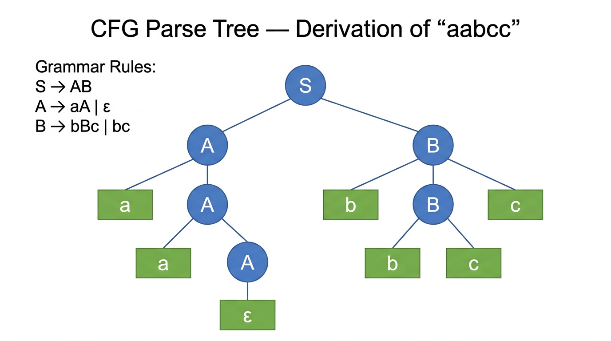

# Context-Free Grammars — COMP0003 Automata

*Lecture-style notes. A **context-free grammar** (CFG) is a set of recursive rewriting rules that **generates** strings from a start variable. CFGs are the **generative** counterpart to PDAs: both define exactly the **context-free languages**. The two-way conversion — CFG to PDA and PDA to CFG — is the central equivalence result, and the DFA-to-CFG conversion shows that every regular language is also context-free.*

---

## 1. COMPLETE TOPIC SUMMARIES

### Context-free grammar — definition

*A parse tree for the grammar S → AB, A → aA | ε, B → bBc | bc. Variables (blue circles) expand via grammar rules; terminals (green rectangles) form the derived string "aabcc" when read left-to-right across the leaves.*

A **context-free grammar** is a 4-tuple $G = (V, \Sigma, R, S)$ where:

| Component | Meaning |
|-----------|---------|
| $V$ | Finite set of **variables** (also called **nonterminals**) |
| $\Sigma$ | Finite set of **terminals** (the alphabet; $V \cap \Sigma = \emptyset$) |
| $R$ | Finite set of **rules** (or **productions**), each of the form $A \to w$ where $A \in V$ and $w \in (V \cup \Sigma)^*$ |
| $S \in V$ | **Start variable** (by convention, the left-hand side of the first rule) |

**Convenience notation:** Multiple rules with the same left-hand variable can be merged with $\mid$:

$$
A \to w_1 \mid w_2 \mid \cdots \mid w_k \quad\text{abbreviates}\quad A \to w_1,\; A \to w_2,\; \ldots,\; A \to w_k
$$

---

### Derivations

A grammar **derives** a string by repeatedly replacing variables with the right-hand side of a rule.

**Notation:**

- $uAv \Rightarrow uwv$ if $A \to w$ is a rule in $R$ (one-step derivation).
- $u \Rightarrow^* v$ means $u$ derives $v$ in **zero or more** steps.
- A grammar derives $w \in \Sigma^*$ if $S \Rightarrow^* w$.

**Formal definition of a derivation:** A sequence of intermediate strings $s_0, s_1, \ldots, s_m$ where:

1. $s_0 = S$ (start with the start variable).
2. For each $i$: $s_{i-1} = xA_i y$ and $s_i = xu_i y$ where $A_i \to u_i \in R$ (replace one variable using a rule).
3. $s_m = w$ (final string contains only terminals).

---

### Context-free languages

The **language generated by** a CFG $G$ is:

$$
L(G) = \{w \in \Sigma^* \mid S \Rightarrow^* w\}
$$

A language is **context-free** if it is generated by some CFG. The class of all context-free languages is denoted **CFL**.

---

### Example 1 — 0^n 1^n (n ≥ 0)

**Grammar:**

$$
S \to 0S1 \mid \varepsilon
$$

**Derivation of $0011$:**

$$
S \Rightarrow 0S1 \Rightarrow 00S11 \Rightarrow 00\varepsilon11 = 0011
$$

Each application of $S \to 0S1$ wraps the current string with a $0$-$1$ pair. Applying $S \to \varepsilon$ terminates the derivation.

---

### Example 2 — equal number of 0s and 1s

**Grammar:**

$$
S \to S0S1S \mid S1S0S \mid SS \mid \varepsilon
$$

**Why this works:** The rule $S0S1S$ generates a $0$ before a $1$ with arbitrary balanced strings in between; $S1S0S$ does the reverse. The rule $SS$ allows concatenation of balanced strings. Every string with equal $0$s and $1$s can be decomposed this way.

---

### DFA to CFG conversion

Every regular language is context-free. The conversion procedure from a DFA $M = (Q, \Sigma, \delta, q_0, F)$ to a CFG $G = (V, \Sigma, R, S)$ is:

| CFG component | Constructed from DFA |
|---------------|---------------------|
| **Variables $V$** | One variable $Q_i$ for each state $q_i \in Q$ |
| **Terminals $\Sigma$** | Same as DFA input alphabet |
| **Start variable $S$** | $Q_0$ (variable for the start state $q_0$) |
| **Rules $R$** | (1) For each transition $\delta(q_i, a) = q_j$, add $Q_i \to aQ_j$. (2) For each accept state $q_i \in F$, add $Q_i \to \varepsilon$. |

**Example — DFA for "even number of 1s"** (states $q_\text{even}$, $q_\text{odd}$; start = $q_\text{even}$; accept = $\{q_\text{even}\}$):

$$
Q_\text{even} \to 0Q_\text{even} \mid 1Q_\text{odd} \mid \varepsilon
$$
$$
Q_\text{odd} \to 0Q_\text{odd} \mid 1Q_\text{even}
$$

---

### Equivalence proof — DFA and constructed CFG

**Direction 1: $w \in L(M) \Rightarrow w \in L(G)$.**

If $w = w_1 \cdots w_n$ is accepted by the DFA, there exist states $r_0, r_1, \ldots, r_n$ with $r_0 = q_0$, $\delta(r_i, w_{i+1}) = r_{i+1}$, and $r_n \in F$. Build the derivation:

$$
Q_0 \Rightarrow w_1 Q_1 \Rightarrow w_1 w_2 Q_2 \Rightarrow \cdots \Rightarrow w_1 \cdots w_n Q_n \Rightarrow w_1 \cdots w_n
$$

Each step uses the transition rule $Q_i \to w_{i+1} Q_{i+1}$; the final step uses $Q_n \to \varepsilon$ (since $r_n \in F$).

**Direction 2: $w \in L(G) \Rightarrow w \in L(M)$.**

Any derivation in $G$ consists of transition rules $Q_i \to aQ_j$ followed by a final $Q_k \to \varepsilon$. Simulating in the DFA: each $Q_i \to aQ_j$ corresponds to $\delta(q_i, a) = q_j$, and the final $Q_k \to \varepsilon$ means $q_k \in F$. So the DFA accepts $w$.

---

### CFG to PDA conversion

**Theorem:** For every CFG $G$, there exists a PDA $M$ such that $L(M) = L(G)$.

**Construction:** Build a **3-state PDA** ($q_\text{start}$, $q_\text{loop}$, $q_\text{accept}$):

| Transition | From | To | Label | Purpose |
|-----------|------|----|-------|---------|
| Initialise | $q_\text{start}$ | $q_\text{loop}$ | $\varepsilon,\; \varepsilon \to S\$$ | Push start variable and bottom marker |
| Rule application | $q_\text{loop}$ | $q_\text{loop}$ | $\varepsilon,\; A \to w$ | If top is variable $A$, replace with RHS $w$ |
| Terminal match | $q_\text{loop}$ | $q_\text{loop}$ | $a,\; a \to \varepsilon$ | If top is terminal $a$ matching input, pop it |
| Accept | $q_\text{loop}$ | $q_\text{accept}$ | $\varepsilon,\; \$ \to \varepsilon$ | Pop bottom marker, accept |

**Pushing multi-character strings:** When a rule's RHS $w$ has multiple symbols, they are pushed via **intermediate states** in **reverse order** so the leftmost symbol ends up on top.

For example, the rule $S \to 0A1$ means pushing $1$, then $A$, then $0$ (three intermediate push transitions).

**Key insight:** The PDA nondeterministically "guesses" which grammar rule to apply. If there exists a derivation in the grammar, some branch of the PDA will find it. The PDA simulates a **leftmost derivation** on the stack.

---

### PDA to CFG conversion

**Theorem:** For every PDA $M$, there exists a CFG $G$ such that $L(G) = L(M)$.

This is the harder direction. The construction requires first converting the PDA into **special form**.

**Step 1 — Convert to special-form PDA** (three modifications, all without loss of generality):

1. **Single accept state:** Reroute all accept states to a single fresh accept state $q_f$ via $\varepsilon, \varepsilon \to \varepsilon$ transitions.
2. **Empty stack before accepting:** Add states that pop all remaining stack symbols before reaching $q_f$; only accept via $\varepsilon, \$ \to \varepsilon$.
3. **Each transition is strictly a push or a pop:** Split replacement transitions ($a, X \to Y$) into pop-then-push through an intermediate state. Convert no-ops ($\varepsilon, \varepsilon \to \varepsilon$) into push-then-pop of a dummy symbol.

**Step 2 — Construct the CFG:**

Given the special-form PDA with states $Q$:

- **Variables:** $A_{q_i q_j}$ for every pair of states $(q_i, q_j) \in Q \times Q$.
- **Start variable:** $S = A_{q_0 q_f}$.
- **Rules (three types):**

| Type | Rule | Meaning |
|------|------|---------|
| **Base case** | $A_{q_i q_i} \to \varepsilon$ for every $q_i$ | Staying in a state with empty stack consumes nothing |
| **Stack empties mid-path** | $A_{q_i q_j} \to A_{q_i q_k} \; A_{q_k q_j}$ for any $i, j, k$ | If stack empties at intermediate state $q_k$, split into two sub-paths |
| **Matched push/pop** | $A_{q_p q_t} \to a \; A_{q_r q_s} \; b$ | If $q_p \xrightarrow{a,\; \varepsilon \to \alpha} q_r$ (push $\alpha$) and $q_s \xrightarrow{b,\; \alpha \to \varepsilon} q_t$ (pop $\alpha$), the push and pop "wrap around" whatever happens between $q_r$ and $q_s$ |

**Intuition for $A_{q_i q_j}$:** The variable generates exactly the set of strings that the PDA can consume when going from state $q_i$ to state $q_j$ with the stack **empty at both endpoints**.

---

### Equivalence proof sketch (CFG ↔ PDA)

The full equivalence $\text{CFL} = \text{NPDA languages}$ follows from the two directions above. The proof of correctness for each direction uses **induction on derivation length**:

**CFG → PDA direction:** If the grammar derives $w$ in $n$ steps, the PDA accepts $w$.

- **Base ($n = 1$):** $S \to w$ where $w \in \Sigma^*$; the PDA pushes $w$, then matches it against input.
- **Inductive step:** The first rule applied determines the stack configuration; by the inductive hypothesis, each sub-derivation is correctly simulated.

**PDA → CFG direction (stronger claim):** If $A_{q_i q_j}$ generates $w$, then the PDA can go from $q_i$ to $q_j$ reading $w$ with empty stack at both endpoints.

- **Base ($n = 1$):** Only $A_{q_i q_i} \to \varepsilon$ applies; reading nothing from $q_i$ to $q_i$ with empty stack is trivially valid.
- **Inductive step ($n = k + 1$):** Two cases based on which rule type was applied first:
    - **Type 2** ($A_{q_i q_j} \to A_{q_i q_k} A_{q_k q_j}$): By IH, first part takes PDA from $q_i$ to $q_k$, second from $q_k$ to $q_j$, both with empty stack at endpoints. Chain them.
    - **Type 3** ($A_{q_p q_t} \to a \; A_{q_r q_s} \; b$): The push of $\alpha$ at $q_p$ and pop of $\alpha$ at $q_s$ wrap around the sub-path $q_r \to q_s$ (handled by IH). Stack ends empty.

---

## 2. EXAM-STYLE QUESTIONS (WITH MODEL ANSWERS)

### Q1 — CFG formal definition

**Question.** Define a context-free grammar formally. What is the language of a CFG?

**Model answer.** A CFG is a 4-tuple $G = (V, \Sigma, R, S)$ where $V$ is a finite set of variables, $\Sigma$ is a finite set of terminals (with $V \cap \Sigma = \emptyset$), $R$ is a finite set of rules of the form $A \to w$ ($A \in V$, $w \in (V \cup \Sigma)^*$), and $S \in V$ is the start variable. The language of $G$ is $L(G) = \{w \in \Sigma^* \mid S \Rightarrow^* w\}$, the set of all terminal strings derivable from $S$.

---

### Q2 — Write a CFG for 0^n 1^n

**Question.** Write a CFG that generates $\{0^n 1^n \mid n \geq 0\}$. Show the derivation of $000111$.

**Model answer.** Grammar: $S \to 0S1 \mid \varepsilon$. Derivation: $S \Rightarrow 0S1 \Rightarrow 00S11 \Rightarrow 000S111 \Rightarrow 000\varepsilon111 = 000111$.

---

### Q3 — DFA to CFG conversion

**Question.** Describe the procedure for converting a DFA into an equivalent CFG. Apply it to a DFA over $\{a, b\}$ with two states $q_0, q_1$, start state $q_0$, accept state $\{q_1\}$, and transitions $\delta(q_0, a) = q_0$, $\delta(q_0, b) = q_1$, $\delta(q_1, a) = q_1$, $\delta(q_1, b) = q_0$.

**Model answer.** Create variable $Q_i$ for each state $q_i$. For each transition $\delta(q_i, c) = q_j$, add rule $Q_i \to cQ_j$. For each accept state $q_i$, add $Q_i \to \varepsilon$. Start variable is $Q_0$. Applied:

$$
Q_0 \to aQ_0 \mid bQ_1
$$
$$
Q_1 \to aQ_1 \mid bQ_0 \mid \varepsilon
$$

This generates exactly the strings accepted by the DFA (those ending in state $q_1$, i.e. strings with an odd number of $b$s).

---

### Q4 — CFG to PDA construction

**Question.** Explain how to convert a CFG into a PDA. How many states does the PDA need? Why is nondeterminism essential?

**Model answer.** The PDA has **3 states**: $q_\text{start}$, $q_\text{loop}$, $q_\text{accept}$. From $q_\text{start}$, push the start variable $S$ and a bottom marker $\$$, then move to $q_\text{loop}$. In $q_\text{loop}$: if the top of the stack is a variable $A$, nondeterministically choose a rule $A \to w$ and replace $A$ with $w$ (pushing in reverse order via intermediate states); if the top is a terminal matching the next input character, pop it. When $\$$ is on top and input is exhausted, move to $q_\text{accept}$. Nondeterminism is essential because at each step the PDA must "guess" which grammar rule to apply — the correct rule depends on the full structure of the input, which is not yet known.

---

### Q5 — PDA to CFG variables

**Question.** In the PDA-to-CFG conversion, what does a variable $A_{q_i q_j}$ represent? What are the three types of rules, and what is the intuition behind the matched push/pop rule?

**Model answer.** $A_{q_i q_j}$ generates exactly the set of input strings that the (special-form) PDA can consume when transitioning from $q_i$ to $q_j$ with the stack empty at both endpoints. The three rule types are: (1) **Base:** $A_{q_i q_i} \to \varepsilon$ — staying in a state with no stack change. (2) **Split:** $A_{q_i q_j} \to A_{q_i q_k} A_{q_k q_j}$ — the stack empties at some intermediate $q_k$, splitting the path. (3) **Matched push/pop:** $A_{q_p q_t} \to a \; A_{q_r q_s} \; b$ — a push of $\alpha$ on reading $a$ at $q_p \to q_r$ is matched by a pop of $\alpha$ on reading $b$ at $q_s \to q_t$. The pushed symbol $\alpha$ stays on the stack throughout the sub-path $q_r \to q_s$, and everything generated by $A_{q_r q_s}$ is "wrapped" between the input characters $a$ and $b$.

---

## 3. MUST-KNOW KEY POINTS

- **CFG:** 4-tuple $(V, \Sigma, R, S)$ — variables, terminals, rules ($A \to w$), start variable.
- **Derivation:** $S \Rightarrow^* w$ via repeated rule applications; $L(G) = \{w \in \Sigma^* \mid S \Rightarrow^* w\}$.
- **Example:** $S \to 0S1 \mid \varepsilon$ generates $\{0^n 1^n\}$.
- **DFA → CFG:** states become variables; $\delta(q_i, a) = q_j$ becomes $Q_i \to aQ_j$; accept states get $Q_i \to \varepsilon$; start variable = $Q_0$.
- **Every regular language is context-free** (direct corollary of DFA → CFG conversion).
- **CFG → PDA:** 3-state PDA; push start variable, nondeterministically apply rules on stack, match terminals with input, accept on empty stack ($\$$).
- **PDA → CFG:** Convert PDA to special form (single accept, empty stack, push-or-pop only); variables $A_{q_i q_j}$; three rule types (base, split, matched push/pop).
- **CFG $\equiv$ PDA:** Both define exactly the class of context-free languages. Proof by induction on derivation length in both directions.

---

## 4. HIGH-PRIORITY TOPICS

### 🔴 Must Know

- **CFG formal definition:** 4-tuple, what each component means, rule format $A \to w$.
- **Derivation notation:** $\Rightarrow$ (one step), $\Rightarrow^*$ (zero or more steps), $L(G)$.
- **Canonical example:** $S \to 0S1 \mid \varepsilon$ for $\{0^n 1^n\}$, including a traced derivation.
- **DFA → CFG procedure:** states → variables, transitions → rules, accept states → $\varepsilon$-rules.
- **CFG → PDA construction:** 3-state design, role of nondeterminism, pushing RHS in reverse order via intermediate states.
- **The equivalence result:** CFGs and PDAs define the same class (context-free languages).

### 🟡 Important

- **Equal 0s and 1s grammar:** $S \to S0S1S \mid S1S0S \mid SS \mid \varepsilon$.
- **PDA → CFG construction:** special-form PDA requirements (single accept, empty stack, push-or-pop only); variables $A_{q_i q_j}$; three rule types.
- **Equivalence proof idea:** induction on derivation length; the stronger claim about $A_{q_i q_j}$ generating strings that take PDA from $q_i$ to $q_j$ with empty stack.
- **DFA ↔ CFG equivalence proof** (both directions): DFA transitions map to derivation steps and vice versa.

### 🟢 Useful but Lower Priority

- Full worked example of PDA → CFG conversion (e.g. equal 0s and 1s PDA to grammar rules).
- Parse trees and ambiguity in CFGs (related but typically a separate topic).
- Chomsky normal form and its role in the CFL pumping lemma proof.

---

## 5. TOPIC INTERCONNECTIONS & BIGGER PICTURE

- **Regular languages $\subset$ CFLs:** The DFA → CFG conversion proves strict containment (and $\{0^n 1^n\}$ witnesses strictness — it is context-free but not regular by the pumping lemma).
- **PDA ↔ CFG equivalence** mirrors the **DFA ↔ NFA ↔ regex** equivalence for regular languages: multiple formalisms, one language class.
- **Compiler front-ends:** Context-free grammars define the **syntax** of programming languages. Parsers (LL, LR) are essentially algorithms for testing membership in a CFL, using stack-based techniques directly related to the CFG → PDA construction.
- **Pumping lemma for CFLs** (later lectures) uses properties of parse trees (not DFA states) to show languages like $\{a^n b^n c^n\}$ are not context-free — extending the regular pumping lemma to the next level of the hierarchy.
- **Chomsky hierarchy:** the CFG/PDA level is **Type 2**. Regular languages (Type 3) sit below; context-sensitive (Type 1) and recursively enumerable (Type 0, Turing machines) sit above. Each level corresponds to a more powerful automaton and grammar formalism.
- **Stack discipline:** the PDA's LIFO stack naturally handles **nested** and **recursive** structure (parentheses, function calls, XML tags) — this is why context-free grammars are the right tool for syntax.

---

## 6. EXAM STRATEGY TIPS

- **CFG design:** start simple — $S \to 0S1 \mid \varepsilon$ is enough for $\{0^n 1^n\}$. Don't over-complicate with unnecessary variables.
- **Show derivations explicitly:** write out every $\Rightarrow$ step. Examiners want to see each rule applied, not just the final string.
- **DFA → CFG:** this is a mechanical procedure — practise it until it's automatic. One rule per transition, one $\varepsilon$-rule per accept state, start variable = start state variable.
- **CFG → PDA:** remember the 3-state template. The most common mistake is forgetting to push the RHS in **reverse order** or omitting intermediate states for multi-symbol pushes.
- **PDA → CFG:** know the three modifications for special form (single accept, empty stack, push-or-pop). For the rules, remember the three types: base ($A_{q_i q_i} \to \varepsilon$), split ($A_{q_i q_j} \to A_{q_i q_k} A_{q_k q_j}$), matched push/pop ($A_{q_p q_t} \to a A_{q_r q_s} b$).
- **Proof questions:** state the **induction parameter** explicitly ("by induction on the number of derivation steps $n$"), handle the **base case**, state the **inductive hypothesis**, and show the **inductive step** with clear case analysis.
- When asked "are CFGs and PDAs equivalent?" — answer **yes, they define exactly the context-free languages**, and briefly sketch both conversion directions.

---

*These notes cover Automata Lectures 8–9 material on context-free grammars and their equivalence with pushdown automata. The DFA → CFG conversion shows regular languages are a subset of CFLs; the CFG ↔ PDA equivalence establishes the full characterisation of context-free languages.*
