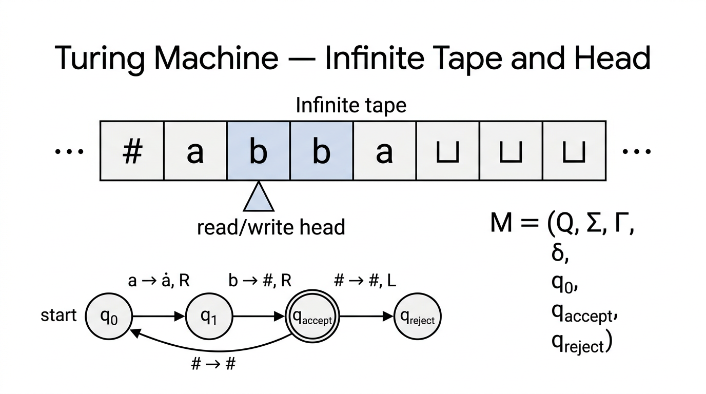

# Turing Machines — COMP0003 Automata

*Lecture-style notes. A **Turing machine** extends the DFA model with an **infinite read/write tape** and a head that moves freely left and right, breaking through the limitations of finite automata and pushdown automata. TMs can **accept**, **reject**, or **loop forever** — and this three-way outcome is central to everything that follows on decidability.*

---

## 1. COMPLETE TOPIC SUMMARIES

*A Turing machine reads and writes on an infinite tape via a movable head. The state diagram below the tape shows transitions labeled "read → write, direction". The 7-tuple formal definition is shown on the right.*

### Motivation — why we need more than DFAs and PDAs

| Model | Memory | Access pattern | Limitation |
|---|---|---|---|
| **DFA / NFA** | Current state only | — | Cannot count beyond a fixed bound |
| **PDA** | Infinite stack | LIFO (top only) | Can match one pair of constraints, not two |
| **Turing machine** | Infinite tape | **Random access** (head moves L/R) | None known within computable functions |

Languages like $\{a^n b^n c^n\}$ and $\{ww\}$ are **not** context-free. We need a model with **unbounded** storage and **unrestricted** access — the Turing machine.

---

### Formal definition — the 7-tuple

A **Turing machine** $M$ is a 7-tuple:

$$M = (Q,\; \Sigma,\; \Gamma,\; \delta,\; q_0,\; q_{\text{accept}},\; q_{\text{reject}})$$

| Component | Meaning |
|---|---|
| $Q$ | Finite set of **states** |
| $\Sigma$ | **Input alphabet** (does not contain the blank symbol $\sqcup$) |
| $\Gamma$ | **Tape alphabet** with $\Sigma \subseteq \Gamma$ and $\sqcup \in \Gamma$ |
| $\delta : Q \times \Gamma \to Q \times \Gamma \times \{L, R\}$ | **Transition function** |
| $q_0 \in Q$ | **Start state** |
| $q_{\text{accept}} \in Q$ | **Accept state** (halts immediately on entry) |
| $q_{\text{reject}} \in Q$ | **Reject state** (halts immediately on entry), $q_{\text{reject}} \neq q_{\text{accept}}$ |

**Transition notation:** $\delta(q_i, a) = (q_j, b, R)$ means "in state $q_i$, reading tape symbol $a$: write $b$, move head **right**, transition to state $q_j$."

---

### The tape

- **Infinite to the right** (or bi-infinite in some formulations — equivalent).
- Initially contains the **input string** $w$ starting at the leftmost cell; all cells to the right of $w$ contain the **blank symbol** $\sqcup$.
- The **read/write head** starts at the leftmost cell.
- At each step the head reads the current cell, **writes** a symbol (possibly the same one), and moves **one cell left or right**.

---

### Accept, reject, and looping

A TM has **three possible outcomes** on a given input:

1. **Accept** — the machine enters $q_{\text{accept}}$ and halts immediately.
2. **Reject** — the machine enters $q_{\text{reject}}$ and halts immediately.
3. **Loop** — the machine runs forever, never entering $q_{\text{accept}}$ or $q_{\text{reject}}$.

This is a critical difference from DFAs and PDAs, which always halt after reading the input. A TM may **never halt**.

---

### Configurations

A **configuration** captures the complete instantaneous state of a TM: the tape contents, the current state, and the head position. Written as:

$$C = w_1 \; q_i \; w_2$$

- $w_1$ = tape contents **to the left** of the head.
- $q_i$ = current state (written at the head position).
- $w_2$ = tape contents **under and to the right** of the head (first symbol of $w_2$ is under the head).

**Special configurations:**

- **Starting configuration:** $q_0\, w$ (head at the leftmost character of input $w$).
- **Accepting configuration:** any configuration containing $q_{\text{accept}}$.
- **Rejecting configuration:** any configuration containing $q_{\text{reject}}$.

**Yielding.** Configuration $C_i$ **yields** $C_{i+1}$ (written $C_i \Rightarrow C_{i+1}$) if $C_{i+1}$ follows from $C_i$ by one application of $\delta$:

- If $\delta(q_i, b) = (q_j, c, L)$: $\;ua\; q_i\; bv \;\Rightarrow\; u\; q_j\; acv$
- If $\delta(q_i, b) = (q_j, c, R)$: $\;ua\; q_i\; bv \;\Rightarrow\; uac\; q_j\; v$

---

### TM computation and acceptance — formal definition

$M$ **accepts** input $w$ if there exists a sequence of configurations $C_1, C_2, \ldots, C_k$ such that:

1. $C_1 = q_0\, w$ (start in the starting configuration).
2. $C_i \Rightarrow C_{i+1}$ for all $1 \leq i < k$ (each step follows from $\delta$).
3. $C_k$ is an accepting configuration (contains $q_{\text{accept}}$).

The **language recognised** by $M$ is $L(M) = \{w \mid M \text{ accepts } w\}$.

---

### TM capabilities — basic techniques

Turing machines can perform operations that DFAs and PDAs cannot:

| Technique | Description |
|---|---|
| **Mark / replace characters** | Overwrite a tape symbol to "cross it off" (e.g. replace $0$ with $\times$) |
| **Detect end of input** | Scan right until the head reads $\sqcup$ |
| **Return head to start** | Scan left until the head reads $\sqcup$ (or a special left-end marker) |
| **Shift input right** | Make room on the tape by copying symbols one cell to the right |
| **Compare distant symbols** | Mark a symbol, scan to another position, check, scan back |

---

### Example 1 — Recognise strings of 0s whose length is a power of 2

**Language:** strings of $0$'s whose length is a power of $2$: $\{0, 00, 0000, 00000000, \ldots\}$.

**Algorithm:**

1. Sweep left to right, **cross off every other $0$** (replace with $\times$).
2. If in the sweep there was **exactly one** $0$ remaining (before crossing off), **accept**.
3. If the number of $0$'s at the start of a sweep was **odd** (and greater than $1$), **reject**.
4. Return the head to the left end and **repeat**.

Each sweep halves the count of uncrossed $0$'s. If the original count is $2^n$, after $n$ sweeps exactly one $0$ remains. If not a power of $2$, an odd count $> 1$ appears at some sweep.

---

### Example 2 — Recognise a^i b^j c^k where i × j = k

**Algorithm (multiplication by repeated addition):**

1. For each $a$ in the input:
   - For each $b$, cross off one $c$.
   - Restore the $b$'s (un-mark them) for the next $a$.
   - Cross off the current $a$.
2. After all $a$'s are processed, check that **no un-crossed $c$'s** remain.
3. If all $c$'s are consumed, **accept**; otherwise **reject**.

This demonstrates that TMs can perform **arithmetic** — something impossible for DFAs or PDAs.

---

### Example 3 — Recognise ww (same word twice over {0,1})

**Algorithm:**

1. **Find the middle:** scan left to right, alternately marking symbols from the left and the right ends, to locate the midpoint of the string.
2. **Compare halves:** match the first half against the second half character by character, crossing off matched pairs.
3. Accept if all characters are matched; reject if a mismatch is found or the string has odd length.

This language, proven non-CFL by the pumping lemma, is easily recognised by a TM.

---

### Multi-tape Turing machines

A **$k$-tape TM** has $k$ independent tapes, each with its own read/write head. The transition function becomes:

$$\delta : Q \times \Gamma^k \to Q \times \Gamma^k \times \{L, R\}^k$$

**Equivalence theorem.** Every $k$-tape TM has an equivalent **single-tape** TM.

**Simulation idea:** Use a single tape with **delimiters** $\#$ separating the contents of each simulated tape. Place a **dot** (marker) above the symbol under each simulated head. To simulate one step:

1. Scan the entire tape to read all $k$ marked symbols.
2. Make the updates (write new symbols, move dots left/right).
3. If a simulated tape needs more space, shift the rest of the tape rightward.

**Overhead:** simulating one step of a $k$-tape TM takes $O(n)$ steps on a single-tape TM (where $n$ is the total used tape length), but the set of **recognised languages** is identical.

---

### Nondeterministic Turing machines

A **nondeterministic TM (NTM)** allows the transition function to return a **set** of possible next moves:

$$\delta : Q \times \Gamma \to \mathcal{P}(Q \times \Gamma \times \{L, R\})$$

The NTM **accepts** if **any** branch of the computation tree reaches $q_{\text{accept}}$.

**Equivalence theorem.** Every NTM has an equivalent **deterministic** TM.

**Simulation (BFS with 3 tapes):**

- **Tape 1:** the original input (never modified).
- **Tape 2:** working tape to simulate a single branch.
- **Tape 3:** an address string encoding which nondeterministic choices to make (systematically enumerate all possible choice sequences in **breadth-first** order).

For each address on tape 3, copy the input from tape 1 to tape 2 and simulate the NTM deterministically following the choices. If any branch accepts, accept. If all branches of a given length reject or halt, increment the address length and continue.

**Key point:** NTMs do not add **computational power** (same class of recognised languages), but they may be **exponentially faster** — this distinction is the foundation of the $P$ vs $NP$ question.

---

### The Church-Turing thesis

**Informal statement:** Every function that is "effectively computable" (by any reasonable algorithmic process) is computable by a Turing machine.

This is a **thesis** (philosophical claim), not a theorem — it cannot be formally proved because "effectively computable" is an informal concept. However, every proposed alternative model of computation (lambda calculus, recursive functions, register machines, modern programming languages) has been shown to be **equivalent** in power to TMs, providing strong evidence.

**Practical implication:** When designing a TM, we can describe the algorithm in **high-level pseudocode** and trust that a TM can implement it — we do not always need to specify every state and transition explicitly.

---

### The Universal Turing Machine

A **Universal Turing Machine (UTM)** $U$ is a TM that can **simulate any other TM**.

**Input:** an encoding $\langle M, w \rangle$ where $M$ is the description of a TM and $w$ is an input string.

**Behaviour:** $U$ simulates $M$ on $w$ step by step:

- If $M$ accepts $w$, then $U$ accepts $\langle M, w \rangle$.
- If $M$ rejects $w$, then $U$ rejects $\langle M, w \rangle$.
- If $M$ loops on $w$, then $U$ loops on $\langle M, w \rangle$.

The UTM is the theoretical precursor to **stored-program computers** — the idea that a single machine can run any program by treating the program as data.

---

## 2. EXAM-STYLE QUESTIONS (WITH MODEL ANSWERS)

### Q1 — State the formal definition of a TM

**Question.** Give the formal definition of a Turing machine as a 7-tuple. Explain each component.

**Model answer.** A TM is $M = (Q, \Sigma, \Gamma, \delta, q_0, q_{\text{accept}}, q_{\text{reject}})$ where: $Q$ is a finite set of states; $\Sigma$ is the input alphabet (not containing $\sqcup$); $\Gamma$ is the tape alphabet with $\Sigma \subseteq \Gamma$ and $\sqcup \in \Gamma$; $\delta: Q \times \Gamma \to Q \times \Gamma \times \{L,R\}$ is the transition function; $q_0 \in Q$ is the start state; $q_{\text{accept}} \in Q$ is the accept state; $q_{\text{reject}} \in Q$ is the reject state with $q_{\text{reject}} \neq q_{\text{accept}}$. Both $q_{\text{accept}}$ and $q_{\text{reject}}$ are **halting** states — the machine stops immediately upon entering either.

---

### Q2 — Configurations and yielding

**Question.** Write the starting configuration for TM $M$ on input $w = 0110$. If $\delta(q_0, 0) = (q_1, X, R)$, what configuration does the starting configuration yield?

**Model answer.** Starting configuration: $q_0\; 0110$. The head reads $0$ in state $q_0$. Applying $\delta$: write $X$, move right, enter $q_1$. New configuration: $X\; q_1\; 110$. The head is now over the first $1$.

---

### Q3 — Three outcomes of a TM

**Question.** What are the three possible outcomes when a TM runs on an input? How does this differ from a DFA?

**Model answer.** A TM can (1) **accept** (enter $q_{\text{accept}}$ and halt), (2) **reject** (enter $q_{\text{reject}}$ and halt), or (3) **loop forever** (never enter either halting state). A DFA always halts after reading the entire input — it has only two outcomes: accept or reject. The possibility of infinite looping is unique to TMs (among these models) and is the root cause of undecidability.

---

### Q4 — Multi-tape TMs and equivalence

**Question.** Define a multi-tape TM. Explain how a single-tape TM can simulate a 2-tape TM.

**Model answer.** A 2-tape TM has two independent tapes with separate heads; $\delta: Q \times \Gamma^2 \to Q \times \Gamma^2 \times \{L,R\}^2$. To simulate on a single tape: store both tapes' contents separated by a delimiter $\#$, with a marker (e.g. a dot) above the symbol under each virtual head. Each simulated step: scan the full tape to find both markers and read their symbols, then apply $\delta$ to update the symbols and move the markers. If a virtual tape needs more space, shift symbols rightward. This is slower (one step costs $O(n)$ on the single tape) but recognises the **same languages**.

---

### Q5 — Church-Turing thesis and the Universal TM

**Question.** State the Church-Turing thesis. What is a Universal Turing Machine and why is it significant?

**Model answer.** The Church-Turing thesis asserts that any function computable by an effective algorithm is computable by a Turing machine. It is a thesis, not a theorem, because "effective algorithm" is informal. A Universal TM $U$ takes as input an encoding $\langle M, w \rangle$ and simulates $M$ on $w$: accepting if $M$ accepts, rejecting if $M$ rejects, looping if $M$ loops. Its significance: it shows a **single fixed machine** can execute any algorithm — the theoretical foundation of general-purpose (stored-program) computers.

---

## 3. MUST-KNOW KEY POINTS

- **TM = 7-tuple:** $(Q, \Sigma, \Gamma, \delta, q_0, q_{\text{accept}}, q_{\text{reject}})$ with $\delta: Q \times \Gamma \to Q \times \Gamma \times \{L,R\}$.
- **Tape:** infinite (at least to the right), read/write, head starts at leftmost cell, blanks ($\sqcup$) fill unused cells.
- **Three outcomes:** accept, reject, or **loop forever** — the loop possibility distinguishes TMs from DFAs/PDAs.
- **Configuration notation:** $w_1\; q_i\; w_2$ encodes tape contents, head position, and current state.
- **TM capabilities:** mark/erase symbols, detect input boundaries, return head to start, shift tape contents, compare distant symbols — enables arithmetic and pattern matching beyond PDA power.
- **$\{0^{2^n}\}$:** cross off every other $0$ each pass — TMs can do iterated halving.
- **$\{a^i b^j c^k \mid ij = k\}$:** repeated addition — TMs can multiply.
- **$\{ww\}$:** find middle then compare halves — TMs handle what PDAs cannot.
- **Multi-tape TMs** = same power as single-tape (simulation with delimiters + markers).
- **Nondeterministic TMs** = same power as deterministic (BFS simulation with 3 tapes).
- **Church-Turing thesis:** TMs capture all algorithmic computation.
- **Universal TM:** simulates any TM from its encoding $\langle M, w \rangle$ — precursor to stored-program computers.

---

## 4. HIGH-PRIORITY TOPICS

### 🔴 Must Know

- **7-tuple definition** of a TM and what each component means.
- **Transition function** $\delta(q, a) = (q', b, D)$: read $a$, write $b$, move $D \in \{L,R\}$, go to $q'$.
- **Three outcomes** (accept / reject / loop) and how this differs from DFA (always halts).
- **Configuration notation** $w_1\; q_i\; w_2$ and how yielding works for $L$ and $R$ moves.
- **Formal acceptance definition:** sequence of configurations from $q_0 w$ to one containing $q_{\text{accept}}$.
- **Multi-tape ↔ single-tape equivalence** and the simulation technique (delimiters + markers).
- **Nondeterministic ↔ deterministic TM equivalence** and the BFS simulation idea.
- **Church-Turing thesis** — statement and significance (thesis, not theorem).

### 🟡 Important

- **Example algorithms:** recognising $\{0^{2^n}\}$ (iterated halving), $\{a^i b^j c^k \mid ij = k\}$ (multiplication), $\{ww\}$ (find middle + compare).
- **TM capabilities** table: mark, erase, scan, shift — know how basic operations are implemented.
- **Universal TM:** input $\langle M, w \rangle$, simulates $M$ on $w$, three-way outcome mirrors $M$.
- **Hierarchy positioning:** DFA $\subset$ PDA $\subset$ TM (strictly increasing power).

### 🟢 Useful but Lower Priority

- **Formal yielding rules** for left and right moves (the exact string manipulation in configurations).
- **BFS simulation details** for NTMs (three-tape architecture, address tape encoding).
- **Overhead analysis** of multi-tape simulation ($O(n)$ per simulated step).
- **Historical context:** Turing (1936), Church (lambda calculus), equivalence proofs with other models.

---

## 5. TOPIC INTERCONNECTIONS & BIGGER PICTURE

- **DFA → PDA → TM** is the central **automata hierarchy**. Each step adds more powerful memory: none → stack → infinite tape. The pumping lemmas mark the boundaries between regular and context-free; the CFL pumping lemma failures motivate TMs directly.
- **Multi-tape and nondeterministic equivalences** preview a key theme in complexity theory: these variants don't change **what** is computable, only **how efficiently**. The deterministic vs nondeterministic gap is precisely the $P$ vs $NP$ question.
- **Universal TMs** connect to **decidability** (next topic): the UTM recognises $A_{\text{TM}} = \{\langle M, w \rangle \mid M \text{ accepts } w\}$, but $A_{\text{TM}}$ turns out to be **undecidable** — the UTM may loop. This is the entry point to undecidability theory.
- **Church-Turing thesis** underpins all of theoretical CS: whenever we say "there is no algorithm for X," we mean "no TM can do X." Every modern programming language is TM-equivalent.
- **Configurations** will reappear in **decidability proofs** (encoding TM computations as strings) and in defining **time/space complexity** (counting steps and tape cells).

---

## 6. EXAM STRATEGY TIPS

- **When asked to define a TM**, always write the 7-tuple with all components explained. Do not forget $q_{\text{reject}} \neq q_{\text{accept}}$ or that $\sqcup \in \Gamma \setminus \Sigma$.
- **Configuration questions:** practise writing $w_1\; q_i\; w_2$ by hand. The most common error is misplacing the state symbol (it goes **before** the symbol under the head, not after).
- **Three outcomes:** always mention **looping** as the third possibility. If a question asks "what happens if a TM does not accept or reject?", the answer is "it loops forever."
- **Multi-tape simulation:** mention **delimiters** and **head markers** as the two key ideas; you rarely need to write out every detail.
- **NTM simulation:** say "BFS over the computation tree using three tapes" — input tape, simulation tape, address tape. Mentioning BFS (not DFS) is important because DFS could loop on an infinite branch.
- **Church-Turing thesis:** emphasise it is a **thesis** (not a theorem) because "algorithm" is informal. Do not try to "prove" it.
- **Algorithm-level descriptions** are usually sufficient for TM examples on exams. You do not need to specify every state and transition unless explicitly asked — describe the high-level strategy and mention the key tape operations (mark, scan, compare).
- **Universal TM questions:** the key insight is that a TM description can be **encoded as a string** and given as input to another TM — programs are data.

---

*These notes cover Turing machines as presented in COMP0003 Automata Lectures 11 (second half) through 13. Follow your lecturer's conventions for configuration notation and transition diagrams if they differ.*
