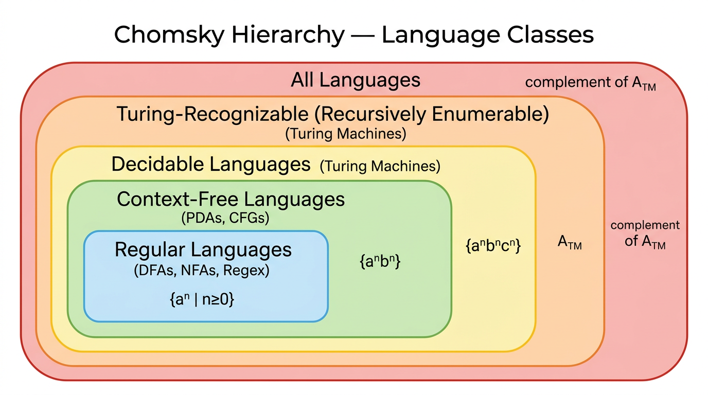

# Decidability & Undecidability — COMP0003 Automata

*Lecture-style notes. **Decidability** asks whether a TM can always give a definitive YES or NO answer. Some problems — most famously $A_{\text{TM}}$ and the halting problem — are **undecidable**: no algorithm can solve them for all inputs. The proof technique is **diagonalisation**, and **reductions** extend undecidability from one problem to another.*

---

## 1. COMPLETE TOPIC SUMMARIES

### Recognition vs decidability

| Concept | Definition | Guarantee |
|---|---|---|
| **Turing-recognisable** (r.e.) | TM accepts every $w \in L$ in finite time | Guaranteed **YES** for members; may loop on non-members |
| **Decidable** (recursive) | TM accepts every $w \in L$ **and** rejects every $w \notin L$ in finite time | Guaranteed **YES or NO** for every input |
| **Co-Turing-recognisable** | The **complement** $\overline{L}$ is Turing-recognisable | Guaranteed **NO** for non-members; may loop on members |

A TM that always halts (on every input) is called a **decider**. If a language has a decider, it is **decidable**.

**Key relationship:**

$$L \text{ is decidable} \;\Longleftrightarrow\; L \text{ is Turing-recognisable AND co-Turing-recognisable}$$

**Proof idea:** If $L$ is both recognisable (by $M_1$) and co-recognisable (by $M_2$), run $M_1$ and $M_2$ in **parallel** on input $w$. One of them must accept (since $w \in L$ or $w \in \overline{L}$). If $M_1$ accepts, accept; if $M_2$ accepts, reject. This always halts.

---

### The language hierarchy

*The Chomsky hierarchy: each layer is strictly more expressive than the one inside it. Example languages show where each class's boundary lies.*

$$\text{Regular} \;\subset\; \text{Context-Free} \;\subset\; \text{Decidable} \;\subset\; \text{Turing-recognisable (r.e.)}$$

- Every regular language is decidable (DFAs always halt).
- Every CFL is decidable (there are algorithms to decide CFG membership — see Chomsky Normal Form below).
- There exist decidable languages that are not context-free (e.g. $\{a^n b^n c^n\}$).
- There exist Turing-recognisable languages that are not decidable (e.g. $A_{\text{TM}}$).
- There exist languages that are **not even Turing-recognisable** (e.g. $\overline{A_{\text{TM}}}$).

---

### Decidable problems about DFAs

**$A_{\text{DFA}}$ — DFA acceptance.** Given a DFA $B$ and a string $w$, does $B$ accept $w$?

$$A_{\text{DFA}} = \{\langle B, w \rangle \mid B \text{ is a DFA that accepts } w\}$$

**Decidable.** Simulate $B$ on $w$ step by step; after $|w|$ steps the DFA is in some state — accept if it is a final state, reject otherwise. The simulation always terminates.

**$E_{\text{DFA}}$ — DFA emptiness.** Given a DFA $B$, is $L(B) = \emptyset$?

$$E_{\text{DFA}} = \{\langle B \rangle \mid B \text{ is a DFA with } L(B) = \emptyset\}$$

**Decidable.** Perform a **reachability search** (BFS/DFS) from the start state. If any accept state is reachable, reject (the language is non-empty); otherwise accept.

---

### Decidable problems about CFGs and Chomsky Normal Form

**$A_{\text{CFG}}$ — CFG acceptance.** Given a CFG $G$ and a string $w$, does $G$ generate $w$?

$$A_{\text{CFG}} = \{\langle G, w \rangle \mid G \text{ is a CFG that generates } w\}$$

**Decidable** — but we need to avoid the problem of infinite derivations. The solution: convert to **Chomsky Normal Form** first.

#### Chomsky Normal Form (CNF)

A CFG is in **Chomsky Normal Form** if every rule has one of these forms:

- $A \to BC$ where $B, C$ are variables (and neither is the start variable $S$).
- $A \to a$ where $a$ is a terminal.
- $S \to \epsilon$ (only the start variable may derive $\epsilon$).

**Key property:** In CNF, any derivation of a string $w$ with $|w| = n$ takes exactly $2n - 1$ steps (for $n \geq 1$). This gives a **finite bound** on the number of derivation steps to check.

**Conversion to CNF (high-level procedure):**

1. **Add a new start variable** $S_0 \to S$ so the original start variable can appear on the right-hand side of rules.
2. **Eliminate $\epsilon$-rules:** for each $A \to \epsilon$ (where $A \neq S_0$), add rules that account for $A$ being empty wherever $A$ appears on the right-hand side of other rules, then remove $A \to \epsilon$.
3. **Eliminate unit rules** ($A \to B$): replace with the rules that $B$ produces directly.
4. **Convert remaining rules:** for $A \to u_1 u_2 \cdots u_k$ with $k \geq 3$, introduce new variables to create a chain of binary rules. Replace terminals in multi-symbol rules with fresh variables.

**Deciding $A_{\text{CFG}}$:** Convert $G$ to CNF. If $w = \epsilon$, check if $S \to \epsilon$ is a rule. Otherwise, enumerate all derivations of length $2|w| - 1$. If any produces $w$, accept; otherwise reject. (In practice, the **CYK algorithm** does this in $O(n^3 |G|)$ time.)

---

### Undecidability of A_TM (acceptance problem)

$$A_{\text{TM}} = \{\langle M, w \rangle \mid M \text{ is a TM that accepts } w\}$$

$A_{\text{TM}}$ is **Turing-recognisable** — a Universal TM can simulate $M$ on $w$ and accept if $M$ accepts. But $A_{\text{TM}}$ is **not decidable**: there is no TM that always halts and correctly decides membership.

#### Proof by diagonalisation

**Assume for contradiction** that a decider $H$ exists for $A_{\text{TM}}$:

$$H(\langle M, w \rangle) = \begin{cases} \text{accept} & \text{if } M \text{ accepts } w \\ \text{reject} & \text{if } M \text{ does not accept } w \end{cases}$$

**Construct** a new TM $D$ that takes input $\langle M \rangle$ (the encoding of a TM):

1. Run $H$ on $\langle M, \langle M \rangle \rangle$ (feed $M$ its own description as input).
2. **Reverse** $H$'s answer: if $H$ accepts, $D$ **rejects**; if $H$ rejects, $D$ **accepts**.

**The contradiction.** Run $D$ on its own description $\langle D \rangle$:

- If $D$ accepts $\langle D \rangle$: by $D$'s construction, $H$ rejected $\langle D, \langle D \rangle \rangle$, meaning $D$ does **not** accept $\langle D \rangle$. Contradiction.
- If $D$ rejects $\langle D \rangle$: by $D$'s construction, $H$ accepted $\langle D, \langle D \rangle \rangle$, meaning $D$ **does** accept $\langle D \rangle$. Contradiction.

Both cases lead to contradiction, so $H$ cannot exist. $A_{\text{TM}}$ is **undecidable**. $\square$

**Intuition.** This is a self-referential "liar's paradox" argument, analogous to Cantor's diagonal argument for uncountability of the reals.

---

### The halting problem

$$\text{HALT}_{\text{TM}} = \{\langle M, w \rangle \mid M \text{ is a TM that halts on input } w\}$$

**Undecidable.** Can be proved by:

1. **Direct diagonalisation** (similar structure to $A_{\text{TM}}$), or
2. **Reduction from $A_{\text{TM}}$:** if we could decide $\text{HALT}_{\text{TM}}$, we could decide $A_{\text{TM}}$ — first check if $M$ halts on $w$; if yes, simulate $M$ on $w$ and report its answer; if no, reject. Since $A_{\text{TM}}$ is undecidable, $\text{HALT}_{\text{TM}}$ must also be undecidable.

---

### Reductions — the main proof technique

A **reduction** from problem $A$ to problem $B$ shows that solving $B$ would let us solve $A$. If $A$ is known to be undecidable, then $B$ must also be undecidable.

**Formally:** $A$ **reduces to** $B$ (written $A \leq_m B$) if there is a computable function $f$ such that $w \in A \iff f(w) \in B$.

**Proof pattern for undecidability of $B$:**

1. Assume $B$ is decidable (i.e. a decider $R$ exists for $B$).
2. Use $R$ to build a decider for $A$ (which is known undecidable).
3. Contradiction — so $B$ is undecidable.

---

### E_TM — TM emptiness is undecidable

$$E_{\text{TM}} = \{\langle M \rangle \mid M \text{ is a TM with } L(M) = \emptyset\}$$

**Reduction from $A_{\text{TM}}$.** Given $\langle M, w \rangle$, construct a new TM $M'$:

- $M'$ on input $x$: ignore $x$, simulate $M$ on $w$. If $M$ accepts $w$, accept $x$.

Now: if $M$ accepts $w$, then $M'$ accepts everything, so $L(M') \neq \emptyset$, hence $\langle M' \rangle \notin E_{\text{TM}}$. If $M$ does not accept $w$, then $M'$ accepts nothing, so $L(M') = \emptyset$, hence $\langle M' \rangle \in E_{\text{TM}}$.

If we had a decider for $E_{\text{TM}}$, we could decide $A_{\text{TM}}$ (run the $E_{\text{TM}}$ decider on $\langle M' \rangle$ and negate). Since $A_{\text{TM}}$ is undecidable, $E_{\text{TM}}$ is undecidable. $\square$

---

### EQ_TM — TM equality is undecidable

$$EQ_{\text{TM}} = \{\langle M_1, M_2 \rangle \mid L(M_1) = L(M_2)\}$$

**Reduction from $E_{\text{TM}}$.** Given $\langle M \rangle$, construct $M_{\emptyset}$ that rejects all inputs (so $L(M_{\emptyset}) = \emptyset$). Then $L(M) = \emptyset \iff L(M) = L(M_{\emptyset}) \iff \langle M, M_{\emptyset} \rangle \in EQ_{\text{TM}}$. A decider for $EQ_{\text{TM}}$ would decide $E_{\text{TM}}$. Since $E_{\text{TM}}$ is undecidable, so is $EQ_{\text{TM}}$. $\square$

---

### Summary table — decidability of standard problems

| Problem | DFA / NFA | CFG / PDA | TM |
|---|:---:|:---:|:---:|
| **Acceptance** ($A$): does machine/grammar accept/generate $w$? | Decidable | Decidable (CNF / CYK) | **Undecidable** ($A_{\text{TM}}$) |
| **Emptiness** ($E$): is the language empty? | Decidable | Decidable | **Undecidable** ($E_{\text{TM}}$) |
| **Equivalence** ($EQ$): do two machines accept the same language? | Decidable | **Undecidable** | **Undecidable** ($EQ_{\text{TM}}$) |
| **Universality** ($ALL$): does the machine accept all strings? | Decidable | **Undecidable** | **Undecidable** |

**Notable:** CFG equivalence ($EQ_{\text{CFG}}$) is **undecidable**, but DFA equivalence ($EQ_{\text{DFA}}$) is decidable (minimize both DFAs and compare, or check $L(A) \Delta L(B) = \emptyset$ using product construction).

---

## 2. EXAM-STYLE QUESTIONS (WITH MODEL ANSWERS)

### Q1 — Recognition vs decidability

**Question.** Define "Turing-recognisable" and "decidable." Give an example of a language that is Turing-recognisable but not decidable, and explain why.

**Model answer.** A language $L$ is **Turing-recognisable** if some TM accepts every $w \in L$ (but may loop on $w \notin L$). $L$ is **decidable** if some TM accepts every $w \in L$ and rejects every $w \notin L$ (always halts). Example: $A_{\text{TM}} = \{\langle M, w \rangle \mid M \text{ accepts } w\}$ is recognisable (a UTM simulates $M$ on $w$ and accepts if $M$ does) but not decidable (proved by diagonalisation — assuming a decider $H$ leads to a self-contradictory machine $D$).

---

### Q2 — Prove A_TM is undecidable

**Question.** Prove that $A_{\text{TM}} = \{\langle M, w \rangle \mid M \text{ is a TM that accepts } w\}$ is undecidable.

**Model answer.** Assume decider $H$ exists: $H(\langle M, w \rangle)$ accepts if $M$ accepts $w$, rejects otherwise. Construct $D$: on input $\langle M \rangle$, run $H(\langle M, \langle M \rangle \rangle)$ and output the **opposite**. Now consider $D(\langle D \rangle)$: if $D$ accepts $\langle D \rangle$, then $H$ rejected $\langle D, \langle D \rangle \rangle$, meaning $D$ doesn't accept $\langle D \rangle$ — contradiction. If $D$ rejects $\langle D \rangle$, then $H$ accepted, meaning $D$ does accept $\langle D \rangle$ — contradiction. So $H$ cannot exist. $\square$

---

### Q3 — Decidable = recognisable ∩ co-recognisable

**Question.** Prove that a language $L$ is decidable if and only if both $L$ and $\overline{L}$ are Turing-recognisable.

**Model answer.** ($\Rightarrow$) If $L$ is decidable by decider $D$, then $D$ recognises $L$ (accepts members, rejects non-members — it halts on everything). A machine $D'$ that runs $D$ and flips the answer recognises $\overline{L}$. ($\Leftarrow$) Let $M_1$ recognise $L$ and $M_2$ recognise $\overline{L}$. Build decider $D$: on input $w$, run $M_1$ and $M_2$ in parallel (alternate steps). Since $w \in L$ or $w \in \overline{L}$, one machine must accept. If $M_1$ accepts first, accept $w$; if $M_2$ accepts first, reject $w$. $D$ always halts.

---

### Q4 — Reduction: proving E_TM undecidable

**Question.** Use a reduction from $A_{\text{TM}}$ to prove that $E_{\text{TM}} = \{\langle M \rangle \mid L(M) = \emptyset\}$ is undecidable.

**Model answer.** Assume decider $R$ exists for $E_{\text{TM}}$. Given input $\langle M, w \rangle$ for $A_{\text{TM}}$, construct TM $M'$: on any input $x$, $M'$ ignores $x$ and simulates $M$ on $w$; if $M$ accepts, $M'$ accepts. Then: $M$ accepts $w \iff L(M') \neq \emptyset \iff \langle M' \rangle \notin E_{\text{TM}}$. So run $R$ on $\langle M' \rangle$: if $R$ rejects (meaning $L(M') \neq \emptyset$), accept (meaning $M$ accepts $w$); if $R$ accepts, reject. This decides $A_{\text{TM}}$ — contradiction. So $R$ cannot exist. $\square$

---

### Q5 — Decidability summary table

**Question.** For each of the problems Acceptance, Emptiness, and Equivalence, state whether it is decidable for (a) DFAs, (b) CFGs, (c) TMs.

**Model answer.** (a) **DFAs:** all three are decidable — acceptance by simulation, emptiness by reachability, equivalence by minimisation or symmetric difference. (b) **CFGs:** acceptance is decidable (convert to CNF, use CYK); emptiness is decidable (check if start variable generates any terminal string); equivalence is **undecidable**. (c) **TMs:** all three are **undecidable** — $A_{\text{TM}}$ by diagonalisation, $E_{\text{TM}}$ by reduction from $A_{\text{TM}}$, $EQ_{\text{TM}}$ by reduction from $E_{\text{TM}}$.

---

## 3. MUST-KNOW KEY POINTS

- **Turing-recognisable (r.e.):** TM accepts members; may loop on non-members. **Decidable:** TM always halts with correct YES/NO.
- **Co-Turing-recognisable:** complement is recognisable — guarantees NO for non-members.
- **Decidable $=$ recognisable $\cap$ co-recognisable** (run both recognisers in parallel).
- **Hierarchy:** Regular $\subset$ CFL $\subset$ Decidable $\subset$ Turing-recognisable; each inclusion is strict.
- **DFA problems:** $A_{\text{DFA}}$, $E_{\text{DFA}}$, $EQ_{\text{DFA}}$ are all **decidable**.
- **CFG problems:** $A_{\text{CFG}}$ and $E_{\text{CFG}}$ are decidable; $EQ_{\text{CFG}}$ is **undecidable**.
- **Chomsky Normal Form:** rules are $A \to BC$, $A \to a$, or $S \to \epsilon$; derivation of $w$ with $|w| = n$ takes exactly $2n - 1$ steps.
- **$A_{\text{TM}}$ is undecidable:** proof by diagonalisation — assume decider $H$, build $D$ that reverses $H$ on $\langle M, \langle M \rangle \rangle$, feed $D$ to itself → contradiction.
- **Halting problem** is undecidable (direct diagonalisation or reduction from $A_{\text{TM}}$).
- **Reductions:** if solving $B$ solves known-undecidable $A$, then $B$ is undecidable.
- **$E_{\text{TM}}$** undecidable via reduction from $A_{\text{TM}}$ (construct $M'$ that ignores input and simulates $M$ on $w$).
- **$EQ_{\text{TM}}$** undecidable via reduction from $E_{\text{TM}}$.

---

## 4. HIGH-PRIORITY TOPICS

### 🔴 Must Know

- **Definitions:** Turing-recognisable, decidable, co-Turing-recognisable, decider.
- **Decidable $=$ recognisable $\cap$ co-recognisable** — statement and proof sketch (parallel simulation).
- **$A_{\text{TM}}$ undecidability proof:** the full diagonalisation argument (assume $H$, build $D$, feed $\langle D \rangle$ to $D$, contradiction).
- **Reduction technique:** how to prove undecidability by reducing from a known undecidable problem.
- **$E_{\text{TM}}$ undecidability:** the reduction from $A_{\text{TM}}$ (construct $M'$, run $E_{\text{TM}}$ decider, negate).
- **Summary table:** decidability status of $A$, $E$, $EQ$ for DFA / CFG / TM.
- **Hierarchy diagram:** Regular $\subset$ CFL $\subset$ Decidable $\subset$ Turing-recognisable.

### 🟡 Important

- **DFA decidability proofs:** $A_{\text{DFA}}$ (simulate), $E_{\text{DFA}}$ (reachability search).
- **Chomsky Normal Form:** the three rule forms, why it guarantees a finite derivation bound, high-level conversion steps.
- **$A_{\text{CFG}}$ decidability:** convert to CNF, then check derivations of bounded length (or CYK).
- **Halting problem:** statement and proof (reduction from $A_{\text{TM}}$ or direct diagonalisation).
- **$EQ_{\text{TM}}$ undecidability** via reduction from $E_{\text{TM}}$.

### 🟢 Useful but Lower Priority

- **CNF conversion procedure** in full detail (add new start, eliminate $\epsilon$-rules, eliminate unit rules, binarise).
- **CYK algorithm** — $O(n^3)$ dynamic programming for CFG membership (usually not examined in detail in automata courses).
- **$EQ_{\text{CFG}}$ undecidability** — reduction details.
- **Rice's theorem** (generalises undecidability: any non-trivial property of TM languages is undecidable).
- **Formal definition of mapping reducibility** $\leq_m$ and its properties.

---

## 5. TOPIC INTERCONNECTIONS & BIGGER PICTURE

- **TMs** (previous topic) provide the computational model; **decidability** asks what TMs can and cannot solve. The Universal TM **recognises** $A_{\text{TM}}$ but cannot **decide** it — this is the bridge between the two topics.
- **Diagonalisation** is the same technique Cantor used to prove the reals are uncountable. The $A_{\text{TM}}$ proof is a direct analogue: we construct a "diagonal" machine $D$ that contradicts any proposed enumeration of deciders.
- **Reductions** form a **hierarchy of undecidability**: $A_{\text{TM}} \to E_{\text{TM}} \to EQ_{\text{TM}}$ — each proof builds on the previous one. This chain-of-reductions technique is the same one used in NP-completeness proofs (Cook–Levin, Karp reductions).
- **Chomsky Normal Form** connects back to **CFGs and parsing** (Lecture 8–9). CNF is also the basis for the **CYK parsing algorithm** used in natural language processing.
- The **decidability table** (DFA/CFG/TM × acceptance/emptiness/equivalence) encapsulates the entire automata course: regular languages are "easy" (everything decidable), CFLs are "medium" (equivalence breaks), TMs are "hard" (almost everything breaks). This reflects increasing expressive power coming at the cost of **analysability**.
- **Practical impact:** the halting problem means no debugger can tell you whether an arbitrary program terminates. Undecidability of $EQ_{\text{TM}}$ means no tool can check whether two programs compute the same function. These are fundamental limits of software verification.

---

## 6. EXAM STRATEGY TIPS

- **$A_{\text{TM}}$ diagonalisation is the most examinable proof in the course.** Practise writing it from memory: (1) assume $H$, (2) build $D$ that reverses $H$ on $\langle M, \langle M \rangle \rangle$, (3) run $D$ on $\langle D \rangle$, (4) both cases contradict.
- **Reductions:** always clearly state (a) what you assume is decidable, (b) what known-undecidable problem you reduce from, (c) the construction of the intermediate TM, (d) the correspondence (YES maps to YES, NO maps to NO), (e) the contradiction.
- **Direction of reduction matters.** To prove $B$ undecidable, reduce **from** a known-undecidable $A$ **to** $B$ (i.e. show $A \leq_m B$). A common exam error is reducing in the wrong direction.
- **Decidable vs recognisable:** if the question asks "is $X$ decidable?", answering "yes, a TM can recognise it" is **wrong** — you must show the TM always **halts**.
- **Summary table** is a high-value memorisation target — it compresses the whole topic into one grid. Know not just the answers but a one-line justification for each cell.
- **CNF questions:** know the three allowed rule forms ($A \to BC$, $A \to a$, $S \to \epsilon$). For the conversion procedure, a bullet-point summary of the four steps (new start, $\epsilon$-elimination, unit-elimination, binarisation) is sufficient unless the exam asks for a worked example.
- **"Recognisable $\cap$ co-recognisable $=$ decidable"** is a common short-answer question. The proof boils down to: run two machines in parallel, one must halt.
- When asked "why is $A_{\text{TM}}$ recognisable?", the answer is: "a Universal TM simulates $M$ on $w$ and accepts if $M$ accepts." When asked "why is $A_{\text{TM}}$ not decidable?", the answer is the diagonalisation proof.

---

*These notes cover decidability and undecidability as presented in COMP0003 Automata Lectures 14–15. Follow your lecturer's conventions for encoding notation and reduction definitions if they differ.*
