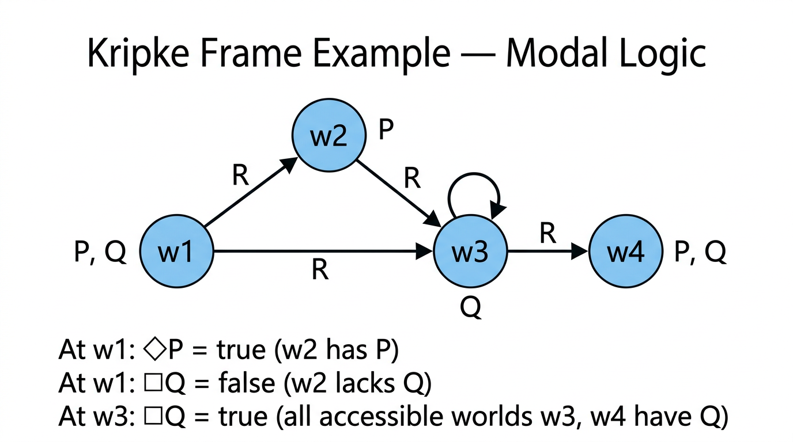

# Modal Logic — COMP0003 Formal Logic

*Lecture-style notes covering Logic Lectures 13–15. **Modal logic** extends propositional logic with operators for **possibility** ($\Diamond$) and **necessity** ($\Box$), interpreted over **Kripke frames** — directed graphs of "possible worlds." The semantics hinge on an **accessibility relation** $R$: $\Box A$ means $A$ holds in every accessible world, $\Diamond A$ means $A$ holds in some accessible world. Restricting $R$ to be **reflexive** or **transitive** yields different modal systems with distinct valid formulas — culminating in the system **S4**.*

---

## 1. COMPLETE TOPIC SUMMARY

### Why modal logic?

Classical propositional logic deals with statements that are **true or false**, period. But natural language distinguishes between what **is** true, what **must be** true, and what **could be** true:

- "It is raining." (fact)
- "It must be raining." (necessary truth)
- "It might be raining." (possible truth)

Modal logic formalises these distinctions by adding two operators — $\Box$ ("necessarily") and $\Diamond$ ("possibly") — to propositional logic. The resulting system has applications in philosophy, computer science (program verification, knowledge representation), and linguistics.

---

### Syntax of modal logic

Modal logic formulas are built from:

- **Proposition letters:** $P, Q, R, \ldots$ (as in propositional logic)
- **Propositional connectives:** $\neg, \wedge, \vee, \to, \leftrightarrow$ (as usual)
- **Modal operators:** $\Box A$ ("necessarily $A$" / "it must be that $A$") and $\Diamond A$ ("possibly $A$" / "it might be that $A$")

**Precedence.** $\Box$ and $\Diamond$ bind **tighter** than binary connectives (like $\neg$ does). So $\Box P \to Q$ means $(\Box P) \to Q$, **not** $\Box(P \to Q)$.

**Grammar (BNF-style):**

$$A \;::=\; P \;\mid\; \neg A \;\mid\; A \wedge A \;\mid\; A \vee A \;\mid\; A \to A \;\mid\; \Box A \;\mid\; \Diamond A$$

---

### Translating English to modal logic

| English | Modal formula |
|---------|---------------|
| "It is necessarily the case that $P$" | $\Box P$ |
| "It is possible that $P$" | $\Diamond P$ |
| "If $P$ then necessarily $Q$" | $P \to \Box Q$ |
| "It is necessary that if $P$ then $Q$" | $\Box(P \to Q)$ |
| "It is not possible that $P$ and $Q$" | $\neg \Diamond(P \wedge Q)$ |
| "Possibly $P$ and possibly $Q$" | $\Diamond P \wedge \Diamond Q$ |

The difference between $P \to \Box Q$ and $\Box(P \to Q)$ is a common exam trap — the scope of $\Box$ matters.

---

### Semantics — Kripke frames and models

The semantics of modal logic uses **Kripke structures** (also called **Kripke models**).

#### Frames

*A sample Kripke frame with four worlds, directed accessibility edges, and proposition assignments. Evaluation examples show how the satisfaction of modal formulas depends on what is true at accessible worlds.*

A **Kripke frame** is a pair $\mathcal{M} = (W, R)$ where:

- $W$ is a **nonempty** set of **worlds** (also called states or points).
- $R \subseteq W \times W$ is the **accessibility relation**. If $Rww'$, we say world $w'$ is **accessible from** $w$.

**Frames as directed graphs.** Each world is a node; there is a directed edge from $w$ to $w'$ iff $Rww'$. The graph can have self-loops (if $Rww$), cycles, or disconnected components.

#### Valuations

A **valuation** is a function $\rho : \mathcal{L} \to \mathcal{P}(W)$ that assigns to each proposition letter the set of worlds where that letter is **true**. That is, $P$ is true at world $w$ iff $w \in \rho(P)$.

#### A Kripke model

A **Kripke model** is a triple $(\mathcal{M}, \rho)$ — equivalently $(W, R, \rho)$ — a frame together with a valuation.

---

### The satisfaction relation

The **satisfaction relation** $\mathcal{M}, w \models_\rho A$ ("formula $A$ is true at world $w$ in model $\mathcal{M}$ under valuation $\rho$") is defined inductively:

| Formula | Satisfaction condition |
|---------|----------------------|
| $\mathcal{M}, w \models_\rho P$ | $w \in \rho(P)$ |
| $\mathcal{M}, w \models_\rho \neg A$ | $\mathcal{M}, w \not\models_\rho A$ |
| $\mathcal{M}, w \models_\rho A \wedge B$ | $\mathcal{M}, w \models_\rho A$ and $\mathcal{M}, w \models_\rho B$ |
| $\mathcal{M}, w \models_\rho A \vee B$ | $\mathcal{M}, w \models_\rho A$ or $\mathcal{M}, w \models_\rho B$ |
| $\mathcal{M}, w \models_\rho A \to B$ | $\mathcal{M}, w \not\models_\rho A$ or $\mathcal{M}, w \models_\rho B$ |
| $\mathcal{M}, w \models_\rho \Diamond A$ | $\exists w' \in W.\; Rww' \;\text{and}\; \mathcal{M}, w' \models_\rho A$ |
| $\mathcal{M}, w \models_\rho \Box A$ | $\forall w' \in W.\; Rww' \to \mathcal{M}, w' \models_\rho A$ |

**Key intuition:**

- $\Box A$ at $w$: "$A$ holds in **every** world accessible from $w$."
- $\Diamond A$ at $w$: "$A$ holds in **some** world accessible from $w$."

---

### Validity and satisfiability

**Satisfiability at a world.** A formula $A$ is **satisfiable** if there exists a model $(W, R, \rho)$ and a world $w \in W$ such that $\mathcal{M}, w \models_\rho A$.

**Validity in a frame.** $A$ is **valid in frame** $\mathcal{M} = (W, R)$ if for **every** valuation $\rho$ and **every** world $w \in W$, $\mathcal{M}, w \models_\rho A$.

**General validity.** $A$ is **(generally) valid** if it is valid in **every** frame — i.e. true at every world in every frame under every valuation.

---

### Key results on validity

#### K combined with necessity of conjunction implies necessity of B — valid

**Proof.** Let $\mathcal{M} = (W, R)$ be any frame, $\rho$ any valuation, $w$ any world. Suppose $\mathcal{M}, w \models_\rho \Box(A \wedge (A \to B))$. Then for every $w'$ with $Rww'$:

- $\mathcal{M}, w' \models_\rho A \wedge (A \to B)$
- So $\mathcal{M}, w' \models_\rho A$ and $\mathcal{M}, w' \models_\rho A \to B$
- By modus ponens, $\mathcal{M}, w' \models_\rho B$

Since this holds for every accessible $w'$, $\mathcal{M}, w \models_\rho \Box B$. The implication holds at every world in every frame, so the formula is valid. $\blacksquare$

#### Duality: not-necessarily-A iff possibly-not-A — valid

**Proof.** We show both directions at an arbitrary world $w$ in any model.

$(\Rightarrow)$ Suppose $\mathcal{M}, w \models_\rho \neg \Box A$. Then $\mathcal{M}, w \not\models_\rho \Box A$, so there exists $w'$ with $Rww'$ and $\mathcal{M}, w' \not\models_\rho A$. Thus $\mathcal{M}, w' \models_\rho \neg A$, and since $Rww'$, we have $\mathcal{M}, w \models_\rho \Diamond \neg A$.

$(\Leftarrow)$ Suppose $\mathcal{M}, w \models_\rho \Diamond \neg A$. Then there exists $w'$ with $Rww'$ and $\mathcal{M}, w' \models_\rho \neg A$, i.e. $\mathcal{M}, w' \not\models_\rho A$. So $\mathcal{M}, w \not\models_\rho \Box A$, hence $\mathcal{M}, w \models_\rho \neg \Box A$. $\blacksquare$

**Duality.** This gives a general principle: $\Box$ and $\Diamond$ are **duals**, just as $\forall$ and $\exists$ are duals in first-order logic:

$$\neg \Box A \equiv \Diamond \neg A \qquad \neg \Diamond A \equiv \Box \neg A$$

#### Necessarily A implies possibly A — NOT generally valid

**Counterexample.** Take a frame with a single world $w$ and $R = \emptyset$ (no accessibility edges — $w$ is **isolated**). Let $\rho(P) = \emptyset$ (so $P$ is false at $w$).

- $\mathcal{M}, w \models_\rho \Box P$: vacuously true, since there are **no** worlds $w'$ with $Rww'$ — the universal condition $\forall w'.\; Rww' \to \ldots$ is satisfied trivially.
- $\mathcal{M}, w \not\models_\rho \Diamond P$: there is **no** $w'$ with $Rww'$ at all, so the existential condition fails.

Therefore $\mathcal{M}, w \models_\rho \Box P$ but $\mathcal{M}, w \not\models_\rho \Diamond P$, so $\Box P \to \Diamond P$ fails at $w$. $\blacksquare$

**Insight.** The isolated-world counterexample works because $\Box$ is vacuously satisfied when nothing is accessible, while $\Diamond$ requires at least one accessible world.

#### Necessarily A implies A — NOT generally valid

**Counterexample.** Same frame: one world $w$, $R = \emptyset$, $\rho(P) = \emptyset$.

- $\mathcal{M}, w \models_\rho \Box P$: vacuously true (no accessible worlds).
- $\mathcal{M}, w \not\models_\rho P$: since $w \notin \rho(P)$.

So $\Box P \to P$ fails at $w$. $\blacksquare$

---

### Reflexive frames

A frame $(W, R)$ is **reflexive** if $R$ is reflexive: $\forall w \in W.\; Rww$.

In graph terms: every world has a **self-loop**.

#### Necessarily A implies A — valid iff the frame is reflexive

**($\Rightarrow$) If $\Box A \to A$ is valid in $\mathcal{M}$, then $\mathcal{M}$ is reflexive.**

Suppose $\mathcal{M}$ is **not** reflexive: there exists $w_0 \in W$ with $\neg Rw_0 w_0$. Define $\rho(P) = \{w' \in W \mid Rw_0 w'\}$ — i.e. $P$ is true at exactly the worlds accessible from $w_0$.

- For any $w'$ with $Rw_0 w'$: $w' \in \rho(P)$, so $\mathcal{M}, w' \models_\rho P$. Thus $\mathcal{M}, w_0 \models_\rho \Box P$.
- But $w_0 \notin \rho(P)$ (since $\neg Rw_0 w_0$), so $\mathcal{M}, w_0 \not\models_\rho P$.
- Therefore $\mathcal{M}, w_0 \models_\rho \Box P \wedge \neg P$, making $\Box P \to P$ false at $w_0$. Contradiction.

**($\Leftarrow$) If $\mathcal{M}$ is reflexive, then $\Box A \to A$ is valid in $\mathcal{M}$.**

Let $w \in W$ and suppose $\mathcal{M}, w \models_\rho \Box A$. Then for all $w'$ with $Rww'$, $\mathcal{M}, w' \models_\rho A$. Since $R$ is reflexive, $Rww$, so taking $w' = w$ gives $\mathcal{M}, w \models_\rho A$. $\blacksquare$

---

### Transitive frames

A frame $(W, R)$ is **transitive** if $R$ is transitive: $\forall u, v, w \in W.\; (Ruv \wedge Rvw) \to Ruw$.

#### Necessarily A implies necessarily necessarily A — valid iff the frame is transitive

**($\Leftarrow$) If $\mathcal{M}$ is transitive, then $\Box A \to \Box \Box A$ is valid in $\mathcal{M}$.**

Suppose $\mathcal{M}, w \models_\rho \Box A$. We need $\mathcal{M}, w \models_\rho \Box \Box A$, i.e. for all $w'$ with $Rww'$, $\mathcal{M}, w' \models_\rho \Box A$.

Take any $w'$ with $Rww'$ and any $w''$ with $Rw'w''$. By transitivity, $Rww''$. Since $\mathcal{M}, w \models_\rho \Box A$ and $Rww''$, we get $\mathcal{M}, w'' \models_\rho A$. Since $w''$ was arbitrary among worlds accessible from $w'$, we have $\mathcal{M}, w' \models_\rho \Box A$. Since $w'$ was arbitrary among worlds accessible from $w$, we have $\mathcal{M}, w \models_\rho \Box \Box A$. $\blacksquare$

**($\Rightarrow$) If $\Box A \to \Box \Box A$ is valid in $\mathcal{M}$, then $\mathcal{M}$ is transitive.**

Suppose $\mathcal{M}$ is **not** transitive: there exist $u, v, w \in W$ with $Ruv$, $Rvw$, but $\neg Ruw$. Define $\rho(P) = \{w' \in W \mid Ruw'\}$.

- For any $w'$ with $Ruw'$: $w' \in \rho(P)$, so $\mathcal{M}, w' \models_\rho P$. Thus $\mathcal{M}, u \models_\rho \Box P$.
- Now consider $v$ (with $Ruv$): for $\Box P$ at $v$, we need $P$ at all $w'$ with $Rvw'$. In particular, $Rvw$ but $w \notin \rho(P)$ (since $\neg Ruw$), so $\mathcal{M}, w \not\models_\rho P$. Therefore $\mathcal{M}, v \not\models_\rho \Box P$.
- Since $Ruv$ and $\mathcal{M}, v \not\models_\rho \Box P$, we have $\mathcal{M}, u \not\models_\rho \Box \Box P$.
- So $\mathcal{M}, u \models_\rho \Box P \wedge \neg \Box \Box P$, making $\Box P \to \Box \Box P$ false at $u$. Contradiction. $\blacksquare$

---

### Modal logic S4

**S4** is the modal logic determined by frames that are both **reflexive** and **transitive**.

**Axioms of S4** (in addition to all propositional tautologies and the distribution axiom $\Box(A \to B) \to (\Box A \to \Box B)$):

| Axiom name | Formula | Frame condition |
|------------|---------|-----------------|
| **T** (reflexivity axiom) | $\Box A \to A$ | $R$ is reflexive |
| **4** (transitivity axiom) | $\Box A \to \Box \Box A$ | $R$ is transitive |

A formula is **S4-valid** iff it is valid in all reflexive and transitive frames.

**Remarks:**

- S4 is one of many modal systems. Others include **K** (no frame conditions), **T** (reflexive only), **S5** (reflexive, symmetric, and transitive — equivalence relations), and **GL** (Gödel–Löb logic, for provability).
- In S4, both $\Box A \to A$ and $\Box A \to \Box \Box A$ are valid, so iterated modalities can be simplified: $\Box \Box A \equiv \Box A$.

---

### Exam revision summary — four subtopics of COMP0003

The COMP0003 module (as indicated in the lectures) covers four main blocks:

1. **Propositional logic:** syntax, semantics (truth tables), tautologies, satisfiability, natural deduction, soundness and completeness.
2. **First-order logic (FOL):** predicates, quantifiers ($\forall, \exists$), structures, satisfaction, validity, natural deduction for FOL.
3. **Induction:** ordinary induction, complete (strong) induction, infinite descent, well-ordering.
4. **Modal logic:** $\Box$, $\Diamond$, Kripke frames, satisfaction, validity, frame conditions (reflexive, transitive), S4.

---

## 2. EXAM-STYLE QUESTIONS (WITH MODEL ANSWERS)

### Q1 — Satisfaction at a world

**Question.** Consider the frame $\mathcal{M} = (W, R)$ with $W = \{w_1, w_2, w_3\}$ and $R = \{(w_1, w_2), (w_1, w_3), (w_2, w_3)\}$. Let $\rho(P) = \{w_2\}$ and $\rho(Q) = \{w_2, w_3\}$. Determine whether $\mathcal{M}, w_1 \models_\rho \Box Q$ and whether $\mathcal{M}, w_1 \models_\rho \Diamond P$.

**Model answer.**

**$\Box Q$ at $w_1$:** The worlds accessible from $w_1$ are $w_2$ and $w_3$ (since $Rw_1 w_2$ and $Rw_1 w_3$). Is $Q$ true at both?

- $w_2 \in \rho(Q) = \{w_2, w_3\}$: yes.
- $w_3 \in \rho(Q)$: yes.

Both accessible worlds satisfy $Q$, so $\mathcal{M}, w_1 \models_\rho \Box Q$. **True.**

**$\Diamond P$ at $w_1$:** Is there an accessible world where $P$ is true?

- $w_2 \in \rho(P) = \{w_2\}$: yes, and $Rw_1 w_2$.

So $\mathcal{M}, w_1 \models_\rho \Diamond P$. **True.**

---

### Q2 — Counterexample to general validity

**Question.** Show that $\Box A \to A$ is not generally valid by constructing a counterexample.

**Model answer.** Let $\mathcal{M} = (\{w\}, \emptyset)$ — a single world $w$ with no accessibility edges. Let $\rho(P) = \emptyset$.

- $\mathcal{M}, w \models_\rho \Box P$: There are **no** $w'$ with $Rww'$, so the condition "$\forall w'.\; Rww' \to \mathcal{M}, w' \models_\rho P$" is **vacuously true**.
- $\mathcal{M}, w \not\models_\rho P$: since $w \notin \rho(P) = \emptyset$.

Therefore $\mathcal{M}, w \models_\rho \Box P$ and $\mathcal{M}, w \not\models_\rho P$, so $\Box P \to P$ is false at $w$. The formula is not generally valid. $\blacksquare$

---

### Q3 — Prove validity of the □/◇ duality (not-□A iff ◇¬A)

**Question.** Prove that $\neg \Box A \leftrightarrow \Diamond \neg A$ is valid in all frames.

**Model answer.** Let $\mathcal{M} = (W, R)$ be any frame, $\rho$ any valuation, $w \in W$.

$(\Rightarrow)$ Suppose $\mathcal{M}, w \models_\rho \neg \Box A$. Then $\mathcal{M}, w \not\models_\rho \Box A$: not every accessible world satisfies $A$. So $\exists w' \in W$ with $Rww'$ and $\mathcal{M}, w' \not\models_\rho A$, i.e. $\mathcal{M}, w' \models_\rho \neg A$. Since $Rww'$ and $w'$ satisfies $\neg A$, by the semantics of $\Diamond$: $\mathcal{M}, w \models_\rho \Diamond \neg A$.

$(\Leftarrow)$ Suppose $\mathcal{M}, w \models_\rho \Diamond \neg A$. Then $\exists w'$ with $Rww'$ and $\mathcal{M}, w' \models_\rho \neg A$, i.e. $\mathcal{M}, w' \not\models_\rho A$. So not all accessible worlds satisfy $A$, meaning $\mathcal{M}, w \not\models_\rho \Box A$, hence $\mathcal{M}, w \models_\rho \neg \Box A$.

Both directions hold at every world in every frame under every valuation. $\blacksquare$

---

### Q4 — Prove □A → A is valid iff the frame is reflexive

**Question.** Prove that $\Box A \to A$ is valid in a frame $\mathcal{M} = (W, R)$ if and only if $R$ is reflexive.

**Model answer.**

**($\Leftarrow$)** Suppose $R$ is reflexive. Let $w \in W$ and $\rho$ any valuation with $\mathcal{M}, w \models_\rho \Box A$. Then $\forall w'.\; Rww' \to \mathcal{M}, w' \models_\rho A$. Since $R$ is reflexive, $Rww$, so taking $w' = w$: $\mathcal{M}, w \models_\rho A$. Thus $\Box A \to A$ holds at every world.

**($\Rightarrow$)** Suppose $\Box A \to A$ is valid in $\mathcal{M}$ but $R$ is **not** reflexive: there exists $w_0$ with $\neg Rw_0 w_0$. Define $\rho(P) = \{w' \in W \mid Rw_0 w'\}$. Then:

- For all $w'$ with $Rw_0 w'$: $w' \in \rho(P)$, so $\mathcal{M}, w' \models_\rho P$. Hence $\mathcal{M}, w_0 \models_\rho \Box P$.
- But $w_0 \notin \rho(P)$ (since $\neg Rw_0 w_0$), so $\mathcal{M}, w_0 \not\models_\rho P$.

This makes $\Box P \to P$ false at $w_0$, contradicting validity. $\blacksquare$

---

### Q5 — S4 and frame conditions

**Question.** What frame conditions define the modal logic S4? State the two corresponding axioms and explain why $\Box \Box A \equiv \Box A$ in S4.

**Model answer.** S4 is the modal logic of frames where $R$ is both **reflexive** and **transitive**. The axioms are:

- **Axiom T:** $\Box A \to A$ (corresponds to reflexivity).
- **Axiom 4:** $\Box A \to \Box \Box A$ (corresponds to transitivity).

To show $\Box \Box A \equiv \Box A$ in S4:

- $\Box A \to \Box \Box A$: this is Axiom 4, valid by transitivity.
- $\Box \Box A \to \Box A$: instantiate Axiom T with the formula $\Box A$: $\Box(\Box A) \to \Box A$. This is valid by reflexivity (applying the T axiom to the formula $\Box A$).

Combining both directions: $\Box A \leftrightarrow \Box \Box A$ is S4-valid. So iterated $\Box$ operators collapse in S4. $\blacksquare$

---

## 3. MUST-KNOW KEY POINTS

- **Syntax:** $\Box A$ ("necessarily $A$") and $\Diamond A$ ("possibly $A$") extend propositional logic. Both bind tighter than binary connectives.
- **Kripke frame:** $(W, R)$ with $W$ a nonempty set of worlds and $R \subseteq W \times W$ the accessibility relation. Frames are directed graphs.
- **Valuation:** $\rho : \mathcal{L} \to \mathcal{P}(W)$ assigns proposition letters to sets of worlds.
- **Satisfaction:** $\Box A$ at $w$ iff $A$ holds at **all** $R$-accessible worlds; $\Diamond A$ at $w$ iff $A$ holds at **some** $R$-accessible world.
- **Duality:** $\neg \Box A \equiv \Diamond \neg A$ and $\neg \Diamond A \equiv \Box \neg A$ — valid in all frames.
- **$\Box A \to \Diamond A$ is NOT valid** — fails at isolated worlds ($R = \emptyset$) where $\Box$ is vacuously true.
- **$\Box A \to A$ is NOT generally valid** — same isolated-world counterexample.
- **Reflexive frames ($Rww$ for all $w$):** $\Box A \to A$ is valid **iff** the frame is reflexive.
- **Transitive frames:** $\Box A \to \Box \Box A$ is valid **iff** the frame is transitive.
- **S4 = reflexive + transitive frames.** Axioms: $\Box A \to A$ (T) and $\Box A \to \Box \Box A$ (4).

---

## 4. HIGH-PRIORITY TOPICS

### 🔴 Must Know

- **Syntax:** $\Box$, $\Diamond$, precedence rules. Translating English to modal formulas.
- **Kripke frame definition** $(W, R)$ and the concept of worlds and accessibility.
- **Satisfaction relation** — all seven clauses, especially $\Box$ and $\Diamond$.
- **Evaluating formulas** at specific worlds in a given model (trace through the definition).
- **Duality of $\Box$ and $\Diamond$:** proof that $\neg \Box A \leftrightarrow \Diamond \neg A$.
- **Counterexample:** $\Box A \to A$ and $\Box A \to \Diamond A$ fail at isolated worlds — know how to construct and explain this.
- **Reflexivity characterisation:** $\Box A \to A$ valid iff reflexive (both directions of the proof).
- **Transitivity characterisation:** $\Box A \to \Box \Box A$ valid iff transitive (both directions).

### 🟡 Important

- **S4 axioms** (T and 4) and the corresponding frame conditions. Collapse of iterated modalities: $\Box \Box A \equiv \Box A$.
- **Validity vs satisfiability** distinction (in a frame vs generally).
- **Proof of** $\Box(A \wedge (A \to B)) \to \Box B$ — as a template for showing formulas are valid.
- **Constructing counterexample frames** to disprove general validity — knowing which "pathological" frames to try (isolated worlds, asymmetric edges, etc.).

### 🟢 Useful but Lower Priority

- Other modal systems: **K**, **T**, **S5**, **GL** — names and rough frame conditions.
- Applications of modal logic in computer science (knowledge, belief, temporal reasoning).
- The full exam revision summary mapping four COMP0003 subtopics.

---

## 5. TOPIC INTERCONNECTIONS & BIGGER PICTURE

- **Propositional logic (Lectures 1–5)** is the base language that modal logic extends. Every propositional tautology remains valid in modal logic; the $\Box$/$\Diamond$ operators add a new dimension of reasoning about **possible** versus **actual** truth.
- **First-order logic (Lectures 6–10)** has quantifiers $\forall$ and $\exists$ over a domain. $\Box$ and $\Diamond$ behave analogously: $\Box$ = "for all accessible worlds" and $\Diamond$ = "there exists an accessible world." The duality $\neg \Box \equiv \Diamond \neg$ mirrors $\neg \forall \equiv \exists \neg$.
- **Induction (Lectures 11–12)** connects in that frame-condition proofs (reflexivity, transitivity characterisations) sometimes use structural arguments or case analysis familiar from inductive reasoning. Well-foundedness of accessibility relations is central to modal logics of provability (GL).
- **Automata theory** (the other half of COMP0003) intersects via **model checking**: verifying whether a Kripke structure satisfies a modal/temporal formula is algorithmic, relating to state-space exploration in finite automata.
- **Temporal logic** (CTL, LTL) extends modal logic with operators for "always in the future" and "eventually," used in hardware and software verification — a natural continuation of the Kripke semantics framework.

---

## 6. EXAM STRATEGY TIPS

- **Draw the frame.** For any question involving a specific model, sketch the directed graph with labelled worlds and edges. Mark which proposition letters are true at each world. This prevents mistakes when evaluating nested modalities.
- **Evaluate inside-out.** For nested formulas like $\Box(\Diamond P \to Q)$, first evaluate $\Diamond P$ at each world, then $\Diamond P \to Q$ at each world, then apply $\Box$.
- **Isolated-world trick.** The frame $(\{w\}, \emptyset)$ is the go-to counterexample for anything involving $\Box$ being vacuously true. Use it whenever asked to show a formula is **not** generally valid.
- **Both directions in "iff" proofs.** For "$\Box A \to A$ valid iff reflexive," you must prove ($\Leftarrow$) and ($\Rightarrow$) separately. The ($\Rightarrow$) direction typically constructs a **clever valuation** $\rho$ tailored to expose the failure.
- **Precedence matters.** $\Box P \to Q$ is $(\Box P) \to Q$, not $\Box(P \to Q)$. Misplacing parentheses changes the meaning entirely — annotate your work with explicit parentheses when in doubt.
- **Duality as a shortcut.** Instead of proving something about $\Diamond$ from scratch, use $\Diamond A \equiv \neg \Box \neg A$ to reduce to a $\Box$-statement (or vice versa). Examiners accept this equivalence without re-proof once it has been established.
- **Name the axioms.** When invoking S4 properties, say "by Axiom T (reflexivity)" or "by Axiom 4 (transitivity)" rather than just "by S4." This shows you know which condition does the work.

---

*These notes cover Logic Lectures 13–15 (Modal Logic) for COMP0003 Formal Logic; follow your lecturer's notation if it differs.*
