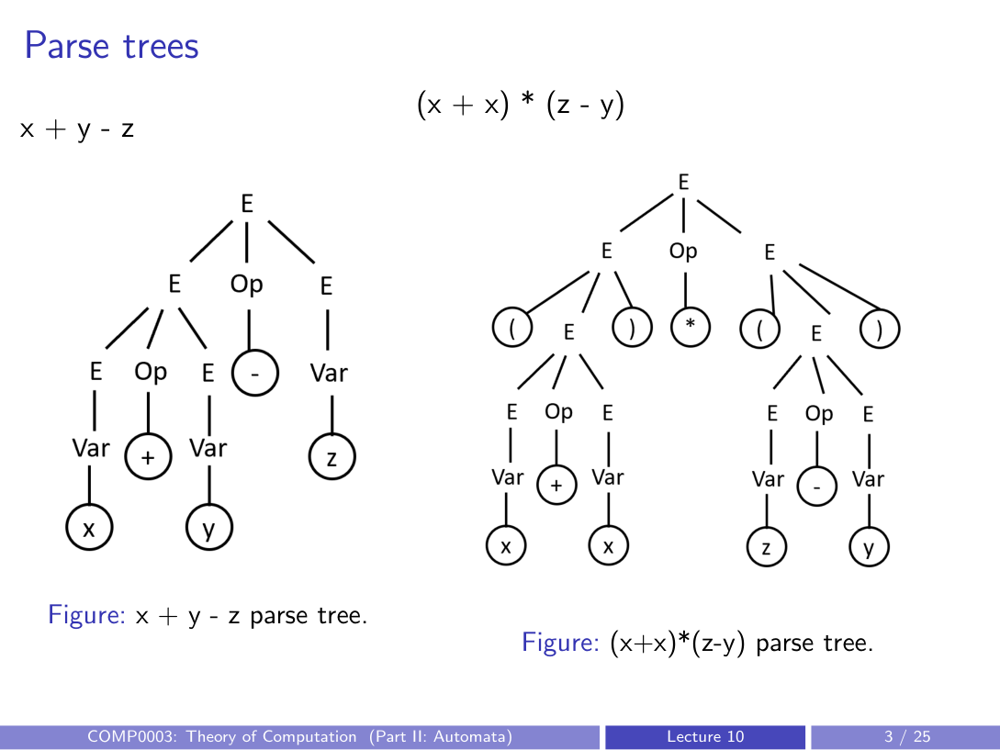
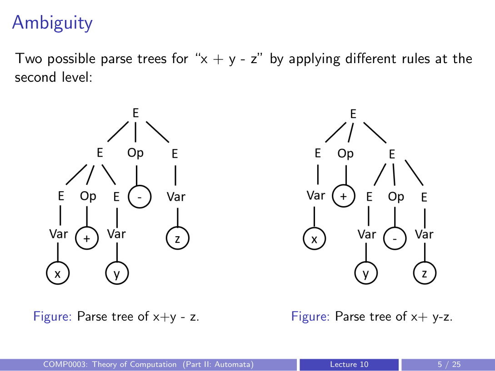
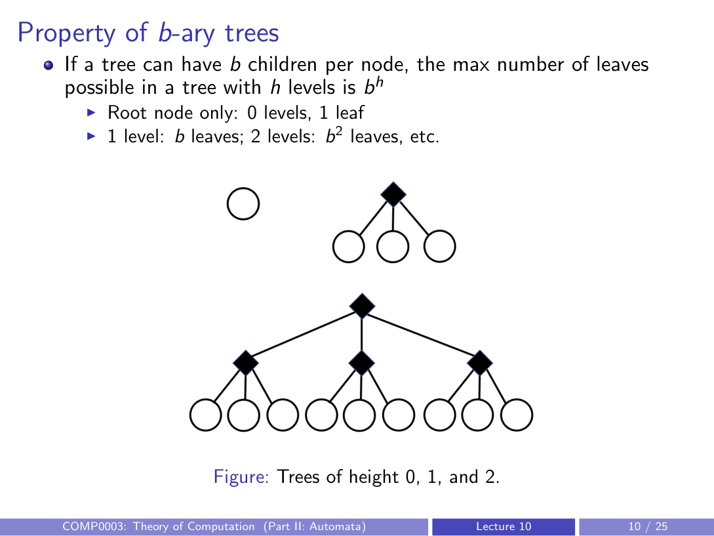
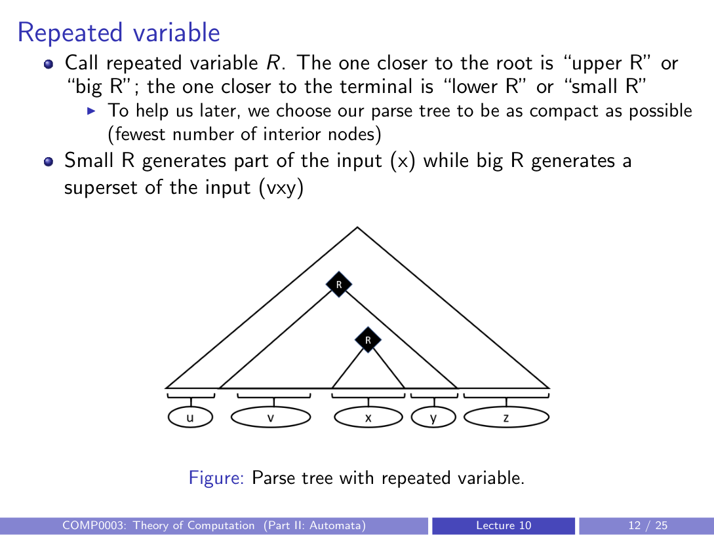
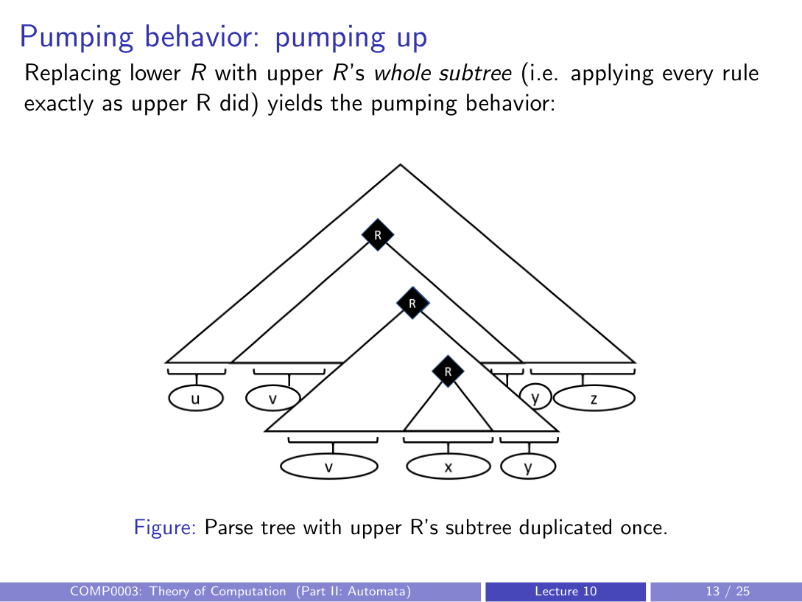
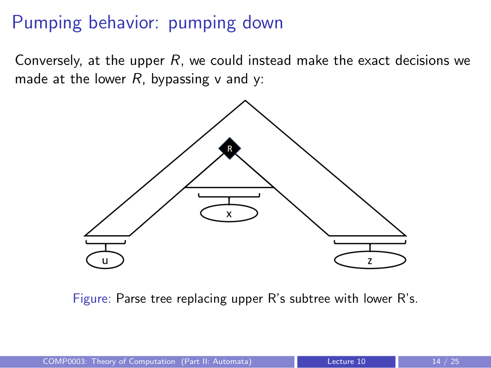

# parse trees, ambiguity, and the pumping lemma for CFLs

## CFG example: algebraic expressions
Grammar for simple algebraic expressions:
- $E \to E \; Op \; E \mid (E) \mid Var$
- $Op \to + \mid - \mid * \mid \div$
- $Var \to x \mid y \mid z$

Some derivable strings:
- `x + y - z`
- `(x + x) * (z - y)`
- `((y ÷ x) + z)`

---

## parse trees

### features of parse trees
- children of a node = variables AND terminals on the right side of a rule
- leaves = terminals; interior nodes = variables
- path from root to leaf = chain of derivation steps needed to produce that terminal in the final string

---

## ambiguity
A grammar is **ambiguous** if some string has more than one parse tree.

Example: `x + y - z` can be parsed two ways:
- `(x + y) - z` — apply `E Op E` at top, left child expands first
- `x + (y - z)` — apply `E Op E` at top, right child expands first

These give different parse trees (and potentially different evaluation results).

---

## pumping lemma for context-free languages

### the property
Similar to regular languages, all CFLs have a pumping length. Strings longer than this can be pumped to produce other strings in the language.

This is useful for proving a language is **not** context-free (same proof-by-contradiction strategy as the RL pumping lemma).

### statement
For any context-free language $A$, there exists a pumping length $p$ such that any string $s \in A$ with $|s| \geq p$ can be split into $s = uvxyz$ satisfying:

1. $uv^ixy^iz \in A$ for all $i \geq 0$ (pump the **second and fourth** segments simultaneously)
2. $|vy| > 0$ (at least one of $v, y$ is non-empty)
3. $|vxy| \leq p$ (the pumpable "window" is bounded)

---

## proof idea (why the pumping lemma holds)

### setup
- let $b$ = branching factor (max number of symbols on the right side of any rule)
- let $n = |V|$ = number of variables in the grammar
- pumping length: $p = b^{n+1}$

### b-ary tree height argument

- a tree with branching factor $b$ and $h$ levels has at most $b^h$ leaves
- if a string has more than $b^n$ terminals (i.e. $\geq b^{n+1}$), the parse tree must have at least $n + 1$ levels
- a path with $n + 1$ interior nodes passes through $n + 1$ variables
- by the **pigeonhole principle**, some variable $R$ must repeat along this path

### the repeated variable

- call the occurrence closer to the root "upper $R$" (big $R$) and the one closer to the leaf "lower $R$" (small $R$)
- lower $R$ generates part of the input: $x$
- upper $R$ generates a superset: $vxy$
- we choose the most compact parse tree (fewest interior nodes) and focus on the longest root-to-leaf path

### pumping up

Replace lower $R$'s subtree with upper $R$'s entire subtree (applying the same rules upper $R$ used). This adds another copy of $v$ and $y$, giving $uv^2xy^2z$. Repeating gives $uv^ixy^iz$.

### pumping down

At upper $R$, make the same decisions as lower $R$ instead. This skips $v$ and $y$ entirely, giving $uxz = uv^0xy^0z$.

### why $|vy| > 0$?
If both $v$ and $y$ were empty, then $w = uxz$, and we could have used lower $R$'s decisions at upper $R$ from the start — producing the same string with a smaller tree. This contradicts our assumption that we picked the most compact tree. So at least one of $v, y$ must be non-empty.

### why $|vxy| \leq p$?
The repeat was found in the bottom $n + 1$ nodes of the longest path. So upper $R$'s subtree has at most $n + 1$ levels, which means it generates at most $b^{n+1} = p$ terminals.

---

## using the pumping lemma to prove a language is not context-free

### the contrapositive
The pumping lemma says: if $L$ is a CFL, then the pumping property holds.

Contrapositive: if the pumping property does **not** hold, then $L$ is **not** a CFL.

To prove $L \notin$ CFL, show:
- for **all** $p$, there **exists** a string $s \in L$ with $|s| \geq p$, such that for **all** breakdowns $s = uvxyz$, at least one of the three properties fails

Strategy: given arbitrary $p$, construct an "evil string" and show every valid breakdown breaks the lemma.

---

## example: $L = \{a^n b^n c^n \mid n \geq 0\}$ is not context-free

Given arbitrary $p$, choose $s = a^p b^p c^p$ (so $|s| = 3p \geq p$).

### proof strategy 1 (case analysis)
**Case 1**: $v$ and $y$ each contain at most one type of character.
- then pumping affects at most 2 of the 3 character types
- the third type's count stays the same, so the counts become unequal
- pumped string $\notin L$

**Case 2**: at least one of $v$ or $y$ contains 2+ types of characters (e.g. `aabb`).
- pumping produces interleaved characters (e.g. `aabbaabb`) that break the $a^*b^*c^*$ pattern
- pumped string $\notin L$

All cases break the lemma, so $L$ is not a CFL.

### proof strategy 2 (using property 3 directly)
Assume property 3 holds: $|vxy| \leq p$.

Since each segment ($a^p$, $b^p$, $c^p$) has length $p$, the window $vxy$ can span at most 2 of the 3 segments — it's not wide enough to touch all three.

So $v$ and $y$ collectively contain at most 2 character types. Pumping increases those types but not the third, breaking the equal-count requirement.

Therefore the pumping lemma cannot hold, so $L$ is not a CFL.

---

## summary
- parse trees visualise CFG derivations; leaves are terminals, interior nodes are variables
- a grammar is ambiguous if a string has multiple parse trees
- the pumping lemma for CFLs: long enough strings can be split into $uvxyz$ and pumped at $v$ and $y$ simultaneously
- use the contrapositive to prove languages are not context-free (e.g. $\{a^n b^n c^n\}$)
- CFGs/PDAs are more powerful than DFAs/regex, but still cannot recognise some languages
