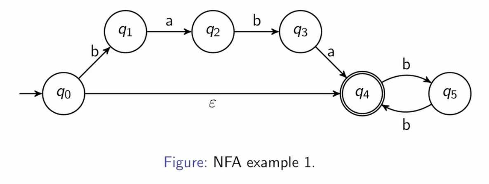
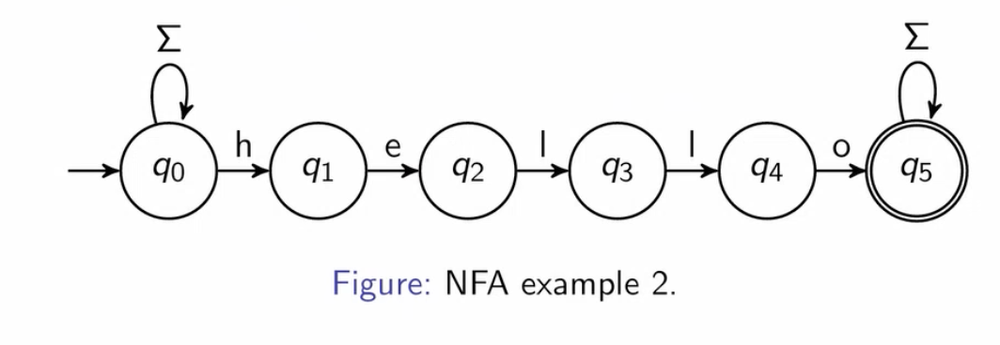
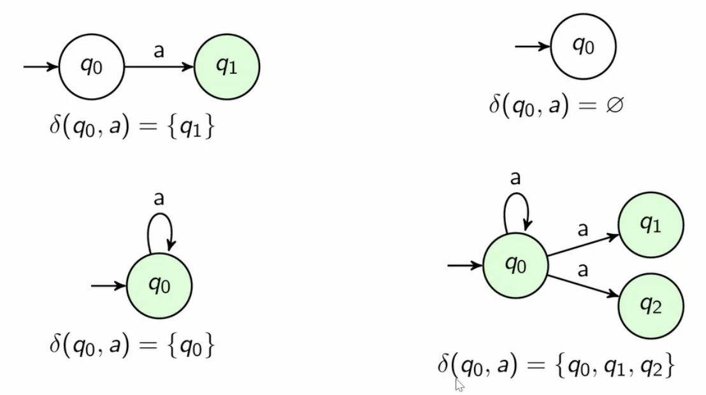
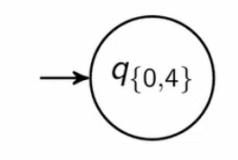

# nondeterministic finite automata/NFAs
- NFA = DFA with convenient features:
  - $\epsilon$ transitions: can change states without consuming input
  - multiple arrows with same input can leave a state to different destinations
  - missing arrows okay
- exact same power as DFAs

# example: $\epsilon$ transitions
$\Sigma= \set{a, b}$
create a finite automaton that accepts strings that optionally start with "$baba$" followed by an even number of $b$'s

# example: substring
$\Sigma = \set{A, \dots, Z, a, \dots, z, 0, \dots, 9}$
create a finite automaton that accepts any string containing "hello" as a substring.

not a valid DFA (multiple "h" transitions from $q_0$)
don't need backtracking

# nondeterminism
- multiple actions posisble at each state
- trace through them all simultaneously
- or somehow "know" the right path to take all along

# formal definition
An NFA $M$ is a 5-tuple $(Q, \Sigma, \delta, q_0, F)$, where:
- $Q \Sigma, q_0, F$ ... no change
- $\delta: Q \times \Sigma_\epsilon \to \mathcal{P}(Q)$
  - note: $\Sigma_\epsilon = \Sigma \cup \set{\epsilon}$
  - instead of spitting out one single state to go to, it spits out a subset of $Q$ states to go to

# NFA transition function
- NFAs can transition to any number of states when reading an input character.

# NFA operation (acceptance)
## definition
NFA $N = (Q, \Sigma, \delta, q_0, F)$ accepts input string $w = w_1 w_2 \dots w_n (w_i \in \Sigma_\epsilon)$ if there exists a sequence of starts $r_0, r_1, \dots, r_n$ such that:
1. $r_0 = q_0$ (start in start state)
2. $r_{i+1} \in \delta(r_i, w_{i+1})$ for $i = 0, \dots, n-1$ (use valid transitions)
3. $r_n \in F$ (end in an accepting state)
- note: $abb, \epsilon abb, a \epsilon b \epsilon b \epsilon \epsilon \epsilon$ are all ways of writing the same string
- accept if there exists a valid path from start state to accepting state for this input string

# equivalent power
- NFAs are exactly as powerful as DFAs (no more and no less)
- proof: want to show any NFA can be implemented as DFA and vice versa
- easy case: any DFA can be implemented as an NFA. Any valid DFA is (pictorially) already a valid NFA. Mathematically, make the outputs of the DFA's transition function into 1-element sets and you have a valid NFA 
- hard case: any NFA can be implemented as a DFA (next)

# converting NFA to DFA
- want to show: any NFA $N$ can be implemented as a DFA $M$
- similar to union proof in automata lecture 2.
- instead of tracking a pair of states, we track which combination of states in our NFA $N$ we might currently be in
- whenever we read in new input, we update that set of states accordingly.

- at the beginning, having read in NO input, we could either be in state $q_0$ or $q_4$

- after reading a $b$, we could in $q_1$ or $q_5$
- after reading in an $a$, we are in no state (trash)
- from $q_{\set{1, 5}}$, after reading $b$, we could be in $q_4$; after reading an $a$, we could be in $q_2$; reading any $a$'s will land us in $q_\emptyset$
- and so on.

# converting NFA to DFA: handling $\epsilon$ transitions
- whenever you update the set of states you're possibly in, it's important to follow any $\epsilon$ arrows too ($\epsilon$-closure)
- if input $a$ takes you to a set of states $S = \delta(q_i, a)$, then the epsilon closure $E(S)$ is $S \cup \set{q_j |q_j \text{ is reachable by } \epsilon \text{ transitions from any } q_k \in S}$
  - repeatedly union $S$ with $\set{q_j | q_j \in \delta(q_k, \epsilon), q_k \in S}$ until the set doesn't change anymore

# converting NFA to DFA: general procedure
- given NFA $N = (Q, \Sigma, \delta, q_0, F)$ we create DFA $M = (Q', \Sigma', \delta', q_0', F')$:
  $Q' = \mathcal{P}(Q)$
  $\Sigma' = \Sigma$
  $\delta' (R, a) = \set{q \in Q | q \in E(\delta(r, a)) \text{ for any } r \in R}$ (all states reachable from current states $R$ on input $a$ and any number of $\epsilon$ transitions)
  $q_0' = E(\set{q_0})$
  $F' = \set{R \in Q'| R \text{ contains an accept state in } F}$
- potentially huge, but completely valid DFA

# conclusion
- any NFA can be expressed as a regular DFA
- "syntactic sugar": NFAs make it easier and cleaner to express ideas but do not add any additional functionality

# big three closure properties
- if $L_1$ and $L_2$ are regular languages, then:
  - $L_3 = L_1 \cup L_2$ is also a regular language (union)
  - $L_3 = \set{s_1 s_2 | s_1 \in L_1 \text{ and } s_2 \in L_2}$ is also a regular language (concatenation)
- if $L$ is a regular language, then $L*$ is also a regular language, where $L*=$ the set of finite strings consisting of an arbitrary number of strings in $L$ (zero or more) concatenated together (Kleene star)

# union proof: formal construction
- given NFAs $M_1 = (Q_1, \Sigma_1, \delta_1, q_{01}, F_1)$ and $M_2 = (Q_2, \Sigma_2, \delta_2, q_{02}, F_2)$ 
- construct NFA $N = $
    $Q_n = \set{q_{0\text{new}}}\cup Q_1 \cup Q_2$
    $\Sigma_n = \Sigma_1 \cup \Sigma_2$
    $q_{0n} = q_{0\text{new}}$
    $F_n = F_1 \cup F_2$
    $\delta_n(q_1, a_1) = \delta_1(q_1, a_1) \text{ for} q_1 \in Q_1 \text{ and } a_1 \in \Sigma_1$
    $\delta_n(q2, a_2) = \delta_2(q_2, a_2) \text{ for} q_2 \in Q_2 \text{ and } a_2 \in \Sigma_2$
    $\delta_n (q, a) = \emptyset \text{ otherwise}$ 

## does this really work?
- a string $s$ in $L(M_1)$ or $L(M_2)$ would be accepted by new NFA
- the new NFA would not cause a string $s$ not in either language to be accepted
- implicitly, we we would be converting all NFAs to corresponding DFAs.