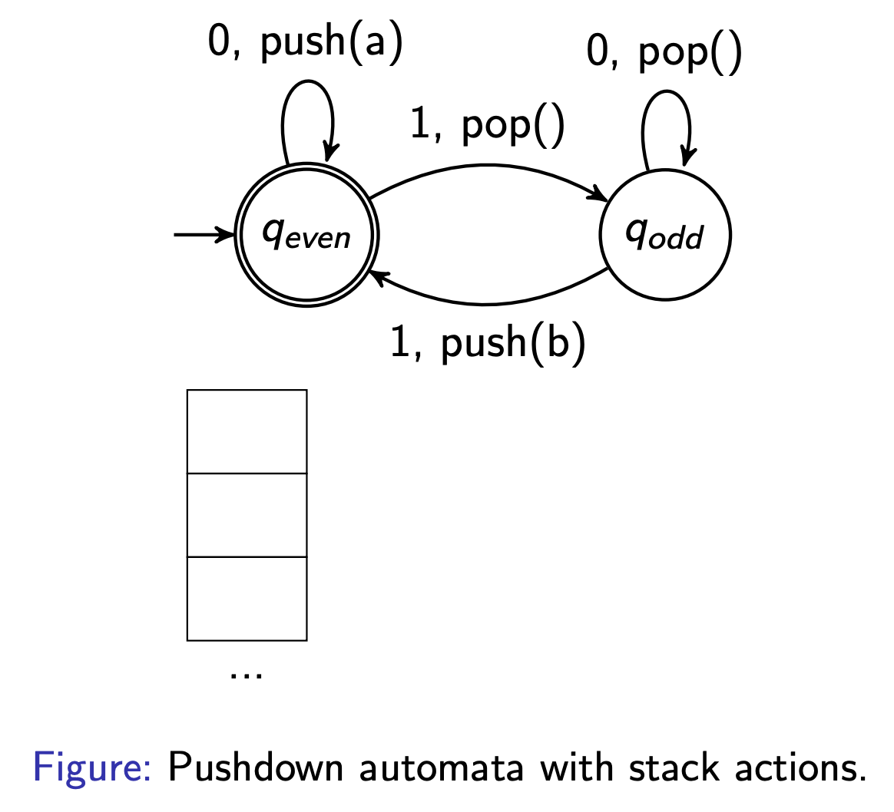
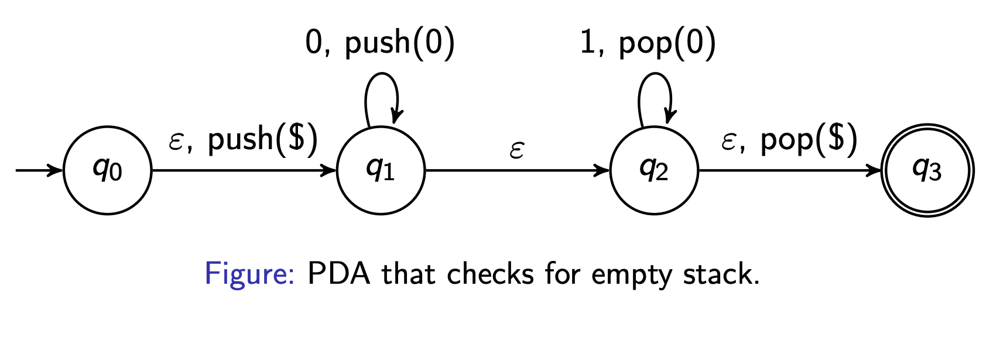
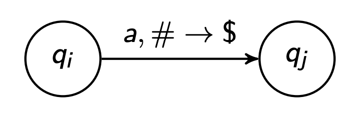
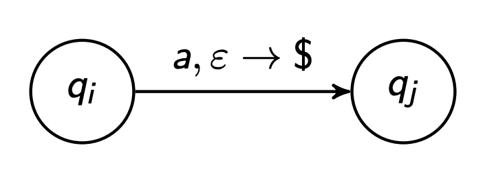
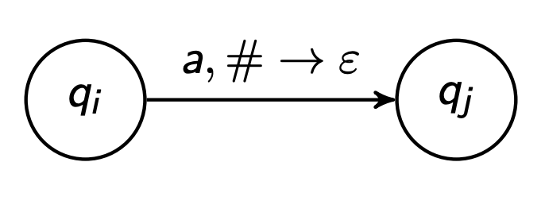
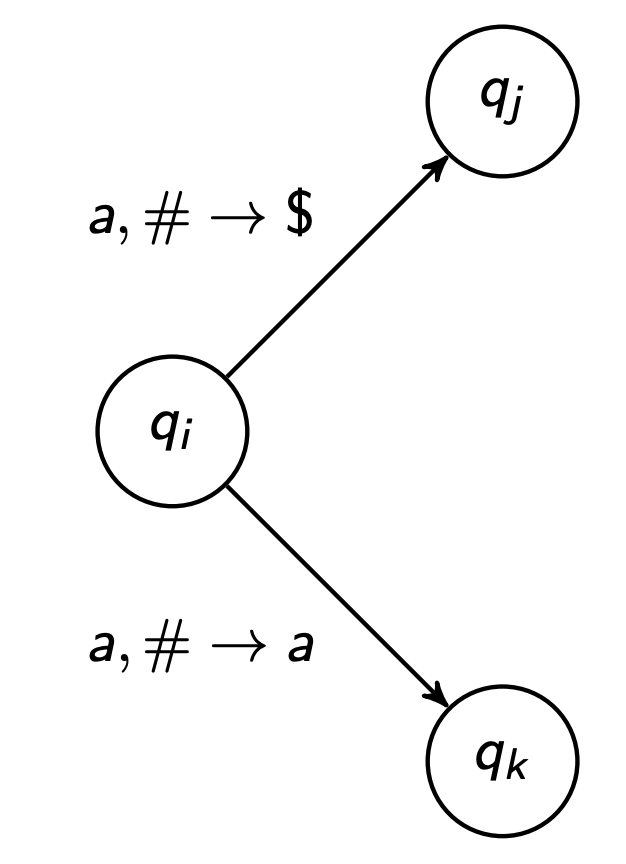
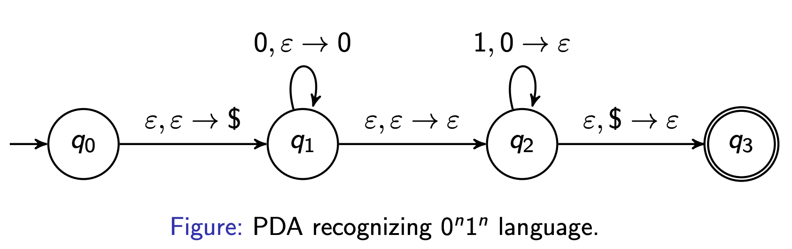

# Pushdown Automata (PDAs)
more specifically:
# Nondeterministic pushdown automata
- like an NFA, except with a stack
- stack has infinite storage

# PDA example
- build a PDA recognising the language $L = \set{0^n1^n | n \geq 0}$
- solution: push a special character indicating the bottom of the stack
 

# Pushdown automata: formal definition
A non-deterministic PDA $M$ is a 6-tuple $(Q, 
\Sigma, \Gamma, \delta, q_0, F)$, where:
$Q, \Sigma, q_0, F$: no change
$\Gamma$ is the stack alphabet (can be different from the input stream alphabet)
$ \delta: Q \times \Sigma_\epsilon \times \Gamma_\epsilon \to \mathcal{P}(Q \times \Gamma_\epsilon)$ is a transition function
- $\delta(q_i, a, \#) = \set{(q_j, \$)}$

- $\delta(q_i, a, \epsilon) = \set{(q_j, \$)}$ (push only)

- $\delta(q_i, a, \#) = \set{(q_j, \epsilon)}$ (pop only)

- $\delta(q_i, a, \#) = \set{(q_j, \$), (q_k, a)}$

can end in multiple states after same input character and top of stack

# non-deterministic computation
PDA $M = (Q, \Sigma, \Gamma, \delta, q_0, F)$ accepts ipnut string $w = w_1 w_2 \dots w_n \space (w_i \in \Sigma_\epsilon)$ if there exists a sequence of states $r_0, r_1, \dots r_n \space (r_i \in Q)$ and a sequence of strings $s_0, s_1, \dots, s_n \space (s_i \in \Gamma *)$ (stack contents) such that:
1. $r_0 = q_0$ and $s_0 = \epsilon$ (start in start state with empty stack)
2. $(r_{i+1}, b) \in \delta(r_i, w_{i+1}, a)$ for $i = 0, \dots, n-1$, where $s_i = ax$ and $s_{i+1} = bx$ for some $x \in \Gamma *$ (use valid transitions that change stack one character at a time)
3. $r_n \in F$ (end in an accepting state)
- non deterministic behaviour
- stack does not need to be empty at end of input

---

# acceptance example

- trace string $w = "0011"$

## transitions
- $q_0 \to q_1: \epsilon, \epsilon \to \$$ (push the bottom of stack marker $\$$)
- $q_1 \to q_1: 0, \epsilon \to 0$ (read a $0$, push it)
- $q_1 \to q_2: \epsilon, \epsilon \to \epsilon$ (non-deterministically guess we're done reading $0$s)
- $q_2 \to q_2: 1, 0 \to \epsilon$ (read a $1$, pop a $0$)
- $q_2 \to q_3: \epsilon, \$ \to \epsilon$ (pop the $\$$, confirming the stack is empty)

## setup: expanding string with epsilon steps2
- formal definition says each $w_i \in \Sigma_\epsilon$, meaning some "characters" in the sequences can be $\epsilon$. 
  - therefore, the 4-character input $"0011"$ gets expanded to a 7-step sequence that includes the epsilon transitions
  - $w = \epsilon 0 0 \epsilon 1 1 \epsilon$
- this is critical, epsilon slots correspond to transitions that consume no input but do change the state or stack

## trace
| Step | Read | Transition used | State after | Stack after | Explanation |
| --- |  --- |  --- |  --- |  --- |  --- |
| 0 | - | - | q0 | ε (empty) | Start: in q0 with empty stack |
| 1 | ε | δ(q0, ε, ε) = {(q1, $)} | q1 | $ | Push the bottom-of-stack marker $ |
| 2 | 0 | δ(q1, 0, ε) = {(q1, 0)} | q1 | 0$ | Read first 0, push it onto stack |
| 3 | 0 | δ(q1, 0, ε) = {(q1, 0)} | q1 | 00$ | Read second 0, push it onto stack |
| 4 | ε | δ(q1, ε, ε) = {(q2, ε)} | q2 | 00$ | Epsilon-transition to q2 (guess: done reading 0s). Stack unchanged |
| 5 | 1 | δ(q2, 1, 0) = {(q2, ε)} | q2 | 0$ | Read first 1, pop one 0 off the top |
| 6 | 1 | δ(q2, 1, 0) = {(q2, ε)} | q2 | $ | Read second 1, pop another 0 |
| 7 | ε | δ(q2, ε, $) = {(q3, ε)} | q3 | ε (empty) | Pop the $, move to accept state q3 |

## why is this accepted?
check the three conditions from the non-deterministic computation definition:
1. $r_0 = q_0$ and $s_0 = \epsilon$ - we started in the start state with an empty stack
2. each transition is valid - at every step, $(r_{i+1}, b) \in \delta(r_i, w_{i+1}, a)$ holds, and the stack is updated by replacing only the top character (the rest, $x$, stays the same)
3. $r_n \in F$ - we ended in $q_3$, which is an accept state
all three conditions are satisfied, so the PDA accepts "0011"

## non-deterministic "guess"
- the transition from $q_1$ to $q_2$ at step 4 is the non-deterministic part. 
- PDA has to "guess" the right moment to stop reading $0$s and start matching $1$s
- if it guess wrong, the computation branch gets stuck and rejects 
- since there is at least one branch accepts, the string is accepted

---
# deterministic vs non-deterministic 
- unlike DFAs and NFAs, DPDAs and NPDAs have different power
- we're more interested in NPDAs because they recognise an important class of languages called context-free languages
  - context-free languages = the set of langauges able to be generated by context free grammars
- the class of languages recognised by DPDAs is also interesting
- in this module, assume a PDA is an NPDA

# summary
- PDAs are NFAs with an infinite stack
- pop transitions allow you to impose requirements on the current content of the stack
- stack must start empty; you can optionally force it to end empty
- PDAs are non-deterministic: accept a string if there is a possible path through the PDA for that string ("somehow know" what transition to take when there are multiple possibilities)
