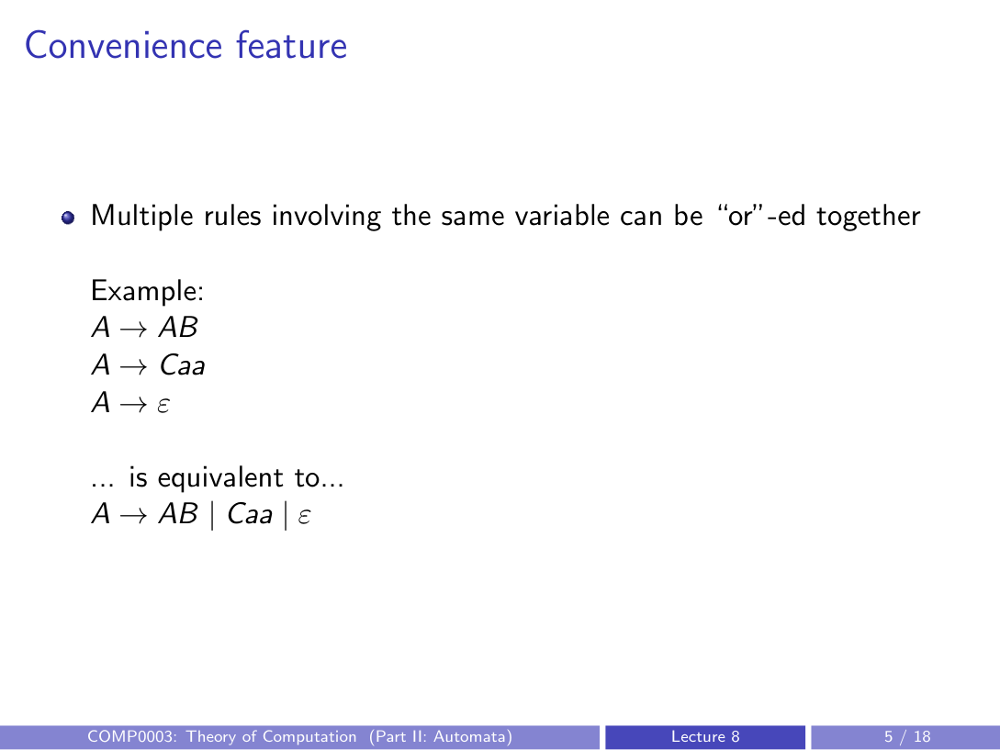
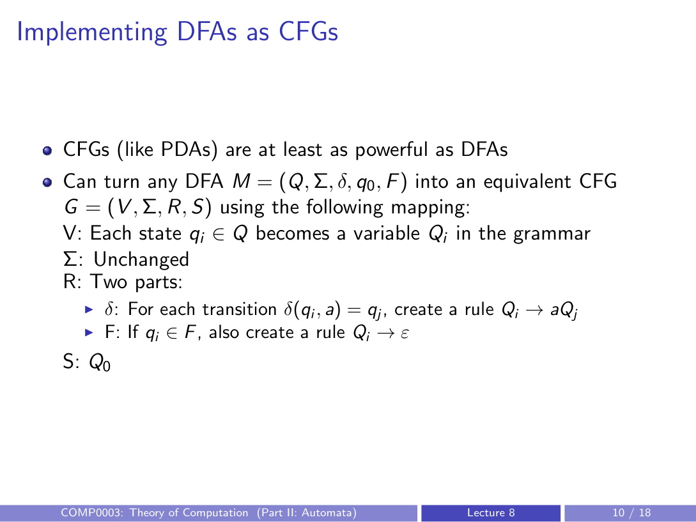
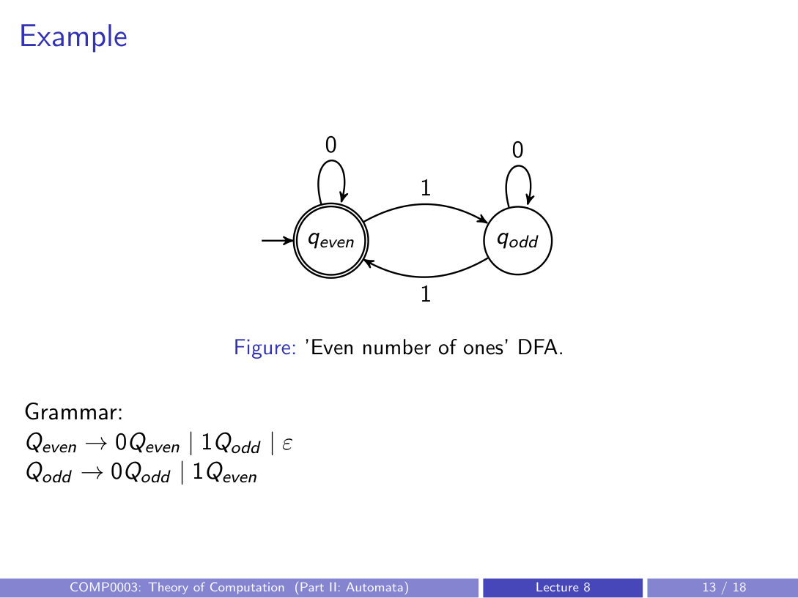

# context-free grammars (CFGs)

## example of a context-free grammar
List of rules:
- $S \to A \mid B$ (start variable: $S$)
- $A \to 0S1$ (other variables are usually capital letters)
- $B \to \epsilon$ (terminals here are $0, 1$; $\epsilon$ is the empty string)

Strings this grammar can generate:
- $\epsilon$
- $0\epsilon1$
- $00\epsilon11$
- etc.

---

## formal definition
A context-free grammar $G$ is a 4-tuple $(V, \Sigma, R, S)$, where:

- $V$ is a finite set of variables
- $\Sigma$ is a finite set of terminals (alphabet symbols)
- $R$ is a finite set of rules of the form $A \to w$, where $A \in V$ and $w$ is a string of variables and/or terminals
- $S \in V$ is the start variable (by convention, the left side of the first rule)

## convenience feature
Multiple rules with the same variable on the left can be merged using $\mid$.

Example:
- $A \to AB$
- $A \to Caa$
- $A \to \epsilon$

Equivalent compact form:
- $A \to AB \mid Caa \mid \epsilon$

---

## exercise: equal number of 0s and 1s
Create a CFG for strings that contain an equal number of 0s and 1s.

One valid solution:
$$
S \to S0S1S \mid S1S0S \mid SS \mid \epsilon
$$

---

## derivations
### definition (step-by-step)
A CFG $G = (V, \Sigma, R, S)$ **derives** string $w$ if there exists:
- intermediate strings $s_0, \dots, s_m$, and
- rule applications $r_1, \dots, r_m$ (each $r_i$ is some rule $A_i \to u_i$),

such that:
1. $s_0 = S$ (start with only the start variable)
2. for each $i = 1, \dots, m$:  
   if $s_{i-1} = xA_i y$, then $s_i = xu_i y$ for some strings $x, y$  
   (replace one variable using a valid grammar rule)
3. $s_m = w$ (final string is all terminals and equals $w$)

### more general notation
- $uAv \Rightarrow uwv$ iff $A \to w$ is a rule in the grammar
- $u \Rightarrow^* v$ means $u$ derives $v$ in zero or more steps
- a grammar derives $w$ iff $S \Rightarrow^* w$

---

## context-free languages (CFLs)
The language generated by a CFG is:
$$
L(G) = \{w \in \Sigma^* \mid S \Rightarrow^* w\}
$$

The set of all languages generated by some CFG is the class of **context-free languages**.

---

## implementing DFAs as CFGs
CFGs (like PDAs) are at least as powerful as DFAs.

Given DFA:
$$
M = (Q, \Sigma, \delta, q_0, F)
$$
construct equivalent CFG:
$$
G = (V, \Sigma, R, S)
$$
using this mapping:

- **variables $V$**: for each state $q_i \in Q$, create variable $Q_i$
- **terminals $\Sigma$**: unchanged
- **rules $R$**:
  - for each DFA transition $\delta(q_i, a) = q_j$, add rule $Q_i \to aQ_j$
  - for each accepting state $q_i \in F$, add rule $Q_i \to \epsilon$
- **start variable $S$**: set to $Q_0$ (the variable for $q_0$)

---

## example: DFA for even number of 1s

Resulting grammar:
- $Q_{\text{even}} \to 0Q_{\text{even}} \mid 1Q_{\text{odd}} \mid \epsilon$
- $Q_{\text{odd}} \to 0Q_{\text{odd}} \mid 1Q_{\text{even}}$

Why:
- transitions become rules of the form "symbol + next state-variable"
- accepting state $q_{\text{even}}$ gets an $\epsilon$ rule

---

## equivalence proof idea (DFA and constructed CFG)
Need both directions:
- if $w \in L(M)$ then $w \in L(G)$
- if $w \in L(G)$ then $w \in L(M)$

### 1) strings in $L(M)$ are in $L(G)$
Take arbitrary $w = w_1w_2\dots w_n \in L(M)$.

Because $w$ is accepted by the DFA, there exist states $r_0, r_1, \dots, r_n$ such that:
- $r_0 = q_0$
- $\delta(r_i, w_{i+1}) = r_{i+1}$ for $i = 0, \dots, n-1$
- $r_n \in F$

Build a grammar derivation:
- start with $s_0 = S = Q_0$
- each DFA step gives a grammar step: apply $Q_i \to w_{i+1}Q_{i+1}$
- because final state is accepting, apply $Q_n \to \epsilon$

Then:
- start condition holds ($s_0 = S$)
- each replacement rule exists by construction of $R$
- final $\epsilon$ rule exists since $q_n \in F$
- produced string is $w_1w_2\dots w_n\epsilon \equiv w$

So $w \in L(G)$.

### 2) strings in $L(G)$ are in $L(M)$
Take arbitrary $w = w_1w_2\dots w_n \in L(G)$.

Then there is a derivation from $S$ to $w$. In this constructed grammar, rules are only:
- $Q_i \to aQ_j$ (transition rules), or
- $Q_i \to \epsilon$ (accepting-state rules)

Therefore:
- until the final step, each string in the derivation has exactly one variable
- final step must be some $Q_k \to \epsilon$

Simulate derivation in DFA:
1. start in $q_0$
2. for each applied rule $Q_i \to aQ_j$, follow transition $\delta(q_i, a) = q_j$
3. final $Q_k \to \epsilon$ implies $q_k \in F$

Hence DFA ends in an accepting state after reading $w$, so $w \in L(M)$.

---

## summary
- CFGs define languages via recursive/self-generating rules
- CFGs are at least as powerful as DFAs and regular expressions
- next key result: CFGs and PDAs are exactly equivalent in expressive power
