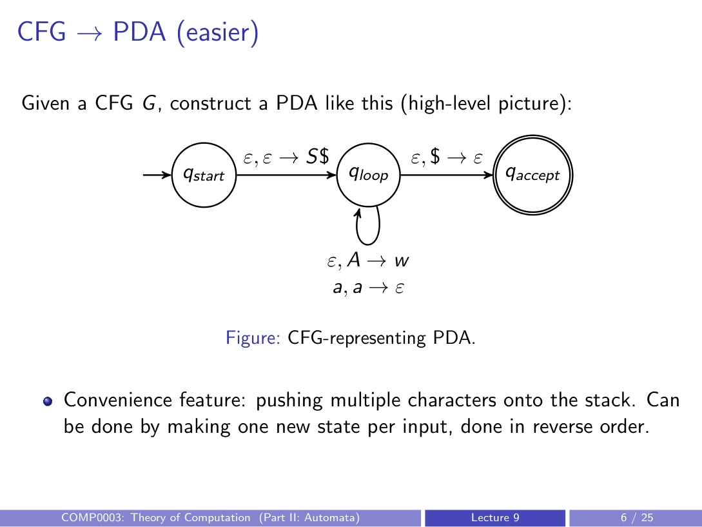
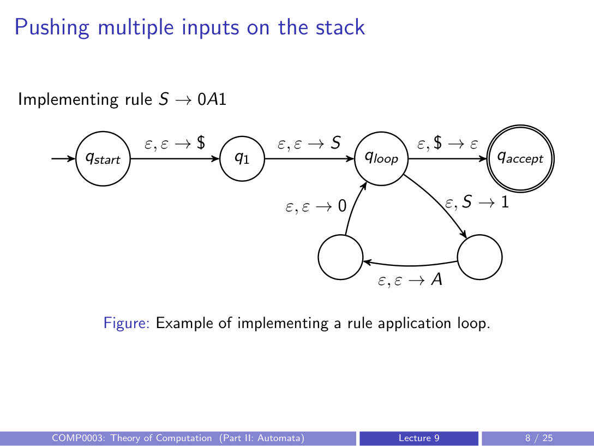
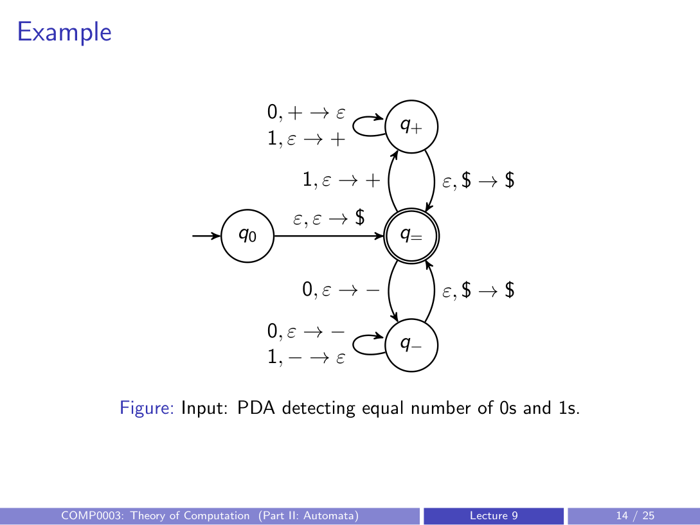
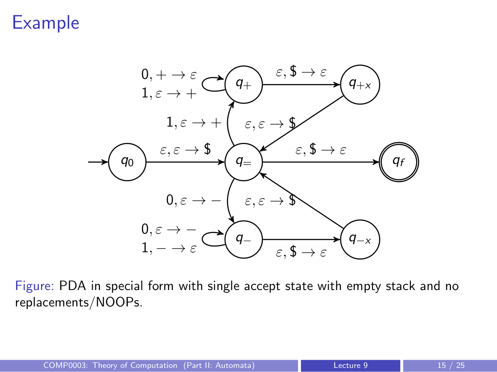
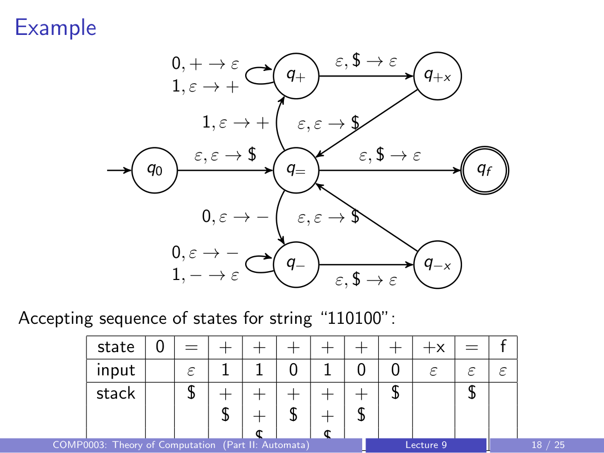

# equivalence of PDAs and CFGs

## review
- **PDA**: 6-tuple $(Q, \Sigma, \Gamma, \delta, q_0, F)$ — an NFA with a stack
- **CFG**: 4-tuple $(V, \Sigma, R, S)$ — generates strings via recursive rewriting rules

## the main result
PDAs recognise and CFGs generate the **same class of languages**: the context-free languages.

Proof requires two directions:
1. given a CFG $G$, a PDA recognising $L(G)$ exists
2. given a PDA $M$, a CFG generating $L(M)$ exists

> the conversion procedures (CFG-to-PDA and PDA-to-CFG) are **not examinable**

---

## CFG to PDA (easier direction)

### high-level idea
Given CFG $G$, build a 3-state PDA:

Transitions:
- $q_{\text{start}} \to q_{\text{loop}}$: push $S\$$ onto the stack (start variable then bottom marker)
- $q_{\text{loop}} \to q_{\text{loop}}$ (rule application): $\epsilon, A \to w$ — if top of stack is a variable $A$, replace it with the right-hand side $w$ of some rule
- $q_{\text{loop}} \to q_{\text{loop}}$ (terminal match): $a, a \to \epsilon$ — if top of stack is a terminal $a$ and next input character is $a$, pop it
- $q_{\text{loop}} \to q_{\text{accept}}$: $\epsilon, \$ \to \epsilon$ — pop the bottom marker when stack and input are both exhausted

### pushing multiple characters
- pushing a multi-character string like $S\$$ requires intermediate states
- characters are pushed in **reverse order** (so the leftmost ends up on top)
- example: implementing rule $S \to 0A1$ means pushing $1$, then $A$, then $0$ (with new intermediate states)

### key observations
- the PDA can only consume input characters if some rule generated them on the stack
- accepting requires no variables or input characters left
- relies **heavily on non-determinism** — the PDA "guesses" which rule to apply

---

## PDA to CFG (harder direction)

### overview
Given PDA $M$, construct CFG $G$ such that $G$ generates exactly the strings $M$ accepts.

Core idea: create variables of the form $A_{q_i q_j}$, where the terminal strings generated by $A_{q_i q_j}$ correspond to all input characters consumed when transitioning from $q_i$ to $q_j$.

Start variable: $A_{q_0 q_{\text{accept}}}$ (assuming one accept state).

### but we need to track the stack
- stack starts empty, so first operation must be a push
- analysis is easier if the stack also **ends empty**
- easier to analyse if transitions are only simple pushes or simple pops (no replacements or no-ops)

---

## converting PDA to special form
Three assumptions we need (all achievable without loss of generality):

1. **single accept state** — reroute all accept states to a fresh one using $\epsilon, \epsilon \to \epsilon$ transitions
2. **stack must be empty before accepting** — after the last meaningful stack operation, add states that pop any remaining characters; only accept on $\epsilon, \$ \to \epsilon$
3. **each transition is either a push or a pop, not both** — split replacement transitions into two steps with an extra state; convert no-ops into a push then pop of a dummy symbol

---

## constructing the CFG from the special-form PDA

Given special-form PDA $M$, build CFG $G$:

- **terminals $\Sigma$**: same as PDA
- **variables $V$**: one variable $A_{q_i q_j}$ for every pair of states $(q_i, q_j)$
- **start variable $S$**: $A_{q_0 q_{\text{accept}}}$
- **rules $R$**: three types

### rule type 1 — base case
$$A_{q_i q_i} \to \epsilon \quad \text{(for every state } q_i \text{)}$$
staying in the same state with empty stack consumes nothing

### rule type 2 — stack empties at an intermediate state
$$A_{q_i q_j} \to A_{q_i q_k} \; A_{q_k q_j} \quad \text{(for any } i, j, k \text{)}$$
if the stack empties out at some state $q_k$ between $q_i$ and $q_j$, split the path into two sub-paths

### rule type 3 — matched push/pop pair
if there exist transitions:
- from $q_p$ to $q_r$ that pushes symbol $\alpha$ (reading input $a$)
- from $q_s$ to $q_t$ that pops symbol $\alpha$ (reading input $b$)

then add rule:
$$A_{q_p q_t} \to a \; A_{q_r q_s} \; b$$
the push at $q_p$ and the matching pop at $q_s$ "wrap around" whatever happens between $q_r$ and $q_s$

---

## worked example: equal number of 0s and 1s

### original PDA

### special-form PDA

### states
- $q_0$ (start), $q_{=}$, $q_{+}$, $q_{-}$, $q_{+x}$, $q_{-x}$, $q_f$ (accept)

### trace of string "110100"

| Step | Read | Transition | State after | Stack after (top → bottom) |
| --- | --- | --- | --- | --- |
| 0 | — | — | $q_0$ | (empty) |
| 1 | $\epsilon$ | $q_0 \to q_{=}$: push $\$$ | $q_{=}$ | $\$$ |
| 2 | 1 | $q_{=} \to q_{+}$: push + | $q_{+}$ | + $\$$ |
| 3 | 1 | $q_{+} \to q_{+}$: push + | $q_{+}$ | + + $\$$ |
| 4 | 0 | $q_{+} \to q_{+}$: pop + | $q_{+}$ | + $\$$ |
| 5 | 1 | $q_{+} \to q_{+}$: push + | $q_{+}$ | + + $\$$ |
| 6 | 0 | $q_{+} \to q_{+}$: pop + | $q_{+}$ | + $\$$ |
| 7 | 0 | $q_{+} \to q_{+}$: pop + | $q_{+}$ | $\$$ |
| 8 | $\epsilon$ | $q_{+} \to q_{+x}$: pop $\$$ | $q_{+x}$ | (empty) |
| 9 | $\epsilon$ | $q_{+x} \to q_{=}$: push $\$$ | $q_{=}$ | $\$$ |
| 10 | $\epsilon$ | $q_{=} \to q_f$: pop $\$$ | $q_f$ | (empty) |

### derived grammar rules (used rules only)

- $A_{q_0 q_f} \to A_{q_0 q_{+x}} \; A_{q_{+x} q_f}$  (rule type 2: stack empties at $q_{+x}$)
- $A_{q_0 q_{+x}} \to A_{q_{=} q_{+}}$ (via push/pop of $\$$)
- $A_{q_{+x} q_f} \to A_{q_{=} q_{=}}$ (via push/pop of $\$$)
- $A_{q_{=} q_{+}} \to 1 \; A_{q_{+} q_{+}} \; 0$ (push + on reading 1, pop + on reading 0)
- $A_{q_{+} q_{+}} \to 1 \; A_{q_{+} q_{+}} \; 0 \mid \epsilon$
- $A_{q_{=} q_{=}} \to \epsilon$

Many other rules are generated by the construction but are never used for this particular string.

---

## equivalence proof sketch

### direction: strings generated by $G$ are accepted by $M$

Stronger claim: if variable $A_{q_i q_j}$ generates $w$, then $w$ allows $M$ to go from $q_i$ to $q_j$ with the stack empty at both endpoints.

Proof by induction on the number of derivation steps $n$:

**base case** ($n = 1$):
- the only one-step rules are $A_{q_i q_i} \to \epsilon$
- starting in $q_i$ with empty stack and reading no input, you stay in $q_i$ with empty stack

**inductive hypothesis**: assume the claim holds for derivations of $\leq k$ steps

**inductive case** ($n = k+1$): first rule applied is one of:
- $A_{q_i q_j} \to A_{q_i q_k} \; A_{q_k q_j}$: by IH, first part takes us from $q_i$ to $q_k$ (empty stack), second part from $q_k$ to $q_j$ (empty stack). Chaining them works.
- $A_{q_i q_j} \to a \; A_{q_r q_s} \; b$: push $\alpha$ reading $a$ (goes $q_i \to q_r$), by IH $A_{q_r q_s}$ consumes middle of string with stack returning to just $\alpha$, then pop $\alpha$ reading $b$ (goes $q_s \to q_j$). Stack ends empty.

### direction: strings accepted by $M$ are generated by $G$
Similar inductive argument in the other direction (not detailed in lecture).

---

## summary
- CFGs and PDAs are **exactly equivalent** in expressive power
- both define the class of context-free languages
- CFG to PDA: simulate grammar derivation on the stack, non-deterministically choosing rules
- PDA to CFG: variables $A_{q_i q_j}$ represent paths between state pairs with matched stack behaviour
