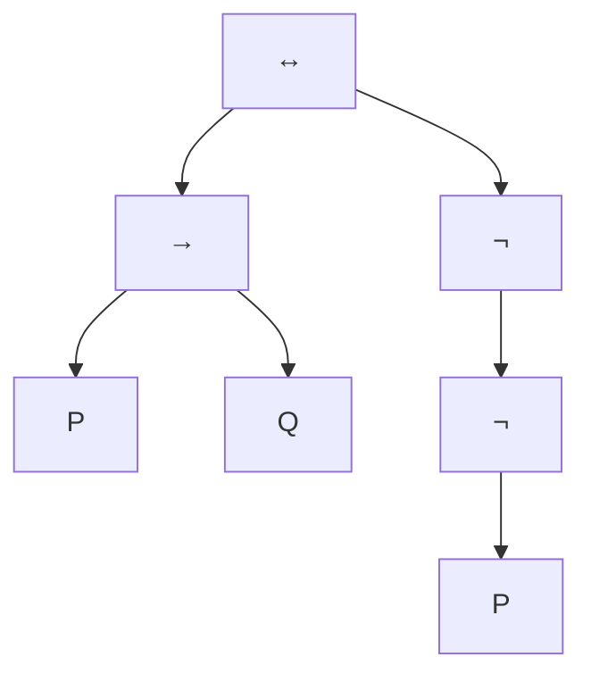

# propositional logic
- one of the simplest logics and is in universal usage
- formulas built up from atomic propositions (formal statements) using logical connectives:
  - $\neg$: not
  - $\land$: and
  - $\lor$: lor
  - $\implies$: implies
  - $\iff$: if and only if

- roughly speaking, propositions are the smallest factual statements in an English sentence
- connectives connect propositions together:
  - and, but, or, either, if, unless
- not every sentence can be interpreted as a proposition

# syntax of formulas 
- we assume an infinite set $P, Q, R, \dots$ of proposition letters
- formulas of propositional logic are given by the grammar: 
$$
\begin{align*}
A &::= \quad P, Q, R, \dots &\text{(proposition)} \\
&| \quad \neg A &\text{(negation)} \\
&| \quad (A \land A) &\text{(conjunction)} \\
&| \quad (A \lor A) &\text{(disjunction)} \\
&| \quad (A \implies A) &\text{(implication)} \\
&| \quad (A \iff A) &\text{(equivalence)}
\end{align*}
$$
- outermost parentheses can be dropped, e.g. $(P \implies Q) \lor R \equiv ((P \implies Q))$
- $\neg$ has a precedence than other connectives

# formulas as syntax trees
- a formula can be represented as a syntax tree
- for $(P \implies Q) \iff \neg \neg P$:

- this is unambiguous

# translating english to propositional logic
- if it's raining, I will stay and eat pie
  - $R \implies (S \land P)$
- you're getting in if you have a ticket
  - $T \implies G$
- you're getting in only if you have a ticket
  - $G \implies T$
- you're not getting in unless you have a ticket
  - $\neg T \implies \neg G$, or $\neg G \lor T$

# valuations
- let's write $L$ for the set of proposition letters in some formula $A$
- $ 1 = \text{true}, 0 = \text{false}$
- a valuation $v$ for $A$ is then an interpretation of each letter in $L$ as either true or false, i.e. a function:
$$ v : L \rightarrowtail \set{0, 1}$$

# implication $\implies$
$ A \implies B$ means that if $A$ is true, then $B$ is also true

$$
\begin{array}{c|c|c} 
A & B & A \implies B \\
\hline
0 & 0 & 1 \\
0 & 1 & 1 \\
1 & 0 & 0 \\
1 & 1 & 1
\end{array}
$$
- the following pairs of formulas are equivalent:
  - $A \implies B \equiv \neg A \lor B$
  - $\neg(A \implies B) \equiv A \land \neg B$

# equivalence/bi-implication ($\iff$)
- $A \iff B$ means that $A$ is true if and only if $B$ is true
$$
\begin{array}{c|c|c}
A & B & A \iff B \\
\hline
0 & 0 & 1 \\
0 & 1 & 0 \\
1 & 0 & 0 \\
1 & 1 & 1
\end{array}
$$
- the following are all equivalent:
  - $A \iff B$
  - $(A \implies B) \land (B \implies A)$
  - $(A \land B) \lor (\neg A \land \neg B)$
  
# satisfiability and validity
- we write $v \models A$ to mean that $A$ is true in the valuation $v$, and $v \not \models A$
- $A$ is called `satisfiable` if $v \models A$ for `some` valuation $v$, and unsatisfiable otherwise
- $A$ is said to be `valid` if $v \models A$ for `all` valuations $v$, and invalid otherwise

# truth tables
- easy way to tell whether a formula is valid/satisfiable is by constructing its truth table
- for $A \implies (A \implies B)$:
$$
\begin{array}{c|c|c|c}
A & B & A \implies B & A \implies (A \implies B) \\
\hline
0 & 0 & 1 & 1 \\
0 & 1 & 1 & 1 \\
1 & 0 & 0 & 0 \\
1 & 1 & 1 & 1
\end{array}
$$
  - $A \implies (A \implies B)$ is satisfiable but not valid
  - $A \implies (A \implies B)$ is equivalent to $A \implies B$