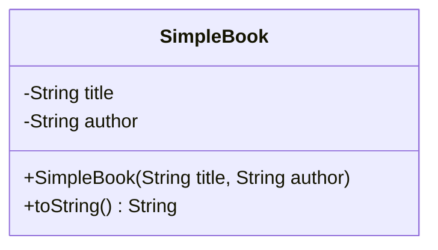
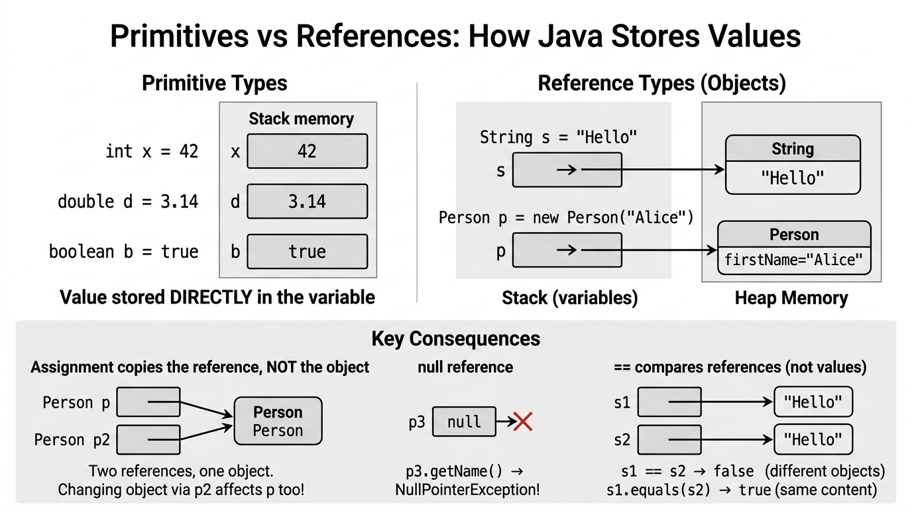

# Classes, Objects & References — COMP0004

*Lecture-style notes aligned with Slides 5. This is the conceptual core of **object-oriented programming** in Java: **blueprints** (**classes**), **instances** (**objects**), and **handles** (**references**).*

---

## 1. COMPLETE TOPIC SUMMARIES

### **Classes** vs **objects**

- A **class** is a **template** that defines **structure** (what data an instance carries) and **behaviour** (what operations are possible) for its instances.
- An **object** is a **runtime instance** of a class — concrete **state** in memory, created typically with **`new`** and a **constructor**.

> **Analogy:** the class **`SimpleBook`** is the idea “book”; each **`new SimpleBook(...)`** is an actual book on the shelf.

---

### Class structure: **instance variables**, **instance methods**, **constructors**

- **Instance variables** (fields) hold **per-object state** (each object has its own copies).
- **Instance methods** implement **behaviour**; they can read/update that object’s fields (subject to **visibility**).
- **Constructors** run at **object creation** to establish a valid initial state.

**Example — `SimpleBook`:**

```java
public class SimpleBook {
    private String title;
    private String author;

    public SimpleBook(String title, String author) {
        this.title = title;
        this.author = author;
    }

    @Override
    public String toString() {
        return title + " by " + author;
    }
}
```

- **`this.title`** disambiguates the **field** from the **parameter** named **`title`**.
- **`toString()`** is inherited from **`Object`**; overriding it gives a **readable** representation for printing/logging.

---

### **Abstraction** in OO

**Abstraction** means presenting a **selective, simplified view** of a concept — hiding irrelevant detail so we can reason at the right level.

- Classes **encode abstractions**: a **`BankAccount`** in software is not a physical vault; it is a **model** capturing **just** the data and rules we need.
- Good abstractions have **clear boundaries**: **what** clients can do (public methods) vs **how** it is done internally.

---

### **Class roles** in modelling

1. **Representation** — model **entities** in the domain (student, ticket, sensor reading).
2. **Relationships** — express **associations** between entities (a **`Module`** offered by a **`Department`**).
3. **Partitioning** — break a system into **components** with responsibilities (UI vs model vs persistence).

These roles guide **where** to put fields/methods and **how** to name types.

---

### **UML** (Unified Modeling Language)

**UML** is the **de facto standard** notation for **OO design**. In introductory courses you mostly meet:

- **Class diagrams** — types, fields, methods, relationships (**associations**, sometimes **multiplicities**).
- **Object diagrams** — **snapshots** of **instances** and **links** between them at a moment in time.

**Class icon (three compartments):**

1. **Name** (class name, often **bold** on paper)
2. **Attributes** (fields)
3. **Operations** (methods)

**Visibility adornments:**

- **`+`** **public** — visible to clients outside the class.
- **`-`** **private** — visible **only inside** the class.

Example (UML-style sketch):

```text
---------------------------------
|           SimpleBook          |
---------------------------------
| - title : String              |
| - author : String             |
---------------------------------
| + SimpleBook(title, author)   |
| + toString() : String         |
---------------------------------
```

---

### **Mermaid** as an alternative notation

In Markdown tools (and some slides), **Mermaid** can render diagrams from text:



**Object diagrams** in Mermaid are less universally used than class diagrams, but the **idea** is the same: show **instances** (`book1 : SimpleBook`) and **field values**.

---

### **Encapsulation** and **information hiding**

**Encapsulation** bundles **state** + **behaviour** behind a controlled surface:

- Make fields **`private`** so external code cannot arbitrarily break invariants.
- Expose a **minimal** useful **`public`** API (constructors, getters/setters where appropriate, behaviour methods).

**Information hiding** means clients depend on **what** the object promises, not **how** it stores data internally — freeing you to change representation later.

---

### **Object references** — variables hold **handles**, not embedded objects

For a class type **`Person`**, a variable like **`Person p;`** does **not** contain a whole person “inline”. It holds a **reference** (think: address/link) to a **`Person` object** on the **heap** (after **`new`**).


*Primitive values are stored directly in stack variables. Reference variables hold pointers to objects on the heap. Assignment copies the reference, not the object — two variables can point to the same object.*

- **Multiple variables** can reference the **same object**:

```java
SimpleBook a = new SimpleBook("OOP", "Alex");
SimpleBook b = a; // b references the SAME object as a
```

Mutating through **`a`** affects what you see via **`b`**.

---

### **`null` references** and **`NullPointerException`**

**`null`** is a special reference meaning **“points to no object.”**

- You may assign **`null`** to a reference variable.
- **Dereferencing** **`null`** — field access, method call, array length — throws **`NullPointerException`**:

```java
SimpleBook s = null;
System.out.println(s.toString()); // throws NullPointerException
```

Defensive code tests **`if (s != null)`** or uses APIs designed to avoid **`null`** (later: **`Optional`**, validation).

---

### **Call-by-value** in Java

Java is **always call-by-value**:

- For **primitives**, the **value** (bits of the int, double, etc.) is **copied** into the parameter.
- For **objects**, the **reference value** (the link/handle) is **copied** — **not** a deep copy of the object.

So the callee receives its **own parameter variable**, but for reference types it often **aliases** the same object as the caller.

---

### **Return-by-value**

Method return uses the same rule: a **copy** is returned.

- Returning a **reference type** returns a **copy of the reference**, which still points at the **same object**.
- Returning **`int`** returns a **copy of the int value**.

---

### **Reference parameters** — **mutate** vs **reassign**

```java
static void tryReassign(SimpleBook x) {
    x = new SimpleBook("Other", "Author"); // only local x changes
}

static void renameFirst(SimpleBook x) {
    // assuming a setter exists:
    // x.setTitle("New Title"); // would mutate shared object — affects caller
}
```

- Reassigning the parameter **`x`** inside the method does **not** change the **caller's variable** — only the **copy** of the reference was updated.
- **Mutating the object through the reference** (calling methods that change fields) **does** affect the caller, because both refer to the **same object**.

---

### **Primitives vs reference parameter passing**

| Actual argument type | What gets copied | callee can affect caller how? |
|----------------------|------------------|--------------------------------|
| **`int`, `double`, ...** | the **primitive value** | **Cannot** change caller’s variable; only returns or side channels |
| **`Person`, `int[]`, ...** | the **reference value** | **Can mutate object state** via that reference; **cannot** replace caller’s binding |

---

### **Object lifetime** vs **variable scope**

- A **local variable** disappears when its **block** ends (**scope**).
- The **object** may still exist if **other references** still point to it.

```java
SimpleBook b;
{
    SimpleBook tmp = new SimpleBook("A", "B");
    b = tmp;
} // tmp is out of scope, but the object is still reachable via b
```

**Garbage collection** reclaims objects that are **no longer reachable**. **Scope ≠ lifetime**.

---

### Declaring a class declares a **new type**

Writing **`class Person { ... }`** introduces a **user-defined type **`Person`**. You can use **`Person`** in signatures, generics (later), and variable declarations — it becomes part of your **program’s static type system**.

---

## 2. EXAM-STYLE QUESTIONS (3–5 with model answers)

### Q1 — Class vs object

**Question:** Distinguish **class** and **object** in Java. Give a **one-sentence** role for each in program execution.

**Model answer:** A **class** is a **static definition** (the blueprint) describing **fields and methods**; an **object** is a **runtime instance** allocated on the heap with **its own field values**. The JVM loads **classes** once (per loader); the program manipulates **objects** created with **`new`** as **data in motion**.

---

### Q2 — Encapsulation

**Question:** What is **encapsulation**? Why are **private** fields paired with a small **public** API considered good practice?

**Model answer:** **Encapsulation** bundles **state and behaviour** and **controls access** so invariants (rules that must always hold) are easier to maintain. **`private`** fields **hide representation details**; a minimal **`public`** API exposes only **intentional operations**, reducing **coupling** and allowing internal changes without breaking clients — this is **information hiding**.

---

### Q3 — References and aliasing

**Question:** After:

```java
SimpleBook x = new SimpleBook("A", "B");
SimpleBook y = x;
```

how many **`SimpleBook` objects** exist? If a method mutates **`y`**’s fields (assume setters), does **`x`** reflect the change? Why?

**Model answer:** **One** object. **`y`** holds a **copy of the reference** that **aliases** **`x`**. Mutating the **shared object** through either variable changes **the same instance**, so **`x`** reflects updates made via **`y`**.

---

### Q4 — Call-by-value “paradox”

**Question:** Java is call-by-value. Explain why the following prints **`42`**:

```java
static void setZero(int n) {
    n = 0;
}

public static void main(String[] args) {
    int x = 42;
    setZero(x);
    System.out.println(x);
}
```

Contrast with passing an **`int[]`** and assigning **`arr[0] = 0`** inside a method — what prints and why?

**Model answer:** For **`int x`**, **`setZero`** receives a **copy** of **`42`**; assigning **`n = 0`** only changes the **parameter copy**, not **`x`**, so **`x`** remains **`42`**. For **`int[] arr`**, the parameter is a **copy of the reference**; **`arr[0] = 0`** mutates the **shared array object**, so the caller sees **`0`** at index 0 — **call-by-value** applied to the **reference**, not to a deep copy of the array.

---

### Q5 — UML literacy

**Question:** In a UML class diagram, what do **`+`** and **`-`** mean? Name the **three compartments** of a standard class icon.

**Model answer:** **`+`** denotes **public** visibility; **`-`** denotes **private** visibility. The three compartments are **class name**, **attributes (fields)**, and **operations (methods)**.

---

## 3. MUST-KNOW KEY POINTS

- **Class** = blueprint; **object** = **instance** at runtime (**`new`**).
- Structure: **instance fields**, **instance methods**, **constructors**; use **`this`** to resolve shadowing.
- **Abstraction** simplifies reality into a **manageable model**.
- Classes play roles: **representation**, **relationships**, **partitioning**.
- **UML**: class vs object diagrams; **`+`/`-`** visibility; three compartments.
- **Encapsulation**: **`private`** state, minimal **`public`** surface — **information hiding**.
- Variables store **references** for class types; **`null`** means no object; **`NullPointerException`** on bad dereference.
- **Call-by-value** copies **primitive values** or **reference values**; method reassignment of the parameter does not rebind caller vars; **shared mutation** is possible through references.
- **Lifetime** is **reachability**, not just **scope**; **`Person`** as a class introduces a **new named type**.

---

## 4. HIGH-PRIORITY TOPICS

| Priority | Topic | Why it matters |
|----------|--------|----------------|
| 🔴 **Must know** | **Class vs object** | Foundational definitions for all later OO. |
| 🔴 **Must know** | **Encapsulation + `private` fields** | Central design principle examined in coursework. |
| 🔴 **Must know** | **References, aliasing, `null`** | Explains identity, bugs, and debugger traces. |
| 🔴 **Must know** | **Call-by-value** for primitives vs references | Classic exam explanation question. |
| 🟡 **Important** | **`SimpleBook`-style example** (constructor, `toString`) | Template for “write a small class” tasks. |
| 🟡 **Important** | **UML class diagram basics** (`+`/`-`, compartments) | Design literacy; short-answer friendly. |
| 🟡 **Important** | **Abstraction** and **class roles** | Essay-style “why OO?” answers. |
| 🟢 **Useful** | **Mermaid** diagrams | Handy for notes/repos; may appear as optional tooling. |
| 🟢 **Useful** | **Object lifetime vs scope** | Deeper runtime story; links to GC. |
| 🟢 **Useful** | **User-defined types** | Connects Java types to **static typing** mindset. |

---

## 5. TOPIC INTERCONNECTIONS & BIGGER PICTURE

- **Arrays & objects:** arrays are **objects** too — the same **reference** rules apply (`null`, aliasing, mutation).
- **API design:** encapsulation foreshadows **interfaces**, **packages**, and **testing** (public contracts vs internal refactor freedom).
- **Inheritance & polymorphism (later):** **`extends`**, **`@Override`**, dynamic dispatch build on **classes + references**.
- **Collections:** **`ArrayList<E>`** stores **references** to **`E`** instances — identity and **mutation** matter when sharing elements.
- **Software engineering:** UML (or similar) supports **communication** about structure; code remains the **source of truth**, diagrams are **views**.

---

## 6. EXAM STRATEGY TIPS

- **Define terms in one line** before longer explanations (**class**, **object**, **reference**, **encapsulation**).
- **Draw tiny diagrams** for reference questions: boxes (objects), arrows (variables), **`null`** as “no arrow.”
- **Call-by-value script:** always say **what** is copied (**bits of int** vs **reference value**), then **mutate vs reassign** separately.
- **UML answers:** mention **three compartments** and **visibility** explicitly — easy marks if the rubric lists notation.
- **Code skeletons:** practise **`private` fields**, **constructor**, **`toString()`** until muscle memory — common “warm-up” question.
- **Contrast** **`==` on references** (identity) vs **`.equals`** on meaningful equality (when taught) — examiners like precision.

---

*End of notes — Classes, Objects & References (COMP0004, Slides 5).*
