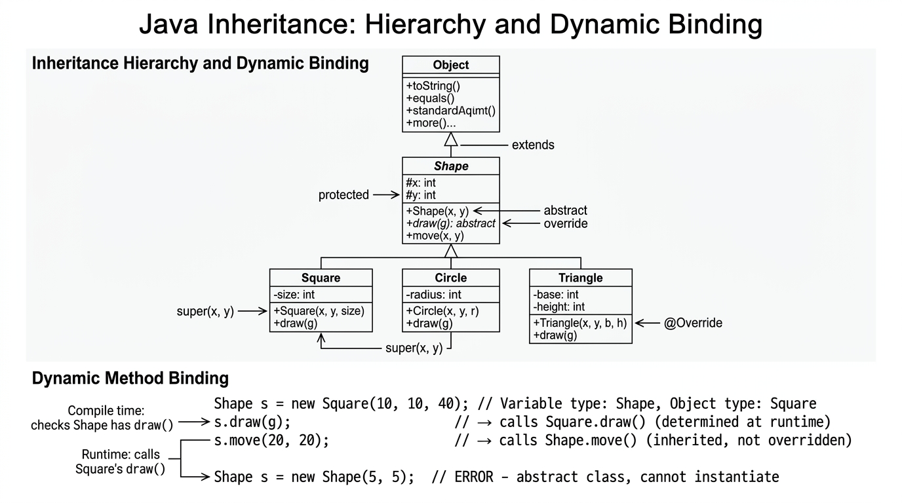

# Inheritance — COMP0004 Object-Oriented Programming (UCL)

*Lecture-style notes aligned with **Slide deck 9** (a large topic): **inheritance hierarchies**, **`extends`**, **abstract** classes/methods, **`super`**, **`protected`**, **overriding** vs **overloading**, **dynamic binding**, **`Object`**, **`final`**, and design guidance (**composition over inheritance**, **template method**).*

---

## 1. COMPLETE TOPIC SUMMARIES

### **Inheritance** — the “is-a” modelling tool

**Inheritance** models a **“kind-of”**, **specialisation-of**, or **extension-of** relationship between types. The **subclass** (child) **inherits** members from the **superclass** (parent) and can **add** fields/methods or **replace** behaviour.

> **Beginner intuition:** If you can say “every **Dog** is an **Animal**” without lying, inheritance may fit. If you say “every **Car** is an **Engine**,” that’s usually wrong — prefer **composition** (a car **has an** engine).

---

### **Subclass and superclass in Java**

- A **subclass** **inherits** state and behaviour from its **superclass** (except where access modifiers block visibility).
- A subclass can **specialise** behaviour (override methods) and **extend** the model with new fields/methods.

Java supports **single inheritance for classes**: a class may **`extend` exactly one** superclass.

```java
public class Student extends Person {
    private final String studentId;

    public Student(String name, String studentId) {
        super(name); // superclass initialisation (must be first in this constructor)
        this.studentId = studentId;
    }
}
```

---

### **A hierarchy example: `Person` → `UCLPerson` → …**

Courses often use a university domain tree (names vary by slide deck):

```text
Person
 └── UCLPerson
       ├── Staff
       │     └── Academic
       └── Student
             ├── Undergraduate
             └── Postgraduate
```

This illustrates **generalisation** upward (“`Person` generalises common identity”) and **specialisation** downward (“`Undergraduate` adds degree-stage specifics”).

---

### **Generalisation vs specialisation**

- **Generalisation** — move shared features **up** the hierarchy into a **superclass** to avoid duplication (**DRY**).
- **Specialisation** — push distinct features **down** into **subclasses** so the superclass stays **stable** and **cohesive**.

---

### **Abstract vs concrete classes**

- A **concrete class** is **fully implementable**; you can **`new`** it (assuming accessible constructors).
- An **abstract class** is a **partial implementation** of a concept: it may contain **abstract methods** (no body) and **concrete methods** (with bodies). **You cannot instantiate** an abstract class with `new`.

```java
public abstract class Shape {
    public abstract double area(); // subclass must implement (unless subclass is also abstract)

    public String describe() {
        return "shape";
    }
}
```

---

### **Abstract methods**

An **abstract method** is declared with the **`abstract`** keyword, has **no method body**, and ends with `;`.

Any **concrete** subclass must **override** and **implement** all inherited abstract methods (otherwise the subclass must also be declared **`abstract`**).

---

### **Constructor chaining and `super(...)`**

When constructing a subclass object, a **superclass portion** of the object must be initialised. Java enforces this via **constructor chaining**:

- If a subclass constructor does not explicitly call another constructor, the compiler inserts **`super()`** (a call to the superclass **no-arg** constructor) **as the first statement**.
- If the superclass has **no accessible no-arg constructor**, you must explicitly call **`super(args)`** with appropriate arguments.

**Rule:** **`super(...)`** (or **`this(...)`** if chaining within the same class) must be the **first statement** in the constructor.

```java
public class Employee extends Person {
    private final String id;

    public Employee(String name, String id) {
        super(name);
        this.id = id;
    }
}
```

---

### **`protected` access**

**`protected`** members are visible to the **same package** and to **subclasses** (including across packages, for subclass code).

This **weakens encapsulation** compared to **`private`**: subclass code can depend on superclass internals. Often, **`private` fields + `protected` or public getters** is safer than scattering **`protected` fields**.

---

### **Method overriding (not overloading)**

**Overriding** redefines an **instance method** in a subclass with the **same signature** as an inherited method (modern Java: use **`@Override`** to catch mistakes).

```java
public class Square extends Rectangle {
    @Override
    public String toString() {
        return "Square(side=" + getWidth() + ")";
    }
}
```

Contrast with **overloading**: **same method name**, **different parameter lists** in the same class (or inherited visible methods) — **compile-time** resolution.

> **Exam trap:** changing only the **return type** in incompatible ways is not a valid override; changing **static**/`instance` nature is also not overriding in the usual sense.

---

### **Dynamic method binding (runtime polymorphism)**

For **instance methods**, Java uses **dynamic binding** (late binding): the method executed depends on the **actual object’s class at runtime**, not only the **reference type**.


*Object → Shape (abstract) → Square/Circle/Triangle. Abstract methods must be overridden. Dynamic binding selects the method at runtime based on the actual object class, not the reference type.*

```java
Shape s = new Circle(1.0);
double a = s.area(); // runs Circle's area() if Circle overrides area()
```

This is the mechanism behind **polymorphism**: you write code against a **supertype** (`Shape`) and still get **specialised** behaviour.

**`static` methods** are **not** overridden in the dynamic sense; they are **hidden** via static dispatch based on the **reference type**.

---

### **Superclass references to subclass objects**

This pattern is central to OOP APIs:

```java
Shape shape = new Square(10, 10, 40);
```

It is **legal** because a **`Square` is-a `Shape`** (per your design). You can pass `shape` to methods expecting `Shape`, store heterogeneous shapes in a `List<Shape>`, etc.

The **compiler** checks members using the **reference type** (`Shape`); **overridden instance methods** still dispatch using the **actual object** (`Square`).

---

### **`java.lang.Object` — root of (almost) everything**

If a class declaration has no `extends`, it implicitly extends **`Object`**.

Common **`Object` methods** you must understand:

- **`toString()`** — string representation (often overridden for debugging/UI).
- **`equals(Object o)`** — logical equality (override consistently with **`hashCode()`** if used in hash collections).
- **`clone()`** — optional copying mechanism; often considered awkward; many teams prefer **copy constructors** or factories.

---

### **`super` for overridden methods and hidden fields**

Inside a subclass, **`super.method()`** calls the **superclass version** of an **overridden instance method**.

```java
public class B extends A {
    @Override
    public void greet() {
        super.greet();
        System.out.println("from B");
    }
}
```

**`super.field`** accesses a **superclass field** if a subclass field **hides** the name (field hiding is usually discouraged—rename for clarity).

---

### **Template method pattern**

The **template method pattern** defines an algorithm **skeleton** in a superclass (**final** template method optional) with **steps** implemented/overridden in subclasses.

Typical shape:

```java
public abstract class Report {
    public final void generate() { // optional: mark final to freeze workflow
        header();
        body();
        footer();
    }

    protected abstract void body();

    protected void header() { /* default */ }
    protected void footer() { /* default */ }
}
```

Subclasses specialise **`body()`** (and optionally hooks), while the overall workflow stays consistent.

---

### **`final` keyword (inheritance-related meanings)**

- **`final` class** — cannot be subclassed (`String` is `final` in the Java library).
- **`final` method** — cannot be overridden by subclasses.
- **`final` variable/field** — assignment happens once (immutability for references: the object may still be mutable unless designed otherwise).

---

### **Good practice: inheritance only for true “is-a”**

Inheritance is a **strong coupling** mechanism: subclasses depend on superclass internals and evolution. Use it when the relationship is **stable** and **conceptually truthful**.

If you only want **reuse of implementation** but not a meaningful “is-a,” you often get **fragile hierarchies**.

---

### **Composition over inheritance**

**Composition** means an object **has** collaborators (fields) and **delegates** work to them.

Classic teaching example: a **`Stack`** should **`use`** an **`ArrayList`** internally (**delegation**), not **`extend ArrayList`**:

```java
public class Stack<E> {
    private final ArrayList<E> data = new ArrayList<>();

    public void push(E x) { data.add(x); }
    public E pop() { return data.remove(data.size() - 1); }
}
```

Why: `extends ArrayList` exposes the **entire list API** publicly (unless carefully restricted), breaking **encapsulation** and creating **LSP** hazards (a stack is not “any list operation you can do on ArrayList”).

---

### **Implementation inheritance vs behaviour specification inheritance**

- **Implementation inheritance** — reuse **actual code** from superclass method bodies (convenience, but can entangle you with superclass changes).
- **Behaviour specification inheritance** — inherit a **contract** (often via **abstract** methods / **interfaces**) and provide **fresh implementations** in subclasses.

Modern Java style often pushes **specification** toward **`interface`** types, using **inheritance** for **true taxonomies** and shared **protected hooks** when justified.

---

## 2. EXAM-STYLE QUESTIONS (3–5 with model answers)

### **Q1.** Explain **dynamic method binding** with a small Java example involving a superclass reference and a subclass object.

**Model answer:** For **instance methods**, the JVM selects the implementation based on the **runtime class** of the object. Example:

```java
Shape s = new Circle(2.0);
System.out.println(s.area());
```

Even though **`s`** is typed as **`Shape`**, if **`Circle` overrides `area()`**, **`Circle`’s `area`** runs. This enables **polymorphism**: one interface (`Shape`), many behaviours.

---

### **Q2.** What is an **abstract class**? Can you instantiate it with `new`? What must a concrete subclass do?

**Model answer:** An **abstract class** may contain **abstract methods** (declared with **`abstract`**, no body) and can contain concrete methods/fields. You **cannot** instantiate it with **`new`** directly. A **concrete** subclass must **implement every inherited abstract method** (or be declared abstract itself).

---

### **Q3.** Why must **`super(...)`** be the **first statement** in a constructor, and what happens if the superclass has no no-arg constructor?

**Model answer:** A subclass object contains a **superclass subobject**; Java requires that superclass construction completes before the subclass finishes initialisation, so **`super(...)`** (or a **`this(...)`** chain that eventually reaches **`super`**) must run first. If there is **no accessible `super()`** because the superclass only defines constructors with parameters, the subclass **must** explicitly call **`super(args)`** with valid arguments—otherwise the code **does not compile**.

---

### **Q4.** Compare **overriding** vs **overloading** in one paragraph, including **when** each is resolved.

**Model answer:** **Overriding** replaces an **inherited instance method** with the **same signature** in a subclass; calls through superclass references still dispatch to the subclass version at **runtime** (**dynamic binding**). **Overloading** defines multiple methods with the **same name** but **different parameter lists**; the compiler picks the best match at **compile time** based on static types of arguments. **`@Override`** helps ensure you truly override.

---

### **Q5.** Explain **composition over inheritance** using **`Stack`** and **`ArrayList`**.

**Model answer:** **`extends ArrayList`** makes **`Stack` a kind of list** in the type system, exposing list operations that can **violate stack invariants** (e.g. arbitrary insertion) and creates a **weak “is-a”** relationship. **Composition** stores an **`ArrayList` privately** and exposes only **`push`/`pop`/`peek`**—**delegation**—preserving **encapsulation** and a truthful API. This is a standard illustration of **LSP**-friendly design and **low coupling** to `ArrayList`’s full surface area.

---

## 3. MUST-KNOW KEY POINTS

- **Inheritance** models **specialisation**; Java classes have **single superclass** via **`extends`**.
- **Abstract** classes/methods describe **partial contracts**; **no instantiation** of abstract classes.
- **Constructor chaining** uses **`super(...)`** (often required first line); compiler inserts **`super()`** if omitted **only when valid**.
- **`protected`** trades encapsulation for **subclass access**; prefer **`private` + accessors** when possible.
- **Overriding** matches **signatures** for **instance methods**; **`@Override`** is best practice.
- **Dynamic binding** selects **subclass** implementations at **runtime** for **instance methods**.
- **`Object`** is the root; know **`toString`**, **`equals`**, **`hashCode`**, **`clone`** at syllabus depth.
- **`super.method()`** calls **superclass** implementation of an **overridden** method.
- **Template method** fixes an algorithm outline; subclasses fill **steps**.
- **`final`** can freeze **subclassing** (class) or **overriding** (method).
- **Composition over inheritance** prevents **exposing internals** of reusable library classes.
- Distinguish **implementation inheritance** vs **specification inheritance** (often interfaces).

---

## 4. HIGH-PRIORITY TOPICS (🔴 Must Know / 🟡 Important / 🟢 Useful)

### 🔴 **Must Know**

- **Subclass/superclass**, **`extends`**, **single inheritance**  
- **Abstract class/method** rules + **cannot instantiate**  
- **`super(...)` constructor chaining** (first statement; no-arg vs explicit)  
- **Overriding** vs **overloading** + **dynamic binding**  
- **Supertype reference, subtype object** (`Shape s = new Square(...)`)  
- **`Object` essentials** (`toString`, `equals`/`hashCode` pairing idea)  
- **`final` class/method** consequences  

### 🟡 **Important**

- **`protected`** visibility and encapsulation trade-offs  
- **`super` instance method calls** in overrides  
- **Template method pattern** (skeleton + overridden steps)  
- **Composition over inheritance** + **delegation**  
- **LSP** as the “substitutability” principle tied to inheritance correctness  

### 🟢 **Useful**

- **Implementation vs specification inheritance** framing  
- **`clone()`** pitfalls and why teams prefer alternatives  
- **Field hiding** vs overriding (avoid hiding; know it exists)  
- **Static method hiding** vs instance overriding (exam edge cases)  

---

## 5. TOPIC INTERCONNECTIONS & BIGGER PICTURE

- **Inheritance** is one half of **polymorphism**; **interfaces** + **generics** (later modules) complete “program to abstractions.”
- **Abstract classes** sit between **concrete classes** and **`interface`** contracts: useful when you want **shared code** + **forced overrides**.
- **Constructor chaining** connects to **initialisation safety** and **immutable object** patterns (superclass invariants first).
- **`equals`/`hashCode`** correctness matters once you store objects in **`HashMap`/`HashSet`**—often taught right after **`Object`** behaviour.
- **Template method** foreshadows **frameworks** (superclass defines lifecycle; your subclass fills hooks).
- **Composition** pairs with **SOLID** (especially **DIP**) from the design lecture: depend on small abstractions, not giant superclass implementations.

---

## 6. EXAM STRATEGY TIPS

- For inheritance questions, start by drawing a **tiny hierarchy** and labelling **“is-a”** truthfulness—examiners reward **conceptual correctness** before code detail.
- Whenever you mention **`equals`**, mention **`hashCode`** in the same breath if collections are involved.
- If a problem shows **`void Sub(...) {}`**, check **constructor vs method**; if it shows **`static` “override”**, discuss **hiding** vs **dynamic override**.
- Use **`@Override`** in written code snippets even on exams if permitted—it signals you understand **compile-time checking**.
- For “design critique” questions, default to: **encapsulation**, **LSP**, **composition over inheritance**, and **minimal public API**.

---

*These notes are for revision; follow your module’s exact slide definitions, coding standards, and any mandated UML notation in assessed work.*
