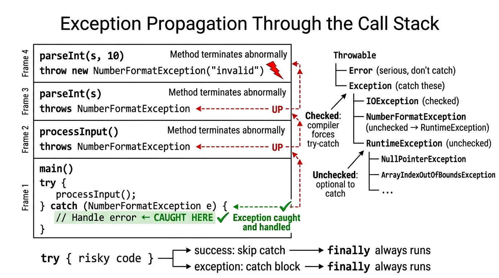

# Exceptions — COMP0004 Object-Oriented Programming (UCL)

*Lecture-style notes aligned with Slide deck 8: **runtime errors**, the **exception mechanism**, **checked vs unchecked** exceptions, **try / catch / finally / try-with-resources**, **propagation**, **custom exceptions**, **strategies** (including **`Optional`**), and the **checked exceptions** debate.*

---

## 1. COMPLETE TOPIC SUMMARIES

### **Runtime errors — when “correct syntax” still fails**

Programs fail at runtime for many reasons beyond compile-time type checking:

- **Logic bugs** — wrong algorithm, off-by-one, incorrect assumptions.
- **Unanticipated user behaviour** — empty input, letters where numbers expected, files missing.
- **Environment / service failures** — disk full, network down, database unavailable.

These situations need a disciplined **reaction model**. In Java, **exceptions** are the primary structured mechanism for **non-local** control flow when something goes wrong.

---

### **Exceptions — signalling failure**

An **exception** is an **object** (usually a **`Throwable`** subtype) **thrown** at the point of failure. If nothing **catches** it, the **thread** unwinds and the program may **terminate** after printing a **stack trace**.

> **Beginner intuition:** A **return** says “here is a normal result.” A **throw** says “I cannot complete this operation as intended; here is **why** (encoded as an exception object).”

---

### **Call stack trace**

When an exception is printed (often **uncaught**), the **stack trace** lists **active method calls** from **innermost** (where **`throw` happened**) outward. Reading it is a core debugging skill: find the **first line in your code**, then ask what **inputs** or **state** caused it.

---

### **`NullPointerException` (NPE)**

**`NullPointerException`** is thrown when you use a **`null`** reference as if it were an object — e.g. calling **`someRef.method()`** when **`someRef`** is **`null`**. It is an **`RuntimeException`** (**unchecked**): the compiler does not force you to declare or catch it. Prevention: **validate** references, use **defensive coding**, or **`Optional`** for explicit absence (see below).

```java
String s = null;
// int n = s.length();  // NullPointerException
```

---

### **Checked vs unchecked exceptions**

| Kind | Extends | Compiler | Typical meaning |
|------|---------|----------|-----------------|
| **Checked** | **`Exception`** but **not** **`RuntimeException`** | Caller must **`catch`** or declare **`throws`** | **Expected recoverable** conditions (I/O, parsing, missing files). |
| **Unchecked** | **`RuntimeException`** (or **`Error`**) | Optional to handle | Often **programming bugs** or failures you rarely recover from (`NullPointerException`, `IllegalArgumentException`). |

**`Error`** (e.g. **`OutOfMemoryError`**) is **unchecked** but usually **not** caught in application code — it signals serious JVM/resource problems.

---

### **Error-handling strategies (Stack example mindset)**

Using a **stack** ADT as a narrative, lectures often contrast strategies:

1. **Ignore** — silently wrong behaviour (**bad**); violates correctness.
2. **Print message + return `null`** — error **disappears** locally but **forces every caller** to remember **`null` checks**; easy to forget → **`NullPointerException`** later.
3. **`System.exit`** — abrupt termination; may **lose unsaved data** and gives no structured recovery.
4. **`assert`** — excellent in **development** to document invariants; **can be disabled** at runtime (`-ea`), so not a substitute for validating **user-facing** input in production.
5. **Throw an exception** — **forces** callers (for **checked**) or at least **documents** failure (**unchecked**); centralises **non-local** recovery.
6. **Return `Optional<T>`** — for **local**, **expected** “value or nothing” outcomes without abusing exceptions.

**Best practice big picture:** use **exceptions** for **exceptional** control flow; use **`Optional`** (or sensible defaults) for **ordinary** absence when the **caller** is the right place to decide.

---

### **Exceptions vs `Optional<T>`**

| Tool | Best when |
|------|-----------|
| **Exception** | Failure is **surprising** or needs to **abort** several layers; multiple **recovery policies** possible upstream; **checked** exceptions document mandatory handling for **API contracts** (e.g. I/O). |
| **`Optional<T>`** | A method **normally** might have **no result** (`find` by key); caller handles **locally** without **`try/catch`** ceremony. |

```java
Optional<User> findUser(String id) { ... }   // expected "maybe none"

void readConfig(Path p) throws IOException { ... }  // IO failure is exceptional for many apps
```

---

### **Java exception syntax: `try`, `catch`, `throw`, `throws`, `finally`**

- **`throw`** — create and throw an exception object: **`throw new IllegalArgumentException("bad");`**
- **`try` / `catch`** — **try** risky code; **catch** specific types to **recover** or **rethrow** / **wrap**.
- **`throws`** — method **signature** declares **checked** exceptions that may escape; **callers** must handle or declare.
- **`finally`** — runs **always** after `try` (whether success, exception, or **`return`**) — classic cleanup (often replaced by **try-with-resources** for closables).

```java
public int parsePositive(String s) throws NumberFormatException {
    int v = Integer.parseInt(s);
    if (v <= 0) {
        throw new IllegalArgumentException("must be positive");
    }
    return v;
}
```

---

### **`try` with multiple `catch` blocks and multi-catch**

Catch **most specific** exceptions **first**; broader catches **after**.

**Multi-catch** (Java 7+): **`catch (IOException | SQLException ex)`** — shared handler; **`ex` is effectively final**.

```java
try {
    risky();
} catch (FileNotFoundException e) {
    // specific recovery
} catch (IOException e) {
    // broader IO recovery
}
```

---

### **`finally`**

Use **`finally`** to release resources or restore invariants when **`try`** may exit in **many** ways. **Pitfall:** swallowing exceptions in **`catch`** without logging; **another pitfall:** **`finally`** that throws — can **mask** the original exception.

---

### **Try-with-resources — `AutoCloseable`**

For objects that must be **closed** (`InputStream`, `BufferedReader`, etc.), **try-with-resources** guarantees **`close()`** is called automatically (with **suppressed exception** handling rules).

```java
try (BufferedReader br = Files.newBufferedReader(path)) {
    return br.readLine();
}  // br.close() called automatically
```

The resource type must implement **`AutoCloseable`** (or **`Closeable`**).

---

### **Exception class hierarchy (core exam diagram)**

- **`Throwable`**
  - **`Error`** — serious JVM / resource problems; **do not** usually catch.
  - **`Exception`**
    - **`RuntimeException`** and subclasses — **unchecked**
    - Other **`Exception`** subclasses — **checked** (e.g. **`IOException`**)

**`RuntimeException`** is for conditions that **need not** be declared in every signature — often **programmer mistakes** or **precondition violations**.

---

### **Custom exception classes**

Extend **`Exception`** (checked) or **`RuntimeException`** (unchecked). Provide **constructors** forwarding **message** and **cause** (`Throwable`).

```java
public class EmptyStackException extends Exception {
    public EmptyStackException() {
        super("stack is empty");
    }
    public EmptyStackException(String message) {
        super(message);
    }
}
```

Choose **checked** if recovery is **expected** and **callers must plan**; **unchecked** if it indicates **bug** or **caller precondition failure**.

---

### **`throws` and compile-time checking**

A method that can throw a **checked** exception **without catching** it must **declare** **`throws IOException`** (etc.). The **compiler** enforces that **every caller** either **catches** or **declares** — this is the **“checked exception contract.”**

```java
public String readFirstLine(Path p) throws IOException {
    return Files.readAllLines(p).get(0);
}
```

---

### **Exception propagation**

If **`methodA`** calls **`methodB`** and **`methodB`** throws an **uncaught** exception, execution of **`methodB`** **stops**; **`methodA`** gets a chance to **catch**; if not, the exception **propagates** up until a **`catch`** handles it or the thread **terminates**. This is **non-local** control flow — powerful but easy to misuse if every layer **logs and rethrows** without adding context.


*When an exception is thrown, it propagates up the call stack until a matching catch block is found. The exception hierarchy determines which are checked (compiler-enforced) vs unchecked (optional to catch).*

---

### **`parseInt` loop — practical input validation**

Interactive programs often **loop** until input parses:

```java
Scanner sc = new Scanner(System.in);
int n = 0;
boolean ok = false;
while (!ok) {
    System.out.print("Enter an int: ");
    String line = sc.nextLine();
    try {
        n = Integer.parseInt(line);
        ok = true;
    } catch (NumberFormatException e) {
        System.out.println("Not an integer — try again.");
    }
}
```

Here **`NumberFormatException`** is **unchecked**, but **catching** it is **appropriate** for **user input** recovery.

---

### **When to use exceptions — and when not to**

**Good uses:**

- **Violated preconditions** you cannot fix locally (`IllegalArgumentException`).
- **I/O and system** failures (`IOException`).
- **Cannot complete** business operation without misleading return values.

**Poor uses:**

- **Routine control flow** (`break` a loop by throwing — expensive, confusing).
- **Expected “not found”** in tight inner loops where **`Optional`** or **`null`-free** APIs are clearer.
- **Catching `Exception` or `Throwable` broadly** without **rethrowing** or **logging** — hides bugs.

---

### **Controversy: checked exceptions**

**Defence of checked exceptions:** They make **failure modes** **visible** in **signatures**; callers **must** confront I/O reality — good for **reliability** in large teams.

**Criticism:** **Boilerplate** (`throws` chains), **API evolution** pain, poor interaction with **lambdas** / **functional** style, and temptation to **`catch (Exception e) {}`** — the worst of both worlds.

Modern Java APIs and many libraries lean on **unchecked** for many cases; **checked** remains important for **`IOException`**-style **recoverable** conditions. **Exam angle:** be able to **argue both sides** with **concrete trade-offs**.

---

## 2. EXAM-STYLE QUESTIONS (WITH MODEL ANSWERS)

### **Q1.** Explain the difference between **checked** and **unchecked** exceptions in Java. Give **one example** of each and state what the **compiler** enforces.

**Model answer:** **Checked exceptions** extend **`Exception`** but **not** **`RuntimeException`** (e.g. **`IOException`**). The **compiler** requires that they be **caught** with **`try/catch`** or **declared** in the method **`throws`** clause; callers must continue this contract. **Unchecked exceptions** extend **`RuntimeException`** (e.g. **`NullPointerException`**, **`IllegalArgumentException`**) or are **`Error`** types; the **compiler does not** force handling. **Checked** signals **expected recoverable** conditions; **unchecked** often signals **bugs** or **precondition failures**.

---

### **Q2.** What is a **stack trace**? Using a small example, describe how you would use it to locate a bug.

**Model answer:** A **stack trace** is the **list of active method calls** at the moment an exception is thrown/printed, from **innermost** frame to **outermost**. The **top lines** usually include the **exception type** and **message**; the **first frame in your package** often pinpoints the **exact line** that failed. You then inspect **inputs**, **nullability**, and **preconditions** for that line and work **outward** to see **which caller** supplied bad state.

---

### **Q3.** Compare strategies (5) **throw exception** vs (6) **return `Optional`** for a **`Stack.pop`**-style operation. Which fits **expected empty stack** in a parser?

**Model answer:** **Throwing** (e.g. **`EmptyStackException`**) signals **abnormal** use: callers must **`try/catch`** or propagate — good when emptiness is a **logic error** that should **abort** a larger process. **`Optional<T>`** fits when **absence is a normal outcome** the **immediate caller** can branch on (`ifPresent`, `orElse`). For a **parser**, **unexpected** pop on empty often indicates **bad grammar / input** — many designs use **exception** or **result type** to **fail fast**; if “try pop” is part of **backtracking**, **`Optional`** might model **“no token”** cleanly **without** exceptions for control flow.

---

### **Q4.** Write or sketch the **try-with-resources** pattern. Why is it preferable to manual **`finally`** with **`close()`**?

**Model answer:**

```java
try (BufferedReader in = Files.newBufferedReader(path)) {
    // use in
}
```

Resources declared in parentheses implement **`AutoCloseable`**; **`close()`** is invoked **automatically** in all exit paths, with **suppression rules** if **`close`** also throws. It reduces **boilerplate**, avoids **forgetting `close()`** on early **`return`**, and is **less error-prone** than hand-written **`finally`** blocks.

---

### **Q5.** Why might **`catch (Exception e) { }`** be considered harmful? What should you do instead?

**Model answer:** An **empty catch** **swallows** **all** checked+unchecked exceptions under **`Exception`**, including **bugs** (`NullPointerException`) and **`OutOfMemoryError`** is not under **`Exception`** but the same **anti-pattern** exists for **`Throwable`**). It **hides failures**, breaks **invariants**, and makes debugging **impossible**. Prefer **catch specific types**, **log** with context, **recover** if meaningful, or **`rethrow`**/**wrap** (`throw new ServiceException("...", e)`) to preserve **cause**.

---

## 3. MUST-KNOW KEY POINTS

- **Exceptions** signal **abnormal** situations; **uncaught** → **thread** unwinds / **termination** + **stack trace**.
- **`NullPointerException`** — **unchecked**; dereferencing **`null`**.
- **Checked** = **`Exception`** not **`RuntimeException`** — **must** **`catch`** or **`throws`**.
- **Unchecked** = **`RuntimeException`**/**`Error`** — no compiler enforcement.
- **Strategies:** avoid **ignore** / careless **`null` returns** / **`System.exit`** for routine errors; **`assert`** for **dev** invariants; **exceptions** for **serious / non-local** failure; **`Optional`** for **local “maybe”** results.
- **`try` / `catch` / `finally`**, **multi-catch**, **try-with-resources** for **`AutoCloseable`**.
- **Hierarchy:** **`Throwable` → Error / Exception → RuntimeException`**.
- **Custom exceptions:** **`extends Exception` or `RuntimeException`**, **constructors** with **message/cause**.
- **`throws`** propagates **checked** exceptions; **propagation** up the **call stack** until **`catch`**.
- **`parseInt` + loop** pattern for **robust input**.
- **Debate:** **checked** exceptions — **reliability vs ergonomics**.

---

## 4. HIGH-PRIORITY TOPICS

### 🔴 **Must Know**
- **Checked vs unchecked** — definitions, **compiler rules**, **examples**
- **`try` / `catch` / `finally`** execution order (including **`return`** interactions — conceptually)
- **`throw` vs `throws`** — statement vs clause
- **Exception hierarchy** — **`Throwable`**, **`Exception`**, **`RuntimeException`**, **`Error`**
- **Try-with-resources** and **`AutoCloseable`**
- **Propagation** — who handles what when **`catch` is absent**

### 🟡 **Important**
- Reading **stack traces**
- **`NullPointerException`** causes and prevention
- **Multi-catch** syntax and **ordering** of **`catch`** blocks
- **Custom exception** design (**message**, **cause**)
- **Input validation** loops (`NumberFormatException`)
- **When not** to use exceptions (control flow, swallowing **`Exception`**)

### 🟢 **Useful**
- **`assert`** semantics (disabled without **`-ea`**)
- **Suppressed exceptions** in **try-with-resources** (advanced)
- **Wrapping** exceptions to preserve **cause** (`initCause` / constructor)
- **Checked exceptions controversy** — articulate **trade-offs**

---

## 5. TOPIC INTERCONNECTIONS & BIGGER PICTURE

- **Exceptions** connect **correctness**, **API design**, and **user experience**: they encode **contracts** (“this method may fail because of I/O”).
- **Checked exceptions** push **reliability** into **signatures**; **`Optional`** and **unchecked** errors push it into **documentation** and **discipline** — different **philosophies** of the same problem: **failure is data**.
- **Try-with-resources** links **exceptions** to **resource management** (files, sockets) — a preview of **RAII-like** thinking in a garbage-collected language.
- **Stacks / ADTs** in lectures illustrate **preconditions** (**pop** on empty): the same scenario appears in **design by contract**, **assertions**, and **tests**.
- **Parsing** ties to **validation** — a bridge to **defensive programming** and later **parsing** / **file** topics in the module.

---

## 6. EXAM STRATEGY TIPS

- Label answers with **checked vs unchecked** using the **`RuntimeException` boundary**, not vague “compiler error” wording.
- Draw the **small hierarchy** (`Throwable` split) if a question asks for “structure” — quick marks.
- For **code** questions, show **`throws IOException`** on **signatures** when **`Files.read...`** appears without **`catch`**.
- Mention **`finally` vs try-with-resources** when the question involves **`close()`**.
- If asked **“is this good style?”** on **empty catch**, answer **no** and give **logging / rethrow / specific type** as the fix.
- For **discursive** questions, use **two short paragraphs**: **pro checked** (explicit contracts, I/O) and **con checked** (verbosity, lambdas, API evolution).

---

*End of notes — Exceptions (Slide deck 8).*
