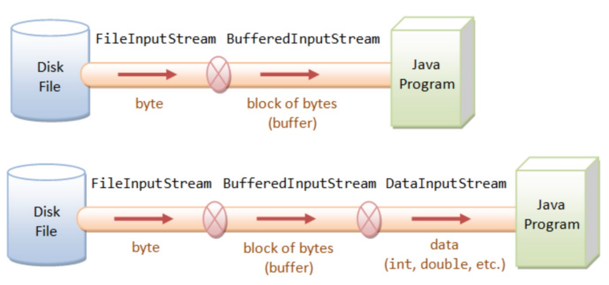

# the basic stream abstraction
- we have seen the `FileInput` and `FileOutput` classes
    - they are wrappers for some of the Java class library file handling classes, hiding exceptions
- standard Java library classes for file I/O:
    - a stream is a sequence of values with a source and destination
    - Java libraries define a number of stream classes:
        - `Reader`/`Writer` for dealing with character formatted data
        - `InputStream`/`OutputStream` for dealing with unformatted data (bytes)

# streams and files

- internal data formats:
    - text (char): UTF-16
    - int, float, double, etc.
- external data formats:
    - text in UTF-8 (and other encodings!)
    - binary 

# UTF-8 v. UTF-16
- UTF-8:1 to 4 bytes per character
    - More space-efficient for ASCII (English text).
    - Backward-compatible with ASCII.
-   Default encoding for the web.
- UTF-16: 2 or 4 bytes per character
    - UTF-16 a better fit for languages like Chinese family languages, Japanese, etc.
    -UTF-16 requires Byte Order Mark (BOM) to indicate endianness (i.e., more complex).
- To write UTF-16 to a UTF-8 data file:
    - If 2 bytes, write directly to 2-byte UTF-8.
    - If 4 bytes, map to a pair of 2-byte ‘surrogate pairs’.

# Class file
- provides a representation for file/directory pathnames
    - not the actual files/directories or contents
- also provides methods to operate on the files/directories named
- creating a FIle object specifies name/path only:
- see Javadoc for full details

