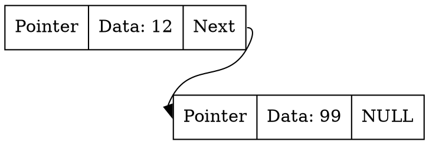

# union-find
  - union: connect two nodes
  - find: is there a path connecting two nodes?

```dot
digraph Structs {
    node [shape=record];
    
    // Using | creates a divider
    nodeA [label=" <f0> Pointer | <f1> Data: 12 | <f2> Next "];
    nodeB [label=" <f0> Pointer | <f1> Data: 99 | <f2> NULL "];
    
    // Connect specific ports (f2 to f0)
    nodeA:f2 -> nodeB:f0;
}
```