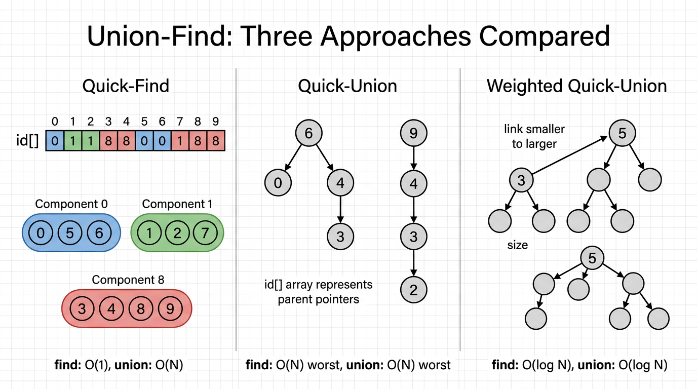

# Union-Find — COMP0005 Algorithms (UCL)

*Lecture-style notes. Union–Find is often one of the first topics: it introduces a clean **problem → model → data structure → complexity → refine** workflow that repeats through the course.*

---

## 1. COMPLETE TOPIC SUMMARIES

### The **Union–Find** problem

You are given an undirected graph with **\(N\)** nodes (often labelled **\(0, 1, \ldots, N-1\)**). Initially there are **no edges**. You must support two operations:

- **`union(x, y)`** — add an (undirected) connection between **\(x\)** and **\(y\)** (conceptually: “merge their connectivity”).
- **`find(x, y)`** (equivalently: **“are \(x\) and \(y\) connected?”**) — return whether there is a **path** between **\(x\)** and **\(y\)** using the edges added so far.

> **Intuition:** Think of islands and bridges. `union` builds bridges; `find` asks whether you can walk from one island to the other using existing bridges.

---

### Step 1 — **Modelling** the problem

- **Nodes as integers:** represent vertices as **\(\{0,\ldots,N-1\}\)** so arrays index directly.
- **“Connected by a path”** (after a sequence of unions) is an **equivalence relation** on vertices:
  - **Reflexive:** every node is connected to itself.
  - **Symmetric:** if there is a path \(x \leadsto y\), there is a path \(y \leadsto x\) (undirected edges).
  - **Transitive:** if \(x\) connects to \(y\) and \(y\) connects to \(z\), then \(x\) connects to \(z\).
- **Connected components:** partition the nodes into **maximal** sets where every pair in the same set is connected. Two nodes satisfy `find(x, y) == true` **iff** they lie in the **same** component.
- **`union(x, y)`** merges the two components containing **\(x\)** and **\(y\)** (if they are already the same, merging is a no-op).

This model is what lets us replace “graph reachability” with “same set / same component” — the algorithmic task becomes maintaining a **partition** under **merges** and **same-set queries**.

---

### Step 2 — **Quick-Find** (eager approach)

**Data structure:** an integer array **`id[0..N-1]`**.

**Meaning:** **`id[i]`** is the **component id** (a label) for node **\(i\)**.

**Connection test:** **\(u\)** and **\(v\)** are connected iff **`id[u] == id[v]`**.

**Operations:**

- **`find(u, v)`:** compare two array entries → **\(\mathcal{O}(1)\)** time.
- **`union(u, v)`:** every node **\(i\)** that used to be in **\(u\)**’s component must be relabelled to **\(v\)**’s component:
  - scan **\(i = 0..N-1\)**; if **`id[i] == id[u]`**, set **`id[i] = id[v]`** → **\(\mathcal{O}(N)\)** time.

**Pseudocode:**

```text
# init: each node is its own component
id = []
for i in range(N):
    id.append(i)

def union(u, v):
    uid = id[u]
    vid = id[v]
    for i in range(N):
        if id[i] == uid:
            id[i] = vid

def find(u, v):
    return id[u] == id[v]
```

**Costs (per operation, unless stated otherwise):**

| Phase   | Time                         |
|--------|------------------------------|
| Init   | **\(\Theta(N)\)** (build array) |
| `union`| **\(\mathcal{O}(N)\)**        |
| `find` | **\(\mathcal{O}(1)\)**         |

**Why this can fail at scale:** **\(N\)** unions each costing **\(\mathcal{O}(N)\)** gives **\(\mathcal{O}(N^2)\)** total work — too slow when **\(N\)** is large. The eager update makes **merges** expensive to keep **queries** cheap.

---

### Step 2 — **Quick-Union** (lazy approach)

**Data structure:** still **`id[0..N-1]`**, but the meaning changes.

**Meaning:** **`id[i]`** is **\(i\)’s parent** in a **forest** (a collection of rooted trees). Roots satisfy **`id[r] == r`**.

**Root:** **`root(i)`** walks **\(i \to id[i] \to id[id[i]] \to \cdots\)** until it reaches a root.

**Connection test:** **\(u\)** and **\(v\)** are connected iff **`root(u) == root(v)`** (same tree ⇔ same component).

**Operations:**

- **`find(u, v)`:** two root walks → cost dominated by tree **depth**.
- **`union(u, v)`:** attach one root under the other: **`id[root(u)] = root(v)`** (or the symmetric choice).

**Pseudocode:**

```text
def root(i):
    while i != id[i]:
        i = id[i]
    return i

def find(u, v):
    return root(u) == root(v)

def union(u, v):
    r_u = root(u)
    r_v = root(v)
    id[r_u] = r_v
```

**Costs:**

| Phase   | Time |
|--------|------|
| Init   | **\(\Theta(N)\)** |
| `union`| **\(\mathcal{O}(N)\)** in the **worst case** (deep trees) |
| `find` | **\(\mathcal{O}(N)\)** in the **worst case** |

**Core issue:** without care, trees can become **long chains** (essentially linked lists), so **`root`** becomes linear time. Quick-Union makes **merges** cheap **locally**, but can create **bad global shape**.

---

### Step 2 — **Weighted Quick-Union**

**Idea:** when merging two trees, **always hang the smaller tree under the larger tree’s root** (by **number of nodes** in each tree). This controls height.

**Extra array:** **`size[i]`** — for a root **\(i\)**, the number of nodes in the tree rooted at **\(i\)**. For non-roots you may ignore **`size[i]`** in simple implementations (only roots must stay meaningful), but the lecture pattern is: maintain sizes at roots and update on merge.

**`find`:** unchanged in spirit — still compare roots.

**`union`:**

1. **`r_u = root(u)`**, **`r_v = root(v)`**; if equal, return.
2. If **`size[r_u] < size[r_v]`**, set **`id[r_u] = r_v`** and **`size[r_v] += size[r_u]`**; else the symmetric case.

**Pseudocode:**

```text
id = []
size = []
for i in range(N):
    id.append(i)
    size.append(1)

def union(u, v):
    r_u = root(u)
    r_v = root(v)
    if r_u == r_v:
        return
    if size[r_u] < size[r_v]:
        id[r_u] = r_v
        size[r_v] += size[r_u]
    else:
        id[r_v] = r_u
        size[r_u] += size[r_v]
```

**Costs (standard bound for this version, without extra optimisations):**

| Phase   | Time |
|--------|------|
| Init   | **\(\Theta(N)\)** |
| `union`| **\(\mathcal{O}(\log N)\)** |
| `find` | **\(\mathcal{O}(\log N)\)** |

**Why \(\log N\) shows up (high-level):** a node’s tree can at most double in size when it becomes a non-root child of a strictly larger tree; you can relate this to a **“how many times can my component size at least double?”** argument, yielding a **logarithmic** depth bound.

> **Course note:** Later you may see **path compression** and **union by rank**, which tighten amortised bounds further. For COMP0005’s first pass, **weighted union + logarithmic depth** is the main “shape control” lesson.

---

### **Algorithm development cycle** (recap — how the course thinks)

1. **Model** the problem (objects, operations, mathematical structure — here: equivalence classes / components).
2. **Choose** data structures and algorithms that implement the operations.
3. **Analyse** correctness and **cost** (often worst-case per operation, sometimes totals for sequences).
4. **Iterate** — if too slow or too complex, refine (Quick-Find → Quick-Union → Weighted Quick-Union is a textbook iteration).

Union–Find is a small, self-contained example of that loop.

---

### **Cost summary table**


*Comparison of Quick-Find (flat array), Quick-Union (forest of trees), and Weighted Quick-Union (balanced trees). The key trade-off is between find and union costs.*

| Algorithm | Init | `union` | `find` |
|-----------|------|---------|--------|
| **Quick-Find** (eager) | **\(N\)** | **\(N\)** | **\(1\)** |
| **Quick-Union** (lazy) | **\(N\)** | **\(N\)**† | **\(N\)**† |
| **Weighted Quick-Union** | **\(N\)** | **\(\log N\)** | **\(\log N\)** |

† **Worst case** for Quick-Union (bad union sequence creates tall trees).

*(Big-\(\mathcal{O}\) notation is used for growth rates; init is **\(\Theta(N)\)** to allocate and initialise arrays.)*

---

## 2. EXAM-STYLE QUESTIONS (3–5 with model answers)

### Q1 — Definitions

**Question:** Define **connected components** in an undirected graph built incrementally by `union` operations. Explain why “\(x\) is connected to \(y\)” is an **equivalence relation**.

**Model answer:** A **connected component** is a **maximal** subset of vertices such that for any two vertices **\(a, b\)** in the subset, there exists a **path** between them using edges added so far, and no vertex outside the subset can be added without breaking maximality. The relation **\(x \sim y\)** iff **\(x\)** is connected to **\(y\)** is **reflexive** (empty path), **symmetric** (undirected paths reverse), and **transitive** (concatenate paths), hence an **equivalence relation**. Components are exactly the **equivalence classes** of **\(\sim\)**.

---

### Q2 — Quick-Find complexity

**Question:** In Quick-Find, what are the time complexities of **`find`** and **`union`**? Give a sequence of operations illustrating why **`union`** can be **\(\mathcal{O}(N)\)**.

**Model answer:** **`find`** is **\(\mathcal{O}(1)\)** (two array lookups and a comparison). **`union`** scans all **\(N\)** entries to relabel one entire component, so it is **\(\mathcal{O}(N)\)**. Example: if component ids are integers and many nodes share **`id == 0`**, a `union` that relabels all those nodes to another id must touch each of those nodes once — linear work.

---

### Q3 — Quick-Union failure mode

**Question:** Explain how Quick-Union can degrade so that **`root(i)`** takes **\(\Theta(N)\)** time. What structural feature of the forest causes this?

**Model answer:** If unions always attach the current root as a child of the other root in an unfortunate order, the forest can become a **chain** (each node has one child in a line). Then reaching the root from a leaf requires walking **\(\Theta(N)\)** parent pointers. The issue is **unbalanced tree height** (linear depth), not the parent-pointer idea itself.

---

### Q4 — Weighted union rule

**Question:** State the **weighted union** rule. Why does linking the **smaller** tree under the **larger** tree’s root help?

**Model answer:** Maintain **`size[r]`** for each root **\(r\)**. On `union`, find roots **`r_u, r_v`**; if **`size[r_u] < size[r_v]`**, set **`id[r_u]=r_v`** and update **`size[r_v]`**, else symmetrically. This ensures the depth of nodes in the smaller tree increases by **1** while attaching into a tree that already had **at least as many** nodes, preventing repeated “grow a tall skinny tree” behaviour. A standard consequence is a **logarithmic** upper bound on tree height, making **`root`** **\(\mathcal{O}(\log N)\)**.

---

### Q5 — Compare trade-offs

**Question:** Compare Quick-Find and Quick-Union in terms of which operation is expensive and why. Where does Weighted Quick-Union sit in that trade-off?

**Model answer:** **Quick-Find** makes **`union`** expensive (**\(\mathcal{O}(N)\)** global relabelling) but **`find`** cheap (**\(\mathcal{O}(1)\)**). **Quick-Union** makes **`union`** cheap (**\(\mathcal{O}(1)\)** pointer change at roots, ignoring the cost of finding roots) but allows **`find`/root-finding** to degrade to **\(\mathcal{O}(N)\)** if trees degenerate. **Weighted Quick-Union** keeps the cheap-linking idea but **controls tree shape**, so both **`union`** and **`find`** (via root walks) become **\(\mathcal{O}(\log N)\)** in the standard analysis taught at this stage — a more balanced compromise for long sequences of operations.

---

## 3. MUST-KNOW KEY POINTS

- **Union–Find** supports **dynamic connectivity**: add edges (`union`) and test reachability (`find`).
- Model connectivity as **equivalence classes** → **connected components**.
- **Quick-Find:** **`id[i]`** is a **component label**; **`find`** \(\mathcal{O}(1)\), **`union`** \(\mathcal{O}(N)\).
- **Quick-Union:** **`id[i]`** is a **parent**; same component ⇔ **same root**; worst case **linear** depth.
- **Weighted Quick-Union:** merge **smaller tree into larger tree** using **`size[]`**; typical depth bound **\(\mathcal{O}(\log N)\)** → **`find`/`union`** \(\mathcal{O}(\log N)\) (with the usual root-walk union implementation).
- Know the **algorithm development cycle:** model → implement → analyse cost → refine.
- Memorise the **comparison table** pattern: init **\(\Theta(N)\)** for array initialisation; per-op costs as in the table.

---

## 4. HIGH-PRIORITY TOPICS

| Priority | Topic | Why it matters |
|----------|--------|----------------|
| 🔴 **Must know** | **Problem statement:** `union` / `find` | Defines what you are implementing and analysing. |
| 🔴 **Must know** | **Equivalence relation + components** | Explains *why* the array/forest models are valid. |
| 🔴 **Must know** | **Quick-Find vs Quick-Union meaning of `id[]`** | Classic exam trap: same array, different semantics. |
| 🔴 **Must know** | **Per-operation costs + summary table** | Core complexity literacy for the course. |
| 🟡 **Important** | **Why Quick-Union can be \(\mathcal{O}(N)\)** | Shows “lazy” updates can still fail without invariants. |
| 🟡 **Important** | **Weighted union rule + `size[]` updates** | Standard implementation detail and proof sketch anchor. |
| 🟡 **Important** | **Algorithm development methodology** | Meta-skill reused in every algorithms topic. |
| 🟢 **Useful but lower priority** | **Proof details of the \(\log N\)** height bound | Often asked as “outline the argument” rather than full formal proof. |
| 🟢 **Useful but lower priority** | **Variants:** union by rank, path compression | May appear as “extension” reading; not always exam-core in week 1. |

---

## 5. TOPIC INTERCONNECTIONS & BIGGER PICTURE

- **Graphs:** Union–Find is **connectivity** without storing all edges explicitly — useful when edges arrive online or you only care about components.
- **Sets and partitions:** You are maintaining a **partition** of **\(\{0,\ldots,N-1\}\)** under **union** of blocks — the same abstract structure appears in clustering, Kruskal’s MST algorithm, and network reliability sketches.
- **Amortised analysis (later):** Path compression + union by rank/weight leads to **inverse-Ackermann** amortised bounds — a famous “tiny growth rate” story built on the same forest model.
- **Trade-offs:** The progression **eager vs lazy vs balanced lazy** mirrors recurring design pressure: **local simplicity vs global performance**.
- **Complexity notation:** This topic is a gentle introduction to claiming **\(\mathcal{O}\)** bounds for **init**, **single operations**, and **sequences** (e.g. **\(N\)** unions).

---

## 6. EXAM STRATEGY TIPS

- **State the invariant first.** For each variant, one sentence: “**`id[i]`** means **…**; connected iff **…**.” Examiners reward precise semantics.
- **Match operation to cost.** If a question says “many `find` queries, few `union`s”, articulate which structure favours which — but also note **total work** matters (e.g. **\(N\)** unions in Quick-Find).
- **Worst-case shapes:** For Quick-Union, mention **chains**; for weighted union, mention **controlled growth / doubling** intuition for **\(\log N\)**.
- **Pseudocode discipline:** Always **`if r_u == r_v: return`** in `union` — avoid self-loops and redundant work in written answers.
- **Table recall:** Be able to reproduce the **Init / Union / Find** row for all three algorithms from understanding, not rote alone.
- **Big picture sentence:** Ending with one line tying back to **“model → DS → analyse → iterate”** often captures methodology marks.

---

*End of notes — Union-Find (COMP0005, UCL).*
