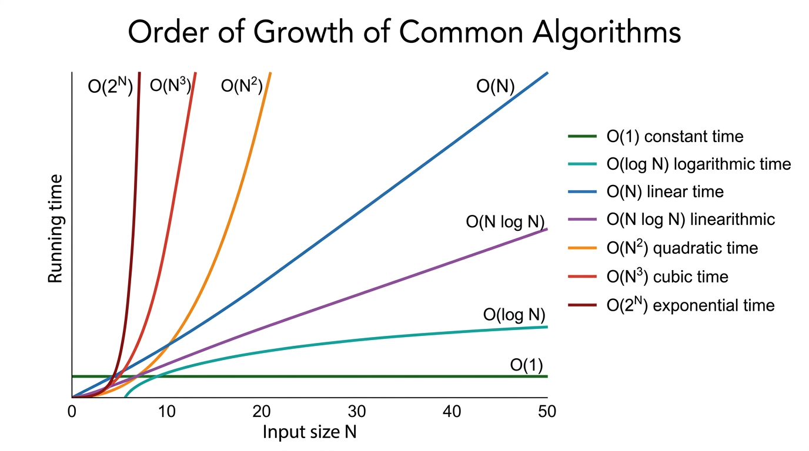
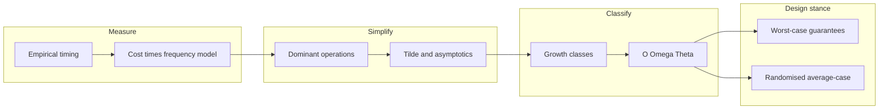

# Analysis of Algorithms — COMP0005 Algorithms (UCL)

*Lecture-style notes on how we **measure**, **predict**, and **compare** algorithm performance — from timing experiments to **mathematical models**, **tilde** and **asymptotic** notation, and **best / worst / average** analysis.*

---

## 1. COMPLETE TOPIC SUMMARIES

### **Observations** (empirical analysis)

Before we prove anything, we often **measure** running time **$T(N)$** for various input sizes **$N$** and plot the results.

- **Example — Bubble Sort timing:** If you time **Bubble Sort** on random arrays of sizes **$N = 100, 200, 400, \ldots$**, you typically see **$T(N)$** grow **much faster than linearly** — often consistent with a **quadratic** trend when **$N$** doubles, **$T(N)$** roughly **quadruples** (up to constant factors and noise). Such curves motivate the need for cleaner **mathematical** descriptions than raw stopwatch numbers.

**Why raw timings are messy — two kinds of factors:**

| Kind | What it captures | Examples |
|------|------------------|----------|
| **System-independent** | Intrinsic to the **problem + algorithm + input** | Which **algorithm** you use; **input size** **$N$**; **input structure** (sorted vs random; duplicates; etc.) |
| **System-dependent** | Everything outside the abstract algorithm | **Hardware:** CPU speed, cores, **memory** hierarchy, **cache** behaviour; **Software:** programming **language**, **compiler** / JIT, libraries; **System:** **OS** scheduling, background **apps**, thermal throttling |

**Takeaway:** Empirical plots are great for **sanity checks** and **calibration**, but **comparing algorithms fairly** across machines needs **analysis** that isolates **growth rate** in **$N$** from machine constants.

---

### **Mathematical models** of running time

A standard model:

$$
T_{\text{total}} \;=\; \sum_{\text{operations } \texttt{op}} \bigl(\text{cost of } \texttt{op}\bigr) \times \bigl(\text{how often } \texttt{op} \text{ runs}\bigr).
$$

- **Cost** (seconds, or “machine steps”) depends on the **machine** and **compiler** — often treated as an unknown constant multiplier.
- **Frequency** (how many times the operation executes) depends on the **algorithm** and the **input** — this is what we usually **count** carefully.

So: **separate “how expensive per step” from “how many steps.”** Asymptotic notation later throws away the per-step constants and keeps the **scaling in $N$**.

---

### **Frequency analysis** — worked patterns

#### **Single loop — count zeros in an array**

Assume **$a[0..N-1]$** and pseudocode of the form:

```text
count = 0
for i in range(N):
    if a[i] == 0:
        count += 1
```

A typical **operation-by-operation** count (exact constants depend on how you define “one operation,” but the **pattern** is standard):

| Operation kind | Representative count (order) | Notes |
|----------------|-------------------------------|--------|
| **Variable declaration** | **$2$** | e.g. `count`, loop index setup |
| **Assignment** | **$2$** | initialise `count`, possibly index init |
| **Less-than compare** (`i < N`) | **$N+1$** | **$N$** successful checks + **$1$** failure that exits |
| **Equal-to compare** (`a[i] == 0`) | **$N$** | once per iteration |
| **Array access** (`a[i]`) | **$N$** | once per iteration |
| **Increment** (`i++` or implicit) | **$N$** to **$2N$** | depending whether you count both `i` update and `count` update separately |

**Big picture:** The loop body runs **$\Theta(N)$** times; **dominant** work is **linear in $N$**.

#### **Double loop** — count pairs $(i,j)$ with $i<j$ and $a[i]+a[j]=0$

```text
count = 0
for i in range(N):
    for j in range(i + 1, N):
        if a[i] + a[j] == 0:
            count += 1
```

- **Inner `j`-loop length** for a fixed **`i`:** **$(N-1-i)$** iterations.
- **Total inner iterations** (sum over **`i`**):

$$
\sum_{i=0}^{N-1} (N-1-i) \;=\; (N-1) + (N-2) + \cdots + 0 \;=\; \frac{N(N-1)}{2}.
$$

So the **pair body** runs **$\Theta(N^2)$** times.

**Array accesses:** Each inner iteration typically touches **`a[i]`** and **`a[j]`** → about **$2 \times \frac{N(N-1)}{2} = N(N-1)$** accesses (same order as **$N^2$**).

**Comparison counts** (outer `i < N`, inner `j < N`, etc.) accumulate to **cubic polynomials in $N$** in a fully itemised count; a common textbook-style total for the nested **`<`** checks alone is on the order of **$\tfrac{1}{2}(N+1)(N+2)$** — still **$\Theta(N^2)$** when we focus on **growth**.

#### **Triple nested loop** — typical **$\Theta(N^3)$** pattern

Many brute-force routines with **$i<j<k$** or three independent indices **$0 \le i,j,k < N$** end up with **innermost** work **$\Theta(N^3)$**. A common **sorted-triple** style scan has about **$\sim \tfrac{1}{6}N^3$** innermost executions (binomial coefficient **$\binom{N}{3}$**); a full **$N\times N\times N$** cube has **$N^3$**. Either way, **array accesses** are **$\Theta(N^3)$** — the course shorthand **“~$\tfrac{1}{2}N^3$”** is a **representative** order-of-magnitude for some specific triple-loop variants; always **read the loop bounds** on the sheet you are given.

---

### **Simplifications** (what we keep vs drop)

1. **Focus on the most costly / most frequent operations** — often **comparisons**, **array accesses**, or **arithmetic** inside the innermost loop — instead of counting every bookkeeping step.
2. **Ignore lower-order terms** when **$N$** is large, using **tilde** (**`~`**) notation.

**Tilde notation (informal, growth-matching):**

$$
f(N) \sim g(N) \quad \Longleftrightarrow \quad \lim_{N\to\infty} \frac{f(N)}{g(N)} = 1.
$$

**Example:** If an exact count is **$\tfrac{1}{2}N^2 + 3N + 7$**, then **$f(N) \sim \tfrac{1}{2}N^2$** — the **$N^2$** term **dominates**.

We also express running time as a **function of input size** **$N$** (and sometimes extra parameters like **$k$** in **$k$**-SUM, or **$V,E$** for graphs).

---

### **Order of growth** — common “complexity classes”

When **$N$** is large, the **leading growth rate** tells you which algorithm will win:


*How different growth rates diverge as input size N increases. The gap between O(N log N) and O(N²) is already massive for moderate N, and exponential O(2^N) is off the chart almost immediately.*

| Growth | Name / intuition | Typical examples (illustrative) |
|--------|------------------|----------------------------------|
| **$1$** | **Constant** | Hash table lookup **average** (idealised), array index |
| **$\log N$** | **Logarithmic** | **Binary search** on sorted array; balanced BST operations |
| **$N$** | **Linear** | Scan array once; two-pointer techniques |
| **$N \log N$** | **Linearithmic** | **Merge sort**, **heapsort** (worst-case **$\Theta(N\log N)$** for comparison sorts in general) |
| **$N^2$** | **Quadratic** | Naive **all pairs**, **Bubble/Insertion** sort worst cases |
| **$N^3$** | **Cubic** | Naive **triple loops**, some DP formulations |
| **$2^N$** | **Exponential** | Brute-force subsets, naive travelling salesman style search |

Each rate is a different **performance class**; constants matter for small **$N$**, but **asymptotics** drive scalability.

---

### **Binary search** — a logarithmic comparison count

**Problem:** Given a **sorted** array **`a`**, determine whether **$x$** appears (return an index or **“not found”**).

**Pseudocode** (as in course notes):

```text
low = 0
high = len(a)
while (low <= high):
    mid = low + (high - low) / 2
    if x < a[mid]: high = mid - 1
    elif x > a[mid]: low = mid + 1
    else: return mid
return -1
```

**Analysis sketch:** Each iteration **halves** the **search interval** (up to **$O(1)$** edge cases). Starting length **$\Theta(N)$**, the number of iterations satisfies **$\Theta(\log N)$** — hence **comparisons** with **`a[mid]`** are **$\Theta(\log N)$**.

**Tilde / log base:** Writing **$T(N) \sim \ln N$** differs from **$\log_2 N$** only by a **constant factor** (**change-of-base**). In **Big-O / Θ** class, **$\Theta(\log N)$** ignores the base.

---

### **Types of analysis** — best, worst, average

- **Best case** — a **lower bound** on cost for **some** “easy” input family (often **not** representative).
- **Worst case** — an **upper bound** guaranteed **for all inputs of size $N$**; what you usually **prove** for **correctness of performance claims** in safety-critical or adversarial settings.
- **Average case** — **expected** cost under a **probabilistic model** of inputs (e.g. each permutation equally likely; random pivot; random hash function). Requires an explicit **randomness model** — different models → different averages.

---

### **Algorithm design** stances

- **Approach 1 — design for worst case:** Guarantees **robust** performance (e.g. **merge sort** **$\Theta(N\log N)$** worst case).
- **Approach 2 — design for average case:** Use **randomisation** (**QuickSort** random pivot, **randomised** selection) so **expected** time is good while **pathological** inputs are **unlikely** — sometimes **worst case** remains bad, but **probability** of hitting it is tiny under the model.

---

### **Asymptotic notation** — **Big-O**, **Big-Omega**, **Big-Theta**

Let **$f,g : \mathbb{N} \to \mathbb{R}_{\ge 0}$** (typical running-time functions).

- **Big-O** **$f(N) = O(g(N))$** — **upper bound**: **$f$** grows **no faster than** **$g$** (up to constants). **Example:** **$5N\log N + 2N = O(N^2)$** (very loose), also **$= O(N\log N)$** (tighter).
- **Big-Omega** **$f(N) = \Omega(g(N))$** — **lower bound**: **$f$** grows **at least as fast as** **$g$**. **Example:** **$N^3 + N\log N = \Omega(N^2)$**.
- **Big-Theta** **$f(N) = \Theta(g(N))$** — **tight bound**: **$f$** is **sandwiched** between constant multiples of **$g$** for large **$N$** — both **$O(g)$** and **$\Omega(g)$**. **Example:** **$\tfrac{1}{2}N^2 + 10N = \Theta(N^2)$**.

**Sets vs abuse of notation:** Strictly, **$O(g)$** is a **set** of functions; writing **$f(N) = O(g(N))$** is conventional **shorthand**.

**Course mnemonics:**

- **$O$** — **“≤”** (up to constants) in growth rate.
- **$\Omega$** — **“≥”** (up to constants).
- **$\Theta$** — **“=”** (up to constants) — **matching** upper and lower.

**What lives in each set?** (illustrative members for **$g(N)=N^2$**)

- **$O(N^2)$** — anything that grows **no faster** than **$N^2$**: e.g. **$2N^2$**, **$5N\log N$**, **$10N$**, **$7$** (all are **$O(N^2)$**; some are **much** smaller — **$O$** allows **loose** upper bounds).
- **$\Omega(N^2)$** — anything that grows **at least** as fast as **$N^2$**: e.g. **$2N^2$**, **$N^5$**, **$N^3+N\log N$**.
- **$\Theta(N^2)$** — same **growth order** as **$N^2$**: e.g. **$\tfrac{1}{2}N^2$**, **$2N^2$**, **$N^2+5N\log N$** (leading term **$N^2$**).

---

### **How to know if we can do better** (upper vs lower vs optimal)

1. **Upper bound** — exhibit an **algorithm** and prove **$T(N) = O(\ldots)$** — a **guarantee** that some correct method uses **at most** that much time (up to constants).
2. **Lower bound** — prove **any** correct algorithm must use **$\Omega(\ldots)$** resources (e.g. **comparison lower bound** **$\Omega(N\log N)$** for **comparison-based sorting** in the worst case).
3. **Classification** — if you prove **$\Theta(\ldots)$** for a problem **and** an algorithm matches it, you’ve found **optimal order** (up to the model — e.g. comparison sorts).

When **upper** and **lower** **match asymptotically**, you’ve pinned the **intrinsic difficulty** of the problem (in that model).

---

## 2. EXAM-STYLE QUESTIONS (with model answers)

### **Q1 — Empirical vs analytical**

**Question:** Explain why measuring **Bubble Sort**’s wall-clock time **$T(N)$** on one laptop is **not** enough to **fairly compare** two algorithms. Distinguish **system-independent** and **system-dependent** factors.

**Model answer:** Wall-clock time mixes **intrinsic** algorithmic cost with **machine effects**. **System-independent** factors (**algorithm**, **$N$**, **input distribution**) tell you how work **scales**. **System-dependent** factors (**CPU**, **cache**, **language**, **compiler**, **OS** noise) shift timings by constants or add jitter. For **fair comparison**, use **the same hardware** for both **or** (better) **analyse** operation counts / **asymptotic** growth so conclusions **transfer** across machines.

---

### **Q2 — Frequency count**

**Question:** For “**count zeros**” in **$a[0..N-1]$** with a single **`for i in range(N)`** loop, why is the **`i < N`** test executed **$N+1$** times?

**Model answer:** The loop checks the condition **before** each iteration. For **$i = 0,1,\ldots,N-1$**, the test succeeds **$N$** times. When **$i = N$**, the test **fails** once and the loop exits. Total **$N+1$** comparisons. This **+1** is a **low-order** detail dropped in **$O(N)$** but important in **exact** instruction counting.

---

### **Q3 — Double loop**

**Question:** Show that for

```text
for i in range(N):
    for j in range(i + 1, N):
        ...
```

the inner loop runs **$\dfrac{N(N-1)}{2}$** times in total.

**Model answer:** For fixed **`i`**, **`j`** runs **$i+1$** through **$N-1$**, i.e. **$(N-1-i)$** values. Sum:

$$
\sum_{i=0}^{N-1} (N-1-i) = \sum_{k=0}^{N-1} k = \frac{(N-1)N}{2}.
$$

So inner-body work is **$\Theta(N^2)$**.

---

### **Q4 — Asymptotic notation**

**Question:** True or false? **$2N^2 + 100N = O(N^3)$**. True or false? **$2N^2 + 100N = \Theta(N^3)$**. Justify.

**Model answer:** **True** for **$O(N^3)$** — for large **$N$**, **$2N^2+100N \le cN^3$** (e.g. **$c=3$** works eventually). **False** for **$\Theta(N^3)$** — **$\Theta$** needs **$\Omega(N^3)$** too, but **$f(N)/N^3 \to 0$**, so **$f$** is **not** **$\Omega(N^3)$**. Tight classification is **$\Theta(N^2)$**.

---

### **Q5 — Cases of analysis**

**Question:** For **unsorted array search** (check each element for **$x$**), give **best-case**, **worst-case**, and **average-case** **time** under the model: **$x$** is equally likely to be at any position or **absent** (uniform).

**Model answer:** **Best:** **$O(1)$** if **$x$** is the first element (or you adopt a model where you find it immediately). **Worst:** **$O(N)$** if **$x$** is last or missing — must scan all. **Average:** still **$\Theta(N)$** — expected position **$\Theta(N)$** when present; if absent, **$N$** checks. (Precise expectation depends on whether **$x$** is guaranteed present; state assumptions clearly in an exam.)

---

## 3. MUST-KNOW KEY POINTS

- **Separate** **frequency** (algorithm + input) from **per-operation cost** (machine/compiler).
- **Nested loops** often yield **sums**; **$\sum_{i=0}^{N-1} i = N(N-1)/2$** is the **triangular number** identity used constantly.
- **Tilde** **$f \sim g$** = **ratio** **$\to 1$**; used to **drop** lower-order terms **precisely**.
- **Growth classes** **$1, \log N, N, N\log N, N^2, N^3, 2^N$** — know **which** typical algorithms land where.
- **Binary search** is **$\Theta(\log N)$** comparisons on sorted arrays.
- **Best / worst / average** — **worst** gives **guarantees**; **average** needs a **probability model**.
- **$O$** = **upper**, **$\Omega$** = **lower**, **$\Theta$** = **tight** (both).
- **Optimality** argument pattern: **algorithm** upper bound + **problem** lower bound → **$\Theta$** if they **match**.

---

## 4. HIGH-PRIORITY TOPICS

### 🔴 **Must know**

- **Cost × frequency** summation model; **dominant term** / **tilde** reasoning.
- **Triangular sum** **$\sum i$** and **$\Theta(N^2)$** double-loop pattern.
- **Definitions** and **correct use** of **$O$**, **$\Omega$**, **$\Theta$** (including **counterexamples** like **$O$** without **$\Theta$**).
- **Binary search** logarithmic analysis (halving invariant).
- **Best / worst / average** meanings; **worst-case** guarantees vs **randomised** **expected** bounds.

### 🟡 **Important**

- **Empirical** pitfalls; **system-dependent** vs **independent** factors.
- **Triple-loop** **$\Theta(N^3)$** recognition; translating **exact** polynomial counts to **$\Theta(\cdot)$**.
- **Log bases** irrelevant in **$\Theta(\log N)$** (constant-factor change).
- **Comparison** lower bound **$\Omega(N\log N)$** for **comparison sorting** (story-level — often revisited when sorting is taught formally).

### 🟢 **Useful but lower priority**

- **Exact** instruction counts for **every** line of pseudocode (course-dependent).
- **Average-case** **precise** expectations with subtle **probability** models.
- **Peeking ahead:** **amortised** analysis, **master theorem** (if your term places them later).

---

## 5. TOPIC INTERCONNECTIONS & BIGGER PICTURE



- **Empirical** measurements **motivate** **models**; **models** **predict** scaling **beyond** what you can benchmark.
- **Tilde** is the bridge from **exact polynomials** to **clean** **leading-term** behaviour.
- **Asymptotic notation** is the **language** used everywhere later: **sorting**, **graphs**, **DP**, **data structures**.
- **Upper + lower bounds** connect **algorithms** (“**I can**”) with **complexity** (“**nobody can, in this model**”).
- **Worst-case** vs **randomised** thinking previews **hash tables**, **QuickSort**, **Monte Carlo** algorithms, etc.

---

## 6. EXAM STRATEGY TIPS

- **State the loop invariant / summation** before jumping to **$O(\cdot)$** — examiners reward **$ \sum $** setup (e.g. **$\sum_{i=0}^{N-1}(N-1-i)$**).
- **Never confuse** **$O$** with **$\Theta$** — if asked for **“the complexity,”** check whether they want **tight** **$\Theta$** or **any valid** **$O$**.
- **Always declare** the **input model** for **average case** (uniform random? **adversarial**?).
- **Match the course’s pseudocode** when counting **$<$** tests — **off-by-one** constants are easy to miscount; show **$N+1$** style reasoning briefly, then say **“still $\Theta(N)$”** if appropriate.
- **Binary search / log N:** mention **halving** and **$\log$** — one short paragraph often suffices.
- **If stuck**, **bound loosely** first (**$O$**), then **tighten** (**$\Theta$**) if the question asks for **exact growth class**.

---

*These notes align with standard **COMP0005** introductions to **analysis of algorithms**; always cross-check **definitions** and **notation** with your **official lecture slides** and **problem sheets**.*
