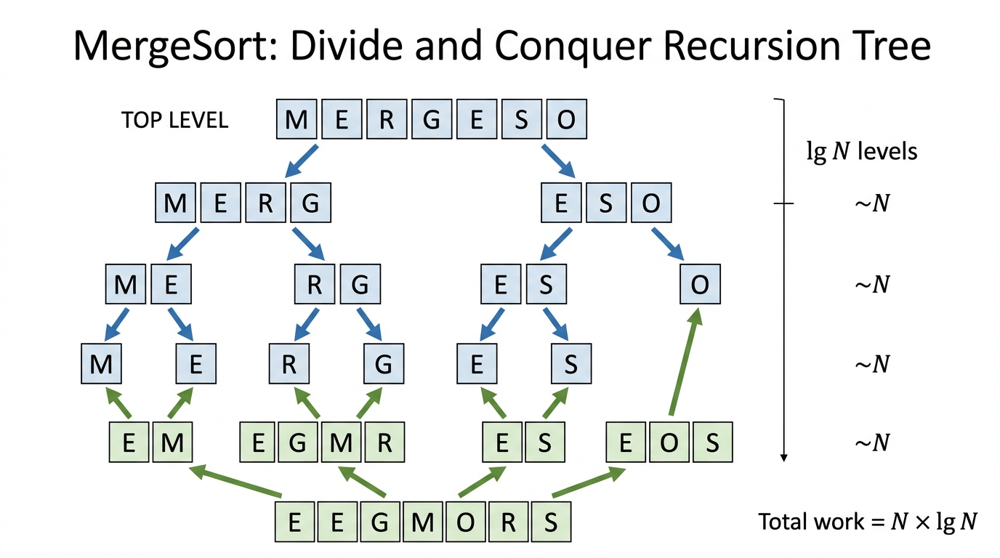

# MergeSort — COMP0005 Algorithms

*Lecture-style notes. MergeSort is the canonical **divide-and-conquer** sorting algorithm: it is fast, theoretically well understood, and a template for analysing recursion trees and proving lower bounds.*

---

## 1. COMPLETE TOPIC SUMMARIES

### MergeSort — the **divide-and-conquer** idea

MergeSort sorts an array by three steps:

1. **Divide** the array into two (roughly) equal halves.
2. **Conquer** by recursively sorting each half.
3. **Combine** by **merging** the two sorted halves into one sorted segment.

If the subproblem is tiny (zero or one element), it is already sorted — that is the **base case**.

> **Mental model:** You and a friend each sort half a deck of cards (already sorted in your hands). Then you **merge** the two sorted piles by repeatedly taking the smaller visible top card — the result is the full sorted deck.

---

### The **merge** step

**Input:** An array **`a`** and indices **`lo`**, **`mid`**, **`hi`** such that:

- **`a[lo..mid]`** is sorted, and  
- **`a[mid+1..hi]`** is sorted.

**Goal:** Make **`a[lo..hi]`** sorted.

**Method:** Copy the segment **`a[lo..hi]`** into an **auxiliary** array **`aux`**, then **fill `a[lo..hi]`** from left to right by always choosing the smaller of the two current front elements from the left and right sorted runs.

**Two pointers:**

- **`i`** starts at **`lo`** (front of left run in **`aux`**).
- **`j`** starts at **`mid+1`** (front of right run in **`aux`**).

At each position **`k`** from **`lo`** to **`hi`**, decide which value to write to **`a[k]`**:

- If the left run is exhausted (**`i > mid`**), take from the right.
- Else if the right run is exhausted (**`j > hi`**), take from the left.
- Else compare **`aux[i]`** and **`aux[j]`** and take the smaller.

**Pseudocode:**

```text
merge(a[], aux[], lo, mid, hi):
    for k = lo to hi:
        aux[k] = a[k]
    i = lo
    j = mid + 1
    for k = lo to hi:
        if i > mid:
            a[k] = aux[j]; j++
        else if j > hi:
            a[k] = aux[i]; i++
        else if aux[j] < aux[i]:
            a[k] = aux[j]; j++
        else:
            a[k] = aux[i]; i++
```

**Why copy to `aux` first?** Merging **in place** in a simple way is tricky; the textbook approach uses **\(\Theta(hi-lo+1)\)** extra space for the merge buffer so you can read from **`aux`** while writing the merged order back into **`a`**.

**Correctness sketch:** Induction on the length of the merged segment. Invariant: before handling **`k`**, all of **`a[lo..k-1]`** contains the **`k-lo`** smallest elements of **`aux[lo..hi]`** in sorted order, and **`i`**, **`j`** point at the next unmerged elements in each run.

---

### The **sort** step (top-down recursion)

**Pseudocode:**

```text
sort(a[], aux[], lo, hi):
    if hi <= lo:
        return
    mid = lo + (hi - lo) / 2
    sort(a, aux, lo, mid)
    sort(a, aux, mid + 1, hi)
    merge(a, aux, lo, mid, hi)
```

**Typical top-level call:** allocate **`aux`** of length **`N`**, then **`sort(a, aux, 0, N-1)`**.

**Why `mid = lo + (hi - lo) / 2`?** This avoids overflow bugs that can appear with **`(lo + hi) / 2`** in other languages when indices are large.

**Call tree (example):** **`sort(0, 6)`** splits into **`sort(0, 3)`** and **`sort(4, 6)`**, which split further until **`hi <= lo`**, then **merges bubble upward** until the whole range is sorted. For **\(N\)** a power of two, the recursion tree is a balanced binary tree of depth **\(\lg N\)** (base 2 is standard in this course unless stated otherwise).

---

### **Practical improvements**

1. **Skip merge if already in order:** After the two recursive calls, if **`a[mid] <= a[mid+1]`**, the combined segment is already sorted — **skip** **`merge`**. This helps **nearly sorted** or **partially sorted** data and does not break correctness.

2. **Avoid copying the full range every time (role swapping):** A common implementation trick is to pass **two arrays** and **swap which is “source” and “destination”** at each recursion level so you do not always copy **`a[lo..hi]`** into **`aux`** in the same way. The asymptotic cost remains **\(\Theta(N \log N)\)** for typical analyses, but constants improve. (Exam focus is usually on the standard **`merge`** above plus the **\(\Theta(N)\)** auxiliary memory story.)

---

### **Analysis**

Let **\(T(N)\)** be the worst-case running time to sort **\(N\)** elements.

**Recurrence (merge cost \(\Theta(N)\)):**

\[
T(N) = 2\,T(N/2) + \Theta(N), \quad T(1) = \Theta(1).
\]

**Solution:** **\(T(N) = \Theta(N \log N)\)**.


*The recursion tree has lg N levels. Each level performs ~N total work (comparisons/copies during merges). Total work: N × lg N.*

**Intuition (when **\(N\)** is a power of two):** The recursion tree has **\(\lg N\)** levels; each level touches all **\(N\)** elements once (across the merges at that level) → **\(N \log N\)** total work.

**Finer statements (as often quoted in COMP0005-style treatments):**

- MergeSort uses **at most** **\(N \log_2 N\)** **compares** (up to constant-factor slack depending on counting conventions).
- It may be reported as using on the order of **\(6 N \log_2 N\)** **array accesses** in a typical counting model (reads/writes to **`a`** and **`aux`** during copy + merge). Treat the exact constant as **implementation-dependent**; the **growth rate** is what matters.

**Empirical takeaway:** For large **\(N\)**, **\(\Theta(N^2)\)** algorithms (e.g. Insertion Sort in the worst case) become unusable, while **\(\Theta(N \log N)\)** methods remain feasible. A rough “orders of magnitude” story: at **\(10^8\)** compares per second, **\(10^9\)** Insertion-Sort compares is **years** of work; **\(10^9 \log_2 10^9\)**-scale MergeSort work is **minutes** — not because constants are magically tiny, but because **\(\log N\)** is small compared to **\(N\)**.

---

### **Optimality (comparison-based sorting)**

**Theorem (comparison lower bound):** Any **comparison-based** sorting algorithm requires **\(\Omega(N \log N)\)** comparisons in the **worst case** (and also in the **average case** under reasonable models).

**Consequence:** MergeSort’s **\(\Theta(N \log N)\)** worst-case time **matches** this bound up to constants — it is **asymptotically optimal** among comparison sorts.

> **What “comparison-based” means:** The algorithm only learns information about the input by **comparing** pairs of elements (e.g. **`a[i] < a[j]`**). No hashing the whole array into integers in **\(O(1)\)** time per element, no radix tricks — those can beat **\(N \log N\)** under extra assumptions.

---

### **Memory**

- MergeSort needs **\(\Theta(N)\)** **extra** array space for **`aux`** (plus **\(\Theta(\log N)\)** recursion stack frames in a typical recursive implementation).
- It is **not in-place** in the strict sense: **in-place** usually means **\(O(\log N)\)** **extra** memory (beyond the input array).

**Contrast:**

| Algorithm        | Typical extra memory |
|-----------------|----------------------|
| Selection Sort  | **\(O(1)\)**         |
| Insertion Sort  | **\(O(1)\)**         |
| Merge Sort      | **\(O(N)\)**         |

---

### **Stability**

A sort is **stable** if, for **equal keys**, the algorithm preserves the **original relative order** of those items.

| Algorithm        | Stable? |
|-----------------|---------|
| Insertion Sort  | Yes     |
| Merge Sort      | Yes*    |
| Selection Sort  | No      |

\* **Provided** the merge breaks ties by taking from the **left** run when **`aux[j] == aux[i]`** (the pseudocode above uses **`<`**, not **`<=`**, on **`aux[j]` vs `aux[i]`**, which does exactly that).

**Why Selection Sort fails stability:** It repeatedly selects a minimum and may **swap** it a long distance, jumping over equal keys and **reordering** equal elements.

**Why stability matters (example):** Sort students **by course**, then **stable sort by name** — you get alphabetical order **within** each course. An unstable second sort can scramble names among ties.

---

## 2. EXAM-STYLE QUESTIONS (WITH MODEL ANSWERS)

### Q1 — Trace merge

**Question.** Left run: **`[1, 4, 7]`**, right run: **`[2, 5, 6]`**. Show the merged output and list the **compare** outcomes in order (enough to justify the merge’s decisions).

**Model answer.** Merged: **`[1, 2, 4, 5, 6, 7]`**. A typical compare sequence: **`1 vs 2`** (take 1), **`4 vs 2`** (take 2), **`4 vs 5`** (take 4), **`7 vs 5`** (take 5), **`7 vs 6`** (take 6), then left run has **`7`** only (no compare needed vs empty right). *(Exact compare count depends on exhaustion cases, but the output order is unique.)*

---

### Q2 — Recurrence and big-O

**Question.** Explain why MergeSort’s worst-case time is **\(\Theta(N \log N)\)** using the recurrence **\(T(N) = 2T(N/2) + \Theta(N)\)**.

**Model answer.** Unroll one level: **\(T(N) = 2\bigl(2T(N/4) + \Theta(N/2)\bigr) + \Theta(N) = 4T(N/4) + 2\Theta(N)\)**. After **\(k\)** levels: **\(2^k T(N/2^k) + k\cdot \Theta(N)\)**. Stop at **\(N/2^k = 1\)** ⇒ **\(k = \log_2 N\)**. Then **\(T(N) = N T(1) + \Theta(N \log N) = \Theta(N \log N)\)**. (Master theorem / tree method gives the same.)

---

### Q3 — Lower bound and “optimality”

**Question.** What does it mean that MergeSort is **optimal** among comparison-based sorts?

**Model answer.** **Any** comparison-based sorting algorithm needs **\(\Omega(N \log N)\)** comparisons in the worst case. MergeSort runs in **\(O(N \log N)\)** worst case, so its growth rate **matches** the lower bound: no comparison sort can beat **\(\Theta(N \log N)\)** **asymptotically** in the worst case.

---

### Q4 — Stability

**Question.** Is MergeSort stable with the merge rule **`if aux[j] < aux[i]`** (strict inequality) when equal keys appear in both halves? Justify briefly.

**Model answer.** **Yes.** When **`aux[j] == aux[i]`**, the **`else`** branch takes **`aux[i]`** from the **left** run first, preserving the earlier element’s relative position before later equal keys from the right — the definition of stability.

---

### Q5 — Space and in-place status

**Question.** Why is MergeSort **not** considered in-place, and what is the extra memory?

**Model answer.** It allocates an auxiliary array of size proportional to **\(N\)** (typically **\(\Theta(N)\)**) to merge. **In-place** sorting is usually defined as **\(O(\log N)\)** extra memory (plus sometimes allowing **\(O(1)\)** pointers). **\(\Theta(N)\)** auxiliary storage exceeds that, so MergeSort is **not** in-place.

---

## 3. MUST-KNOW KEY POINTS

- **Pattern:** Divide array → sort halves → **merge** two sorted runs in **linear time** in the run lengths.
- **Merge correctness** relies on two sorted inputs and the two-pointer “always take smaller front” rule.
- **Time:** **\(\Theta(N \log N)\)** worst case for typical implementations; matches **comparison-sort lower bound**.
- **Space:** **\(\Theta(N)\)** auxiliary array (plus **\(O(\log N)\)** recursion stack in recursive code).
- **Stability:** Stable if ties break **toward the left** run (use **`<`**, not **`<=`**, when comparing right vs left in the pseudocode above).
- **Not in-place** vs **Insertion/Selection** which use **\(O(1)\)** extra memory.
- **Practical tweak:** If **`a[mid] <= a[mid+1]`**, skip merge — safe optimisation.

---

## 4. HIGH-PRIORITY TOPICS

### 🔴 Must Know

- Divide-and-conquer structure: **`sort` → two recursive calls → `merge`**
- **`merge` pseudocode** (copy to **`aux`**, two pointers, four cases)
- **\(\Theta(N \log N)\)** time and **why** (levels × **\(N\)** work per level)
- **\(\Omega(N \log N)\)** **comparison lower bound** and what “optimal” means
- **\(\Theta(N)\)** extra memory; **not in-place**
- **Stability** definition + why MergeSort is stable with **`<`** tie-breaking

### 🟡 Important

- Call tree picture for **\(N\)** a power of two (depth **\(\lg N\)**)
- Base case **`hi <= lo`**
- **`mid = lo + (hi-lo)/2`** (overflow-safe midpoint)
- Skip-merge optimisation when already ordered
- Empirical contrast: **\(N^2\)** vs **\(N \log N\)** at large **\(N\)**

### 🟢 Useful but Lower Priority

- Role-swapping/double-buffer tricks to improve constants
- Exact constant factors like “**\(6N\log N\)** accesses” as reported in some slides (know it is **model-dependent**)
- Relationship to other **\(N\log N\)** sorts (Heapsort, Quicksort variants) — different constants, stability, in-place trade-offs

---

## 5. TOPIC INTERCONNECTIONS & BIGGER PICTURE

- **Divide and conquer** reappears in binary search, closest pair, fast multiplication, Strassen-style ideas, etc. MergeSort is the **cleanest** introductory example: **same-sized subproblems** + **linear-time combine**.
- **Recursion trees** and the **Master Theorem** are general tools for recurrences like **\(T(N)=aT(N/b)+f(N)\)**; MergeSort is the flagship case **\(a=b=2\)**, **\(f(N)=\Theta(N)\)**.
- **Sorting lower bounds** connect to **decision trees**: **\(N!\)** outcomes ⇒ **\(\log_2(N!)=\Theta(N\log N)\)** height in a comparison model.
- **Stability** matters when sorting by **multiple keys** (lexicographic / radix-style pipelines).
- **Space-time trade-off:** MergeSort buys **worst-case speed** and **stability** with **linear extra memory**; **Heapsort** is in-place but not stable; **Quicksort** is fast in practice but needs careful partitioning and analysis.

---

## 6. EXAM STRATEGY TIPS

- **Be able to trace** **`merge`** on a small example (6–8 elements) without arithmetic mistakes on pointers **`i`**, **`j`**, **`k`**.
- **Write the recurrence** and finish with **\(\Theta(N\log N)\)** in one or two lines — examiners reward the **correct template**.
- If asked **“optimal?”**: always mention **comparison-based** model + **\(\Omega(N\log N)\)** lower bound + MergeSort **matches** asymptotically.
- **Stability** questions: tie-break rule in merge (**`<`** vs **`<=`**) is a classic trap.
- **In-place** questions: state the **\(\Theta(N)\)** **`aux`** array explicitly; contrast with Insertion/Selection **\(O(1)\)** extra.
- For **improvements**, the **“already sorted between halves”** shortcut is easy marks if you say **why it preserves correctness** (two sorted halves + global order already holds).

---

*These notes align with standard COMP0005 treatments of MergeSort; always follow your lecturer’s exact definitions of “array access” counts and logarithm bases if they differ.*
