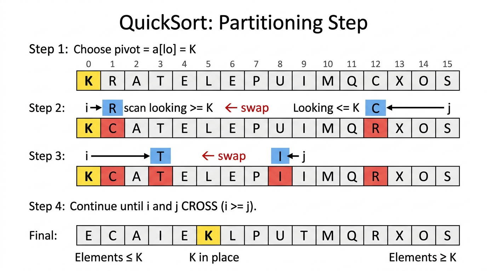

# QuickSort — COMP0005 Algorithms

*Lecture-style notes. QuickSort is the canonical **in-place**, **divide-and-conquer** comparison sort that dominates practice: its **average** behaviour is **\(\Theta(N \log N)\)**, but the **worst case** is **quadratic** unless you randomise or engineer the pivot.*

---

## 1. COMPLETE TOPIC SUMMARIES

### 1.1 QuickSort — the **key idea**

QuickSort sorts an array by three steps:

1. **Shuffle** the array (or otherwise randomise pivot choices) to make bad splits unlikely.
2. **Partition** the current segment so that, for some index **\(j\)**:
   - **\(a[j]\)** is in its **final sorted position** (for this subproblem’s key value relative to the segment),
   - every **\(a[i]\)** with **\(i < j\)** satisfies **\(a[i] \le a[j]\)**,
   - every **\(a[i]\)** with **\(i > j\)** satisfies **\(a[i] \ge a[j]\)**.
3. **Recurse** independently on **\(a[\text{lo}..j-1]\)** and **\(a[j+1..\text{hi}]\)**.

**Base case:** if **\(\text{hi} \le \text{lo}\)** (zero or one element), the segment is already sorted.

> **Mental model:** Pick a **pivot** value, **sweep** the segment so “small stuff” goes left and “large stuff” goes right, then **park** the pivot between them. The pivot never moves again in the correct implementation — you only sort **strictly smaller** subproblems on each side.

---

### 1.2 The **partitioning** step (Lomuto-style story, Sedgewick/Bentley-style two-pointer scan)

**Pivot choice in the classic lecture version:** use **\(a[\text{lo}]\)** as the pivot value **\(p\)**.


*The partition step in action: pivot K is chosen, pointers i and j scan inward swapping elements until they cross, then the pivot is placed in its final position. Everything left of K is ≤ K, everything right is ≥ K.*

**Two pointers:**

- **\(i\)** scans **left → right**, looking for an element **\(\ge p\)** (that “belongs” on the right).
- **\(j\)** scans **right → left**, looking for an element **\(\le p\)** (that “belongs” on the left).

**Repeat until** **\(i\)** and **\(j\)** **cross**:

1. Advance **\(i\)** while **\(a[i] < p\)** (stop when you find something not smaller than the pivot, or hit the boundary).
2. Retreat **\(j\)** while **\(p < a[j]\)** (stop when you find something not larger than the pivot, or hit the boundary).
3. If **\(i \ge j\)**, **break** — the pointers have **crossed**.
4. Otherwise **swap** **\(a[i]\)** and **\(a[j]\)** and continue.

**Finishing move:** after the loop, **swap** **\(a[\text{lo}]\)** with **\(a[j]\)**. Then **\(j\)** is the pivot’s final index.

**Why the final swap uses `j` (not `i`)?** When pointers cross, **\(j\)** ends up at the **rightmost** position that still holds something **\(\le p\)** in the standard invariant setup — exchanging **\(a[\text{lo}]\)** with **\(a[j]\)** places the pivot **between** the “≤ region” and the “≥ region”.

**Pseudocode** (as in many COMP0005 slide packs — note the **pre-increment** / **pre-decrement** style):

```text
partition(a[], lo, hi):
    i = lo
    j = hi + 1
    p = a[lo]
    while (true):
        while (a[++i] < p):
            if (i == hi) break
        while (p < a[--j]):
            if (j == lo) break
        if (i >= j) break
        swap(a[i], a[j])
    swap(a[lo], a[j])
    return j
```

**Boundary sentinels in the inner loops:** the **`if (i == hi)`** / **`if (j == lo)`** guards stop the scans from running past the segment when **every** element on that side still satisfies the strict inequality — without them, **\(i\)** could walk past **\(\text{hi}\)** or **\(j\)** past **\(\text{lo}\)**.

**What partition guarantees (for distinct keys, and more generally with careful tie handling):**

- After it returns **\(j\)**, **\(a[j]\)** holds the original pivot value (moved into place).
- **\(\forall i < j,\ a[i] \le a[j]\)** and **\(\forall i > j,\ a[i] \ge a[j]\)**.

---

### 1.3 The **recursive sort** and top-level driver

```text
sort(a[], lo, hi):
    if (hi <= lo) return
    j = partition(a, lo, hi)
    sort(a, lo, j - 1)
    sort(a, j + 1, hi)

randomShuffle(a)
sort(a, 0, a.length - 1)
```

**Why shuffle first?** Deterministic pivot rules (e.g. always **\(a[0]\)** on an **already sorted** array) can make every partition **extremely unbalanced**, producing **\(\Theta(N^2)\)** behaviour. A **uniform random shuffle** makes the **expected** split sizes balanced enough for **\(\Theta(N \log N)\)** average cost.

---

### 1.4 **Analysis** (compares; informal but exam-useful)

Let **\(N = \text{hi}-\text{lo}+1\)** be the subarray length.

**Average case (randomised QuickSort):** with random shuffling / random pivot, the **expected** number of **comparisons** is **\(\Theta(N \log N)\)** — often quoted informally as **about \(2 N \ln N\)** in some textbook models (constants vary with implementation details and what you count).

**Worst case (no randomisation + adversarial / structured input):** if the pivot is always the **minimum** or **maximum** of the current segment (e.g. **already sorted** array and pivot always **\(a[\text{lo}]\)**), each partition only removes **one** element:

\[
(N-1) + (N-2) + \cdots + 1 = \frac{N(N-1)}{2} \sim \frac{N^2}{2}
\]

**compares** — **quadratic**.

**Empirical performance:** QuickSort is often **faster than MergeSort in practice** on typical machines because it is **in-place** (better cache behaviour) and has **smaller constant factors** in the inner loop — even though MergeSort has a **guaranteed** **\(\Theta(N \log N)\)** worst case.

---

### 1.5 **Practical improvements**

1. **Cutoff to Insertion Sort** on tiny subarrays (e.g. length **\(< 10\)**): recursion overhead dominates for small **\(N\)**; Insertion Sort is simple and fast for **small** **\(n\)**.

2. **Better pivots:** the **ideal** pivot is the **median** of the segment (would balance splits). A cheap heuristic is **median-of-three**: sample three indices (often **\(\text{lo}\)**, **\(\text{mid}\)**, **\(\text{hi}\)**), pick the median of their three values as pivot, and swap it to **\(a[\text{lo}]\)** before partitioning.

---

### 1.6 **QuickSort vs MergeSort — properties**

| Property | QuickSort (typical) | MergeSort (typical) |
|----------|---------------------|---------------------|
| **Extra memory** | **\(O(\log N)\)** stack (recursive); **\(O(1)\)** extra if partitioned iteratively | **\(\Theta(N)\)** **aux** array (+ **\(O(\log N)\)** stack) |
| **In-place?** | **Yes** (sorts within **\(a\)**) | **No** (needs linear **aux** for standard merge) |
| **Stable?** | **No** (long-distance swaps scramble equal keys) | **Yes** (with correct merge tie-breaking) |
| **Worst-case time** | **\(\Theta(N^2)\)** without care | **\(\Theta(N \log N)\)** |
| **Average/expected** | **\(\Theta(N \log N)\)** with randomisation | **\(\Theta(N \log N)\)** |

**Duplicates — a serious gotcha:** naive “strict **\(<\)** / **\(>\)**” scans can **not** move equal keys across the pivot efficiently; on inputs with **many equal keys**, QuickSort can degrade toward **quadratic** behaviour.

- **Must-know fix:** **stop scans on equality** with the pivot (use **\(\le\)** / **\(\ge\)** appropriately in the inner while conditions, depending on the variant) so equal keys **exchange** across the pivot and splits shrink properly.
- **Stronger engineering fix:** **3-way partitioning** (Dutch National Flag): partition into **\(< p\)**, **\(= p\)**, **\(> p\)** regions; recurse only on **<** and **>** parts — **linear** time on arrays of **all equal** keys.

---

### 1.7 **Sorting summary table** (COMP0005-style big-O / tilde behaviour)

| Algorithm | In-place | Stable | Worst | Average | Best |
|-----------|:--------:|:------:|-------|---------|------|
| **Selection** | ✓ | ✗ | **\(\sim N^2/2\)** | **\(\sim N^2/2\)** | **\(\sim N^2/2\)** |
| **Insertion** | ✓ | ✓ | **\(\sim N^2/2\)** | **\(\sim N^2/4\)** | **\(\sim N\)** |
| **MergeSort** | ✗ | ✓ | **\(\Theta(N \log N)\)** | **\(\Theta(N \log N)\)** | **\(\Theta(N \log N)\)** |
| **QuickSort** | ✓ | ✗ | **\(\Theta(N^2)\)** | **\(\Theta(N \log N)\)** | **\(\Theta(N \log N)\)** |
| **HeapSort** | ✓ | ✗ | **\(\Theta(N \log N)\)** | **\(\Theta(N \log N)\)** | **\(\Theta(N \log N)\)** |

For QuickSort, **best** and **average** are both **\(\Theta(N \log N)\)** under **balanced** partitions (e.g. each split roughly halves the segment). Some variant tables list different **best** cases; follow your lecturer’s version if it differs.

---

## 2. EXAM-STYLE QUESTIONS (WITH MODEL ANSWERS)

### Q1 — Trace **partition**

**Question.** Apply the lecture **`partition`** to **`a = [5, 3, 8, 4, 2, 7, 1, 6]`** with **`lo = 0`**, **`hi = 7`** (pivot **\(p = 5\)** at index 0). Show a few key swaps and state the returned **`j`** and the final segment order.

**Model answer.** Start with **`i = 0`**, **`j = 8`**, **`p = 5`**.

1. **`i`** scans: **`a[2]=8`** is the first **\(\ge p\)** → **`i = 2`**. **`j`** scans: **`a[6]=1`** is the first **\(\le p\)** → **`j = 6`**. Swap **`a[2]`**↔**`a[6]`** → **`[5, 3, 1, 4, 2, 7, 8, 6]`**.
2. Next: **`i`** stops at **`a[5]=7`** (**\(i=5\)**), **`j`** stops at **`a[4]=2`** (**\(j=4\)**). Now **`i \ge j`** → exit loop.
3. Final: **`swap(a[lo], a[j])`** = **`swap(a[0], a[4])`** → **`[2, 3, 1, 4, 5, 7, 8, 6]`**; **`partition` returns `j = 4`**.

Check: **`a[4]=5`**; left segment **`[2,3,1,4]`** all **\(\le 5\)**; right **`[7,8,6]`** all **\(\ge 5\)**.

---

### Q2 — Worst-case compares

**Question.** Argue that QuickSort on an **already sorted** array of distinct keys, using **always `a[lo]`** as pivot and **no shuffle**, does **\(\Theta(N^2)\)** **comparisons**.

**Model answer.** Each partition puts the pivot at an **end** (minimum at the left), leaving one subproblem of size **\(N-1\)** and one of size **0**. Partitioning a segment of length **\(k\)** still scans across it → **\(\Theta(k)\)** work. Total:

\[
\sum_{k=1}^{N} \Theta(k) = \Theta(N^2).
\]

The leading constant for **compares** is often **\(\sim \frac{1}{2}N^2\)** in this “always worst split” story (matching the **\(\frac{N(N-1)}{2}\)**-style sum for compare counts in many implementations).

---

### Q3 — Random shuffle — **what** and **why**

**Question.** What does **`randomShuffle(a)`** achieve before **`sort`**, and what bad behaviour does it prevent?

**Model answer.** It places the array in a **uniform random permutation** (if implemented correctly). That makes pivot choices **random**, so **expected** split sizes are **balanced** enough for **\(\Theta(N \log N)\)** **expected** time. Without it, structured inputs (sorted, reverse-sorted, many duplicates with naive scans) can force **unbalanced** partitions and **\(\Theta(N^2)\)** behaviour.

---

### Q4 — **In-place** vs **stable**

**Question.** Compare MergeSort and QuickSort on **in-place** usage and **stability**. Give a one-sentence reason QuickSort is **not** stable.

**Model answer.** **QuickSort** is **in-place** (constant extra memory besides recursion stack in the recursive version) but **not stable** because partitioning **swaps** elements over long distances, which can **reorder equal keys**. **MergeSort** uses **\(\Theta(N)\)** extra memory for merging but can be **stable** if merges break ties toward the **left** run.

---

### Q5 — **Duplicates** and 3-way partitioning

**Question.** Why can QuickSort run slowly on arrays with **many duplicate keys**, and what is **3-way partitioning**?

**Model answer.** With naive **strict** inequalities, equal keys may **not** cross the pivot, so one side barely shrinks → **unbalanced** recursion resembling the worst case. **3-way partitioning** splits the segment into **keys \(< p\)**, **\(= p\)**, **\(> p\)**; the **middle** block needs **no further sorting**, and recursion runs only on **strictly smaller** subproblems — fixing the “all equal” and “few distinct values” cases.

---

## 3. MUST-KNOW KEY POINTS

- **Pattern:** **partition** to place one pivot → recurse **left** and **right** of **\(j\)**.
- **Partition loop:** scan **\(i\)** for **\(\ge p\)**, **\(j\)** for **\(\le p\)**, swap until **\(i \ge j\)**, then **`swap(a[lo], a[j])`**.
- **Random shuffle** (or random pivots) → **expected** **\(\Theta(N \log N)\)**; **structured input + bad pivots** → **\(\Theta(N^2)\)**.
- **In-place** but **not stable**; **watch duplicates** (stop-on-equal scans; **3-way** partition for heavy duplicates).
- **Practical wins:** **insertion cutoff** on small subarrays; **median-of-three** (or better) pivot estimation.
- **vs MergeSort:** QuickSort wins **constants** and **memory** in typical settings; MergeSort wins **worst-case guarantee** and **stability**.

---

## 4. HIGH-PRIORITY TOPICS

### 🔴 Must Know

- **Partition pseudocode** and the **meaning** of returned **\(j\)**
- **Recursive QuickSort** template + **base case** **`hi <= lo`**
- **Average vs worst** time; role of **shuffle / randomisation**
- **In-place** vs **\(\Theta(N)\)** auxiliary memory (contrast MergeSort)
- **Not stable** — **why** (long-distance swaps)
- **Duplicate-key failure mode** + **stop-on-equal** / **3-way** story
- **Sorting summary table** positions of QuickSort vs elementary sorts vs MergeSort vs HeapSort

### 🟡 Important

- **\(\sim \frac{1}{2}N^2\)** worst-case compare story for **sorted input + `a[lo]` pivot + no shuffle**
- **Median-of-three** pivot heuristic
- **Cutoff to Insertion Sort** for small subarrays
- **Empirical** “QuickSort faster than MergeSort” **constant-factor** explanation (cache, memory traffic)

### 🟢 Useful but Lower Priority

- Exact **expected** compare constants (**\(2N\ln N\)**-style claims — model-dependent)
- Iterative QuickSort with an explicit stack (still **\(O(\log N)\)** extra in typical randomised analysis)
- Dual-pivot Quicksort (Java’s `Arrays.sort` for primitives) as a modern variant

---

## 5. TOPIC INTERCONNECTIONS & BIGGER PICTURE

- **Divide and conquer** again — but **combine** is **free** (partitioning does the work **before** recursion, unlike MergeSort’s merge-afterwards).
- **Randomised algorithms:** QuickSort is the flagship example of **randomness** improving **expected** performance without changing the **deterministic** worst-case bound unless you add careful pivot rules (median, introsort, etc.).
- **Recursion trees / expectation:** balanced splits → **\(\log N\)** depth; **\(N\)** work per level → **\(N \log N\)**.
- **Lower bound** **\(\Omega(N \log N)\)** still applies to comparison sorting **worst case**; QuickSort’s **\(\Theta(N^2)\)** worst case does **not** contradict it — it is **algorithm-specific**, not a model violation.
- **Stability + pipelines:** if you need **stable** **\(\Theta(N \log N)\)** worst case, MergeSort is the usual textbook choice; if you need **in-place** and accept randomisation / engineering, QuickSort-family methods dominate practice.
- **IntroSort / introspection:** some libraries (e.g. C++ `std::sort`) combine QuickSort with a **heap sort fallback** to guarantee **\(O(N \log N)\)** worst case — a nice capstone connecting heaps + quicksort + analysis.

---

## 6. EXAM STRATEGY TIPS

- **Be able to trace** **`partition`** on **8** elements: show **\(i\)**, **\(j\)** moves and **when** swaps happen; **finish** with **`swap(a[lo], a[j])`**.
- If asked for **worst case**, default storyline: **sorted array**, pivot **`a[lo]`**, **no shuffle** → **unbalanced** splits → **\(\Theta(N^2)\)**.
- If asked for **average/expected**, mention **randomisation** / shuffle → **balanced splits in expectation** → **\(\Theta(N \log N)\)**.
- **Property questions:** memorise the **in-place / stable / worst** triangle for **QuickSort vs MergeSort**; examiners love the contrast.
- **Duplicates:** if you see “many repeats”, mention **quadratic risk** and the **two fixes**: **stop on equality** in scans, or **3-way partitioning**.
- **Improvements:** **insertion cutoff** + **median-of-three** are easy marks — state **why** each helps (overhead / split balance).

---

*These notes align with standard COMP0005 treatments of QuickSort; follow your lecturer’s exact partition variant, tie-breaking rules, and “compare vs access” counting conventions if they differ.*
