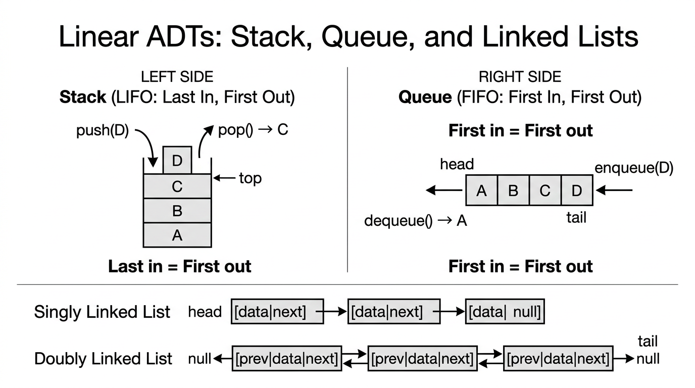

# Abstract Data Types — COMP0005 Algorithms

*Lecture-style notes. An **abstract data type (ADT)** describes *what* operations a collection supports and *how* they behave from the **user’s** perspective. A **data structure** is a **concrete** way to store data in memory so those operations can be implemented efficiently from the **implementer’s** perspective. Separating the two is central to modular software design and to reasoning about correctness vs performance.*

---

## 1. COMPLETE TOPIC SUMMARIES

### ADTs vs data structures — two viewpoints

| | **Abstract Data Type (ADT)** | **Data Structure** |
|---|------------------------------|---------------------|
| **Perspective** | **User** / client of the API | **Implementer** / library author |
| **Specifies** | **Behaviour**: allowed operations and their **meaning** (pre/post conditions, invariants) | **Representation**: how values are laid out in memory (arrays, pointers, trees, hash tables, …) |
| **Hides** | Implementation details | Nothing — this *is* the implementation |
| **Example** | “A **stack** supports `push`, `pop`, `isEmpty` with LIFO semantics” | “Implement the stack with a **resizing array** or a **linked list**” |

**Why it matters:** You can **swap implementations** (e.g. `ArrayList` vs `LinkedList` for a **list**-like ADT) without changing code that only uses the public operations — as long as the **semantics** stay the same.

> **Exam phrasing:** An ADT is a **contract**; a data structure is one **way to honour** that contract.

---

### ADT overview — linear collections

**Linear** ADTs organise elements in a **sequence** (there is a natural “first”, “next”, “last” story, even if access patterns differ).

*Stack (LIFO) operations push/pop at the top; Queue (FIFO) operations enqueue at tail, dequeue from head. Singly linked lists have one-way traversal; doubly linked lists support efficient deletion from any node.*

#### **Array ADT** (fixed size, indexable)

- **Idea:** A sequence of **\(n\)** slots, numbered **\(0, 1, \ldots, n-1\)**, each holding one element.
- **Typical operations:** **`get(i)`**, **`set(i, x)`** — random access by index.
- **Constraint:** Length is usually **fixed** at creation (unlike a dynamic list).

#### **List ADT** (dynamic, sequential)

- **Idea:** A **variable-length** ordered sequence; emphasis on **structure at the ends** and sequential traversal.
- **Typical operations:** **`append(x)`**, **`prepend(x)`**, **`head()`**, **`tail()`** (exact names vary by course/textbook; some courses also require **`insert`/`remove` at position**).
- **Contrast with array ADT:** Lists stress **growth** and **sequential** use; arrays stress **index** access.

#### **Stack ADT** (LIFO — last in, first out)

- **Operations:** **`push(x)`** adds **\(x\)** on top; **`pop()`** removes and returns the **most recently pushed** element; **`isEmpty()`** tests whether any element remains.
- **Invariant:** The element returned by **`pop`** is always the one most recently **`push`**ed among those still stored.

#### **Queue ADT** (FIFO — first in, first out)

- **Operations:** **`enqueue(x)`** adds **\(x\)** at the **back**; **`dequeue()`** removes and returns the element at the **front** (the **oldest** still waiting).
- **Invariant:** Order of removal matches order of insertion among items still in the queue.

#### **Priority queue ADT**

- **Operations:** **`enqueue(x, p)`** (or enqueue **\(x\)** with implicit priority) inserts an item; **`dequeue()`** removes an item with **highest priority** (or lowest, by convention — be consistent in an exam answer).
- **Contrast with queue:** **FIFO** is replaced by **priority order**; two items enqueued at different times may leave in **either** order depending on priority.

---

### ADT overview — non-linear collections

**Non-linear** ADTs are not modelled as a single left-to-right sequence with one obvious “next” for every element in the same way.

#### **Set** and **multiset (bag)**

- **Set:** Unordered collection of **distinct** elements.
- **Multiset (bag):** Unordered collection **allowing duplicates** (each value may appear more than once; “how many copies” is part of the state).
- **Typical operations:** **`insert(x)`**, **`remove(x)`**, **`contains(x)`** (and for bags, often **`count(x)`** in richer APIs).

#### **Map** (dictionary / associative array)

- **Idea:** Stores **(key → value)** pairs; each **key** appears **at most once**.
- **Typical operations:** **`insert(k, v)`**, **`remove(k)`**, **`update(k, v)`**, **`lookup(k)`** (sometimes **`insert`** and **`update`** are unified as “put”).
- **Use case:** Fast retrieval of a value **by key** rather than by integer index.

---

### Implementing ADTs — array data structure

An **array** (in the data-structure sense) is a contiguous block of memory holding **homogeneous** elements (same size per cell in the low-level picture).

#### **Array ADT on a plain array**

- **Addressing:** Cell **\(i\)** is found at **\(\text{base} + i \times \text{sizeOfElement}\)** (conceptually); hence **`get(i)`** and **`set(i, x)`** are **\(O(1)\)** **worst case** for a fixed array.

#### **Stack ADT on an array**

- Keep a **top index** (or size counter). **`push`** writes at **`top+1`** and increments; **`pop`** reads **`top`** and decrements. All **\(O(1)\)** **worst case** if space is already available.

#### **Queue ADT on an array — circular buffer**

- Naive dequeue (**shift everything left**) is **\(O(n)\)**. Instead, keep **head** and **tail** indices and treat the array as **circular** (wrap with modulo or explicit wrap logic). Then **enqueue** and **dequeue** are **\(O(1)\)** **worst case** per operation (given capacity).

#### **Resizing arrays (dynamic stack / list backing store)**

When the array is **full** and you need another **`push`:**

1. Allocate a new array of **double the capacity** (common choice).
2. **Copy** all elements to the new array.
3. Continue operations.

**Amortised analysis (sketch):** Doubling is expensive **occasionally**, but the copies are **rare** enough that **averaged over many pushes**, each push costs **\(O(1)\)** **amortised**.

**Shrinking (common policy):** When the array becomes **only \(\frac{1}{4}\) full** after a **`pop`**, **halve** the capacity (and copy). This keeps space **\(\Theta(n)\)** for **\(n\)** stored elements and preserves **\(O(1)\)** amortised for **both** push and pop under standard accounting.

**Capacity invariant (typical):** After each operation, the array is between **\(25\%\)** and **\(100\%\)** full (up to small constant slack right after resize), so you do not thrash between grow and shrink.

| | **Worst case (single op)** | **Amortised** |
|---|---------------------------|---------------|
| Push / pop with resize | **\(O(n)\)** when copy happens | **\(O(1)\)** |

---

### Implementing ADTs — linked lists

A **linked list** is a **dynamic** chain of **nodes**. Each node stores **payload data** and **link(s)** to neighbour(s). Lists are good when you need **frequent inserts/deletes** in the middle **given a pointer to the node** — but **random access by index** is generally slow.

#### **Singly linked list**

Each node: **`data`**, **`next`**.

| Operation | Idea | Typical time |
|-----------|------|----------------|
| **Append** (with **`tail`** pointer) | `tail.next = newNode`, move **`tail`** | **\(O(1)\)** |
| **Prepend** | `newNode.next = head`, `head = newNode` | **\(O(1)\)** |
| **Delete a known node** | Need **predecessor** to patch **`next`** | **\(O(n)\)** without predecessor pointer; **\(O(1)\)** if you already have predecessor |
| **Access \(i\)-th element** | Walk from **`head`** | **\(O(n)\)** |

#### **Doubly linked list**

Each node: **`data`**, **`prev`**, **`next`**.

- **Delete** (with pointer to node): patch **`prev.next`** and **`next.prev`** in **\(O(1)\)**.
- **Trade-off:** Extra memory per node and slightly more pointer bookkeeping.

#### **Stack via linked list**

- **`push`:** prepend (or append with tail) → **\(O(1)\)**.
- **`pop`:** remove head (or tail if doubly linked / with tail) → **\(O(1)\)**.

#### **Queue via linked list**

- **`enqueue`:** insert at tail → **\(O(1)\)** with tail pointer.
- **`dequeue`:** remove from head → **\(O(1)\)**.

---

### Other implementations — maps and priority queues

These ADTs are specified **abstractly**, but their **performance** depends heavily on representation.

| ADT | Naïve / simple backing | Better backing | Typical time (informal) |
|-----|------------------------|----------------|-------------------------|
| **Map** | Unsorted array: scan keys | **Hash table** | Unsorted array: **\(O(n)\)** per lookup; hash table: **\(O(1)\)** **average** |
| **Priority queue** | Unsorted array: scan for max/min | **Binary heap** | Array: **\(O(n)\)** dequeue; heap: **\(O(\log n)\)** enqueue/dequeue |

> **Exam caution:** **\(O(1)\)** for hash tables is almost always **average-case** under good hashing; **worst-case** collisions can degrade behaviour unless assumptions or fixes (e.g. balanced trees) are mentioned.

---

### Implementation summary table (course-style)

| ADT | Common implementations | Java examples |
|-----|------------------------|---------------|
| Array | array | `type[]` |
| List | array, linked list | `ArrayList`, `LinkedList` |
| Queue | array, linked list | `LinkedList` |
| Stack | array, linked list | `Stack`, `Deque` implementations |
| Set & Bag | hash table | `HashSet` |
| Map | hash table | `HashMap` |
| Priority Queue | heap | `PriorityQueue` |

*(Java class names are **illustrative** of common choices; your lecturer may prefer different interfaces.)*

---

## 2. EXAM-STYLE QUESTIONS (WITH MODEL ANSWERS)

### Q1 — ADT vs data structure

**Question.** Explain the difference between an **abstract data type** and a **data structure**. Give one example of the same ADT implemented with two different data structures.

**Model answer.** An **ADT** specifies **what operations** exist and their **behaviour** (the user’s view), without saying **how** they are implemented. A **data structure** is a **concrete representation** in memory (the implementer’s view). Example: the **stack ADT** (LIFO with **`push`/`pop`**) can be implemented with a **fixed/resizing array** (top index) or a **linked list** (insert/remove at one end). Both honour the same **abstract** contract; time/space trade-offs differ.

---

### Q2 — Queue with array without shifting

**Question.** Why is a **naïve array queue** that shifts all elements left on **`dequeue`** inefficient? Describe the **circular array** idea and state the **worst-case** time per **`enqueue`** and **`dequeue`** when capacity is sufficient.

**Model answer.** Shifting **\(n\)** elements costs **\(\Theta(n)\)** per **`dequeue`**, so **\(m\)** operations can cost **\(\Theta(mn)\)**. A **circular buffer** keeps **head** and **tail** indices; **`dequeue`** only advances **`head`** (with wrap-around), and **`enqueue`** writes at **`tail`** and advances **`tail`**. Each operation is **\(O(1)\)** **worst case** as long as no resize is needed. (If the array must grow, a separate analysis / amortised story applies.)

---

### Q3 — Linked list complexities

**Question.** For a **singly linked list** with pointers to **`head`** and **`tail`**, give **big-O** for: **(a)** prepend, **(b)** append, **(c)** access the element at index **\(i\)**, **(d)** delete a node when you only have a pointer to that node (not its predecessor).

**Model answer.** **(a)** **\(O(1)\)** — create node, point to old head, update head. **(b)** **\(O(1)\)** with **`tail`** — link old tail to new node, update tail. **(c)** **\(O(n)\)** — must walk **\(i\)** steps from head in the worst case. **(d)** **\(O(n)\)** in general — singly linked lists cannot unlink a node without the predecessor unless it is the head (special case); finding the predecessor requires a scan.

---

### Q4 — Resizing stack — amortised vs worst case

**Question.** A stack is implemented with a **dynamic array** that **doubles** when full. Argue that **`push`** is **\(O(1)\)** **amortised** even though a single **`push`** can trigger **\(\Theta(n)\)** copying. Mention why shrinking is usually **not** done immediately when the array becomes half full.

**Model answer.** Most pushes copy **nothing** and cost **\(\Theta(1)\)**. After a resize from capacity **\(n\)** to **\(2n\)**, the **expensive** push pays for copying **\(n\)** elements. Charging that cost across the **\(\Omega(n)\)** cheap pushes since the previous resize yields **\(O(1)\)** **amortised** per push (standard aggregate or accounting argument). If we **halved** whenever the array became **half full**, alternating push/pop near the threshold could trigger **\(\Theta(n)\)** work **every** operation; hence **shrink-on-quarter-full** (or similar hysteresis) is used so amortised bounds stay **\(O(1)\)**.

---

### Q5 — Map and priority queue implementations

**Question.** Compare implementing a **map ADT** with an **unsorted array** vs a **hash table**, and a **priority queue ADT** with an **unsorted array** vs a **heap**. Use **big-O** for **`lookup`** / **`dequeue`** as appropriate.

**Model answer.** **Map:** With an unsorted array, **`lookup(k)`** may scan all keys → **\(O(n)\)** worst case. A **hash table** maps keys with a hash function to buckets; **`lookup`** is **\(O(1)\)** **average** under good hashing and load-factor control (worst case can degrade if many collisions). **Priority queue:** With an unsorted array, **`dequeue`** must find the extremal priority → **\(O(n)\)**. With a **heap**, extract-min/max is **\(O(\log n)\)** (and insert typically **\(O(\log n)\)**).

---

## 3. MUST-KNOW KEY POINTS

- **ADT** = **behavioural** specification (operations + meaning); **data structure** = **concrete** realisation.
- **Linear ADTs:** array (indexed, fixed), list (dynamic sequence), stack (LIFO), queue (FIFO), priority queue (by priority).
- **Non-linear ADTs:** set vs **bag** (duplicates), **map** (unique keys → values).
- **Arrays:** contiguous, **\(O(1)\)** index access; **circular buffer** for **\(O(1)\)** queue ends; **doubling + halving on quarter** → **\(O(1)\)** amortised stack/list growth story; single op can still be **\(O(n)\)** worst case when copying.
- **Linked lists:** **\(O(1)\)** prepend/append with right pointers; **\(O(n)\)** **\(i\)**-th access; singly linked delete needs predecessor unless head.
- **Map / PQ:** simple array backing often **\(O(n)\)** for heavy ops; **hash table** / **heap** give the **standard** fast implementations (**average** vs **log** caveats).

---

## 4. HIGH-PRIORITY TOPICS

### 🔴 Must Know

- Definitions: **ADT** vs **data structure**; **LIFO** vs **FIFO**; **set** vs **multiset**
- **Array** addressing: **\(\text{base} + i \times \text{size}\)** → **\(O(1)\)** **`get`/`set`**
- **Circular array** queue: why it beats shifting; **\(O(1)\)** enqueue/dequeue (no resize)
- **Resizing array:** double on full; **amortised** **\(O(1)\)** push; **\(O(n)\)** worst-case single push
- **Shrink hysteresis:** **quarter-full** rule; avoids **\(\Theta(n)\)** per op thrashing
- **Singly vs doubly** linked list trade-offs for **delete** and **predecessor**
- **Map:** array **\(O(n)\)** lookup vs hash **\(O(1)\)** **average**
- **Priority queue:** array **\(O(n)\)** dequeue vs heap **\(O(\log n)\)**

### 🟡 Important

- **List** vs **array ADT**: dynamic/sequential vs fixed/indexed emphasis
- **Priority queue** semantics: **not** FIFO unless priorities tie in a specified way
- **Java** mapping table (recognise typical classes, not memorise every method name)
- **Homogeneous** contiguous memory vs **heterogeneous** linked nodes (conceptual; languages vary)
- **Worst vs amortised vs average** — which bound applies to which structure

### 🟢 Useful but Lower Priority

- **Alternative** list/map/PQ implementations (balanced BSTs, skip lists, etc.) as enrichment
- **Detailed** accounting method vs potential method for amortised analysis (if not examined)
- **Thread-safety**, iterator invalidation, and **API** design in real libraries

---

## 5. TOPIC INTERCONNECTIONS & BIGGER PICTURE

- **ADTs modularise** algorithms: e.g. **graph** algorithms often need a **queue** (BFS), **stack** (DFS), **priority queue** (Dijkstra / Prim).
- **Analysis of algorithms** attaches to **implementations**: the **same** ADT operation can be **\(O(1)\)** or **\(O(n)\)** depending on backing store — always ask **“which representation?”**
- **Sorting** connects to **priority queues**: **heapsort** is essentially **PQ sort** using a heap as the PQ implementation.
- **Hashing** (maps/sets) reuses ideas from **universal / good hash functions** and **load factors**; collision resolution ties to **lists** or **open addressing** (arrays again).
- **Memory hierarchy:** arrays are **cache-friendly** (contiguous access); linked lists can be **pointer-chasing** heavy — big-O is not the whole engineering story.
- **Abstract** specification + **concrete** implementation is the same design pattern behind **interfaces** and **classes** in OOP.

---

## 6. EXAM STRATEGY TIPS

- If a question names an **ADT**, **list the operations** and **invariants** first (e.g. **LIFO**), then discuss implementation — marks often go to **correct behaviour** before **complexity**.
- For **complexity**, state **worst / amortised / average** explicitly when relevant (especially **hash tables** and **resizing arrays**).
- **Queue + array** questions: mention **circular indices** and **why shifting fails**.
- **Linked list** questions: always check whether you have **`tail`**, **doubly linked** links, or a pointer to **predecessor** — these change **delete** and **append** answers.
- **Compare two implementations** using a **small table** (time for each core op, memory overhead, cache locality) — examiners like structured comparisons.
- When citing **Java** examples, treat them as **illustrative**; tie each back to the **underlying** data structure (**array**, **doubly linked**, **hash table**, **heap**).

---

*These notes align with standard COMP0005 treatments of ADTs and basic implementations; follow your lecturer’s exact operation lists and complexity conventions if they differ.*
