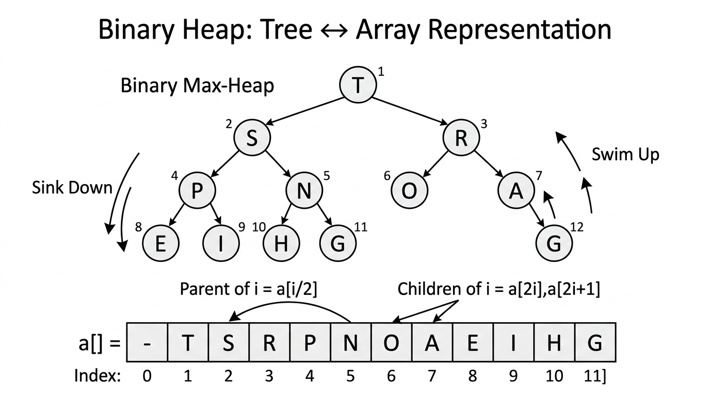

# Binary Heaps & HeapSort — COMP0005 Algorithms

*Lecture-style notes. A **binary heap** is a compact way to implement a **priority queue** and to sort **in place** with **\(O(N \log N)\)** worst-case performance. The same array stores the tree in **level order** with **no pointers** — mastery of **swim** and **sink** is central.*

---

## 1. COMPLETE TOPIC SUMMARIES

### Priority queues and the **“top M from a stream”** problem

**Motivation.** You receive a **stream** of **\(N\)** items and want the **\(M\)** **largest** (or smallest) items. You may **not** be able to store all **\(N\)** items at once — only **\(O(M)\)** memory is realistic.

**Abstract data type — priority queue (PQ).** Support at least:

- **Insert** a key.
- **Delete max** (for a **max-oriented** PQ) or **delete min** (for a **min-oriented** PQ).

For “**largest **\(M\)** in a stream**,” maintain a **min-heap** of size **\(M\)** (smallest of the top **\(M\)** sits at the root; evict it when something better arrives). The notes below focus on **max-heaps** for exposition; the same ideas flip for min-heaps.

**Implementation comparison** (finding **\(M\)** largest among **\(N\)** stream items, asymptotically):

| Implementation | Time | Space |
|----------------|------|-------|
| **Array & sort** | **\(O(N \log N)\)** per batch if you store all **\(N\)** | **\(O(N)\)** |
| **Elementary PQ** (e.g. unordered array, scan for max on delete) | **\(O(MN)\)** in a naive “insert + scan” pattern | **\(O(M)\)** |
| **Binary heap** | **\(O(N \log M)\)** with a heap of capacity **\(M\)** | **\(O(M)\)** |

**Intuition.** A heap keeps the “**best**” structure with **\(\log M\)**-depth operations instead of **\(O(M)\)** scans.

---

### **Binary tree** and **complete binary tree**

- **Binary tree:** each node has **at most two** children (often called **left** and **right**).
- **Complete binary tree:** every level is **fully filled** except possibly the **last** level; on the last level, nodes are packed **as far left as possible**.

**Height.** For a complete binary tree with **\(N\)** nodes, height is **\(\lfloor \log_2 N \rfloor\)** (equivalently **\(\Theta(\log N)\)**). Here **\(\log\)** is **base 2** unless your lecturer specifies otherwise — standard in algorithm analysis.

> **Why it matters:** Heap operations walk from a leaf toward the root (**swim**) or from the root toward a leaf (**sink**) — at most **tree height** steps.

---

### **Array representation** of a complete binary tree

**Convention used here:** array **`a`**, heap size **`N`** (number of active heap elements), indices **start at 0**.

Nodes are stored in **level order** (breadth-first): root, then its children left-to-right, then the next level, etc.

**Navigation with integer indices** (parent/child via arithmetic — **no explicit pointers**):

- **Parent** of node **`i`** (for **`i > 0`**): index **`⌊(i-1)/2⌋`** (integer division).
- **Left child** of **`i`**: **`2i + 1`** (if **`2i + 1 < N`**).
- **Right child** of **`i`**: **`2i + 2`** (if **`2i + 2 < N`**).

**Why complete trees?** They pack perfectly into an array with **no gaps** up to **`N`**, so **\(\Theta(N)\)** storage is tight and cache-friendly in principle (though **HeapSort** is still known for **mediocre cache behaviour** in practice compared to tuned Quicksort).

---

### **Binary heap** (**max-heap**)


*A max-heap stored as both a tree and an array in level order. In this note we use 0-based indexing: parent of node i is at a[(i-1)/2], children at a[2i+1] and a[2i+2]. Swim up restores heap order after insertion; sink down restores it after deletion.*

A **max-heap** is a **complete binary tree** satisfying **heap order**:

- **Heap order:** for every node **\(i>0\)**, **\(\texttt{a}[\lfloor (i-1)/2 \rfloor] \geq \texttt{a}[i]\)** — each parent’s key is **≥** both children’s keys.

**Consequences:**

- The **largest** key is always at **\(\texttt{a}[0]\)** (the **root**).
- The tree shape is fixed by **\(N\)**; only **values** violate order after an update — restored by **swim** or **sink**.

*(A **min-heap** reverses the inequality: parent **≤** children; root is **minimum**.)*

---

### **Heap operations**

#### **Insertion — swim up** (**swim**, sometimes **fix-up**)

**Idea:** Insert the new key at the **next free leaf** (position **`N+1`** after incrementing **`N`**), then **bubble up** recursively: if the node is larger than its parent, **swap** and recurse on the parent index.

**Pseudocode:**

```python
def enqueue(key):
    a[N] = key
    swim(N)
    N += 1

def swim(i):
    if i <= 0:
        return
    p = (i - 1) // 2
    if a[p] >= a[i]:
        return
    a[p], a[i] = a[i], a[p]
    swim(p)
```

**Cost:** Tree height is **\(O(\log N)\)**; each step does **\(O(1)\)** work and **one compare** with the parent → **at most** **\(1 + \lfloor \log_2 N \rfloor\)** **compares** in the usual counting model.

---

#### **Delete max — sink down** (**sink**, sometimes **fix-down**)

**Idea:** Save **\(\texttt{a}[0]\)**. Move the **last active** element to the root to keep a **complete** tree, shrink **`N`**, then **bubble down** recursively: swap with the **larger child** only if that child is larger, then recurse.

**Pseudocode:**

```python
def dequeue():
    max_key = a[0]
    N -= 1
    a[0], a[N] = a[N], a[0]
    a[N] = None  # optional: clear removed slot
    sink(0)
    return max_key

def sink(i):
    left = 2 * i + 1
    if left >= N:
        return
    j = left
    right = left + 1
    if right < N and a[j] < a[right]:
        j = right
    if a[i] >= a[j]:
        return
    a[i], a[j] = a[j], a[i]
    sink(j)
```

**Cost:** At each level you may compare with **two** children → **at most** **\(2 \lfloor \log_2 N \rfloor\)** **compares** in the worst case (still **\(O(\log N)\)**).

---

### **Implementation cost summary** (PQ of size M)

| Data structure | Insert | Delete max | Find max |
|----------------|--------|------------|----------|
| Unordered array | **\(O(1)\)** | **\(O(M)\)** | **\(O(M)\)** |
| Ordered array | **\(O(M)\)** | **\(O(1)\)** | **\(O(1)\)** |
| **Binary heap** | **\(O(\log M)\)** | **\(O(\log M)\)** | **\(O(1)\)** |

**Takeaway:** Heaps balance **fast inserts** and **fast delete-max** while keeping the maximum **instantly** at the root.

---

### **HeapSort**

**Goal:** Sort an array **in place** using heap structure.

**Two phases:**

1. **Heap construction** — rearrange **\(\texttt{a}[0..N-1]\)** into **max-heap order**.
2. **Sortdown** — repeatedly **remove the maximum** by swapping root with the end and **sinking** the new root into the smaller heap.

#### **Heap construction (bottom-up)**

**Key trick:** In a complete tree, nodes with indices **`⌊N/2⌋ .. N-1`** are **leaves** and already trivial heaps. For **`k`** from **`⌊N/2⌋ - 1`** **down to** **`0`**, run **`sink(k)`**.

```python
for k in range(N // 2 - 1, -1, -1):
    sink(k)
```

**Analysis surprise:** Total time is **\(O(N)\)** **compares/exchanges** (not **\(N \log N\)**). **Intuition:** Most nodes are near the bottom and only sink a **short** distance; a careful summation over levels gives **linear** total cost.

#### **Sortdown (top-down)**

Repeatedly move the current maximum to its final position at the end of the array:

```python
while N > 1:
    a[0], a[N - 1] = a[N - 1], a[0]
    N -= 1
    sink(0)
```

After the loop, the array is sorted **in ascending order** (if using a max-heap and this “largest to the back” strategy).

#### **Overall analysis and properties**

| Aspect | Statement |
|--------|-----------|
| **Heap construction** | **\(O(N)\)** compares/exchanges |
| **Total HeapSort** | **\(O(N \log N)\)** compares/exchanges |
| **In-place** | Yes (**\(O(1)\)** extra memory beyond the array, aside from recursion/stack if any) |
| **Worst case** | **\(O(N \log N)\)** — unlike basic Quicksort’s **\(O(N^2)\)** worst case |
| **Stable?** | **No** — long-distance swaps scramble equal keys |
| **Cache performance** | Often **poorer** than good Quicksort variants (non-sequential access pattern) |

---

### **Complete sorting comparison** (exam reference table)

| | In-place | Stable | Worst | Average | Best |
|---|:---:|:---:|---|---|---|
| **Selection** | ✓ | ✗ | **\(\sim N^2\)** | **\(\sim N^2\)** | **\(\sim N^2\)** |
| **Insertion** | ✓ | ✓ | **\(\sim N^2\)** | **\(\sim N^2\)** | **\(\sim N\)** |
| **MergeSort** | ✗ | ✓ | **\(\sim N \log N\)** | **\(\sim N \log N\)** | **\(\sim N \log N\)** |
| **QuickSort** | ✓ | ✗ | **\(\sim N^2\)** | **\(\sim N \log N\)** | **\(\sim N \log N\)** |
| **HeapSort** | ✓ | ✗ | **\(\sim N \log N\)** | **\(\sim N \log N\)** | **\(\sim N \log N\)** |

---

## 2. EXAM-STYLE QUESTIONS (WITH MODEL ANSWERS)

### Q1 — Parent/child indices

**Question.** In a 0-based heap array, what are the indices of the **parent**, **left child**, and **right child** of node **`i`**? What is the height of a **complete** binary tree with **\(N\)** nodes?

**Model answer.** **Parent:** **`⌊(i-1)/2⌋`** (for **`i ≥ 1`**). **Left child:** **`2i+1`**. **Right child:** **`2i+2`** (children exist only if their index **<** heap size **\(N\)**). Height is **\(\lfloor \log_2 N \rfloor\)**.

---

### Q2 — Trace **swim** or **sink**

**Question.** Starting from a valid max-heap on **`[9, 7, 8, 3, 5, 6]`**, suppose **`enqueue(10)`** appends **`10`** so the array becomes **`[9, 7, 8, 3, 5, 6, 10]`** with **`N = 7`**. List the **swaps** **`swim(6)`** performs until heap order is restored.

**Model answer.** **`10`** at index **`6`** has parent **`⌊(6-1)/2⌋ = 2`** (**`8`**). **`10 > 8`** → swap → **`[9, 7, 10, 3, 5, 6, 8]`**, **`i = 2`**. Parent of **`2`** is **`0`** (**`9`**). **`10 > 9`** → swap → **`[10, 7, 9, 3, 5, 6, 8]`**, **`i = 0`**. Stop at root. **Swaps:** **(6,2)** then **(2,0)**.

---

### Q3 — **HeapSort** phases and complexity

**Question.** Explain the two phases of **HeapSort** and state the **asymptotic** cost of **heap construction**, **sortdown**, and **overall**. Why is HeapSort **not stable**?

**Model answer.** **Phase 1 — build-heap:** for **`k`** from **`⌊N/2⌋ - 1`** down to **`0`**, **`sink(k)`**; **\(O(N)\)**. **Phase 2 — sortdown:** while **`N > 1`**, swap root with **`a[N-1]`**, decrement **`N`**, **`sink(0)`**; **\(O(N \log N)\)** because each of **\(N-1\)** extractions costs **\(O(\log N)\)**. **Total:** **\(O(N \log N)\)**. **Not stable** because swapping the root with distant positions reorders **equal** elements relative to each other.

---

### Q4 — Priority queue strategies for **top M**

**Question.** Compare **“store all **\(N\)**, sort”** vs **“binary heap of size **\(M\)**”** for finding the **\(M\)** largest items in a stream of **\(N\)** items. Give **time** and **space**.

**Model answer.** **Store-all + sort:** **\(O(N)\)** space; sorting costs **\(O(N \log N)\)** time (and you must hold everything). **Heap of size **\(M\)**:** **\(O(M)\)** space; each of **\(N\)** items does **\(O(\log M)\)** work → **\(O(N \log M)\)** time. When **\(M \ll N\)**, the heap wins on **memory** and often on **time** vs **\(N \log N\)**.

---

### Q5 — Unordered vs heap vs ordered array

**Question.** For a **max-oriented** priority queue storing **\(M\)** elements, contrast **unordered array**, **ordered array**, and **binary heap** for **insert**, **delete-max**, and **find-max** worst-case times.

**Model answer.** **Unordered array:** insert **\(O(1)\)**; find-max/delete-max **\(O(M)\)** (scan). **Ordered array** (e.g. descending): insert **\(O(M)\)** (shift to place); find-max **\(O(1)\)** at one end; delete-max **\(O(1)\)** if end is max and no shift needed (or **\(O(M)\)** if implemented with shift — typically **\(O(1)\)** for “remove first”). **Binary heap:** insert **\(O(\log M)\)**, delete-max **\(O(\log M)\)**, find-max **\(O(1)\)** (root). *(Exam-safe line: heap gives **logarithmic** updates + **constant** peek.)*

---

## 3. MUST-KNOW KEY POINTS

- **Complete binary tree** → **level-order** array; **0-based** indexing: parent **`⌊(i-1)/2⌋`**, children **`2i+1`**, **`2i+2`**.
- **Max-heap order:** parent **≥** children ⇒ **maximum at root** **`a[0]`**.
- **Insert:** append, then **`swim`** — **\(O(\log N)\)** compares (about **height**).
- **Delete max:** swap root with last active index, shrink heap, **`sink(0)`** — **\(O(\log N)\)**, up to **two** compares per level when choosing the larger child.
- **PQ costs:** heap achieves **\(O(\log M)\)** insert/delete-max and **\(O(1)\)** find-max.
- **HeapSort:** **bottom-up build** **\(O(N)\)** + **sortdown** **\(O(N \log N)\)** → **\(O(N \log N)\)** total; **in-place**, **worst-case** **\(N \log N\)**, **not stable**.
- **Contrast sorts:** HeapSort is **in-place** like Selection/Insertion/QuickSort but **unstable** like Selection/QuickSort; MergeSort is **stable** and **\(N \log N\)** but needs **linear extra space**.

---

## 4. HIGH-PRIORITY TOPICS

### 🔴 Must Know

- **Array indexing** for complete trees: **parent / left / right** formulas with **0-based** heaps.
- **Max-heap invariant** and **why** the maximum is at **\(\texttt{a}[0]\)**.
- **`swim`** vs **`sink`** — **when** each runs (insert vs delete-max).
- **Pseudocode** for **`swim`** and **`sink`** (including **choose larger child** in **`sink`**).
- **Heap construction** loop **`for k = N/2 - 1 downto 0`** and that it is **\(O(N)\)**.
- **Sortdown** loop and **\(O(N \log N)\)** **total** HeapSort time.
- **HeapSort properties:** **in-place**, **not stable**, **\(N \log N\)** worst case; **poor cache** relative to tuned Quicksort (qualitative).
- **PQ implementation table** (unordered vs ordered array vs heap).

### 🟡 Important

- **Streaming “top \(M\)”:** **\(O(N \log M)\)** time, **\(O(M)\)** space with a heap vs **\(N \log N\)**, **\(N\)** for store-and-sort.
- **Height** **\(\lfloor \log_2 N \rfloor\)** of a complete tree with **\(N\)** nodes.
- **Compare counts:** **swim** ~**height**, **sink** ~**\(2 \times\)** height worst case.
- **Sorting comparison table** (in-place / stable / best-worst-average).

### 🟢 Useful but Lower Priority

- **Min-heap** variant for **\(k\)** smallest or for **largest \(M\)** on a stream (min-heap of size **\(M\)** to retain the **\(M\)** largest).
- **Alternative conventions:** some texts still use 1-based heaps; convert carefully during exams if notation differs.
- **Why** bottom-up build is linear (layer-sum argument); **d-ary heaps** as generalisation.

---

## 5. TOPIC INTERCONNECTIONS & BIGGER PICTURE

- **Priority queues** underpin **Dijkstra’s algorithm**, **Prim’s MST**, **Huffman coding**, **event simulation**, and **scheduling** — anywhere you repeatedly need the **best** pending item.
- **Heaps** connect **trees** and **arrays**: the same ideas appear in **binary heaps**, **tournament selection**, and some **graph** traversals — **shape** is rigid, **order** is maintained locally.
- **HeapSort** completes the **comparison-sort** picture with **MergeSort** and **QuickSort**: all average/worst **\(\Theta(N \log N)\)** in standard models (QuickSort worst **\(O(N^2)\)** without randomisation/medians-of-three), but **different constants**, **stability**, and **memory**.
- **Lower bound** **\(\Omega(N \log N)\)** for comparison sorting still applies; HeapSort is **asymptotically optimal** in that model but **not stable** and often **beaten in practice** by Quicksort on arrays due to **cache** and **branch prediction**.
- **Selection** vs **HeapSort:** both move extremes into place, but HeapSort uses **heap structure** to find the next maximum in **\(O(\log N)\)** instead of **\(O(N)\)** scanning.

---

## 6. EXAM STRATEGY TIPS

- **Draw a small tree** (7–15 nodes) alongside the array; trace **`swim`**/**`sink`** on paper — index arithmetic errors are the main failure mode.
- If asked for **parent of** node **i**, restate **integer division** explicitly (**`⌊(i-1)/2⌋`**).
- **`sink`:** always mention **compare both children** and **swap with the larger** (unless ties are specified).
- **HeapSort:** separate **“build heap **\(O(N)\)**”** from **“**\(N\)** times delete-max **\(O(\log N)\)**”** → **\(O(N \log N)\)**; do **not** claim build-heap is **\(N \log N\)**.
- **Stability:** link to **long-distance swaps** in sortdown (equal keys can **cross**).
- **Complexity traps:** **unordered array** has **fast insert** but **slow delete-max**; **ordered array** flips the tradeoff; **heap** balances both to **logarithmic**.
- When a question says **“in-place”**, contrast **HeapSort/QuickSort/Insertion** with **MergeSort’s **\(\Theta(N)\)** auxiliary array**.

---

*These notes align with standard COMP0005 treatments of binary heaps and HeapSort; this page uses **0-based indexing**, and you should still follow your lecturer’s conventions for tie-breaking in **`sink`** and exact compare/exchange counts if they differ.*
