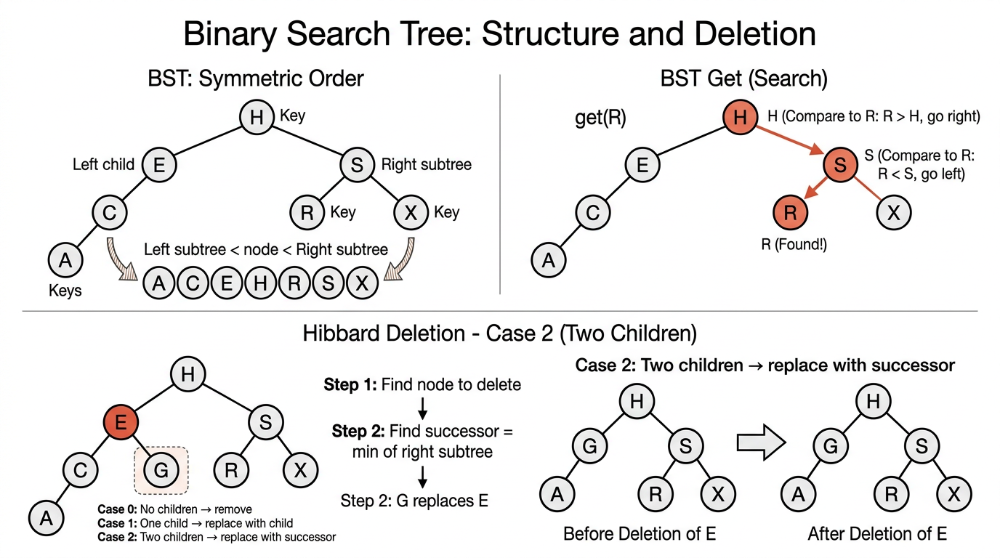

# Symbol Tables & Binary Search Trees — COMP0005 Algorithms (UCL)

*Lecture-style notes. A **symbol table** (dictionary / map) is one of the most used abstractions in computing. This topic connects **ordered data**, **search structures**, and the first **tree-based** implementation whose performance depends on **shape** — setting up balanced trees and hash tables later in the course.*

---

## 1. COMPLETE TOPIC SUMMARIES

### **Symbol Table ADT**

A **symbol table** stores **key–value pairs** and supports lookup and update by key. The same idea appears under many names: **associative array**, **dictionary**, or **map**.

**Core operations (minimal story):**

- **`put(key, value)`** — associate **`value`** with **`key`** (insert or overwrite).
- **`get(key)`** — return the value for **`key`**, or signal “not found”.

**Standard assumptions (as in typical COMP0005 treatments):**

- **Keys are unique** — at most one value per key at any time.
- **Values are non-null** — simplifies reasoning; “delete” is modeled by removing the key (or using a sentinel) rather than storing **`null`** as a value.
- **Keys are totally ordered** — you can compare any two keys with **`<`**, **`>`**, **`==`**. Formally, the order is **antisymmetric** (if **\(a \le b\)** and **\(b \le a\)** then **\(a = b\)**), **transitive**, and **total** (any two keys are comparable).

**Why order matters:** **Binary search** on arrays and **BST navigation** both need a consistent comparison rule. Without a total order, you cannot “go left or right” in a BST in a well-defined way.

**Typical applications:**

- **Dictionary** — word → definition.
- **Book index** — term → page list.
- **Web search** — query → ranked results (conceptually).
- **File systems** — path → metadata / inode.
- **Financial accounts** — account id → balance.

---

### **Elementary Implementations**

#### **Linked list & sequential search (unordered)**

Maintain an **unordered linked list** of nodes, each holding **`(key, value)`**.

- **`get(key)`** — scan the list until you find a matching key → **\(O(N)\)** in the worst case (and **\(\Theta(N)\)** if the key is absent and you must scan all).
- **`put(key, value)`** — scan: if the key exists, **update** the value; otherwise **insert** a new node (often at the **front** for **\(O(1)\)** physical insert after the scan) → **\(O(N)\)** because of the search.

**Pros:** Simple, **\(O(1)\)** extra memory beyond storing the pairs, easy inserts after locate. **Cons:** Search does not improve with **\(N\)** — unacceptable for large tables.

---

#### **Ordered array & binary search**

Keep **parallel arrays** **`keys[]`** and **`values[]`** with **`keys`** sorted in ascending order.

- **`get(key)`** — **binary search** on **`keys`** to find index **`i`** with **`keys[i] == key`**, then return **`values[i]`** → **\(O(\log N)\)** comparisons (and array accesses in typical implementations).
- **`put(key, value)`** — binary search to find the **insertion position**; if key exists, overwrite **`values[i]`**; else **shift** all elements from that index to the end rightward by one to make space (**insertion in a sorted array**) → **\(O(N)\)** in the worst case because shifting is linear.

**Pros:** **Fast search**, simple memory layout, cache-friendly for search. **Cons:** **Expensive updates** (insert/delete) due to shifting.

**Big picture:** You have traded **\(O(N)\)** search (list) for **\(O(\log N)\)** search (array), but **insert** remains **linear** unless you use a different structure.

---

### **Binary Search Tree (BST)**

A **binary search tree** is a **binary tree** where each node stores a **key** (and usually a **value**), and the keys satisfy **symmetric order**:

- Every key in the **left subtree** is **strictly less** than the node’s key.
- Every key in the **right subtree** is **strictly greater** than the node’s key.

Equivalently (and the phrasing you will see in lectures): each node’s key is **larger than all keys in its left subtree** and **smaller than all keys in its right subtree**. This global invariant is stronger than only comparing to the immediate children — it constrains **whole subtrees**.


*Left: BST symmetric order property (left < node < right) with in-order traversal giving sorted keys. Right: BST search follows comparisons down the tree. Bottom: Hibbard deletion for a node with two children — replace with the in-order successor.*

**Important:** Many different BST shapes can represent the **same set** of keys; **insertion order** determines shape.

---

### **BST node implementation (Python sketch)**

```python
class Node:
    def __init__(self, key, value):
        self.key = key
        self.value = value
        self.left = None
        self.right = None
```

The tree is referenced by a **root** pointer; an empty tree is **`None`**.

---

### **`get` (search)**

Start at the **root**. Compare **`key`** with **`node.key`**:

- **Equal** → **hit**; return **`node.value`**.
- **Less** → recurse / move to **`node.left`**.
- **Greater** → recurse / move to **`node.right`**.
- **`None`** reached → **miss**.

**Cost:** Proportional to **depth** of the node (or would-be leaf): **\(1 + \text{depth}\)** pointer hops / recursive calls in a simple model.

---

### **`put` (insert)**

Traverse **exactly like `get`**.

- If you find a node with the same key → **update** its value.
- If you fall off the tree (**`None`**) → **attach** a new **`Node(key, value)`** at the position where the search expected a child.

**Cost:** **\(1 + \text{depth}\)** to the insertion point.

---

### **BST shape and performance**

- **Best case (balanced):** height **\(\Theta(\log N)\)** → search/insert **\(\Theta(\log N)\)**.
- **Average case (random insertion order, informal):** height is **\(O(\log N)\)** with high probability; constants matter in practice.
- **Worst case:** keys inserted in sorted order → tree becomes a **“spine”** (like a linked list) → height **\(N-1\)** → **\(\Theta(N)\)** per operation.

**Exam mantra:** BST time is **\(O(h)\)** where **\(h\)** is **height**; **\(h\)** ranges from **\(\lfloor \log_2 N \rfloor\)** (best) to **\(N-1\)** (worst).

---

### **BST ordered operations**

Assuming **symmetric order**, you can support **order statistics** and **range reasoning**:

- **`min()`** — walk **left** until **`left`** is **`None`**; that node is the minimum key.
- **`max()`** — walk **right** until **`right`** is **`None`**.
- **In-order traversal** — recursively visit **left subtree**, then **current node**, then **right subtree**. This visits keys in **strictly ascending order** (for distinct keys).
- **`floor(k)`** — the **largest key in the tree that is \(\le k\)** (or “not found” if all keys are larger than **`k`**).
- **`ceiling(k)`** — the **smallest key that is \(\ge k\)**.

**How to think about floor/ceiling:** Walk like **`get`**, but carry a **candidate** answer when you take a turn that might still allow equality on the other side — classic exam trace material.

---

### **BST delete operations**

#### **Delete minimum (`delMin`)**

The minimum is the leftmost node. **Delete it** by:

- If **`node.left is None`**, this node is the minimum; **return `node.right`** (may be **`None`**) to splice out the node.
- Else **`node.left = delMin(node.left)`** and return **`node`**.

This preserves **symmetric order** because the minimum has **no left child**, so its right subtree (if any) contains only larger keys and can replace it.

```python
def delMin(node):
    if node.left is None:
        return node.right
    node.left = delMin(node.left)
    return node
```

---

#### **Hibbard deletion (general `delete`)**

Three structural cases when deleting the node **`x`** that holds **`key`**:

- **Case 0 — no children:** remove **`x`** (parent link becomes **`None`**).
- **Case 1 — one child:** replace **`x`** with its sole child (left or right).
- **Case 2 — two children:** let **`t`** be the node to delete. Find the **successor**: the **minimum node in `t.right`** (smallest key **greater than** **`t.key`**). That successor **`s`** has **no left child**. **Replace** **`t`**’s key/value with **`s`**’s, then **delete the old successor** from the right subtree using **`delMin(t.right)`** (or an equivalent splice).

**Why successor?** It is the **next** key in sorted order, so promoting it keeps **all left keys \(< s.key\)** and **all right keys \(> s.key\)** consistent with **symmetric order**.

```python
def delete(x, key):
    if x is None:
        return None
    if key < x.key:
        x.left = delete(x.left, key)
    elif key > x.key:
        x.right = delete(x.right, key)
    else:
        if x.right is None:
            return x.left
        if x.left is None:
            return x.right
        t = x
        x = min_node(t.right)   # successor: min of right subtree
        x.right = delMin(t.right)
        x.left = t.left
    return x
```

*(Here **`min_node`** is the helper that returns the node found by walking left; slide code often inlines that logic.)*

**Important caveat:** Repeated **Hibbard deletion** can **unbalance** the tree over long random operation sequences — average height may grow like **\(\Theta(\sqrt{N})\)** in some models, which is why the summary table quotes **\(\sqrt{N}\)** for **average delete** cost in a long-run shape sense. **Balanced BSTs** (later topic) fix this.

---

### **Performance summary (as in course tables)**

Let **\(N\)** be the number of keys.

| Structure | Worst search | Worst insert | Worst delete | Avg search | Avg insert | Avg delete |
|-----------|--------------|--------------|--------------|------------|------------|------------|
| Sequential search (unordered list) | **\(N\)** | **\(N\)** | **\(N\)** | **\(N/2\)** | **\(N\)** | **\(N/2\)** |
| Binary search (ordered array) | **\(\lg N\)** | **\(N\)** | **\(N\)** | **\(\lg N\)** | **\(N/2\)** | **\(N/2\)** |
| BST | **\(N\)** | **\(N\)** | **\(N\)** | **\(c \log N\)*** | **\(c \log N\)*** | **\(\sqrt{N}\)**† |

\* **“Average”** here assumes **random insertion order** / good shapes; constants **\(c\)** absorb base-2 vs natural log factors depending on the lecturer’s convention.

† **Hibbard deletion** can **skew** the tree over time; **\(\sqrt{N}\)** is the **order of average height** (hence search/insert cost) after **many random insert/delete** operations in standard textbook analyses — not a hard **\(O(\sqrt{N})\)** for a single delete step, but a **long-run structural** warning.

---

## 2. EXAM-STYLE QUESTIONS (WITH MODEL ANSWERS)

### Q1 — Symmetric order

**Question.** Insert keys **`10, 5, 15, 3, 7`** into an initially empty BST (standard **`put`**). Draw the tree. Then state whether a BST with keys **`{3,5,7,10,15}`** must have this shape.

**Model answer.** Standard insertion yields root **`10`**, left **`5`**, right **`15`**, **`3`** and **`7`** as left/right children of **`5`**. Many shapes are possible for the **same multiset** of keys — e.g. root **`7`** with different left/right splits — so the tree is **not unique**; only **in-order order** of keys is forced (here **\(3<5<7<10<15\)**).

---

### Q2 — `get` and `put` cost

**Question.** Explain why BST **`get`** and **`put`** are **\(O(h)\)** where **\(h\)** is height. Give an insertion order of keys **`1..N`** that forces **\(h = N-1\)**.

**Model answer.** Each step moves one level down (left or right) until hit or **`None`** — at most **\(h+1\)** nodes on a root-to-leaf path. Sorted insertion order **`1,2,3,\ldots,N`** (or reverse) produces a **right-only** (or **left-only**) chain, so **\(h = N-1\)** and operations are **\(\Theta(N)\)**.

---

### Q3 — Ordered operations

**Question.** Define **`floor(k)`** and **`ceiling(k)`** for a BST with **distinct** keys. For the tree in Q1, what are **`floor(6)`** and **`ceiling(6)`**?

**Model answer.** **`floor(k)`** is the **largest** stored key **\(\le k\)**; **`ceiling(k)`** is the **smallest** stored key **\(\ge k\)**. In that tree, **`floor(6)=5`**, **`ceiling(6)=7`**.

---

### Q4 — Hibbard delete trace

**Question.** Delete **`5`** from the BST of Q1 using **Hibbard deletion**. Show the successor choice and the resulting tree.

**Model answer.** Node **`5`** has two children; successor is **min of right subtree** → **`7`**. Replace **`5`** by **`7`**, then **`delMin`** on old right subtree removes the old **`7`** node (its left is **`None`**, splice in its right, here **`None`**). Result: root **`10`**, left child **`7`** with left **`3`**, right **`15`**. Keys remain **\(3<7<10<15\)**; **symmetric order** holds.

---

### Q5 — Array vs BST trade-offs

**Question.** Compare **ordered array + binary search** vs **BST** for **`get`**, **`put`**, and **memory**, in big-O terms.

**Model answer.** **Search:** both **\(O(\log N)\)** in the best/array case and **balanced** BST case; BST worst **\(O(N)\)** vs array **\(O(\log N)\)**. **Insert:** array **\(O(N)\)** due to shifting; BST **\(O(h)\)** — **\(O(\log N)\)** balanced, **\(O(N)\)** skewed. **Memory:** array stores two parallel arrays tightly; BST stores **pointers** per node (**extra space** for links) but **no shifting** on insert. **Takeaway:** arrays win **static** search-heavy workloads; BSTs win **dynamic** insert/delete **if** height stays small — hence **balancing** later.

---

## 3. MUST-KNOW KEY POINTS

- **Symbol table** = **key → value** with **`get` / `put`**; keys **unique**, values **non-null**, keys **totally ordered**.
- **Unordered list:** **`get`**, **`put`** **\(O(N)\)** (search dominates).
- **Ordered array:** **`get`** **\(O(\log N)\)** via **binary search**; **`put`** **\(O(N)\)** due to **shifting**.
- **BST invariant:** **symmetric order** — all left keys **\(<\)** node key **\(<\)** all right keys (subtree-level statement).
- **`get` / `put`** follow the same path; cost **\(O(h)\)**.
- **Shape depends on insertion order**; sorted insertion → **height \(N-1\)**.
- **In-order traversal** outputs keys in **sorted order**.
- **`min` / `max`**: extreme left / right walks.
- **`floor` / `ceiling`**: definitions + **search with candidate** pattern.
- **`delMin`**: splice **minimum** (no left child) by returning **right** link.
- **Hibbard delete (two children):** **successor = min of right subtree**, copy, **`delMin`** on right.
- **Performance table:** know **worst vs average** rows; **Hibbard** → **long-run imbalance** (**\(\sqrt{N}\)** average height story).

---

## 4. HIGH-PRIORITY TOPICS

### 🔴 Must Know

- **ADT:** **`put`**, **`get`**, assumptions on keys/values/order
- **List vs ordered array:** which operation is **\(O(\log N)\)** vs **\(O(N)\)** and **why** (scan vs binary search vs shift)
- **BST symmetric order** (subtree formulation, not just parent/child)
- **`get` / `put` tracing** on small trees
- **Height **\(h\)** drives cost:** best **\(\Theta(\log N)\)**, worst **\(\Theta(N)\)**
- **In-order traversal → sorted keys**
- **`delMin`** and **Hibbard** three cases; **successor** rule
- **Summary table** (search/insert/delete worst and typical averages)

### 🟡 Important

- **`floor` / `ceiling`** definitions and **small traces**
- **Non-uniqueness** of BST shape for a fixed key set
- **Why successor works** in deletion (next in sort order)
- **Pointer / object overhead** of BST vs **compact arrays**
- **Applications** list (dictionary, index, file system, accounts) — one-sentence each

### 🟢 Useful but Lower Priority

- **Formal order axioms** (antisymmetry, transitivity, totality) — recognise names
- **Exact constants** in “**\(c \log N\)**” average-case statements
- **Detailed proofs** of **\(\sqrt{N}\)** height under random Hibbard deletion (know **qualitative** lesson: **unbalanced over time**)
- **Predecessor-based** deletion variant (symmetric to successor) as enrichment

---

## 5. TOPIC INTERCONNECTIONS & BIGGER PICTURE

- **Binary search** on a sorted array and **BST search** are the same **decision pattern**: each comparison **eliminates half** of the remaining possibilities **only when the structure is balanced** — arrays enforce **dense** order; BSTs encode order in **links**.
- **Elementary sorts** and **in-order BST traversal** both connect to **sorted order**; merging sorted sequences (MergeSort) is a different “order” idea but trains the same muscle: **invariants** about sorted segments.
- **This unit is the bridge** from **fixed-size / shifting** structures to **pointer-based** structures whose analysis needs **tree height**.
- **Failure mode (skew)** motivates **balanced BSTs** (AVL, red-black, B-trees) and **hash tables** — different ways to restore **\(O(\log N)\)** or **\(O(1)\)** expectations.
- **Symbol tables** underpin **sets** (ignore values or use trivial values), **graphs** (adjacency maps), **compilers** (symbol environments), and **databases** (indexes).

---

## 6. EXAM STRATEGY TIPS

- **Trace first, formula second:** For BST questions, **draw the tree** after each **`put`** or **`delete`** — marks follow the **correct shape**.
- **State the invariant:** When asked “why is this still a BST?”, cite **symmetric order** on **subtrees**, not just local parent checks.
- **Deletion:** Name the **case** (0/1/2 children) before executing **Hibbard**; explicitly identify **successor** as **min of right subtree**.
- **Complexity:** Always tie BST running time to **\(h\)**; then give **\(h=\Theta(\log N)\)** vs **\(h=\Theta(N)\)** scenarios.
- **Compare structures** using the **table**: examiners like “**ordered array vs BST**” for **dynamic** vs **static** workloads.
- **Floor/ceiling:** If confused, **list keys in sorted order** from an **in-order walk** and read off answers — fast sanity check.

---

*These notes align with standard COMP0005-style treatments of symbol tables and BSTs (Sedgewick/Wayne-flavoured). Follow your lecturer’s exact conventions for **\(\log\)** base, “average case” assumptions, and the **\(\sqrt{N}\)** Hibbard-deletion remark if their slides differ.*
