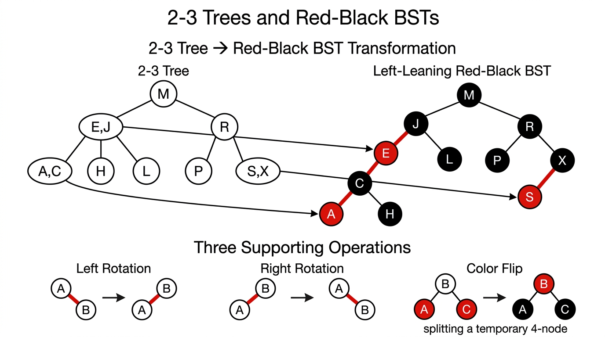
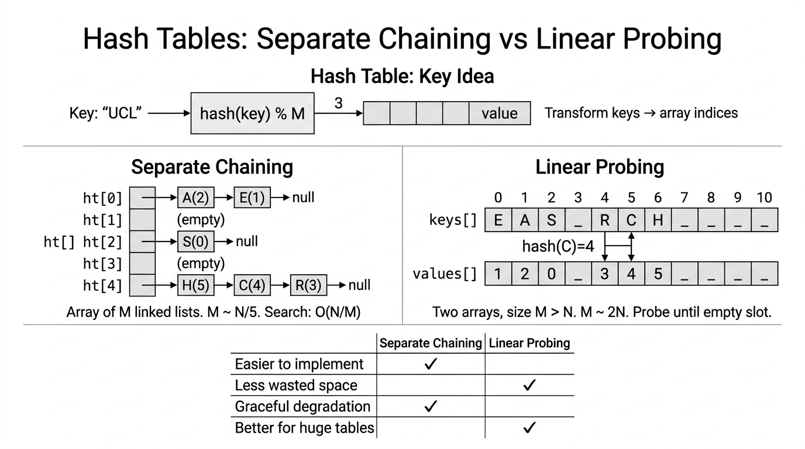

# Balanced Search Trees & Hash Tables — COMP0005 Algorithms

*Lecture-style notes. **2-3 trees** and **left-leaning red–black BSTs (LLRB)** guarantee **logarithmic** height so symbol-table operations stay predictable. **Hash tables** trade **ordering** for **expected constant-time** access when **\(M\)** is chosen well and the **hash function** spreads keys evenly.*

---

## 1. COMPLETE TOPIC SUMMARIES

### **2-3 search trees**

**Structure.** Each internal node is either:

- a **2-node**: **one** key and **two** children (subtrees for keys **less than**, **between**, or **greater than** that key — standard BST partitioning extended naturally), or  
- a **3-node**: **two** ordered keys and **three** children (partitioning into three key ranges).

**Invariants** (both must hold):

1. **Symmetric order:** an **in-order traversal** visits keys in **strictly ascending** order (same “BST ordering” idea, generalized to 3-nodes).  
2. **Perfect balance:** **every** root-to-**null** path has the **same length** — all leaves are at the same depth (external tree height is uniform).

**Search.** Compare the query key with the key(s) in the current node and recurse into the **one** subtree that can contain it — same “decision at a node, then go deeper” pattern as a BST, with one extra branch case for 3-nodes.

**Insert — Case 1 (into a 2-node at the bottom).** The new key fits into an existing 2-node: **promote** it to a **3-node** by storing **two** keys in that node (still **local**, no structural change above).

**Insert — Case 2 (into a 3-node at the bottom).** The naive step would create a **4-node** (three keys, four children). That is **not** allowed in the final tree, so we **split**:

1. Temporarily treat the node as a **4-node** (three keys).  
2. **Move the middle key up** into the **parent**, and replace the overloaded node by **two** **2-nodes** holding the remaining keys as children.  
3. If the parent **also** becomes overloaded (a 4-node), **repeat** the split **upward**.  
4. If the **root** becomes a 4-node, split it: the tree **grows in height** by one (new root holds the promoted middle key).

**Locality.** Splitting a 4-node uses only **constant** work at that level (pointer rewiring and key moves) — it is a **local** transformation; propagation upward is **\(O(h)\)** where **\(h\)** is height.

**Height bounds** (for **\(N\)** keys):

- **Worst case (all 2-nodes):** height **\(\le \lfloor \log_2 N \rfloor\)** — behaves like a **perfectly balanced** binary tree, so **\(h = O(\log N)\)**.  
- **Best case (as many 3-nodes as possible):** fewer nodes per level → height **\(\le \lfloor \log_3 N \rfloor\)** (still **\(\Theta(\log N)\)**).

**Performance guarantee.** Search, insert, and delete (with analogous splits/merges as taught) are **\(O(\log N)\)** — more precisely **\(c \log N\)** for a small constant **\(c\)**, with **no** pathological **\(N\)**-deep skewed shape as in an unbalanced BST.

---

### **Red–black BST (left-leaning) — encoding a 2-3 tree as a BST**

**Key idea.** A **2-3 tree** is conceptually clean but awkward to implement directly. A **left-leaning red–black BST (LLRB)** represents the same **2-3** structure using **only** **binary** nodes plus **edge colors**.

**Correspondence.** A **3-node** in the 2-3 tree becomes **two** **2-nodes** in a BST, joined by an internal **red** link. **Convention:** that red link **leans left** (the **smaller** key is the **parent** of the **larger** key via a **left** red child).


*Left: a 2-3 search tree with perfect balance. Right: the corresponding Left-Leaning Red-Black BST where 3-nodes become two nodes connected by a red (left-leaning) link. Bottom: the three supporting operations — left rotation, right rotation, and color flip.*

**LLRB invariants** (left-leaning red–black BST):

1. **Black balance:** every path from the **root** to **null** uses the **same number of black links** — think “every 2-3 node contributes one **black** step down the conceptual tree.”  
2. **No double-red:** no node has **two** red links to its children (that would encode a disallowed **4-node**).  
3. **Left-leaning reds:** **red** edges are **left** edges only (no right-leaning red links in the final representation).

**1–1 correspondence** (up to rotation choices in some presentations): **2-3 trees** \(\leftrightarrow\) **LLRB BSTs** — same abstract set of shapes/operations, different concrete layout.

**Search.** **Identical** to ordinary **BST search** — **ignore colors**; they exist only to preserve balance on **updates**.

**Interactive demo (browser).** Step through inserts and LLRB fix-ups in an [LLRB tree visualiser](../demos/llrb-visualiser/index.html) (static page for this site — same behaviour as the local Python `llrb_visualiser_web.py` tool).

**Storing color.** Typically: **each node** stores the color of the **incoming** link from its **parent** (**RED** = true, **BLACK** = false); **null** links are treated as **BLACK**.

---

#### **Supporting operations (LLRB)**

**Left rotation** — makes a **right-leaning** red link **left-leaning**:

```python
def rotateLeft(n):
    x = n.right
    n.right = x.left
    x.left = n
    x.color = n.color
    n.color = RED
    return x
```

**Right rotation** — temporarily rotates a **left** red link the other way (used to fix **two reds in a row** on the left).

**Color flip** — when a node’s **two** children are both connected by **red** links, recolor to simulate **splitting** a **4-node** in the 2-3 view: **parent** becomes **RED**, **both children** become **BLACK** (exact roles match the lecture’s “temporary 4-node” story).

---

#### **Insert (LLRB) — bottom-up fix-up**

**Case 1 — bottom 2-node.** Standard BST insert; attach new node with a **RED** link to its parent; if the red is on the **right**, **rotate left** at the parent so reds **lean left**.

**Case 2 — bottom 3-node.** After inserting **RED**, local transforms may create a **4-node** pattern (two reds in a row or two red children). Apply **rotations** and **color flips** so the 2-3 invariants are restored; a **red** may **propagate** upward — repeat fix-up on the way **up** (in recursive implementations, this happens **after** recursive calls return).

**Three fix-up rules** (applied in order, e.g. after recursive `put`):

1. **Right red, left black:** **`rotateLeft(n)`** — enforce left-leaning.  
2. **Left red and left-left red:** **`rotateRight(n)`** — break **two consecutive left reds**.  
3. **Both children red:** **`flipColors(n)`** — split the **4-node**, may push red to parent.

**Sketch (recursive `put`):**

```python
def put(n, key, value):
    if n == null: return Node(key, value, RED)
    # BST insert: compare key with n.key, recurse left or right, assign result
    if isRed(n.right) and not isRed(n.left): n = rotateLeft(n)
    if isRed(n.left) and isRed(n.left.left): n = rotateRight(n)
    if isRed(n.left) and isRed(n.right): flipColors(n)
    return n
```

*(Real code also updates subtree sizes, handles updates to existing keys, and often forces the **root** **BLACK** after insertion.)*

---

#### **Performance (LLRB)**

- **Height:** worst case **\(\le 2 \log_2 N\)** — at most **twice** the optimal BST height (red links can “double” steps between black levels).  
- **Worst-case** search / insert / delete: **\(O(\log N)\)** with constant **\(2 \log N\)** style bound.  
- **Average** (typical random-ish inputs): often close to **\(1 \cdot \log N\)** behaviour — still **\(O(\log N)\)**.

---

### **Hash tables — array + hash function**

**Key idea.** Implement a **symbol table** with a **direct-addressing** flavour: map keys to indices **\(0, 1, \ldots, M-1\)** in an array via a **hash function** **\(h(\text{key})\)**.

**Hash function goals:**

- **Deterministic:** same key → same index.  
- **Fast** to compute.  
- **Spreads keys uniformly** over **\(0..M-1\)** to **minimize collisions** (in practice, as uniform as practical for the key domain).

**Space–time trade-off.** Larger **\(M\)** → fewer collisions / shorter chains / less clustering, but **more** memory.

**Common choice — modular hashing** with **hash table size \(M\)** often **prime** (reduces certain arithmetic patterns of clustering):

- **Integer key:** e.g. **`abs(n) % M`** (watch language-specific overflow/sign issues in real code).  
- **String key (Horner-style rolling hash):** for characters **\(s_0,\ldots,s_{k-1}\)** and radix **\(R\)** (e.g. **\(R = 31\)**):

\[
h \leftarrow 0;\quad h \leftarrow (R \cdot h + s[i]) \bmod M \quad \text{for each character } s[i].
\]

---

### **Separate chaining**

**Structure.** Array of **\(M\)** **buckets**; each bucket is a **linked list** (or other collection) of **key–value** pairs. Typically **\(M \ll N\)** (many keys, modest bucket count).

**Insert (`put`).** Compute **\(i = h(\text{key})\)**; insert the pair at the **front** of list **\(i\)** (often **\(O(1)\)** if you don’t check duplicates first).

**Search (`get`).** Compute **\(i\)**, **scan** list **\(i\)** linearly for a matching key.

**Cost model.** Under **simple uniform hashing** (idealisation), expected **chain length** is **\(\alpha = N/M\)** (**load factor**). Time scales with **chain length** → keep **\(\alpha\)** **bounded** (e.g. **\(M \approx N/5\)** as a rule-of-thumb lecture figure) for **expected constant** time per op.

**Pseudocode (illustrative):**

```text
get(key):
    i = hash(key)
    for each node x in bucket[i]:
        if x.key == key: return x.value
    return null

put(key, value):
    i = hash(key)
    insert (key, value) at front of bucket[i]  // or update if key exists
```

---

### **Linear probing (open addressing)**

**Structure.** One array (or parallel **keys** / **values** arrays) of size **\(M\)**, **\(M > N\)**. **No** per-bucket lists; **empty slots** are part of the probing sequence.

**Insert.** Let **\(i = h(\text{key})\)**. If slot **\(i\)** is free, place it there; else try **\((i+1) \bmod M\)**, **\((i+2) \bmod M\)**, … until an empty slot (**linear probing**).

**Search.** Start at **\(i\)**; if occupied by a different key, continue **\(i+1, i+2, \ldots\)** until **empty** (key absent) or match.

**Clustering.** Primary clustering: long runs of occupied slots build up; performance depends strongly on **load** **\(N/M\)**. Lecture rule of thumb: when the table is about **half full**, **mean displacement** is around **\(3/2\)** (model-dependent; remember the **qualitative** point: keep load **well below 1**). Often take **\(M \approx 2N\)** to keep operations **expected constant-time** in practice.

**Worst case.** If the table fills or hashes cluster badly, degrades toward **\(O(N)\)** scans.

---


*Separate chaining stores collisions in linked lists at each array index. Linear probing uses open addressing — on collision, probe the next slot. Both achieve constant-time average operations with appropriate table sizing.*

### **Separate chaining vs linear probing**

| | **Separate chaining** | **Linear probing** |
|---|------------------------|---------------------|
| **Implementation** | Often **easier** (lists are forgiving) | Tighter memory, but **empty slots** and **deletion** need care |
| **Degradation** | **Graceful** — long lists hurt but no rigid probe chains | **Sensitive** to clustering; can become bad if overloaded |
| **Hash quality** | **Less sensitive** — a few bad buckets are local | **More sensitive** — clustering amplifies poor spread |
| **Scale / cache** | Pointer chasing in lists | **Better locality** in one array for **huge** tables (when load is sane) |

---

### **Hash tables vs balanced search trees**

| | **Hash table** | **Balanced BST / 2-3 / LLRB** |
|---|----------------|------------------------------|
| **Typical time** | **Expected** **\(O(1)\)** with good **\(M\)** and hash | **Worst-case** **\(O(\log N)\)** |
| **Ordered ops** | **No** efficient `min`, `max`, `rank`, `range` | **Yes** — inherits **BST order** |
| **Keys** | Must design **hash**; equality-based | **Comparable** keys (`compareTo`) |
| **Guarantees** | Probabilistic / depends on **\(M\)** and data | **Deterministic** logarithmic height |
| **Code complexity** | Often **simpler** for basic `get`/`put` | More moving parts (rotations / splits) |

---

### **Full performance summary** (lecture-style bounds)

| Structure | Worst search | Worst insert | Avg search | Avg insert |
|-----------|--------------|--------------|------------|------------|
| **Sequential search** | **\(N\)** | **\(N\)** | **\(N/2\)** | **\(N\)** |
| **Binary search (sorted array)** | **\(\lg N\)** | **\(N\)** | **\(\lg N\)** | **\(N/2\)** |
| **BST** | **\(N\)** | **\(N\)** | **\(c \lg N\)** | **\(c \lg N\)** |
| **2-3 tree** | **\(c \lg N\)** | **\(c \lg N\)** | **\(c \lg N\)** | **\(c \lg N\)** |
| **LLRB BST** | **\(2 \lg N\)** | **\(2 \lg N\)** | **\(1 \lg N\)** | **\(1 \lg N\)** |
| **Hash (separate chaining)** | **\(\lg N\)**† | **\(\lg N\)**† | **\(3\text{–}5\)**‡ | **\(3\text{–}5\)**‡ |
| **Hash (linear probing)** | **\(N\)** | **\(N\)** | **\(3\text{–}5\)**‡ | **\(3\text{–}5\)**‡ |

† *Pathological worst cases (e.g. all keys in one chain, or full/clusters table) — not the usual “expected \(O(1)\)” story.*  
‡ *Typical **array accesses** / **probes** per operation under good **\(M\)** and load — as in Sedgewick/Wayne-style engineering tables; asymptotics remain **\(O(N/M)\)** chaining or probe length linear in load under idealised models.*

---

## 2. EXAM-STYLE QUESTIONS (WITH MODEL ANSWERS)

### **Q1 — 2-3 tree invariants**

**Question.** State the **two global invariants** of a **2-3 search tree** and briefly explain why each is necessary for correct **search** and **\(O(\log N)\)** height.

**Model answer.**

1. **Symmetric order:** keys in any node split the key space so that an **in-order traversal** lists all keys in **sorted order**. This is exactly what makes **search** a single-path descent (you always know which child can hold the key).  
2. **Perfect balance:** all root-to-null paths have equal length, so the tree cannot degenerate to a chain — height is **\(\Theta(\log N)\)**, giving **logarithmic** worst-case search/insert.

---

### **Q2 — 4-node split**

**Question.** When inserting into a **3-node leaf** in a 2-3 tree, why do we temporarily form a **4-node** and then **promote the middle key**? What happens if the **root** splits?

**Model answer.** A legal 2-3 node holds at most **two** keys. Inserting into a full 3-node would hold **three** keys — a **4-node**. We **split** it by sending the **middle** key to the **parent** so the remaining keys form **two** valid **2-nodes** as children; this preserves **symmetric order** and **balance** locally. If the **root** becomes a 4-node and splits, the promoted middle key becomes a **new root**, and the **tree height increases by one** — the only way height grows.

---

### **Q3 — LLRB invariants and search**

**Question.** List the **three LLRB invariants** and explain whether **search** uses **red/black** information.

**Model answer.** (1) **Black balance:** equal **black** links on every root-to-null path. (2) **No double-red:** a node cannot have **two red** children. (3) **Left-leaning:** **red** links are **left** links. **Search** does **not** use colors — it is standard **BST search**; colors are only for maintaining balance during **insert/delete** transformations.

---

### **Q4 — Separate chaining vs linear probing**

**Question.** Compare **separate chaining** and **linear probing** with respect to **ease of implementation**, **sensitivity to poor hash functions**, and **memory locality**.

**Model answer.** **Separate chaining** is usually **easier** (append to lists; deletion straightforward); it **degrades gracefully** because collisions only lengthen **local** lists, so it is **less sensitive** to a mediocre hash. **Linear probing** uses **less** extra structure and can have **better cache locality** in one big array for huge tables, but it **clusters** and is **more sensitive** to hash quality and **high load**; **deletion** requires care (often **lazy deletion**).

---

### **Q5 — Hash table vs balanced tree for ordered operations**

**Question.** Your application needs **`floor(key)`** (largest key \(\le\) query) and **range iteration** in sorted order. Should you use a **hash table** or a **balanced BST**? Why?

**Model answer.** Use a **balanced BST** (or similar ordered structure). **Hash tables** scatter keys by **hash** — they do **not** maintain **sorted order** between buckets, so **order-statistics** and **range queries** are not supported efficiently. A **BST** (especially **balanced**) maintains **symmetric order**, so **in-order traversal** and **tree navigation** implement **ordered** operations in **\(O(\log N)\)** per step (plus output size for ranges).

---

## 3. MUST-KNOW KEY POINTS

- **2-3 tree:** **2-node / 3-node** shapes; **symmetric order** + **perfect balance**; insert via **temporary 4-node** + **promote middle** + propagate; splits are **local**; height **\(O(\log N)\)** (**\(\le \log_2 N\)** worst, **\(\le \log_3 N\)** best).  
- **LLRB:** **encodes 2-3** as a **BST** with **red left links** for **3-nodes**; **three invariants** (black balance, no double-red, left-leaning); **search = BST**; **rotate left/right** + **color flip** implement **insert** fix-up.  
- **LLRB height:** **\(\le 2 \log N\)** worst; **~\(\log N\)** typical.  
- **Hashing:** **\(h(key) \in \{0,\ldots,M-1\}\)**; want **deterministic**, **fast**, **uniform**; **modular** hashing; strings via **Horner** **\(\bmod M\)**.  
- **Separate chaining:** **\(N/M\)** expected chain length; **\(M \sim N/5\)** rule of thumb for “constant-ish” performance.  
- **Linear probing:** probe **\(i, i+1, \ldots\)**; **clustering**; keep load **moderate** (**\(M \sim 2N\)** lecture thumb); **worst** can be **\(O(N)\)**.  
- **Comparison:** hashes **fast unordered** symbol table; trees **ordered ops** + **worst-case** **\(\log N\)** guarantees.

---

## 4. HIGH-PRIORITY TOPICS

### **🔴 Must know**

- 2-3 tree **invariants** and **insert split** (4-node → promote middle → height grows at root).  
- LLRB **meaning of red links** (3-node encoding) and the **three invariants**.  
- The **three insert fix-up rules** (left-rotate if right-red; right-rotate if two left reds; flip if both children red) and **why** they correspond to **2-3** operations.  
- Hash table **separate chaining** vs **linear probing** — mechanics, **load factor**, **clustering**.  
- **When hash tables fail** for **ordered** queries vs **when trees win**.  
- The **performance summary table** — **BST worst \(N\)** vs **balanced \(\log N\)** vs **hash expected constant** with caveats.

### **🟡 Important**

- **rotateLeft** code-level effect (pivot, recolor).  
- **Height bounds** **\(\log_2 N\)** vs **\(\log_3 N\)** for 2-3; **\(2 \log N\)** for LLRB.  
- **String hashing** formula and **why prime \(M\)** is used.  
- **Worst-case hash** behaviour (all keys same bucket; full linear probing table).

### **🟢 Useful but lower priority**

- Implementation details (e.g. storing color in **child** node, forcing root **black**).  
- Exact **average probe** constants (**3/2** at half-full) — know **qualitatively**.  
- Fine differences between **LLRB** variants in textbooks (same exam ideas: rotations + flips).

---

## 5. TOPIC INTERCONNECTIONS & BIGGER PICTURE

**Unifying theme: symbol tables under different cost models.** Earlier in the course you saw **unordered** structures (linked lists), **sorted arrays** with **binary search**, and **BSTs**. **2-3 / LLRB** fix the **BST weakness** — **height** — giving **worst-case logarithmic** performance while keeping **comparisons** and **ordered** semantics. **Hash tables** change the model: **\(O(1)\)**-ish **expected** time via **randomisation** of placement (hash), but **lose total ordering** unless you add extra structure.

**Two representations, one abstraction:** **LLRB** is a **concrete** way to implement the **abstract** **2-3** balancing policy — exam questions often test **mapping** between a **3-node** picture and a **red edge** picture.

**Choosing a structure:**

- Need **rank / range / sorted iteration**? → **balanced BST** family.  
- Only **get/put/delete** by **equality**, keys hash well, can tune **\(M\)**? → **hash table**.  
- **Adversarial** or **security-sensitive** inputs? Be careful with **hash-only** stories — **worst-case** matters; **balanced trees** give **deterministic** logarithmic guarantees.

**Complexity landscape:** **\(O(\log N)\)** is the **gold standard** for **ordered** **comparison-based** search in many lecture treatments; **\(O(1)\)** average is the **hashing** target when **memory** and **hash quality** cooperate.

---

## 6. EXAM STRATEGY TIPS

- **Define before deriving:** start answers with **invariants** (2-3 or LLRB) — marks often reward precise statements.  
- **Trace inserts on small trees:** 2-3 splits and LLRB **double-red** cases are easy to **draw**; practice **5–10 key** sequences.  
- **Know the “why” for rotations:** **left rotate** fixes **right-leaning red**; **right rotate** fixes **two left reds**; **flip** resolves **both children red** — say **which invariant** was violated.  
- **Hash questions:** always mention **load** **\(N/M\)**, **collisions/clustering**, and **separate chaining vs probing** trade-offs — don’t only quote **\(O(1)\)** without **assumptions**.  
- **Comparison questions:** use a **small table** (ordered ops, worst vs expected, memory).  
- **Watch notation:** **\(\lg\)** means **\(\log_2\)** in this course unless stated; tie **\(2 \lg N\)** LLRB bound to “**two reds per black level**” intuition if asked verbally.  
- **Pseudocode:** if asked for `put`, show **BST recurse** then the **three fixes** in order — order matters for correctness.

---

*These notes align with standard COMP0005-style treatments (2-3 trees, LLRB as 2-3 encoding, and elementary hash tables). Check your term’s sheet for whether **deletion** in LLRB or **double hashing** is examinable.*
