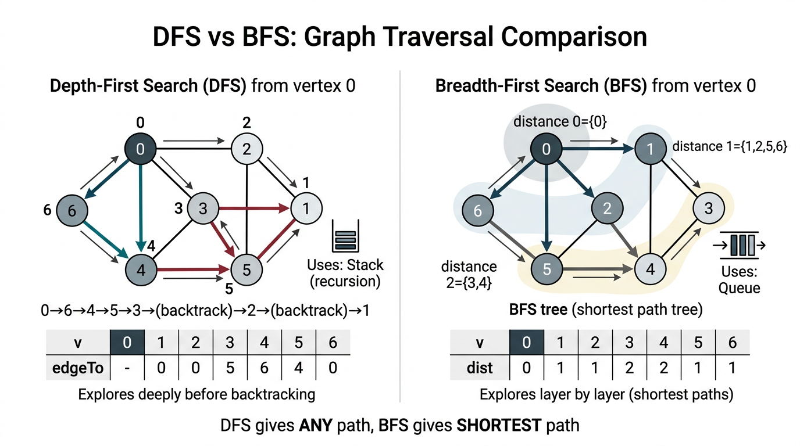

# Undirected Graphs — COMP0005 Algorithms

*Lecture-style notes on representing undirected graphs, basic traversals (DFS/BFS), and preprocessing for connectivity queries. This block sets up everything from shortest paths in unweighted graphs to MSTs and beyond.*

---

## 1. COMPLETE TOPIC SUMMARIES

### Graph definitions

An **undirected graph** **\(G = (V, E)\)** consists of:

- A set **\(V\)** of **vertices** (also called **nodes**).
- A set **\(E\)** of **edges**, where each edge is an **unordered** pair **\(\{u, v\}\)** with **\(u, v \in V\)** (often written **\(u\text{--}v\)** or **\(u\text{-}v\)**).

**Terminology (exam-friendly):**

| Term | Meaning |
|------|--------|
| **Vertex / node** | An element of **\(V\)**. |
| **Edge** | A connection between two distinct vertices (self-loops are usually excluded unless stated). |
| **Degree** **\(\deg(v)\)** | Number of edges **incident** to **\(v\)** (each edge **\(v\text{--}w\)** counts once toward **\(v\)**’s degree). |
| **Path** | A sequence **\(v_0, v_1, \ldots, v_k\)** where each consecutive pair **\((v_{i-1}, v_i)\)** is an edge. |
| **Simple path** | A path with **no repeated vertices** (often what people mean by “path” in proofs). |
| **Cycle** | A path **\(v_0,\ldots,v_k\)** with **\(k \ge 1\)**, all edges as in a path, and **\(v_0 = v_k\)** (first = last). A **simple cycle** repeats no other vertices. |
| **Connected** | Two vertices **\(s, t\)** are connected if there exists a **path** between them. |
| **Connected graph** | Every pair of vertices is connected. |
| **Connected component** | A **maximal** subset **\(C \subseteq V\)** such that the induced subgraph on **\(C\)** is connected — you cannot add another vertex from **\(V \setminus C\)** while keeping the set connected. |

**Applications:** road/rail networks, the web and internet topology, social “who knows whom” graphs, protein–protein interaction networks, VLSI / circuit connectivity, and many more. The same **abstraction** (vertices + pairwise links) appears everywhere once you identify “things” and “relationships.”

---

### Graph processing problems (overview)

Typical questions you might ask about a graph:

- **Reachability / path:** Is there a path from **\(s\)** to **\(t\)**? Output one path?
- **Shortest path (unweighted):** Fewest **edges** from **\(s\)** to **\(t\)** (BFS territory).
- **Cycle detection:** Does the graph contain a cycle?
- **Euler tour:** Traverse **every edge exactly once** (different hardness than Hamilton).
- **Hamilton tour:** Visit **every vertex exactly once** (generally much harder).
- **Connectivity:** How many components? Are **\(v, w\)** in the same component?
- **Minimum spanning tree (MST):** Cheapest set of edges connecting all vertices (later topic).
- **Graph isomorphism:** Are two graphs “the same” up to relabelling? (advanced / not core operational focus in intro courses.)

This week’s toolkit — **API + representations + DFS/BFS + CC** — solves **connectivity**, **paths**, **unweighted shortest paths**, and is the backbone for many harder problems.

---

### Graph API (typical Java-style / course API)

Vertices are often **named by integers** **\(0, 1, \ldots, V-1\)** for array indexing.

- **Edges:** pairs **\((v, w)\)** of integers, with **\(0 \le v, w < V\)**.
- **Core operations:**
  - **`V()`** — number of vertices.
  - **`E()`** — number of edges (if maintained).
  - **`addEdge(v, w)`** — add undirected edge **\(v\text{--}w\)** (implementations usually update **both** endpoints’ adjacency structures).
  - **`adj(v)`** — iterable collection of vertices adjacent to **\(v\)**.

The API hides **representation**; algorithms are written against **`adj`**, **`V`**, etc.

---

### Graph representations

#### Adjacency matrix

A **\(V \times V\)** boolean (or 0/1) matrix **`adj`** with **`adj[v][w] = adj[w][v] = true`** iff edge **\(v\text{--}w\)** exists (diagonal often false unless self-loops allowed).

| Operation | Time | Notes |
|-----------|------|--------|
| **Space** | **\(\Theta(V^2)\)** | Impractical for **sparse** graphs (few edges). |
| **Add edge** | **\(\mathcal{O}(1)\)** | Set two symmetric entries. |
| **Check edge** **\((v,w)\)** | **\(\mathcal{O}(1)\)** | One lookup. |
| **Iterate **\(\texttt{adj}(v)\)** | **\(\Theta(V)\)** | Must scan a whole row. |

**When it shines:** **dense** graphs, very fast edge queries, and some algebraic graph algorithms (matrices as operators — beyond this first pass).

#### Adjacency list

A **vertex-indexed array of lists** (often **bags** / linked lists) **`adj[v]`** holding all neighbours of **\(v\)**. Each undirected edge **\(v\text{--}w\)** appears **twice** — once in **`adj[v]`**, once in **`adj[w]`**.

| Operation | Time | Notes |
|-----------|------|--------|
| **Space** | **\(\Theta(V + E)\)** | **\(V\)** lists + **\(2E\)** edge references total for simple undirected graphs. |
| **Add edge** | **\(\mathcal{O}(1)\)** | Append to two lists (amortised if dynamic arrays). |
| **Check edge** **\((v,w)\)** | **\(\mathcal{O}(\min(\deg(v), \deg(w)))\)** | Scan one adjacency list; worst **\(\mathcal{O}(V)\)**. |
| **Iterate **\(\texttt{adj}(v)\)** | **\(\Theta(\deg(v))\)** | Optimal per neighbour. |

**Default choice** for sparse graphs in algorithm courses.

**Python-style sketch (undirected):**

```python
class Graph:
    def __init__(self, V):
        self.V = V
        self.adj = [Bag() for _ in range(V)]

    def addEdge(self, v, w):
        self.adj[v].add(w)
        self.adj[w].add(v)
```

*( **`Bag()`** is an unordered collection supporting efficient insertion and iteration — like a multiset without multiplicity if edges are unique.)*

---

### Depth-first search (DFS)

**Challenge:** From a **source** **\(s\)**, find **all vertices reachable** from **\(s\)** and (optionally) record **a path** back to **\(s\)**.

**Intuition:** **Maze exploration** — go down a corridor until you hit a dead end, then **backtrack** and try another unexplored turn. Recursion naturally implements “go deeper, then return.”

**Algorithm (connected-to-**\(s\)** marking):**

1. Mark **\(s\)** as **visited**.
2. For each neighbour **\(w\)** of the current vertex **\(v\)**, if **\(w\)** is not visited, **recursively** run DFS from **\(w\)**.

**Implementation notes:**

- **Recursion** uses an **implicit stack** of activation frames.
- **`marked[v]`** — boolean “have we seen **\(v\)** in this search?”
- **`edgeTo[w]`** — for path reconstruction: **parent** of **\(w\)** on the **DFS tree** (set when **\(w\)** is **first discovered** from **\(v\)**).

**Correct parent assignment:** when you traverse edge **\(v\text{--}w\)** and **\(w\)** is unmarked, set **`edgeTo[w] = v`** **before** recursing into **`dfs(G, w)`** so every visited vertex except **\(s\)** has a defined parent.

```python
class DepthFirstPaths:
    def __init__(self, G, s):
        self.marked = [False] * G.V()
        self.edgeTo = [-1] * G.V()
        self.s = s
        self.dfs(G, s)

    def dfs(self, G, v):
        self.marked[v] = True
        for w in G.adj(v):
            if not self.marked[w]:
                self.edgeTo[w] = v
                self.dfs(G, w)
```

**Properties:**

- Visits each vertex at most once; along each edge from the side you first cross it in the recursion tree, you do **constant** extra work.
- Time **\(\Theta(V + E)\)** for the **whole graph** in the usual adjacency-list model (each vertex marked once; each edge examined twice undirected).
- **Path from** **\(s\)** **to** **\(t\)** (if **`marked[t]`**): follow **`edgeTo`** from **\(t\)** back to **\(s\)**, often collected on a **stack** to output **\(s \leadsto t\)** forward.

**What DFS does *not* guarantee here:** **shortest** path in edge count — only **some** valid path.

---

### Breadth-first search (BFS)

**Challenge:** From **\(s\)**, find all reachable vertices **and** **shortest paths** measured in **number of edges** (unweighted graph).

**Intuition:** Explore in **layers** — first all vertices at distance **\(0\)**, then **\(1\)**, then **\(2\)**, … like ripples from a stone in water.

**Algorithm:**

1. Enqueue **\(s\)**; set **distance to source** for **\(s\)** to **\(0\)**.
2. While the queue is not empty: dequeue **\(v\)**; for each neighbour **\(w\)** not yet assigned a distance, enqueue **\(w\)**, set **`dist[w] = dist[v] + 1`**, and **`edgeTo[w] = v`**.

**Data structures:**

- **FIFO queue** — frontier of the current “wave.”
- **`distToSource[v]`** (or **`dist[v]`**) — number of edges on a shortest path from **\(s\)**; use **\(-1\)** or **`None`** for “unseen.”
- **`edgeTo[w]`** — first step parent on a **shortest-path tree**.

```python
def bfs(self, G, s):
    q = Queue()
    q.enqueue(s)
    self.distToSource[s] = 0
    while not q.isEmpty():
        v = q.dequeue()
        for w in G.adj(v):
            if self.distToSource[w] == -1:
                q.enqueue(w)
                self.distToSource[w] = self.distToSource[v] + 1
                self.edgeTo[w] = v
```

**Properties:**

- Marks every vertex in **\(s\)**’s component exactly once; each edge examined a constant number of times → **\(\mathcal{O}(V + E)\)** time with adjacency lists.
- Computes **shortest path lengths** in an **unweighted** graph (**fewest edges**). With nonnegative **edge weights**, you later upgrade to **Dijkstra**; with general weights, **Bellman–Ford**, etc.

---

### Connected components (preprocessing with DFS)

**Goal:** After **one-time preprocessing**, answer **“are **\(v\)** and **\(w\)** connected?”** in **\(\mathcal{O}(1)\)** (after building auxiliary arrays).

**Idea:** Repeatedly start DFS from any **unvisited** vertex. Each DFS sweep discovers **one entire connected component**. Label every vertex discovered in the **\(k\)**-th sweep with **`cc[id] = k`**.

```python
class ConnectedComponents:
    def __init__(self, G):
        self.marked = [False] * G.V()
        self.cc = [-1] * G.V()
        self.count = 0
        for v in range(G.V()):
            if not self.marked[v]:
                self.dfs(G, v)
                self.count += 1

    def dfs(self, G, v):
        self.marked[v] = True
        self.cc[v] = self.count
        for w in G.adj(v):
            if not self.marked[w]:
                self.dfs(G, w)
```

**Query:** **\(v\)** connected to **\(w\)** iff **`cc[v] == cc[w]`**.

**Cost:** **\(\mathcal{O}(V + E)\)** time and **\(\mathcal{O}(V)\)** extra space for **`marked`** and **`cc`**.

*(**Union–Find** can also maintain dynamic connectivity when edges are added online; **CC** here is the static “full graph in memory” preprocessing pattern.)*

---

### DFS vs BFS — summary


*DFS explores deeply using a stack (recursion), producing any path to connected vertices. BFS explores layer-by-layer using a queue, automatically finding shortest paths (fewest edges).*

| | **Intuition** | **Programming** | **Auxiliary structure** | **Typical “hero” capability** |
|---|----------------|-----------------|-------------------------|--------------------------------|
| **DFS** | Maze / backtracking | Natural **recursion** (explicit stack if iterative) | **Stack** (implicit or explicit) | **Paths**, **topological ideas** (directed, later), **CC**, cycle detection variants |
| **BFS** | Distance layers / waves | **Iterative** with a loop | **Queue** | **Unweighted shortest paths**, layers by distance |

Both run in **\(\mathcal{O}(V + E)\)** on adjacency lists for their standard graph-wide traversals.

---

## 2. EXAM-STYLE QUESTIONS (3–5 with model answers)

### Q1 — Definitions

**Question:** Define **path**, **cycle**, **connected graph**, and **connected component** for an undirected simple graph.

**Model answer:** A **path** is a sequence of vertices **\(v_0,\ldots,v_k\)** such that each **\(\{v_{i-1},v_i\}\)** is an edge. A **cycle** is a path with **\(k \ge 1\)**, **\(v_0 = v_k\)**, and otherwise follows the edge condition along the way (examiners often also want **simple** cycle: no repeated vertices except endpoints). A graph is **connected** if for every pair **\(u, v\)** there exists a path between them. A **connected component** is a **subset** of vertices that is **connected** in the subgraph induced by those vertices and is **maximal** with this property (cannot add another vertex of the graph without breaking connectivity of the set).

---

### Q2 — Representation comparison

**Question:** Compare **adjacency matrix** vs **adjacency list** for an undirected graph with **\(V\)** vertices and **\(E\)** edges. Give **space** and the cost of **iterating all neighbours of** **\(v\)**.

**Model answer:** The **adjacency matrix** uses **\(\Theta(V^2)\)** space; iterating neighbours of **\(v\)** requires scanning a full row → **\(\Theta(V)\)** time even if **\(\deg(v)\)** is tiny. The **adjacency list** uses **\(\Theta(V + E)\)** space (each undirected edge stored twice); iterating **`adj(v)`** takes **\(\Theta(\deg(v))\)** time, which is optimal up to constants for listing those neighbours. The matrix wins on **constant-time edge existence** checks **\(\mathcal{O}(1)\)** vs **\(\mathcal{O}(\deg)\)** for lists.

---

### Q3 — DFS vs BFS paths

**Question:** Both DFS and BFS from a source **\(s\)** can build a **parent array** **`edgeTo[]`**. Which traversal guarantees that following parents from **\(t\)** back to **\(s\)** yields a **shortest** path in terms of **number of edges**? Why?

**Model answer:** **BFS** guarantees **shortest edge-count paths** because it explores vertices in **nondecreasing distance** from **\(s\)**; the first time **\(t\)** is dequeued, it was reached by a shortest route. **DFS** has no such ordering — it may plunge deep along one branch first — so the DFS tree path can be longer than necessary. Hence only **BFS** (among these two) is the standard unweighted shortest-path algorithm.

---

### Q4 — Connected components complexity

**Question:** Explain why the **connected components** algorithm that runs DFS from every unvisited vertex still runs in **\(\mathcal{O}(V + E)\)** time total, not **\(\mathcal{O}(V(V+E))\)**.

**Model answer:** Each vertex is marked **exactly once** across **all** DFS calls, because once **`marked[v] = True`**, **\(v\)** is never the start of a new component search from scratch in a way that reprocesses it. Each adjacency list is traversed **at most once** per vertex when that vertex is popped off the recursion stack / processed. Summed over the graph, edge examinations are **\(\mathcal{O}(E)\)** (each undirected edge looked at from both endpoints, constant factor). Total **\(\mathcal{O}(V + E)\)**.

---

### Q5 — Coding / invariant trap

**Question:** In **`DepthFirstPaths`**, when should **`edgeTo[w] = v`** be executed relative to **`dfs(G, w)`**, and what goes wrong if you **never** set **`edgeTo`** for discovered children?

**Model answer:** Set **`edgeTo[w] = v`** when **\(w\)** is first discovered along the edge from **\(v\)**, **before** recursing **`dfs(G, w)`** (or at least at discovery time). If **`edgeTo`** is never set, you cannot **reconstruct** a path from **\(s\)** to a visited vertex by following parent pointers — the traversal might still **mark** reachable vertices, but the **path information** is lost.

---

## 3. MUST-KNOW KEY POINTS

- **Graph** **\(G=(V,E)\)** — vertices, undirected edges; know **degree**, **path**, **cycle**, **connected**, **component**.
- **API:** **`V()`**, **`addEdge(v,w)`**, **`adj(v)`** — algorithms use **`adj`**, not raw matrices, unless stated.
- **Adjacency matrix:** **\(\Theta(V^2)\)** space, **\(\mathcal{O}(1)\)** edge test, **\(\Theta(V)\)** neighbour scan.
- **Adjacency list:** **\(\Theta(V+E)\)** space, **\(\Theta(\deg(v))\)** neighbour scan — default for sparse graphs.
- **DFS:** recursion / stack; marks reachable vertices; **`edgeTo`** for **a** path; **not** shortest in general.
- **BFS:** queue; **\(\mathcal{O}(V+E)\)**; **shortest path in unweighted** sense (fewest edges).
- **Connected components:** multi-source DFS (or BFS) labelling; query **\(\mathcal{O}(1)\)** via **`cc[u] == cc[v]`** after **\(\mathcal{O}(V+E)\)** preprocess.
- **Traversal cost:** both DFS and BFS **linear in input size** for adjacency lists: **\(\Theta(V + E)\)**.

---

## 4. HIGH-PRIORITY TOPICS

| Priority | Topic | Why it matters |
|----------|--------|----------------|
| 🔴 **Must know** | **Definitions:** path, cycle, connected, component | Language used in every graph proof and exam short-answer. |
| 🔴 **Must know** | **Adjacency list vs matrix:** space + iterate **`adj(v)`** costs | Classic comparison table question. |
| 🔴 **Must know** | **DFS:** marking, recursion/stack, **`edgeTo`**, **\(\mathcal{O}(V+E)\)** | Core traversal; parent pointers for paths. |
| 🔴 **Must know** | **BFS:** queue, **`dist[]`**, shortest path in **unweighted** graphs | Distinct exam narrative from DFS. |
| 🔴 **Must know** | **Connected components** labelling + **\(\mathcal{O}(V+E)\)** total time | Shows “multiple DFS starts” still linear. |
| 🟡 **Important** | **DFS vs BFS** intuition (maze vs layers) | Explains *when* to choose which. |
| 🟡 **Important** | **Double representation** of edges in undirected adjacency lists | Drives the **\(+E\)** in space and **2E** edge inspections. |
| 🟡 **Important** | **Path reconstruction** with stack from **`edgeTo`** | Standard implementation detail. |
| 🟢 **Useful but lower priority** | **Euler vs Hamilton** as named problems | Vocabulary + “which is tractable” high-level awareness. |
| 🟢 **Useful but lower priority** | Matrix-based or algebraic graph angles | Enrichment; rarely the default implementation question. |

---

## 5. TOPIC INTERCONNECTIONS & BIGGER PICTURE

- **Union–Find (earlier):** answers dynamic connectivity with merges; **CC + DFS** answers **static** “same component?” after the full graph is built — same **mathematical** partition, different **operational** setting.
- **Weighted shortest paths:** BFS is **unweighted** shortest paths; **Dijkstra** (nonnegative weights) and others generalise the “expand frontier in order” idea with a priority queue.
- **MST algorithms (later):** **Kruskal** needs **connected component** tests on edges — **Union–Find**; **Prim** resembles **BFS/Dijkstra**-style growth from a tree.
- **Directed graphs (later):** DFS underpins **topological sort**, **strongly connected components** — same traversal machinery, richer structure.
- **Complexity story:** **\(\mathcal{O}(V+E)\)** is **linear in the size of a sparse graph** — the standard “we can afford to scan the whole graph once” baseline.

---

## 6. EXAM STRATEGY TIPS

- **Define before you derive.** One crisp sentence each for **component**, **path**, **cycle** saves marks on theory questions.
- **Always state the representation** you assume. Most proofs assume **adjacency lists** when quoting **\(\mathcal{O}(V+E)\)**.
- **BFS vs DFS:** If the paper says **“fewest edges”** or **“minimum hops”**, say **BFS**. If it says **“some path”** or **“detect cycle / explore structure”**, **DFS** is often the intended hammer.
- **CC timing:** Emphasise **each vertex marked once** — avoids the bogus **\(V \times (V+E)\)** argument.
- **Pseudocode hygiene:** show **`if not marked[w]:`** before recurse/enqueue; show **`edgeTo[w] = v`** (BFS/DFS) **when** **\(w\)** is first discovered.
- **Trade-off table:** Be able to reproduce **matrix vs list** for **space**, **edge query**, **iterate neighbours** from understanding, not memorisation alone.

---

*End of notes — Undirected Graphs (COMP0005).*
