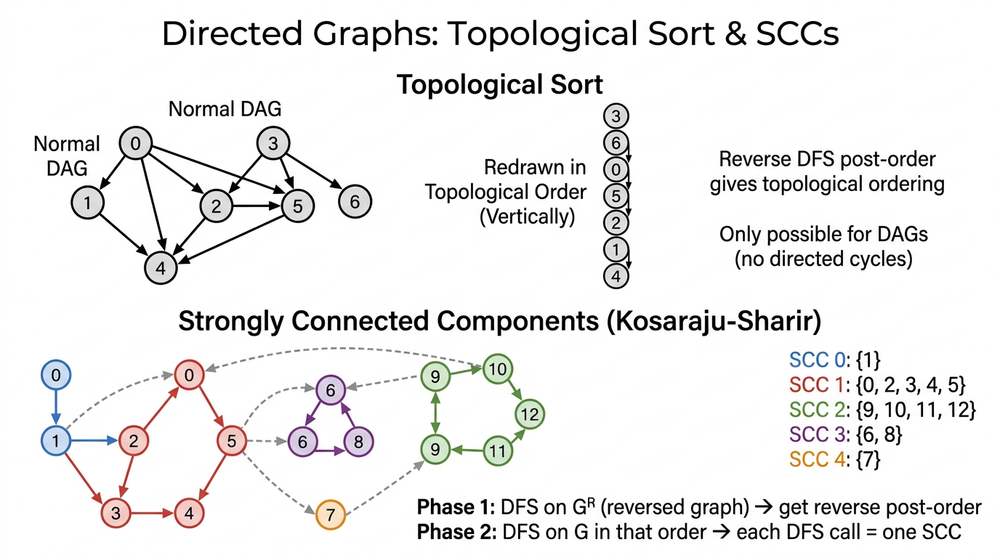

# Directed Graphs (Digraphs) — COMP0005 Algorithms

*Lecture-style notes. A **directed graph** (**digraph**) is the natural model when relationships are **asymmetric**: “**A points to B**” is **not** the same as “**B points to A**.” The same **DFS/BFS** skeletons as for undirected graphs still apply, but **reachability**, **shortest paths**, and **connectivity** all respect **edge direction**. **Topological sort** and **strongly connected components** are the two flagship digraph problems.*

---

## 1. COMPLETE TOPIC SUMMARIES

### Digraph definitions and terminology

**Digraph.** A digraph **\(G = (V, E)\)** consists of:

- a set of **vertices** (**nodes**) **\(V\)** with **\(|V| = V\)** (notation overload: **\(V\)** as set and **\(V\)** as count — your lecturer/textbook will fix one convention), and  
- a set of **directed edges** **\(E \subseteq V \times V\)**.

Each edge is an **ordered pair** **\((v, w)\)**, read **“\(v\) to \(w\)”** or **\(v \to w\)**. Unlike an **undirected** edge **\(\{v,w\}\)**, **\((v,w)\)** and **\((w,v)\)** are **different** edges unless both are present.

**Directed path.** A sequence of vertices **\(v_0, v_1, \ldots, v_k\)** such that **\((v_{i-1}, v_i) \in E\)** for each **\(i = 1,\ldots,k\)**. The **length** is **\(k\)** (number of edges).

**Directed cycle.** A directed path with **\(k \geq 1\)** where **\(v_0 = v_k\)** (a closed walk that follows edge directions). A **self-loop** **\((v,v)\)** is a directed cycle of length **\(1\)**.

**In-degree** and **out-degree** (for vertex **\(v\)**):

- **\(\mathrm{outdeg}(v)\)** = number of edges **\(v \to \cdot\)** (edges **leaving** **\(v\)**).
- **\(\mathrm{indeg}(v)\)** = number of edges **\(\cdot \to v\)** (edges **entering** **\(v\)**).

**Handshaking for digraphs.**  
\[
\sum_{v \in V} \mathrm{indeg}(v) = \sum_{v \in V} \mathrm{outdeg}(v) = |E|.
\]

**Applications (direction matters):**

| Domain | Vertices | Directed edge \(v \to w\) |
|--------|----------|---------------------------|
| Road networks | intersections | one-way street from \(v\) to \(w\) |
| Web | pages | hyperlink from \(v\) to \(w\) |
| Social “follow” | users | \(v\) follows \(w\) |
| Software / OOP | classes / modules | \(v\) inherits or imports \(w\) |
| Scholarly graphs | papers | \(v\) cites \(w\) |

---

### Digraph API and adjacency lists

**Core operations** (typical textbook API):

- **`addEdge(v, w)`** — add **only** **\(v \to w\)** (not **\(w \to v\)** unless you add it separately).
- **`adj(v)`** — iterable of vertices **\(w\)** such that **\(v \to w\)** exists (vertices that **\(v\)** **points to** — **out-neighbours**).

**Adjacency-list representation.** For each **\(v\)**, store a list (or bag) of **out-neighbours** in **`adj[v]`**. If **\(v \to w\)** exists, **\(w\)** appears in **`adj[v]`**. You do **not** automatically add **\(v\)** to **`adj[w]`** (that would be the undirected convention).

**Complexity (standard counting):**

| Operation | Cost (typical adjacency list) |
|-----------|-------------------------------|
| **Space** | **\(\Theta(V + E)\)** (array of **\(V\)** lists + **\(E\)** list entries) |
| **`addEdge(v,w)`** | **\(O(1)\)** amortised if lists append in constant time |
| **Iterate `adj(v)`** | **\(\Theta(\mathrm{outdeg}(v))\)** |

**Beginner trap.** Treating **`adj(v)`** as “neighbours in an undirected sense” breaks algorithms: **reachability from \(s\)** follows **out-edges only**.

---

### DFS on digraphs

**Algorithm.** The **same** recursive (or explicit-stack) DFS as on undirected graphs: mark **\(v\)**, then for each **\(w \in \texttt{adj}(v)\)**, if **\(w\)** not marked, **`dfs(w)`**.

**What it computes.** From a **source** **\(s\)**, DFS marks exactly the vertices **reachable from \(s\)** along **directed** paths (not necessarily reachable **to** **\(s\)**).

**Applications:**

- **Dead-code elimination:** functions/modules as vertices; call edges **\(v \to w\)** if **\(v\)** may invoke **\(w\)**; DFS from **entry** marks live code.
- **Garbage collection (mark-and-sweep):** objects as vertices; references **\(v \to w\)**; mark phase = DFS from **roots**.
- **Web crawling:** pages and links; crawl follows **out-links**.

**Edge classification (optional but useful).** During DFS from **\(s\)**, for an edge **\(v \to w\)**:

- **Tree edge** — first discovery **\(v \to w\)**.
- **Forward / back / cross** edges appear depending on whether **\(w\)** was already known and **stack** structure; exams often focus on **back edges ⇔ cycle** in **DFS trees** for DAG testing.

---

### BFS on digraphs

**Algorithm.** Same as undirected BFS: FIFO queue, distance (or level) from **\(s\)**, relax **out-neighbours**.

**What it computes.** **Shortest directed path** from **\(s\)** in the **unweighted** sense: minimum number of **directed** edges to each reachable vertex. Each edge has **weight 1**; BFS is **not** Dijkstra for arbitrary non-negative weights.

**Contrast with undirected BFS.** “Shortest path” is defined on **directed** reachability; some vertices may be unreachable even if the **underlying undirected** graph would connect them.

---

### Topological sort

**Problem.** Given a **DAG** (**directed acyclic graph** — a digraph with **no** directed cycles), produce a linear order **\(\prec\)** on **\(V\)** such that **every** edge goes **forward** in the order:

\[
\text{for every edge } v \to w,\quad v \text{ appears before } w \text{ in the order.}
\]

Equivalently: if you draw vertices on a line in that order, all arrows point **right** (or “upward” on the board).

**Applications.**

- **Task scheduling** with **precedence constraints:** **\(v \to w\)** means “**\(v\)** must finish before **\(w\)** can start.”
- **Build systems** (module **A** before **B**), **course prerequisites**, **instruction scheduling** dependencies.

**Existence.** A digraph has a **topological ordering** **if and only if** it is a **DAG** (acyclic). If there is a directed cycle, no total order can respect all edges — you cannot put every vertex on a line with all edges forward around a cycle.

**Algorithm (DFS reverse post-order).**

1. **Verify acyclicity** (or run cycle detection first). Topological order is **only** defined for a DAG.
2. Run **DFS** from every unmarked vertex (standard “forest” DFS).
3. **After** fully exploring **all** descendants reachable along **out-edges** from **\(v\)**, record **\(v\)** (e.g. **push** onto a **stack** — **post-order** processing).
4. **Pop** the stack (or read the list **backwards**) → **topological order**.

**Why it works (intuition).** When **\(v\)** is pushed **after** its DFS subtree, every **\(w\)** reachable **from \(v\)** by a **non-trivial** path was already processed and pushed **before** **\(v\)** in the stack’s final order — so **\(w\)** appears **after** **\(v\)** when you pop. Thus **\(v\)** comes **before** **\(w\)** in the popped order for every tree/descendant edge; a rigorous proof handles **cross edges** in a DAG by **acyclicity** (no back edges).

**Reference pattern (DepthFirstOrder + stack):**

```python
class DepthFirstOrder:
    def __init__(self, G):
        self.marked = [False] * G.V()
        self.reversePost = Stack()
        for v in range(G.V()):
            if not self.marked[v]:
                self.dfs(G, v)
    def dfs(self, G, v):
        self.marked[v] = True
        for w in G.adj(v):
            if not self.marked[w]:
                self.dfs(G, w)
        self.reversePost.push(v)
```

**Note.** Some APIs expose **`reversePost()`** as the stack or list; popping until empty yields one valid topological order (not necessarily unique — a DAG can have many topological orderings).

---

### Directed cycle detection (is the graph a DAG?)

**Problem.** Decide whether **\(G\)** contains **any** directed cycle.

**DFS with “recursion stack”.** Maintain:

- **`marked[v]`** — **\(v\)** was ever reached by DFS.
- **`onCallStack[v]`** — **\(v\)** lies on the **current** DFS recursion path (active call chain).

When exploring **\(v \to w\)**:

- If **\(w\)** is **not** marked → recurse.
- If **\(w\)** is marked **and** **`onCallStack[w]`** is **true** → you found a **back edge** to an **ancestor** on the active path → **directed cycle**.
- If **\(w\)** is marked but **not** on the call stack, that edge is **not** (by itself) proof of a cycle through the current path.

**On retreat** from **`dfs(v)`**, set **`onCallStack[v] = False`** so other branches do not false-positive.

**Reference pattern:**

```python
class DirectedCycle:
    def __init__(self, G):
        self.marked = [False] * G.V()
        self.onCallStack = [False] * G.V()
        self.cycleDetected = False
        for v in range(G.V()):
            if not self.marked[v]:
                self.dfs(G, v)
    def dfs(self, G, v):
        self.marked[v] = True
        self.onCallStack[v] = True
        for w in G.adj(v):
            if self.cycleDetected: return
            elif not self.marked[w]: self.dfs(G, w)
            elif self.onCallStack[w]: self.cycleDetected = True
        self.onCallStack[v] = False
```

**Applications:** **cyclic inheritance** in type systems, **circular references** in spreadsheets or formula graphs, **sanity checks** before topological sort.

---

### Strongly connected components (SCCs)

**Strongly connected.** Vertices **\(v\)** and **\(w\)** are **strongly connected** if there is a directed path **\(v \leadsto w\)** **and** a directed path **\(w \leadsto v\)**.

**Properties.**

- Strong connectivity is an **equivalence relation** (reflexive, symmetric, transitive on the “mutually reachable” relation).
- A **strongly connected component** (**SCC**) is a **maximal** set **\(C \subseteq V\)** such that every pair in **\(C\)** is strongly connected. **Maximal** means you cannot add another vertex from **\(V \setminus C\)** while preserving mutual reachability **inside** the enlarged set.

**Contrast with undirected “components”.** In an undirected graph, **connected components** partition **\(V\)**. In a digraph, **weakly connected** components ignore direction; **SCCs** respect direction and can **overlap** in a set-theoretic sense only at boundaries — actually they **partition** **\(V\)** as well: every vertex belongs to **exactly one** SCC.

---

### Kosaraju–Sharir algorithm for SCCs


*Top: A DAG redrawn in topological order (all edges point downward), found via reverse DFS post-order. Bottom: Strongly connected components identified by the Kosaraju-Sharir algorithm (Phase 1: DFS on reversed graph; Phase 2: DFS on original in reverse post-order).*

**Reverse graph** **\(G^R\)**. Same vertices; reverse every edge: **\(w \to v\)** is in **\(G^R\)** iff **\(v \to w\)** is in **\(G\)**. Building **\(G^R\)** as an adjacency list costs **\(\Theta(V + E)\)**.

**Key idea.** The **SCC partition of \(G\)** equals the **SCC partition of \(G^R\)** (reversing edges preserves “mutual reachability”).

**Two-phase algorithm:**

1. **Phase 1 — DFS post-order on** **\(G^R\)**. Run DFS on **\(G^R\)** (from each unmarked vertex) and record vertices in **reverse post-order** (same stack trick as **DepthFirstOrder**).
2. **Phase 2 — DFS on** **\(G\)** **in that order.** Initialise **\(\texttt{count} = 0\)**. Pop vertices from the Phase-1 order; each time you pop an **unmarked** **\(v\)**, start **`dfs(G, v)`** and assign **current** **`count`** as the **SCC id** for everything reached; then increment **`count`**.

Each **DFS** launch in Phase 2 discovers **exactly one** SCC.

**Running time.** **\(\Theta(V + E)\)** — linear in the size of the graph (two DFS passes + linear-time reverse build).

**Reference pattern:**

```python
class StronglyConnectedComponents:
    def __init__(self, G):
        self.marked = [False] * G.V()
        self.scc = [-1] * G.V()
        self.count = 0
        dfsOrder = DepthFirstOrder(G.reverse())
        reverseOrder = dfsOrder.reversePost()
        while not reverseOrder.isEmpty():
            v = reverseOrder.pop()
            if not self.marked[v]:
                self.dfs(G, v)
                self.count += 1
    def dfs(self, G, v):
        self.marked[v] = True
        self.scc[v] = self.count
        for w in G.adj(v):
            if not self.marked[w]:
                self.dfs(G, w)
```

**Intuition (high level).** The order from **\(G^R\)** ensures you **finish** “**sink-like**” components (in the **condensation DAG** of SCCs) before **source-like** ones; when you then DFS on **\(G\)**, you do not “leak” into another SCC before finishing the current one.

---

## 2. EXAM-STYLE QUESTIONS (WITH MODEL ANSWERS)

### Q1 — Out-degree, in-degree, and adjacency lists

**Question.** For a digraph with **\(V\)** vertices and **\(E\)** edges stored as **adjacency lists** (`adj(v)` lists **out-neighbours**), state the **space** used and the time to **iterate all edges leaving** **\(v\)**. If **`addEdge(v, w)`** only appends **\(w\)** to **`adj[v]`**, why is **`adj[w]`** **not** updated automatically?

**Model answer.** **Space** is **\(\Theta(V + E)\)** — **\(V\)** lists plus **\(E\)** total list entries (each directed edge stored once at its tail). Iterating **`adj(v)`** costs **\(\Theta(\mathrm{outdeg}(v))\)**. **`adj[w]`** is **not** updated because the API represents **\(v \to w\)** only as an **out-edge from \(v\)**; **\(w\)**’s **in-neighbours** are not duplicated unless you maintain a separate **reverse adjacency** structure.

---

### Q2 — Topological order vs cycle

**Question.** Explain why a digraph **with a directed cycle** cannot have a **topological ordering**. Then state the **three-step** DFS-based method to produce a topological order for a **DAG**, and name the **vertex ordering** (e.g. **reverse post-order**) you output.

**Model answer.** Suppose a cycle **\(v_0 \to v_1 \to \cdots \to v_k = v_0\)**. In any linear order, some **\(v_i\)** is **first** among the cycle vertices. Its predecessor **\(v_{i-1}\)** on the cycle must appear **before** **\(v_i\)** (edge **\(v_{i-1} \to v_i\)**), contradicting **\(v_i\)** being first. Hence **no** topological order. For a **DAG**: (1) **confirm acyclicity** (cycle detection); (2) run **DFS** from all unmarked vertices; (3) output vertices in **reverse post-order** (push **\(v\)** onto a stack **after** recursive DFS to all **\(w \in \texttt{adj}(v)\)**; popping yields a valid order).

---

### Q3 — Directed cycle detection with `onCallStack`

**Question.** In DFS-based **directed cycle detection**, what do **`marked`** and **`onCallStack`** mean? **Exactly** when do you conclude a **cycle** exists? Why must you clear **`onCallStack[v]`** when **`dfs(v)`** returns?

**Model answer.** **`marked[u]`** = **\(u\)** was ever discovered by DFS. **`onCallStack[u]`** = **\(u\)** is on the **current** recursion path (an **ancestor** of the active call). A **cycle** is detected when traversing **\(v \to w\)** with **\(w\)** already **marked** **and** **`onCallStack[w] == \text{true}`** — a **back edge** to an active ancestor closes a directed cycle following tree edges down and this edge back. Clearing **`onCallStack[v]`** on return removes **\(v\)** from the active path so **cross edges** to **\(v\)** from other branches are **not** mistaken for cycles on a **different** DFS path.

---

### Q4 — BFS vs DFS reachability on a digraph

**Question.** From source **\(s\)**, what set of vertices does **DFS** mark? What does **BFS** compute in addition when edges are **unweighted**? Give a **small** example (sketch or describe) where **\(t\)** is **reachable from \(s\)** but **\(s\)** is **not** reachable from **\(t\)**.

**Model answer.** **DFS** marks all **\(u\)** with a **directed** path **\(s \leadsto u\)**. **BFS** finds **shortest** **directed** paths in **edge count** from **\(s\)** to each reachable vertex (levels = distance). Example: vertices **\(\{s, t\}\)** with **only** edge **\(s \to t\)**. Then **\(t\)** is reachable from **\(s\)**, but there is **no** path **\(t \leadsto s\)**.

---

### Q5 — Kosaraju–Sharir: phases and complexity

**Question.** Describe **Phase 1** and **Phase 2** of **Kosaraju–Sharir** for SCCs. Why use **\(G^R\)** in Phase 1? What is the **total** running time?

**Model answer.** **Phase 1:** Build **\(G^R\)**; run DFS on **\(G^R\)** and record **reverse post-order**. **Phase 2:** Run DFS on **\(G\)**, considering vertices in that **reverse post-order**; each **new** DFS tree (started at the next unmarked vertex in that order) is **one** SCC. **\(G^R\)** reorders processing so that DFS on **\(G\)** does not escape from one SCC into another before finishing the component. **Time** is **\(\Theta(V + E)\)** for reverse construction plus two DFS traversals — **linear** overall.

---

## 3. MUST-KNOW KEY POINTS

- **Digraph:** edges **ordered** **\((v,w)\)** = **\(v \to w\)**; **not** symmetric by default.
- **`adj(v)`** = **out-neighbours**; **adjacency list** stores **\(E\)** entries total → **\(\Theta(V+E)\)** space; **`addEdge`** **\(O(1)\)**; scan **`adj(v)`** in **\(\Theta(\mathrm{outdeg}(v))\)**.
- **DFS/BFS** code matches undirected graphs; **reachability** and **BFS distances** are **directed**.
- **Topological order** exists **iff** **DAG**; algorithm = **DFS** then **reverse post-order** (push **\(v\)** after finishing children in DFS tree).
- **Directed cycle:** DFS + **`onCallStack`**; **back edge to vertex on current stack** ⇒ cycle.
- **Strong connectivity:** mutual **directed** reachability; **SCCs partition** **\(V\)**.
- **Kosaraju–Sharir:** **reverse post-order on** **\(G^R\)**, then **DFS on** **\(G\)** in that order; **\(\Theta(V+E)\)**.

---

## 4. HIGH-PRIORITY TOPICS

### 🔴 Must Know

- Definitions: **directed path**, **directed cycle**, **in-degree** / **out-degree**, **DAG**.
- **Adjacency-list** convention for digraphs: **only** **`adj[v]`** gets **\(w\)** for **\(v \to w\)**.
- **Space** **\(\Theta(V+E)\)** and **iterate `adj(v)`** = **out-degree** work.
- **DFS** from **\(s\)** = vertices **reachable from \(s\)** along **directed** paths.
- **BFS** on unweighted digraph = **shortest directed path** in **edge count**.
- **Topological sort:** **iff DAG**; **reverse DFS post-order**; tie to **precedence** scheduling.
- **Cycle detection:** **`marked`** vs **`onCallStack`**; **why** unmark stack on return.
- **SCC** definition and **Kosaraju–Sharir** **two phases**, **\(G^R\)**, **linear** time.

### 🟡 Important

- **Applications:** web crawl, GC, dead code, prerequisites, spreadsheet cycles, inheritance cycles.
- **Non-uniqueness** of topological order; **every** edge **\(v \to w\)** has **\(v\)** before **\(w\)** in output.
- **Condensation graph** (DAG of SCCs) as **conceptual** support for **why** Kosaraju works — not always required to reproduce proofs.
- **Difference** between **weakly connected** (ignore direction) and **strongly connected**.

### 🟢 Useful but Lower Priority

- DFS **edge classification** (tree / forward / back / cross) on digraphs.
- **Tarjan’s** or **Gabow’s** single-pass SCC algorithms (if mentioned in advanced reading).
- Building **explicit** **\(G^R\)** vs streaming reverse edges on the fly (implementation detail).
- **Topological sort via Kahn’s algorithm** (in-degree peeling, BFS-style) as an alternative.

---

## 5. TOPIC INTERCONNECTIONS & BIGGER PICTURE

- **Graph representation** (Session on ADTs / graph APIs) feeds directly into digraphs: same **list vs matrix** tradeoffs, but **direction** changes **interpretation** of **`adj`**.
- **DFS and BFS** are the **same** traversal templates as undirected graphs; **directed** graphs clarify **what** “neighbour” means (**out-neighbour**).
- **Topological sort** is the digraph analogue of **ordering constraints**; it connects to **shortest paths in DAGs** (relax vertices in topological order — often a later algorithms topic).
- **Cycle detection** is a **prerequisite check** for topological sort and for **safe** dependency resolution in tools (build systems, package managers).
- **SCCs** reduce complex cyclic digraphs to a **DAG of components** — the **condensation graph** — which is the right level for **high-level** reasoning about **feedbacks** vs **layers**.
- **Kosaraju–Sharir** showcases **two linear passes** and **graph reversal** — a pattern that appears elsewhere (e.g. **reverse** graphs for **some** reachability games).

---

## 6. EXAM STRATEGY TIPS

- **Draw arrows** on every small example; students often apply **undirected** intuition and **wrong** reachability.
- When asked **“shortest path”** on an **unweighted** digraph, default answer is **BFS** along **out-edges**, not “shortest in the underlying undirected graph.”
- **Topological sort:** state **push vertex after DFS finishes its outgoing subtree** → **reverse post-order**; do **not** confuse with **pre-order**.
- **Cycle detection:** articulate **back edge to vertex still on recursion stack**; distinguish **`marked` only** (would false-positive **cross edges**).
- **Kosaraju:** **Phase 1 on** **\(G^R\)**, **Phase 2 on** **\(G\)** — reversing **either** phase breaks the algorithm; memorise **\(G^R\)** **first**.
- **Complexity:** commit **\(\Theta(V+E)\)** for DFS/BFS, topo sort, cycle find, and Kosaraju (with **linear** reverse build).
- If a question says **“is this a DAG?”**, offer **directed cycle** as witness **or** **topological order** as certificate — match the tool to the proof style asked.

---

*These notes align with standard COMP0005 treatments of digraphs (Sedgewick/Wayne-style APIs). Match your lecturer’s exact **`reversePost`** API and whether **\(V\)** denotes count or vertex set in complexity statements.*
