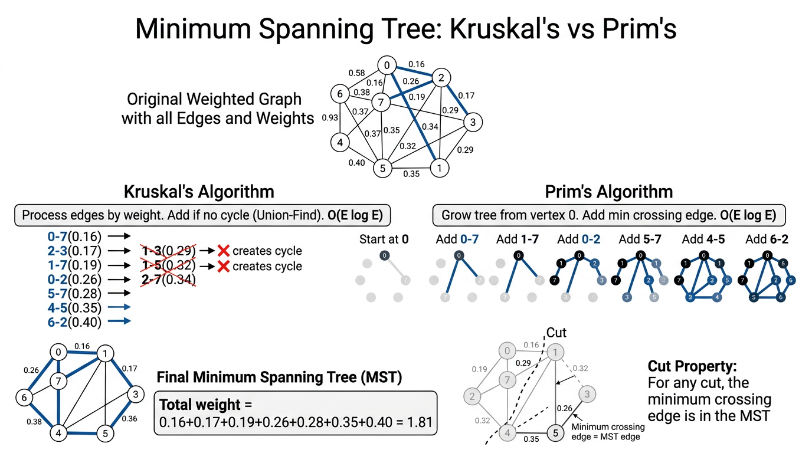

# Minimum Spanning Trees — COMP0005 Algorithms

*Lecture-style notes. A **minimum spanning tree (MST)** is one of the cleanest places where **greedy reasoning** is not just plausible but **provably correct**: the **cut property** justifies two classic algorithms — **Kruskal** (edges + **union–find**) and **Prim** (grow a tree + **priority queue**). This topic ties together **graphs**, **greedy methods**, **priority queues**, and **disjoint-set (union–find)** structures.*

---

## 1. COMPLETE TOPIC SUMMARIES

### **Problem setup: graphs, weights, and trees**

Work with an **undirected graph** **\(G = (V, E)\)** that is **connected** and has **positive** edge weights **\(w(e) > 0\)** for every edge **\(e\)**. (Many implementations also allow zero weights; the theory is usually stated with **strictly positive** weights to avoid “free” edges cluttering tie-breaking discussions.)

- **Spanning subgraph:** uses **all vertices** in **\(V\)** (and some edges from **\(E\)**).
- **Spanning tree:** a spanning subgraph that is a **tree** — i.e. **connected** and **acyclic**.

**Minimum spanning tree (MST):** among all spanning trees of **\(G\)**, one whose **total weight**

\[
\sum_{e \in T} w(e)
\]

is **as small as possible**. (If edge weights are distinct, the MST is **unique**; with ties, there may be **multiple** MSTs with the **same** minimum total weight.)

**Counting edges (fundamental fact):** any tree on **\(|V| = V\)** vertices has exactly **\(V - 1\)** edges. So every spanning tree of **\(G\)** has **\(V - 1\)** edges — no more, no fewer.

**Why “minimum” matters:** spanning trees model **backbone networks** (connect all sites cheaply), **clustering** (later connections to single-linkage ideas), **approximation** for other hard problems, and **pipeline** problems where cycles are redundant or costly.

---

### **Edge-weighted graph representation**

Represent **\(G\)** with an **adjacency list**, but each adjacency entry is an **edge object**, not merely a neighbor id.

**`Edge` class (conceptual API):**

- Fields **\(v\)**, **\(w\)** (the two endpoints) and **`weight`**.
- **`endPoint()`** (Java) / **`end_point()`** (Python style below) — return one endpoint (convention varies by implementation).
- **`otherEndPoint(vertex)`** / **`other_end_point(vertex)`** — given **one** endpoint, return the **other**.
- **`compareTo(edge)`** — compare this edge to **`edge`** by **weight** (for **`MinPQ`** ordering).

**Graph layout:**

- For each vertex, store a **bag** (list) of **references** to **`Edge`** objects.
- Each **undirected** edge **\(\{v,w\}\)** appears **twice** in storage: once in **`v`**’s adjacency list and once in **`w`**’s — so you can traverse **incident** edges from either endpoint in **\(O(\deg)\)** time.

**Beginner tip:** when tracing algorithms, **draw** the graph and **label** edge weights; when simulating **`Edge`**, always ask “**from which endpoint am I standing?**” before calling **`otherEndPoint`**.

---

### **Greedy template: cuts, crossing edges, and the cut property**

#### **Cuts and crossing edges**

- A **cut** **\((S, V \setminus S)\)** **partitions** the vertices into two **nonempty** sets **\(S\)** and its complement.
- An edge **\(e = \{v,w\}\)** **crosses** the cut if **\(v \in S\)** and **\(w \notin S\)** (or the symmetric case).

#### **Cut property (MST cornerstone)**

> **Cut property:** Fix **any** cut **\((S, V\setminus S)\)**. Let **\(e\)** be a **minimum-weight** edge among **all** edges that **cross** this cut. Then **\(e\)** belongs to **some** MST of **\(G\)**.  
> (If weights are unique, **\(e\)** belongs to **the** MST.)

**Greedy story (the “grey / black edge” narrative):**

1. Imagine all edges initially **grey** (undecided).
2. Find a cut such that **no** crossing edge has yet been chosen (**black**) as part of your growing solution.
3. Among **crossing** edges for that cut, pick one of **minimum** weight and color it **black** (add it to the MST under construction).
4. Repeat until you have **\(V - 1\)** black edges.

**Intuition:** any spanning tree must **connect** the two sides of the cut; to do that it needs **at least one** crossing edge. If you ever use a crossing edge **heavier** than the cut’s **lightest** crossing edge, you can **swap** it for the lighter one without disconnecting anything and **strictly improve** (or not worsen) total weight — that swap idea is the heart of proofs.

**Related idea (optional enrichment):** the **cycle property** — the **heaviest** edge on **any** cycle is **never** needed in an MST. Kruskal’s “discard cycle edge” view pairs naturally with this; the **cut property** is the **dual** viewpoint.

---

### **Kruskal’s algorithm**

**Key idea:** scan edges in **nondecreasing order of weight**. Add the next edge **unless** it would **create a cycle** with edges already chosen.

**Why it matches the cut property:** when you add the lightest edge **\(e\)** that **does not** complete a cycle among previously chosen edges, you can interpret that step as choosing the **minimum crossing edge** for a cut where **\(S\)** is one connected component in the **forest** built so far (formal proofs make this precise).

**Cycle test:** maintain a **partition** of vertices into **components**. Edge **\(\{v,w\}\)** creates a cycle **iff** **\(v\)** and **\(w\)** are **already** in the **same** component — exactly what **union–find (UF)** tracks.

**Implementation pattern:**

- **`MinPQ<Edge>`** — all edges, priority = **weight**.
- **`UF`** with **`connected(v,w)`** and **`union(v,w)`**.
- **`Queue<Edge>`** (or list) — edges of the MST in **addition order**.

```python
class KruskalMST:
    def __init__(self, G):
        self.mst = Queue()
        pq = MinPQ()
        for e in G.edges():
            pq.insert(e)
        uf = UF(G.V())
        while not pq.is_empty() and self.mst.size() < G.V() - 1:
            e = pq.del_min()
            v = e.end_point()
            w = e.other_end_point(v)
            if not uf.connected(v, w):
                uf.union(v, w)
                self.mst.enqueue(e)
```

*(Some slides use **`either()`** / **`other(v)`** instead of **`end_point()`** / **`other_end_point(v)`** — same roles.)*

**Performance (typical COMP0005 / Sedgewick–Wayne style, worst-case big-O):**

- **Build PQ:** insert **\(E\)** edges → **\(O(E \log E)\)**.
- **Delete-min loop:** up to **\(E\)** deletes → **\(O(E \log E)\)**.
- **Union–find:** **\(V - 1\)** successful **`union`** calls and **\(O(E)\)** **`find`** / **`connected`** operations → **\(O(E \log V)\)** with basic weighted quick-union analyses (or **\(O(E \,\alpha(V))\)** amortized with path compression — often cited as “almost constant per op” but exams may stick to **\(\log\)**-family bounds).

**Overall:** **\(O(E \log E)\)** dominates (note **\(E \le V(V-1)/2\)** implies **\(\log E = O(\log V)\)** in dense graphs, but **\(O(E \log E)\)** is the clean general statement).

**Space:** **\(O(E)\)** for the PQ plus **\(O(V)\)** for UF.

---

### **Prim’s algorithm (lazy version)**

**Key idea:** start from a **root** vertex (say **\(0\)**). Grow a **single** tree **\(T\)** by repeatedly adding a **minimum-weight** edge that has **exactly one** endpoint in **\(T\)** (a **light** edge **from** **\(T\)** **to** the rest).

**Lazy Prim with a min-PQ of edges:**

- Priority queue stores **candidate edges**; priority = **edge weight**.
- **`delMin`** gives the cheapest candidate.
- **Discard** if **both** endpoints are already **marked** in **\(T\)** (stale entry — “lazy” deletion).
- Otherwise **add** the edge to the MST, **mark** the newly reached vertex, and **insert** all **incident** edges to **unmarked** neighbors.

```python
class LazyPrimMST:
    def __init__(self, G):
        self.marked = [False] * G.V()
        self.mst = Queue()
        self.pq = MinPQ()
        self._visit(G, 0)
        while not self.pq.is_empty() and self.mst.size() < G.V() - 1:
            e = self.pq.del_min()
            v = e.end_point()
            w = e.other_end_point(v)
            if self.marked[v] and self.marked[w]:
                continue
            self.mst.enqueue(e)
            if not self.marked[v]:
                self._visit(G, v)
            if not self.marked[w]:
                self._visit(G, w)

    def _visit(self, G, v):
        self.marked[v] = True
        for e in G.adj(v):
            x = e.other_end_point(v)
            if not self.marked[x]:
                self.pq.insert(e)
```

**Performance (lazy Prim):**

- Each edge may be inserted **multiple times** in the lazy variant, but standard worst-case bounds still land at **\(O(E \log E)\)** for PQ operations.
- **Extra space** **\(O(E)\)** for the PQ in the worst case (many stale entries).

**Eager Prim** (not fully expanded here) stores **\(O(V)\)** keys in the PQ by keeping, for each **non-tree** vertex, the **cheapest connecting edge** to the tree — same greedy logic, better space; still **PQ**-driven.

---


*Top: original weighted graph. Left: Kruskal's processes edges by weight, skipping those that create cycles (detected via Union-Find). Right: Prim's grows the tree from vertex 0, always adding the minimum crossing edge. Both find the same MST.*

### **Kruskal vs Prim — same greed, different data structures**

| Aspect | **Kruskal** | **Prim (lazy)** |
|--------|-------------|------------------|
| **Growth shape** | **Forest** of trees merging | **Single** growing tree from a root |
| **Next edge** | **Globally** smallest among **all** remaining | **Smallest** fringe edge **from** current tree |
| **Main DS** | **Sort/PQ of edges** + **union–find** | **PQ of edges** (lazy) or **PQ of vertices** (eager) |
| **Cycle reasoning** | Explicit **UF** test | Implicit — tree + one fringe edge **cannot** close a cycle if exactly one endpoint is new |

Both are **valid instantiations** of the **generic greedy MST** method justified by the **cut property**.

---

## 2. EXAM-STYLE QUESTIONS (WITH MODEL ANSWERS)

### Q1 — Definitions and the V-1 edge count

**Question.** Define **spanning tree** and **minimum spanning tree** for a connected undirected graph **\(G=(V,E)\)** with positive edge weights. Prove that every spanning tree of **\(G\)** has exactly **\(|V|-1\)** edges.

**Model answer.** A **spanning tree** is a subgraph that is **connected**, **acyclic**, and includes **all** vertices of **\(G\)**. An **MST** is a spanning tree whose **sum of edge weights** is minimum among all spanning trees. For the count: a tree on **\(n\)** vertices has **\(n-1\)** edges — **standard fact** (e.g. prove by induction: removing a leaf reduces **\(n\)** and **\(m\)** each by 1). A spanning tree has **all** **\(n=|V|\)** vertices, so **\(n-1 = |V|-1\)** edges.

---

### Q2 — Cut property (statement + miniature application)

**Question.** State the **cut property** precisely. In the triangle graph on vertices **\(\{A,B,C\}\)** with edges **\(AB=1\)**, **\(BC=2\)**, **\(AC=3\)**, which edge is **certain** to appear in **every** MST? Justify using a cut.

**Model answer.** For any cut **\((S, V\setminus S)\)**, let **\(e\)** be a **minimum-weight** edge crossing the cut; then **\(e\)** is in **some** MST (and in **the** MST if weights are unique). Take **\(S=\{A\}\)**. Crossing edges are **\(AB\)** (weight 1) and **\(AC\)** (weight 3). The **lightest** crossing edge is **\(AB\)**, so **\(AB\)** lies in an MST. Since weights are distinct, the MST is unique — **\(AB\)** is in **the** MST. (The full MST here is **\(\{AB, BC\}\)** with total weight **\(3\)**.)

---

### Q3 — Kruskal trace with union–find

**Question.** Run **Kruskal** on vertices **\(1,2,3,4\)** with edges **\((1,2,1)\)**, **\((2,3,2)\)**, **\((1,3,3)\)**, **\((3,4,4)\)** (format **\((u,v,w)\)**). List edges in **MST order** and note which edge is **skipped** and **why**.

**Model answer.** Sort by weight: **\((1,2,1)\)**, **\((2,3,2)\)**, **\((1,3,3)\)**, **\((3,4,4)\)**. Add **\((1,2)\)** — components **\(\{1,2\},\{3\},\{4\}\)**. Add **\((2,3)\)** — **\(\{1,2,3\},\{4\}\)**. Next **\((1,3)\)**: endpoints **1** and **3** are **already connected** → **skip** (would form a cycle). Add **\((3,4)\)** — connected graph with **\(3\)** edges for **\(4\)** vertices → done. **MST:** **\((1,2), (2,3), (3,4)\)**; **skipped:** **\((1,3)\)**.

---

### Q4 — Lazy Prim trace

**Question.** Starting from vertex **\(1\)** in the graph of Q3, list the first few **`delMin`** outcomes in **lazy Prim** until the MST is complete. Explain one **“continue”** (both endpoints marked) case if it occurs.

**Model answer.** **`visit(1)`** inserts **\((1,2,1)\)** and **\((1,3,3)\)**. **`delMin`** → **\((1,2)\)**; add to MST; **`visit(2)`** inserts **\((2,3,2)\)** (and **\((2,1)\)** may be inserted but leads to stale entries). PQ holds **\((2,3,2)\)**, **\((1,3,3)\)**, possibly **\((2,1)\)**. Next **`delMin`** might be **\((2,1)\)** or **\((1,2)\)** again — **both endpoints marked** → **continue** (lazy discard). Eventually **\((2,3,2)\)** is taken → add; **`visit(3)`** inserts **\((3,4,4)\)** and **\((3,1)\)**, **\((3,2)\)**. Stale copies of edges inside **\(\{1,2,3\}\)** are discarded until **\((3,4)\)** is added. **Final MST** same as Kruskal: **\(\{(1,2),(2,3),(3,4)\}\)**. The **key exam point:** **stale** PQ entries are normal; correctness comes from **always** eventually taking the **cheapest real fringe** edge.

---

### Q5 — Complexity and Kruskal vs Prim

**Question.** Give the **worst-case** time complexity of **Kruskal** as **\(O(E \log E)\)** and identify the **bottlenecks**. In one sentence, when might **Prim** be **conceptually** preferable to **Kruskal**?

**Model answer.** **Kruskal:** building and repeatedly **`delMin`**-ing a PQ of **\(E\)** edges costs **\(O(E \log E)\)**; union–find costs **\(O(E \,\alpha(V))\)** amortized with good UF or **\(O(E \log V)\)** in simpler analyses — dominated by **PQ** for typical ranges. **Prim** grows **one** tree and shines when the graph is **dense** or **PQ-on-vertices** (eager) keeps PQ size **\(O(V)\)** — exam answers often say: **Prim** is natural for **dense** graphs / **adjacency-heavy** growth; **Kruskal** is simple when **edges** are given **explicitly** and **sorting** them is natural. (Both are **\(O(E \log E)\)** in the lazy-PQ forms quoted in many slides.)

---

## 3. MUST-KNOW KEY POINTS

- **Spanning tree:** **connected**, **acyclic**, **all vertices**; exactly **\(V-1\)** edges.
- **MST:** spanning tree with **minimum total weight** (positive weights standard in statements).
- **Edge-weighted adjacency lists:** store **`Edge(v, w, weight)`**; each undirected edge **twice**.
- **Cut** **\((S, V\setminus S)\)**; **crossing edge** joins **different** sides.
- **Cut property:** **min-weight crossing edge** for **any** cut is in **some** MST (unique MST if distinct weights).
- **Kruskal:** edges by **increasing weight**; **add** if **UF** says **different components**, else **skip** (cycle).
- **Kruskal DS:** **`MinPQ` + `UF` + MST queue**; **\(O(E \log E)\)** worst case (PQ dominates in textbook bound).
- **Prim:** grow **one** tree; repeatedly take **cheapest edge** with **one** endpoint in tree.
- **Lazy Prim:** **`marked[]`**, PQ of edges, **skip** if **both** ends marked; **`visit`** pushes edges to **unmarked** neighbors.
- **Lazy Prim:** **\(O(E \log E)\)** time, **\(O(E)\)** extra space for PQ (stale entries).
- **Both** algorithms are **greedy** and justified by the **same** **cut-property** logic.

---

## 4. HIGH-PRIORITY TOPICS

### 🔴 Must Know

- **Definitions:** spanning tree, MST, **\(V-1\)** edges for trees on **\(V\)** vertices
- **Edge** API: **`end_point` / `other_end_point`**, **weight**, **`compare_to`** by weight
- **Cut property** — **statement** and **small-graph** application (identify **light** crossing edge)
- **Kruskal’s loop:** sorted edges + **UF** cycle test; **what** is skipped and **why**
- **Prim’s loop:** **marked** vertices, **fringe** edges, **lazy discard** rule
- **Big-O:** **\(O(E \log E)\)** for both standard lazy implementations; **know PQ dominates** Kruskal’s sorting/PQ story
- **Kruskal vs Prim:** **forest + UF** vs **single tree + PQ**

### 🟡 Important

- **Why** each undirected edge is stored **twice** in adjacency lists
- **Greedy colouring** narrative (**grey/black** edges) tying steps to **cuts**
- **Stale entries** in lazy Prim and **why** they do not break correctness
- **Union–find** at high level: **`connected`**, **`union`**, **path compression / union by rank** as “implementation makes UF practically fast”
- **Uniqueness:** **distinct** weights → **unique** MST; **ties** → possible multiple MSTs **same weight**

### 🟢 Useful but Lower Priority

- **Cycle property** (dual to cut property) and **exchange arguments** in proofs
- **Eager Prim** vs **lazy Prim** (PQ size **\(O(V)\)** vs **\(O(E)\)**)
- **Fibonacci heap** Prim (**\(O(E + V \log V)\)**) — recognition only unless your lecturer emphasizes it
- **Borůvka’s algorithm** — parallel / historical curiosity
- **Kruskal** with **pre-sorted** edges (complexity shifts if **\(E\)** is small or edges arrive sorted)

---

## 5. TOPIC INTERCONNECTIONS & BIGGER PICTURE

- **Greedy algorithms:** MST is the **reference proof** pattern for greedy correctness — **local** choices (light edge across a cut) with a **global** optimum guarantee.
- **Union–find** (from **connectivity / percolation** topics) becomes an **algorithmic engine** here, not just a model — **Kruskal** is the standard payoff.
- **Priority queues** reappear: **Prim** is **Dijkstra-shaped** “grow a frontier by best edge/vertex cost” on a different kind of **objective** (tree weight, not shortest path distances) — comparing the **invariants** strengthens both.
- **Graph representation choices:** **adjacency lists** + **edge objects** prepare you for **flow**, **shortest paths**, and **processing pipelines** where **metadata** on edges matters.
- **Cut property ↔ cycle property:** two lenses on **the same** MST structure — useful in **proofs** and in **edge case** reasoning (e.g. **heaviest** edge on a cycle is **safe to exclude** from **some** cheapest spanning solution when heavier alternatives exist).

---

## 6. EXAM STRATEGY TIPS

- **Draw the graph.** For Kruskal/Prim traces, a **picture** prevents mixing **\(v\)** and **`other_end_point(v)`**.
- **State the theorem before you use it:** “**By the cut property**, …” reads better than jumping to an edge without justification.
- **Kruskal:** write the **sorted edge list** first; maintain **components** (UF or **coloured** vertices) **explicitly**.
- **Prim:** track **`marked`**; when you **`delMin`**, **check both endpoints** before claiming an MST addition — expect **lazy** **continue** steps.
- **Complexity questions:** separate **PQ costs** from **UF costs**; end with **which term wins** to **\(O(E \log E)\)** in standard statements.
- **Proof sketches:** practise the **exchange argument** — assume an MST **omits** the **light** crossing edge **\(e\)**; show some **heavier** crossing edge **\(f\)** is used and **swap** **\(f\)** for **\(e\)** without breaking connectivity or creating a cycle — **contradiction** to minimality.

---

*These notes align with standard COMP0005-style treatments of MSTs (Sedgewick/Wayne-flavoured). Follow your lecturer’s exact API names (**`end_point`** / **`endPoint`** vs **`either`**), **log** base conventions, and whether they emphasize **amortized UF** (**\(\alpha(V)\)**) versus **\(O(\log V)\)** union–find bounds.*
