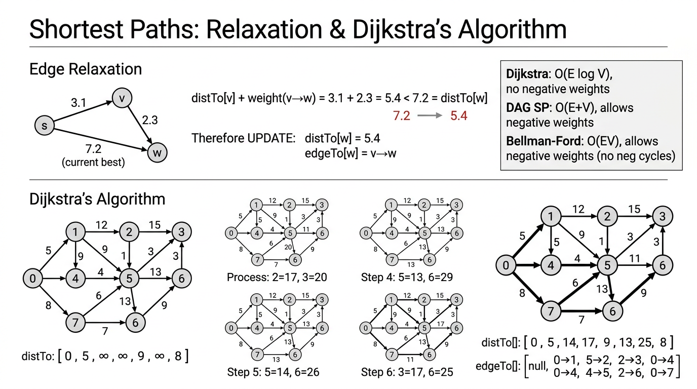
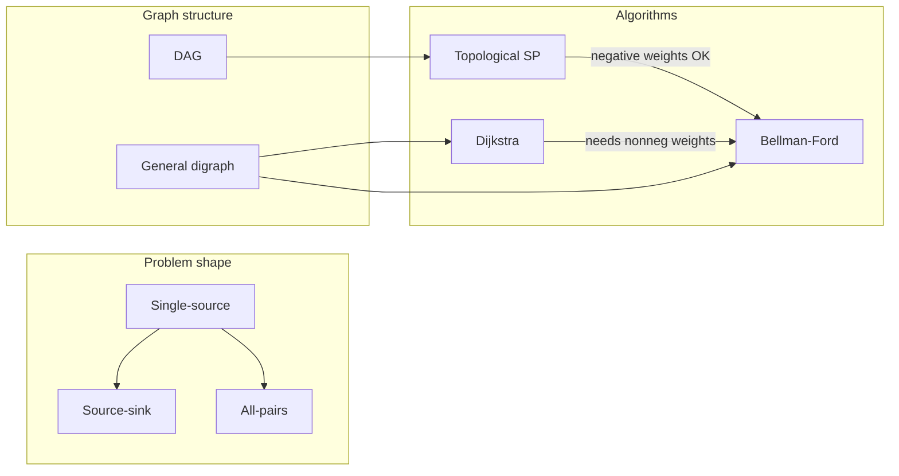

# Shortest Paths — COMP0005 Algorithms

Lecture-style notes on **single-source** and related shortest-path problems on **edge-weighted digraphs**, relaxation, and the main algorithms (DAG, Dijkstra, Bellman–Ford).

---

## 1. COMPLETE TOPIC SUMMARIES

### Problem variants

- **Source–sink**: find a shortest path from a fixed start vertex \(s\) to a fixed target \(t\). Often solved by running a single-source algorithm and reading off \(\texttt{distTo}[t]\) (or stopping early if the algorithm allows).
- **Single-source**: shortest path from \(s\) to **every** other vertex. This is the standard setup for Dijkstra, DAG shortest paths, and Bellman–Ford.
- **All-pairs**: shortest paths between **all** ordered pairs \((u,v)\). Can repeat a single-source method \(V\) times, or use specialised methods (e.g. Floyd–Warshall — not detailed here).

**Simplifying assumption (for exposition):** shortest paths from \(s\) to each reachable vertex **exist**. That fails if a **negative cycle** reachable from \(s\) allows arbitrarily small path cost; algorithms must detect or assume that away.

### Edge-weighted digraph representation

- Use an **adjacency list**: each vertex \(v\) has a list of **outgoing** edges.
- A **directed edge** \(\texttt{DirectedEdge}(v,w,\text{weight})\) goes from \(v\) to \(w\).
- **`EdgeWeightedDigraph.addEdge(e)`** appends \(e\) only to **`adj[from]`** — not to both endpoints (unlike undirected graphs).

### Shortest paths tree (SPT)

For a fixed source \(s\), if shortest paths are well-defined, the union of one shortest path to each reachable vertex forms a **shortest-paths tree** rooted at \(s\) (a tree in the graph-theoretic sense on reachable vertices).

**Data structures:**

- \(\texttt{distTo}[v]\): length of the current best known path from \(s\) to \(v\) (often initialised to \(+\infty\) except \(\texttt{distTo}[s]=0\)).
- \(\texttt{edgeTo}[v]\): the **last edge** on that best path (from some \(u\) into \(v\)).

**Reconstructing a path to \(v\):** follow \(\texttt{edgeTo}\) from \(v\) back toward \(s\); a **stack** reverses the order to print \(s \leadsto v\).

### Edge relaxation

**Relaxation** is the atomic step of shortest-path algorithms.

For edge \(e\) from \(v\) to \(w\) with weight \(w_e\):

- If \(\texttt{distTo}[v] + w_e < \texttt{distTo}[w]\), then going via \(v\) is better; **update** \(\texttt{distTo}[w]\) and set \(\texttt{edgeTo}[w] = e\).

```python
def relax(e):
    v = e.from()
    w = e.to()
    if distTo[v] + e.weight() < distTo[w]:
        distTo[w] = distTo[v] + e.weight()
        edgeTo[w] = e
```

Invariant (when weights are handled correctly): \(\texttt{distTo}[v]\) is always the length of **some** path from \(s\) to \(v\) (or \(\infty\) if none known yet).

### Generic algorithm

1. Initialise \(\texttt{distTo}[s] = 0\), \(\texttt{distTo}[v] = +\infty\) for \(v \neq s\), and \(\texttt{edgeTo}\) appropriately.
2. **Repeat:** relax any edge \(v \to w\) that is **tense**, i.e. \(\texttt{distTo}[v] + w_{vw} < \texttt{distTo}[w]\).
3. **Design question:** *which* edge to relax next, and how many relaxations are needed?

Different algorithms = different **order** of relaxation + **termination** guarantees under different assumptions.


*Top: edge relaxation — if path through v to w is shorter than current best to w, update. Bottom: Dijkstra's algorithm processes vertices in order of distance from source, building the shortest-paths tree. Comparison box shows when to use each algorithm.*

### Dijkstra’s algorithm

**Assumption:** all edge weights are **non-negative** (\(\geq 0\)).

**Idea:** maintain a set of vertices whose shortest distance from \(s\) is **final**. Repeatedly pick the **closest** unfinalised vertex \(v\), declare it final, and **relax all edges out of \(v\)**.

**Implementation:** a **min-indexed priority queue** on vertices keyed by \(\texttt{distTo}\).

```python
class DijkstraSP:
    def __init__(self, G, s):
        self.edgeTo = [None] * G.V()
        self.distTo = [INFINITY] * G.V()
        self.distTo[s] = 0
        self.pq = MinPQ()
        self.pq.insert(s, 0)
        while not self.pq.isEmpty():
            v = self.pq.delMin()
            for e in G.adj(v):
                self.relax(e)
    def relax(self, e):
        v = e.from(); w = e.to()
        if self.distTo[w] > self.distTo[v] + e.weight():
            self.distTo[w] = self.distTo[v] + e.weight()
            self.edgeTo[w] = e
            if self.pq.contains(w):
                self.pq.decreaseKey(w, self.distTo[w])
            else:
                self.pq.insert(w, self.distTo[w])
```

**Complexity:**

- **Binary heap:** \(O(E \log V)\) — each edge may cause one decrease-key/insert; `delMin` is \(O(\log V)\).
- **Array (linear scan for min):** \(O(V^2)\) — can be **better for dense** graphs where \(E \approx V^2\).

### Shortest paths in an edge-weighted DAG

**Assumption:** the graph is a **DAG** (no directed cycles).

**Idea:** take a **topological order** of vertices. Visit vertices in that order; for each \(v\), relax **all outgoing** edges. When you reach \(v\), all incoming updates from earlier vertices are already done.

```python
class AcyclicSP:
    def __init__(self, G, s):
        self.edgeTo = [None] * G.V()
        self.distTo = [INFINITY] * G.V()
        self.distTo[s] = 0
        topological = DepthFirstOrder(G).reverse()
        while not topological.isEmpty():
            v = topological.pop()
            for e in G.adj(v):
                self.relax(e)
```

**Complexity:** \(O(V + E)\) — dominated by topological sort plus one pass over edges.

**Negative weights:** allowed — there are no cycles to accumulate unbounded benefit from, so the topological pass is still correct.

### Why Dijkstra fails with negative edges

Dijkstra **finalises** \(\texttt{distTo}[v]\) when \(v\) is removed from the PQ as the current minimum. That is only safe if **no future edge** can offer a cheaper route to an already-finalised vertex.

With a **negative** edge, a path that looked worse earlier can become optimal after more edges — so “locking in” the minimum too early is **wrong**.

**Why “add a constant to all weights” fails:** paths with different **numbers of edges** change by different totals (\(k\) edges shift by \(k \cdot c\)), so comparing path lengths after such a shift **distorts** the ordering of paths.

### Negative cycles

A **negative cycle** is a directed cycle whose **total weight** is \(< 0\).

If such a cycle is **reachable from \(s\)**, shortest path **distance is not well-defined** (you can loop the cycle to make path length arbitrarily small). No finite **SPT** captures “shortest” in that case.

### Bellman–Ford algorithm

**Assumption:** **no negative cycles** reachable from \(s\) (negative **edges** are OK).

**Idea:** repeat \(V\) rounds: in each round, relax **every** edge. After round \(k\), paths using at most \(k\) edges are accounted for; after \(V-1\) rounds, shortest **simple** paths (at most \(V-1\) edges) are found. The \(V\)-th pass detects improvement only if a negative cycle exists.

```python
distTo = [INFINITY] * G.V()
distTo[s] = 0
for i in range(G.V()):
    for v in range(G.V()):
        for e in G.adj(v):
            relax(e)
```

**Complexity:** \(O(V \cdot E)\).

**Queue-based (SPFA-style) improvement:** maintain a queue of vertices whose \(\texttt{distTo}\) **changed**; only relax edges **out of** those vertices. **Typical** behaviour can be much better (\(O(E+V)\)-ish on many inputs), but **worst case** remains \(O(V \cdot E)\).

### Summary table

| Algorithm | Restriction | Typical | Worst | Extra space |
|-----------|-------------|---------|-------|-------------|
| DAG (topological) | No cycles | \(O(V+E)\) | \(O(V+E)\) | \(O(V)\) |
| Dijkstra (binary heap) | No negative weights | \(O(E \log V)\) | \(O(E \log V)\) | \(O(V)\) |
| Bellman–Ford | No negative cycles | \(O(VE)\) | \(O(VE)\) | \(O(V)\) |
| Bellman–Ford (queue) | No negative cycles | often \(\approx O(V+E)\) | \(O(VE)\) | \(O(V)\) |

---

## 2. EXAM-STYLE QUESTIONS (WITH MODEL ANSWERS)

### Q1 — When is Dijkstra’s greedy choice valid?

**Question:** State the edge-weight assumption under which Dijkstra’s algorithm is correct. Give a **small** example (sketch) where Dijkstra fails if that assumption is violated.

**Model answer:** Dijkstra requires **non-negative** edge weights. If some weight is negative, the vertex with smallest tentative distance might be finalised too early: a longer-looking path can later be shortened by a negative edge. Example pattern: \(s \to a\) weight \(1\), \(s \to b\) weight \(10\), \(b \to a\) weight \(-20\); the true shortest distance to \(a\) may go through \(b\), but Dijkstra may process \(a\) before discovering the cheaper route.

---

### Q2 — DAG shortest paths vs Dijkstra

**Question:** The DAG algorithm runs in \(O(V+E)\) and can use **negative** weights. Dijkstra runs in \(O(E \log V)\) and cannot. Explain **conceptually** why the DAG restriction buys both speed and tolerance for negative weights.

**Model answer:** In a DAG, a **topological order** ensures that when we process \(v\), **no** path to \(v\) can be improved by vertices **later** in the order — there are no back-edges along any path. So one relaxation pass in order is enough. Negative edges cannot create “revisit and improve” cycles. Dijkstra’s proof relies on **non-negativity** so that the smallest tentative distance cannot later be undercut by unexplored vertices.

---

### Q3 — Bellman–Ford rounds

**Question:** Why does the textbook Bellman–Ford loop run about **\(V\)** times? What does an extra improvement on the \(V\)-th pass indicate?

**Model answer:** Any **simple** shortest path has at most \(V-1\) edges. Each outer iteration allows paths that use one more edge to propagate relaxations. After \(V-1\) iterations, all simple-path shortest distances stabilise if no negative cycle exists. If **some** edge can still be relaxed on iteration \(V\), distances can keep decreasing indefinitely along a **negative cycle**, so the graph has a **negative cycle** reachable from the source (in the standard detection setup).

---

### Q4 — Negative cycle and well-defined shortest paths

**Question:** Define a **negative cycle**. Why does the existence of a negative cycle **reachable from \(s\)** mean there is no well-defined shortest path distance to some vertices?

**Model answer:** A negative cycle is a directed cycle whose total weight is **strictly less than zero**. If reachable from \(s\), append that cycle \(k\) times to any path ending on the cycle: total weight decreases without bound as \(k \to \infty\). So “shortest” is not a finite minimum — only **minimum walk** might be \(-\infty\) in principle.

---

### Q5 — Complexity comparison

**Question:** Compare Dijkstra (binary heap) and Bellman–Ford in **big-\(O\)** worst-case time. When might you **prefer** Bellman–Ford despite worse asymptotic worst case?

**Model answer:** Dijkstra with a binary heap is \(O(E \log V)\) for non-negative weights. Bellman–Ford is \(O(VE)\). Prefer Bellman–Ford when **negative edges** may appear but **negative cycles** do not (or you need to **detect** them). Also, queue-based Bellman–Ford can be fast in practice on sparse “easy” graphs even though worst case stays \(O(VE)\).

---

## 3. MUST-KNOW KEY POINTS

- **Relaxation:** \(\texttt{distTo}[w] \gets \min(\texttt{distTo}[w],\, \texttt{distTo}[v] + w_{vw})\), updating \(\texttt{edgeTo}[w]\) when improved.
- **SPT:** \(\texttt{edgeTo}\) + \(\texttt{distTo}\) encode a tree of shortest paths from \(s\) when the model is well-posed.
- **Dijkstra:** non-negative weights; grow finalised set by **smallest** \(\texttt{distTo}\); \(O(E \log V)\) with a binary heap.
- **DAG SP:** topological order + relax outgoing edges; \(O(V+E)\); **negative weights OK**.
- **Why not shift weights:** adding a constant to every edge **does not** preserve shortest-path order across paths of different lengths.
- **Negative cycle:** breaks finite shortest paths when reachable from \(s\).
- **Bellman–Ford:** \(V\) rounds of relaxing **all** edges; \(O(VE)\); handles negative edges if no negative cycles; \(V\)-th improvement \(\Rightarrow\) negative cycle (standard detection narrative).

---

## 4. HIGH-PRIORITY TOPICS

### 🔴 Must know

- Definitions: **single-source**, **SPT**, **relaxation**, **tense edge**
- **Dijkstra:** assumption (non-negative), greedy invariant, **heap** vs **array** complexity
- **DAG algorithm:** topological order, \(O(V+E)\), negative weights allowed
- **Failure modes:** Dijkstra + negative edges; **negative cycles** and undefined distances
- **Bellman–Ford:** triple loop structure, \(O(VE)\), role of \(V\) iterations, negative-cycle detection idea

### 🟡 Important

- **Edge-weighted digraph** API: `addEdge` only on **from**-vertex’s adjacency list
- **pathTo** via \(\texttt{edgeTo}\) and a stack
- **Generic algorithm:** “relax until no tense edges” — algorithms differ by **order**
- **Practical** Bellman–Ford: queue of changed vertices (better typical, same worst case)
- **Dense vs sparse:** when \(O(V^2)\) Dijkstra can beat \(O(E \log V)\)

### 🟢 Useful but lower priority

- **All-pairs** as “run single-source \(V\) times” (conceptual bridge)
- Constant factors in PQ operations vs theoretical bounds
- Early termination variants for Dijkstra when only \(t\) is needed (conceptual)

---

## 5. TOPIC INTERCONNECTIONS & BIGGER PICTURE



**Narrative:** Almost all shortest-path machinery is **relaxation** plus a **smart order** of processing vertices/edges. **Topological order** exploits **acyclicity** for a single \(O(V+E)\) sweep. **Dijkstra** exploits **non-negativity** for a **best-first** order with a priority queue. **Bellman–Ford** drops both assumptions (except banning **negative cycles**) and pays with \(O(VE)\) worst-case robustness. **Negative cycles** are the fundamental obstruction to **well-defined** shortest paths.

This topic closes the loop with earlier course material: **topological sort** and **DFS-based ordering** feed the DAG shortest path algorithm; **priority queues** and **graph representations** from ADTs/heaps underpin Dijkstra.

---

## 6. EXAM STRATEGY TIPS

- For “**which algorithm**?” questions, write a **checklist**: *negative edges?* *negative cycles?* *DAG?* *non-negative?* — then match to **DAG / Dijkstra / Bellman–Ford**.
- When asked for **correctness**, anchor on **relaxation invariants** and what **ordering** guarantees that no future update can violate a finalised distance.
- **Counterexamples** beat long prose: one **3–4 vertex** digraph with a single negative edge often suffices to break Dijkstra.
- **Big-\(O\):** state whether the heap or array PQ is assumed; mention **dense** \(E \approx V^2\) vs **sparse** graphs for Dijkstra variants.
- **Negative cycles:** be precise — “reachable from \(s\)” matters for **single-source** pathology.
- In **trace** questions, maintain \(\texttt{distTo}\) and \(\texttt{edgeTo}\) (or show PQ contents) step by step; examiners reward **clear tables**.

---

*Course context: COMP0005 Algorithms — aligns with Sedgewick/Wayne-style treatment of shortest paths on edge-weighted digraphs.*
