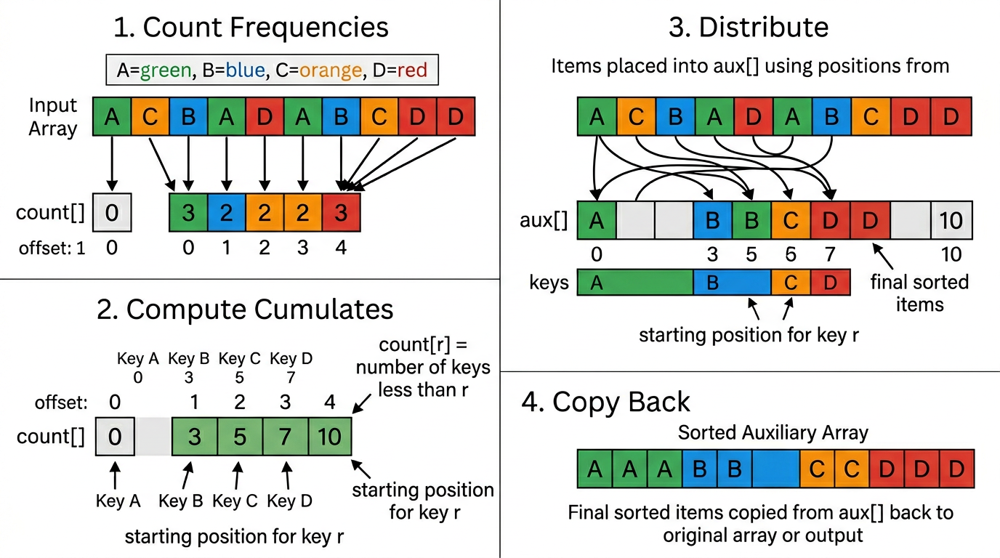
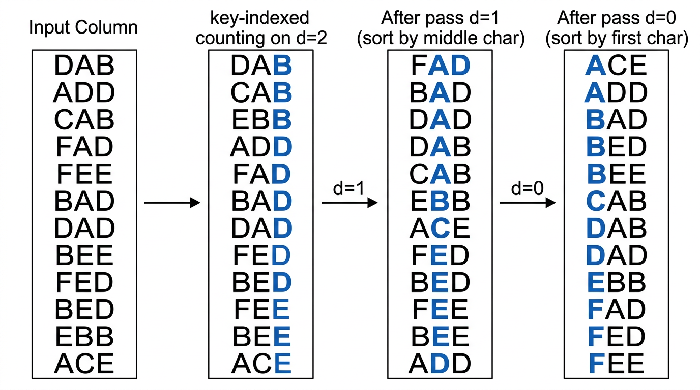

# String Sorting — COMP0005 Algorithms

*Lecture-style notes. Comparison-based sorting has a lower bound of **\(\sim N \lg N\)**. When keys are **strings** drawn from an alphabet of size **\(R\)**, we can exploit the **character-by-character** structure to sort in **linear** or near-linear time using **radix sorts**. The building block is **key-indexed counting**.*

---

## 1. COMPLETE TOPIC SUMMARIES

### Strings and alphabets

A **string** is a sequence of characters from a fixed **alphabet** of size **\(R\)** (the **radix**).

| Alphabet | R | lg R | Characters |
|----------|---|------|------------|
| Binary | 2 | 1 | 0 1 |
| DNA | 4 | 2 | A C T G |
| Hexadecimal | 16 | 4 | 0–9 A–F |
| ASCII | 128 | 7 | Standard ASCII |
| Extended ASCII | 256 | 8 | Extended ASCII |
| Unicode 16 | 65 536 | 16 | Unicode BMP |

**Standard operations:** length, indexing (the \(i\)th character), substring extraction, concatenation.

---

### Key-indexed counting

**Assumption.** Keys are integers in **\([0, R-1]\)**. Because \(R\) is small, we can use the key itself as an array index.

**Algorithm (4 steps):**

1. **Count frequencies.** For each item, increment `count[key + 1]`. The `+1` offset simplifies the next step.
2. **Compute cumulates.** For each `r`, set `count[r+1] += count[r]`. After this, `count[r]` equals the number of keys **strictly less than** `r` — i.e. the first output position available for key `r`.
3. **Distribute.** Scan the input left-to-right. Place each item at `aux[count[key]]`, then increment `count[key]`. This preserves input order among equal keys (**stability**).
4. **Copy back.** Copy `aux[]` into the original array.

**Pseudocode:**

```python
def key_indexed_sort(a, R):
    N = len(a)
    count = [0] * (R + 1)
    aux = [None] * N

    for i in range(N):                # Step 1: frequencies
        count[a[i].key + 1] += 1
    for r in range(R):                # Step 2: cumulates
        count[r + 1] += count[r]
    for i in range(N):                # Step 3: distribute
        aux[count[a[i].key]] = a[i]
        count[a[i].key] += 1
    for i in range(N):                # Step 4: copy back
        a[i] = aux[i]
```

**Analysis:**

| Property | Value |
|----------|-------|
| Time | \(\sim N + R\) |
| Space | \(\sim N + R\) |
| In-place? | No |
| Stable? | **Yes** |

Stability is critical: it allows radix sorts to build on key-indexed counting pass by pass.


*The four steps of key-indexed counting: count frequencies (offset by 1), compute cumulates, distribute items stably into aux[], and copy back.*

---

### LSD radix sort (least-significant-digit first)

**Assumption.** All strings have the **same fixed length** \(W\).

**Idea.** Sort by each character position, starting from the **rightmost** (position \(W-1\)) and moving left to position 0. Each pass uses **key-indexed counting** on one character position.

**Why it works (correctness by stability):**

- After pass \(d\), all strings are sorted by their **last \(W - d\)** characters.
- At pass \(d-1\), key-indexed counting sorts stably on position \(d-1\). Strings that differ at position \(d-1\) are separated correctly. Strings that **agree** at position \(d-1\) retain their relative order from the previous pass (stability), so they remain sorted by the trailing characters.


*LSD radix sort processes characters right-to-left. Each pass uses key-indexed counting on one character position; stability preserves the ordering from previous passes.*

**Pseudocode:**

```python
def lsd_sort(a, W):
    N = len(a)
    R = 256  # radix (e.g. extended ASCII)
    aux = [None] * N

    for d in range(W - 1, -1, -1):        # right to left
        count = [0] * (R + 1)
        for i in range(N):
            count[ord(a[i][d]) + 1] += 1
        for r in range(R):
            count[r + 1] += count[r]
        for i in range(N):
            aux[count[ord(a[i][d])]] = a[i]
            count[ord(a[i][d])] += 1
        for i in range(N):
            a[i] = aux[i]
```

**Analysis:**

| Property | Value |
|----------|-------|
| Time | \(\sim W \cdot (N + R)\), effectively \(O(WN)\) for fixed \(R\) |
| Space | \(\sim N + R\) |

For fixed-length keys where \(W\) is a small constant (e.g. licence plates, phone numbers), LSD is **linear** in \(N\).

---

### MSD radix sort (most-significant-digit first)

**Idea.** Partition strings by their **first** character using key-indexed counting, then **recursively** sort each partition on the **next** character. Subproblems shrink because each partition shares a common prefix.

**End-of-string handling.** Strings may have **variable** lengths. When a string is shorter than the current depth \(d\), treat its character as **-1** (a sentinel that sorts **before** any real character). In the count array this is handled by using offset `+2` instead of `+1`.

**Pseudocode:**

```python
def msd_sort(a, aux, lo, hi, d):
    if hi <= lo:
        return
    R = 256
    count = [0] * (R + 2)

    for i in range(lo, hi + 1):
        count[char_at(a[i], d) + 2] += 1
    for r in range(R + 1):
        count[r + 1] += count[r]
    for i in range(lo, hi + 1):
        aux[count[char_at(a[i], d) + 1]] = a[i]
        count[char_at(a[i], d) + 1] += 1
    for i in range(lo, hi + 1):
        a[i] = aux[i - lo]

    for r in range(R):
        msd_sort(a, aux, lo + count[r], lo + count[r + 1] - 1, d + 1)

# Initial call: msd_sort(a, [None]*len(a), 0, len(a)-1, 0)
```

where `char_at(s, d)` returns `ord(s[d])` if `d < len(s)`, else `-1`.

**Analysis:**

| Property | Value |
|----------|-------|
| Time (worst) | \(\sim W \cdot N\) (all strings identical up to length \(W\)) |
| Time (average, random) | \(\sim N \log_R N\) |
| Space | \(\sim N + D \cdot R\) where \(D\) is recursion depth (longest common prefix) |

**MSD vs LSD:**

| | LSD | MSD |
|-|-----|-----|
| String length | Fixed \(W\) | Variable |
| Order of passes | Right → left | Left → right (recursive) |
| Small subarrays | N/A | Can be expensive (each creates a `count[]` of size \(R\)) |
| Average time | \(\sim WN\) | \(\sim N \log_R N\) (sublinear in string length) |

**Practical optimisation.** Switch to insertion sort for small subarrays to avoid the \(R\)-sized `count[]` overhead on tiny partitions.

---

### Comparison with comparison-based sorts

| Algorithm | Guarantee | Stable | Notes |
|-----------|-----------|--------|-------|
| Comparison sorts | \(\sim N \lg N\) lower bound | varies | General keys |
| Key-indexed counting | \(\sim N + R\) | Yes | Integer keys in \([0, R)\) |
| LSD radix sort | \(\sim WN\) | Yes | Fixed-length strings |
| MSD radix sort | \(\sim N \log_R N\) avg | Yes | Variable-length strings |

Radix sorts bypass the \(N \lg N\) comparison lower bound because they examine individual **characters**, not whole-key comparisons.

---

## 2. EXAM-STYLE QUESTIONS (WITH MODEL ANSWERS)

### Q1 — Key-indexed counting trace

**Question.** Given the array `[C, A, B, A, D, C, B, A]` with alphabet `{A=0, B=1, C=2, D=3}`, trace the four steps of key-indexed counting.

**Model answer.**

Step 1 (frequencies, offset by 1): `count = [0, 3, 2, 2, 1]`.

Step 2 (cumulates): `count = [0, 3, 5, 7, 8]`.

Step 3 (distribute): scan left-to-right, place each item at `aux[count[key]]`, increment. Result: `aux = [A, A, A, B, B, C, C, D]`.

Step 4 (copy back): `a = [A, A, A, B, B, C, C, D]`.

---

### Q2 — LSD correctness

**Question.** Explain why LSD radix sort is correct, given that it processes characters from right to left.

**Model answer.** After pass \(d\), all strings are correctly sorted by their last \(W - d\) characters. At the next pass (\(d-1\)), key-indexed counting sorts stably on character \(d-1\). Strings differing at position \(d-1\) are placed in the correct order. Strings agreeing at position \(d-1\) retain their relative order from the previous pass because key-indexed counting is stable. By induction, after all \(W\) passes the strings are sorted by all characters.

---

### Q3 — MSD vs LSD

**Question.** When would you prefer MSD over LSD radix sort?

**Model answer.** MSD is preferred when strings have **variable lengths** (LSD requires fixed length) or when strings have **long common prefixes** that diverge early (MSD can stop recursing once groups are singleton). On average MSD examines \(\sim N \log_R N\) characters, which can be much less than the \(WN\) characters LSD always examines when \(W\) is large.

---

### Q4 — Why stability matters

**Question.** What goes wrong if the per-character sort in LSD radix sort is not stable?

**Model answer.** If the sort at pass \(d\) is unstable, equal-key items can be reordered arbitrarily. Items that were previously sorted by their later characters (positions \(d+1, \ldots, W-1\)) would lose that ordering. The final result would not be sorted, because the order established by earlier (rightward) passes would be destroyed.

---

### Q5 — MSD space usage

**Question.** Explain why MSD radix sort uses \(\sim N + D \cdot R\) space, where \(D\) is the recursion depth.

**Model answer.** The auxiliary array `aux[]` of size \(N\) is shared across all calls. However, each recursive call allocates a `count[]` array of size \(R + 2\). In the worst case, the recursion depth is \(D\) (the length of the longest common prefix among all strings), so up to \(D\) `count[]` arrays coexist on the call stack, giving \(D \cdot R\) additional space.
