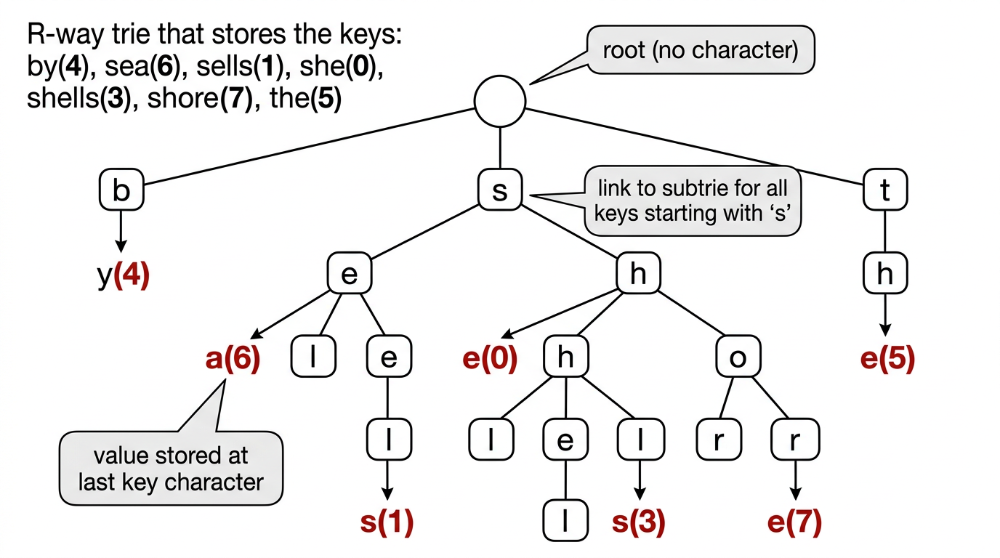
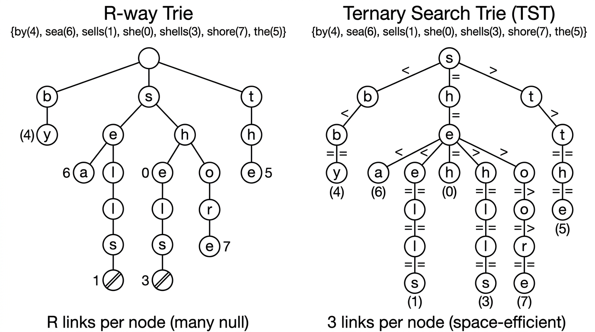

# Tries & String Search — COMP0005 Algorithms

*Lecture-style notes. **Tries** are tree-shaped symbol tables where each node represents a **single character**, not a whole key. **R-way tries** offer fast lookup but waste space; **ternary search tries (TSTs)** fix the space problem while keeping sublinear search-miss times. Both support an **extended API** with prefix matching and sorted iteration that hash tables cannot provide.*

---

## 1. COMPLETE TOPIC SUMMARIES

### R-way tries

**Structure.** A trie (from "re**trie**val") is a tree in which:

- The **root** has no character; every other node stores **one character**.
- Each node has an array of **\(R\)** child links (one per alphabet character).
- A node may also hold a **value**; a key's value is stored in the node reached by following the key's characters from the root.
- Characters and keys are **implicit**: a character is determined by the link index used to reach a node, and a key is the concatenation of characters on the path from the root.


*An R-way trie for seven keys. Each node stores one character; values appear at terminal nodes. Null links are not drawn.*

**Search.**

1. Start at the root.
2. Follow the child link for the next character of the key.
3. **Search hit:** reach the node corresponding to the last character and its value is non-null — return the value.
4. **Search miss:** reach a null link before exhausting the key, **or** reach the last-character node but its value is null — return null.

**Insert.**

1. Follow links for each character, creating new nodes for any null links encountered.
2. At the node for the last character, set (or update) the value.

**Pseudocode:**

```python
class TrieST:
    class Node:
        def __init__(self):
            self.value = None
            self.children = [None] * R

    def __init__(self):
        self.root = self.Node()

    def get(self, key):
        node = self._get(self.root, key, 0)
        return None if node is None else node.value

    def _get(self, node, key, d):
        if node is None:
            return None
        if d == len(key):
            return node
        return self._get(node.children[ord(key[d])], key, d + 1)

    def put(self, key, value):
        self.root = self._put(self.root, key, value, 0)

    def _put(self, node, key, value, d):
        if node is None:
            node = self.Node()
        if d == len(key):
            node.value = value
            return node
        c = ord(key[d])
        node.children[c] = self._put(node.children[c], key, value, d + 1)
        return node
```

**Performance:**

| Operation | Cost |
|-----------|------|
| Search hit | \(O(L)\) where \(L\) = key length (examine all characters) |
| Search miss | \(O(L)\) worst case, but typically **sublinear** (few characters before hitting null) |
| Insert | \(O(L)\) |
| Space per node | \(R\) links (many null) |

**Space problem.** Each leaf has \(R\) null links. For large alphabets (e.g. Unicode, \(R = 65\,536\)), this is prohibitive even when few keys share prefixes.

---

### Ternary search tries (TSTs / 3-way tries)

**Key idea.** Replace the \(R\)-way branching array with a **3-way** comparison at each node:

- **Left child:** keys whose current character is **less than** the node's character.
- **Middle child:** keys whose current character **equals** the node's character (advance to the next character).
- **Right child:** keys whose current character is **greater than** the node's character.

Each node stores: a **character**, a **value** (may be null), and three child pointers (left, mid, right).


*Left: an R-way trie with R links per node (many null). Right: the equivalent TST with only 3 links per node — far more space-efficient for large alphabets.*

**Search.**

1. Compare the current key character with the node's character.
2. If **less**, go left (same character position).
3. If **greater**, go right (same character position).
4. If **equal**, go to the middle child and advance to the next character.
5. Hit/miss conditions are the same as R-way tries.

**Insert.** Same traversal logic; create nodes as needed; set value at the terminal node.

**Pseudocode:**

```python
class TST:
    class Node:
        def __init__(self):
            self.char = None
            self.value = None
            self.left = self.mid = self.right = None

    def __init__(self):
        self.root = None

    def get(self, key):
        node = self._get(self.root, key, 0)
        return None if node is None else node.value

    def _get(self, node, key, d):
        if node is None:
            return None
        c = key[d]
        if c < node.char:
            return self._get(node.left, key, d)
        elif c > node.char:
            return self._get(node.right, key, d)
        elif d < len(key) - 1:
            return self._get(node.mid, key, d + 1)
        else:
            return node

    def put(self, key, value):
        self.root = self._put(self.root, key, value, 0)

    def _put(self, node, key, value, d):
        c = key[d]
        if node is None:
            node = self.Node()
            node.char = c
        if c < node.char:
            node.left = self._put(node.left, key, value, d)
        elif c > node.char:
            node.right = self._put(node.right, key, value, d)
        elif d < len(key) - 1:
            node.mid = self._put(node.mid, key, value, d + 1)
        else:
            node.value = value
        return node
```

**Performance comparison:**

| | R-way trie | TST |
|---|---|---|
| Links per node | \(R\) (many null) | 3 (left, mid, right) |
| Total links | \(\sim R \cdot N\) (worst) | \(\sim 4N\) |
| Search hit | \(O(L)\) | \(O(L + \ln N)\) |
| Search miss | Sublinear | Sublinear |
| Space | Wasteful for large \(R\) | **Space-efficient** |

TSTs are as fast as hashing for string keys and faster on search misses, while also supporting the extended ordered API below.

---

### Extended trie API

Tries (both R-way and TST) support operations that hash tables **cannot**:

| Operation | Description |
|-----------|-------------|
| `keys()` | Return all keys in **sorted order** |
| `keysWithPrefix(s)` | Return all keys that start with prefix `s` |
| `longestPrefixOf(s)` | Return the longest key that is a prefix of `s` |

**`keys()` — sorted iteration.**

Perform an **in-order traversal** of the trie, maintaining the current prefix as a string. Whenever a node with a non-null value is reached, enqueue the current prefix.

```python
def keys(self):
    queue = []
    self._collect(self.root, "", queue)
    return queue

def _collect(self, node, prefix, queue):
    if node is None:
        return
    if node.value is not None:
        queue.append(prefix)
    for c in range(R):
        if node.children[c] is not None:
            self._collect(node.children[c], prefix + chr(c), queue)
```

**`keysWithPrefix(s)` — prefix match.**

Navigate to the node \(x\) corresponding to prefix `s` (using `_get`), then `_collect` from \(x\) using `s` as the starting prefix.

```python
def keysWithPrefix(self, s):
    queue = []
    x = self._get(self.root, s, 0)
    self._collect(x, s, queue)
    return queue
```

**Applications:** autocomplete (user types a prefix, system returns all matching keys), IP routing (longest prefix match for packet forwarding).

---

### Symbol table implementation comparison

| Implementation | Search hit | Insert | Ordered ops | Space |
|----------------|-----------|--------|-------------|-------|
| Red-black BST | \(c \lg N\) | \(c \lg N\) | Yes | moderate |
| Hash table | \(O(1)\) avg | \(O(1)\) avg | **No** | moderate |
| R-way trie | \(O(L)\) | \(O(L)\) | Yes | \(R\) links/node |
| TST | \(O(L + \ln N)\) | \(O(L + \ln N)\) | Yes | 3 links/node |

Tries win when keys are **strings** and you need **prefix-based** queries or **sorted iteration**. Hash tables win when you only need `get`/`put` and don't care about ordering.

---

## 2. EXAM-STYLE QUESTIONS (WITH MODEL ANSWERS)

### Q1 — R-way trie search trace

**Question.** Draw an R-way trie (alphabet {a, b, c}) containing keys "ab" (value 1), "ac" (value 2), "b" (value 3). Trace `get("ac")` and `get("abc")`.

**Model answer.** The trie has root → child 'a' → children 'b' (value 1) and 'c' (value 2); root also has child 'b' (value 3).

`get("ac")`: root → 'a' (follow link for 'a') → 'c' (follow link for 'c') → value = 2. **Hit.**

`get("abc")`: root → 'a' → 'b' → follow link for 'c' → **null link**. **Miss.**

---

### Q2 — TST vs R-way trie space

**Question.** Explain why a TST is more space-efficient than an R-way trie for large alphabets.

**Model answer.** In an R-way trie, every node allocates an array of \(R\) child pointers, most of which are null. For \(R = 256\), even a leaf wastes 255 null pointers. A TST node has only 3 pointers (left, mid, right). The total number of links is \(\sim 4N\) (including the value pointer) regardless of alphabet size, compared to up to \(R \cdot N\) for an R-way trie.

---

### Q3 — keysWithPrefix implementation

**Question.** Explain how `keysWithPrefix("sh")` works on a trie containing {by, sea, sells, she, shells, shore, the}.

**Model answer.** First, follow links for 's' then 'h' to reach the subtrie rooted at the 'h' node under 's'. Then perform an in-order collect from that node, prepending "sh" as the prefix. The traversal visits 'e' (value for "she" found), then 'e' → 'l' → 'l' → 's' (value for "shells"), then 'o' → 'r' → 'e' (value for "shore"). Result: ["she", "shells", "shore"].

---

### Q4 — Why hash tables can't do prefix queries

**Question.** Why can't a hash table efficiently support `keysWithPrefix`?

**Model answer.** A hash function scatters keys uniformly across buckets — keys sharing a common prefix are **not** stored near each other. To find all keys with a given prefix, you would have to examine **every** entry in the table (\(O(N)\)), because there is no structural relationship between a key's prefix and its bucket location. Tries, by contrast, store keys that share a prefix in the **same subtree**, so prefix queries only traverse the relevant part of the tree.
