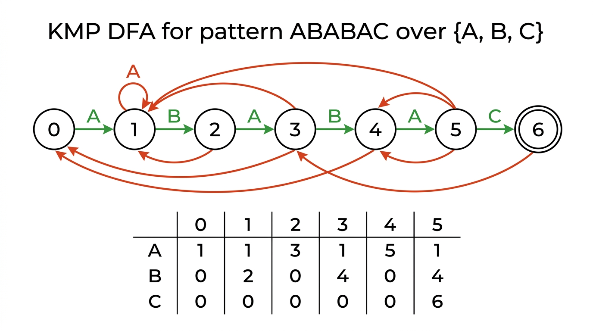
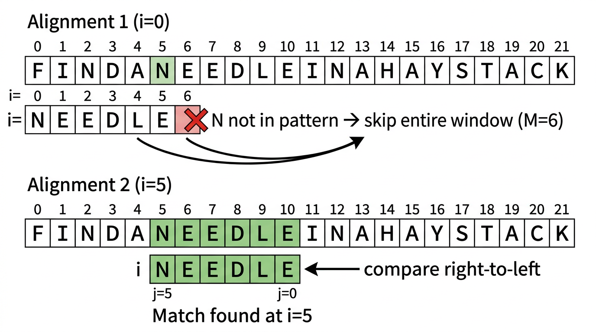

# Substring Search — COMP0005 Algorithms

*Lecture-style notes. Given a **pattern** of length \(M\) and a **text** of length \(N\) (with \(M \ll N\)), find the first occurrence of the pattern in the text. **Brute force** costs \(O(MN)\) worst case; **Knuth–Morris–Pratt (KMP)** guarantees \(O(N)\) by never backing up in the text; **Boyer–Moore** achieves **sublinear** \(\sim N/M\) on average by skipping characters.*

---

## 1. COMPLETE TOPIC SUMMARIES

### Brute-force substring search

**Idea.** Slide the pattern across the text one position at a time. At each alignment \(i\), compare the pattern character-by-character with the text starting at position \(i\).

- **Match:** advance the pattern index \(j\).
- **Mismatch:** reset \(j = 0\), advance \(i\) by 1, and start over.
- **Pattern found:** when \(j = M\), the pattern starts at position \(i\).

**Pseudocode:**

```python
def brute_search(pattern, text):
    M, N = len(pattern), len(text)
    for i in range(N - M + 1):
        for j in range(M):
            if text[i + j] != pattern[j]:
                break
        else:                    # inner loop completed without break
            return i             # match at position i
    return -1                    # not found
```

**Analysis:**

| | Cost |
|---|---|
| Best case | \(\sim N\) (mismatch at first character every time) |
| Worst case | \(\sim MN\) (e.g. pattern `AAAB` in text `AAAA...AAAB`) |

**Backup problem.** On a mismatch, brute force rewinds both \(i\) and \(j\). If the text is a **stream** (can only read forward), brute force needs a buffer of the last \(M\) characters. KMP eliminates this backup entirely.

---

### Knuth–Morris–Pratt (KMP) algorithm

**Key idea.** Build a **deterministic finite automaton (DFA)** from the pattern. Feed text characters one at a time — the DFA tracks how much of the pattern has been matched so far. On a mismatch, the DFA transitions to the correct **fallback state** instead of restarting from scratch, so the text pointer **never backs up**.

**DFA representation.** A 2D array `DFA[c][j]`:

- **\(j\)** is the current state (= number of pattern characters matched so far).
- **\(c\)** is the next text character.
- `DFA[c][j]` gives the **next state**.
- State \(M\) (= pattern length) is the **accept** state.

**State interpretation.** Being in state \(j\) means the last \(j\) characters of the text match the first \(j\) characters of the pattern.

**Search pseudocode:**

```python
def kmp_search(text, DFA, M):
    N = len(text)
    j = 0
    for i in range(N):
        j = DFA[ord(text[i])][j]
        if j == M:
            return i - M + 1      # match starts here
    return -1                      # not found
```

**DFA construction.** Two types of transitions:

1. **Match transition:** `DFA[pattern[j]][j] = j + 1` — the next character matches, advance one state.
2. **Mismatch transition:** `DFA[c][j] = DFA[c][X]` for all \(c \neq\) `pattern[j]` — copy the transition from the **restart state** \(X\).

The restart state \(X\) represents where the DFA would be if it had processed `pattern[1..j-1]` (the pattern shifted by one). \(X\) is maintained incrementally:

```python
def build_dfa(pattern, R):
    M = len(pattern)
    DFA = [[0] * M for _ in range(R)]
    DFA[ord(pattern[0])][0] = 1
    X = 0                             # restart state
    for j in range(1, M):
        for c in range(R):
            DFA[c][j] = DFA[c][X]     # mismatch: copy from X
        DFA[ord(pattern[j])][j] = j + 1  # match: advance
        X = DFA[ord(pattern[j])][X]   # update restart state
```

**Worked example.** Pattern = `ABABAC`, alphabet = {A, B, C}.

| State j | 0 | 1 | 2 | 3 | 4 | 5 |
|---------|---|---|---|---|---|---|
| A | **1** | **1** | **3** | **1** | **5** | **1** |
| B | 0 | **2** | 0 | **4** | 0 | **4** |
| C | 0 | 0 | 0 | 0 | 0 | **6** |

Bold entries are match transitions; the rest are mismatch transitions copied from state \(X\).


*The KMP DFA for pattern ABABAC. Green arrows are match transitions (advance one state); red/orange arrows are mismatch transitions (fall back to the restart state). The transition table below encodes the full automaton.*

**Interactive demo (browser).** [KMP DFA builder &amp; search](../demos/kmp-visualiser/index.html) — same `build_dfa` logic as scratch `kmp.py`, plus a search trace.

**Analysis:**

| | Cost |
|---|---|
| DFA construction | \(\sim RM\) time and space |
| Search | \(\sim M + N\) (exactly \(N\) character accesses, no backup) |

KMP is optimal for **streaming** text because it processes each character exactly once.

---

### Boyer–Moore algorithm (simplified — bad-character rule)

**Key idea.** Align the pattern with the text and compare **right-to-left** (from the last pattern character backward). On a mismatch, use a precomputed **rightmost-occurrence** table to skip the pattern forward by more than one position.

**Rightmost-occurrence table.** For each character \(c\) in the alphabet, `right[c]` = index of the rightmost occurrence of \(c\) in the pattern, or \(-1\) if \(c\) doesn't appear.

```python
def build_right(pattern, R):
    right = [-1] * R
    for j in range(len(pattern)):
        right[ord(pattern[j])] = j
    return right
```

**Skip logic.** When `text[i+j] != pattern[j]`:

- **Case 1 (character not in pattern):** the mismatched text character doesn't appear anywhere in the pattern. Skip the entire pattern past this position: `i += j + 1`.
- **Case 2 (character in pattern):** the mismatched text character appears at position `right[c]` in the pattern. Align that occurrence with the text position: `skip = j - right[c]`. If this would be ≤ 0 (rightmost occurrence is to the **right** of the mismatch), skip by 1 instead.


*Boyer-Moore's bad-character rule in action. When the rightmost character mismatches a text character absent from the pattern, the entire window skips forward by M positions.*

**Pseudocode:**

```python
def bm_search(pattern, text, right):
    M, N = len(pattern), len(text)
    i = 0
    while i <= N - M:
        skip = 0
        j = M - 1
        while j >= 0:
            if pattern[j] != text[i + j]:
                skip = max(1, j - right[ord(text[i + j])])
                break
            j -= 1
        if skip == 0:
            return i                  # all characters matched
        i += skip
    return -1                         # not found
```

**Analysis:**

| | Cost |
|---|---|
| Preprocessing | \(\sim M + R\) |
| Search (average) | \(\sim N / M\) (**sublinear** — skips most of the text) |
| Search (worst) | \(\sim MN\) (e.g. pattern = `BAAAA...A`, text = `AAAA...A`) |

**Why sublinear?** When the rightmost pattern character mismatches a text character that isn't in the pattern at all, the entire window slides forward by \(M\) positions, meaning most text characters are never examined.

---

### Algorithm comparison

| Algorithm | Preprocessing | Search guarantee | Backup? | Average |
|-----------|--------------|-----------------|---------|---------|
| Brute force | — | \(MN\) | Yes | \(\sim 1.1N\) |
| KMP | \(RM\) | \(N\) | **No** | \(\sim 1.1N\) |
| Boyer–Moore | \(M + R\) | \(MN\) | Yes | \(\sim N/M\) |

**When to use which:**

- **KMP:** streaming text (no backup), guaranteed linear time.
- **Boyer–Moore:** large alphabet, long pattern — the skip heuristic makes it very fast in practice.
- **Brute force:** short patterns or when simplicity matters more than worst-case guarantees.

---

## 2. EXAM-STYLE QUESTIONS (WITH MODEL ANSWERS)

### Q1 — Brute-force worst case

**Question.** Give a pattern and text that cause brute-force substring search to take \(\Theta(MN)\) comparisons. Explain why.

**Model answer.** Pattern = `AAAB`, text = `AAAAAAAAB`. At each alignment, brute force matches the first 3 A's before failing on the B, then shifts by 1. With \(M = 4\) and \(N = 9\), there are \(N - M + 1 = 6\) alignments, each requiring up to \(M = 4\) comparisons, giving \(\sim MN\) work. The pattern's repeating prefix ensures maximum wasted comparisons.

---

### Q2 — KMP DFA construction

**Question.** Build the KMP DFA for pattern `AABA` over alphabet {A, B}. Show the restart state \(X\) at each step.

**Model answer.**

Initialise: `DFA[A][0] = 1`, \(X = 0\).

\(j = 1\): pattern[1] = A (match → `DFA[A][1] = 2`). Mismatch: `DFA[B][1] = DFA[B][0] = 0`. Update \(X = DFA[A][0] = 1\).

\(j = 2\): pattern[2] = B (match → `DFA[B][2] = 3`). Mismatch: `DFA[A][2] = DFA[A][1] = 2`. Update \(X = DFA[B][1] = 0\).

\(j = 3\): pattern[3] = A (match → `DFA[A][3] = 4`). Mismatch: `DFA[B][3] = DFA[B][0] = 0`. Update \(X = DFA[A][0] = 1\).

| State | 0 | 1 | 2 | 3 |
|-------|---|---|---|---|
| A | 1 | 2 | 2 | 4 |
| B | 0 | 0 | 3 | 0 |

---

### Q3 — Boyer–Moore skip

**Question.** Pattern = `NEEDLE`, text = `FINDANEEDLEINAHAYSTACK`. Trace the first three alignments of Boyer–Moore, showing which characters are compared and how much is skipped.

**Model answer.** `right[N]=0, right[E]=5, right[D]=3, right[L]=4`. Pattern length \(M = 6\).

**Alignment 1** (\(i = 0\)): compare text[5] = 'N' with pattern[5] = 'E'. Mismatch. `right[N] = 0`, skip = max(1, 5 - 0) = 5. Set \(i = 5\).

**Alignment 2** (\(i = 5\)): compare text[10] = 'E' with pattern[5] = 'E'. Match. Compare text[9] = 'L' with pattern[4] = 'L'. Match. Continue matching rightward-to-left through text[8]='D', text[7]='E', text[6]='E', text[5]='N'. All match. \(j = 0\), skip = 0 → **match found at \(i = 5\)**.

---

### Q4 — KMP vs Boyer–Moore

**Question.** Explain one scenario where KMP is preferable to Boyer–Moore, and one where Boyer–Moore is preferable.

**Model answer.** **KMP preferred:** when the text is a stream that can only be read forward (e.g. network packets). KMP never backs up in the text — it processes each character exactly once. Boyer–Moore compares right-to-left within the window, which requires random access to text characters already passed.

**Boyer–Moore preferred:** searching for a long pattern in a large-alphabet text (e.g. an English word in a document). The bad-character heuristic frequently skips the pattern by \(M\) positions, giving \(\sim N/M\) average time — much faster than KMP's \(\sim N\).

---

### Q5 — Why right-to-left in Boyer–Moore?

**Question.** Why does Boyer–Moore compare the pattern right-to-left rather than left-to-right?

**Model answer.** Comparing right-to-left lets the algorithm **skip** large portions of the text on a mismatch. If the rightmost pattern character doesn't match a text character that isn't in the pattern at all, the entire \(M\)-character window can jump forward. Left-to-right comparison (as in brute force) would discover mismatches only after examining characters that provide no useful skip information, since the remaining unexamined pattern characters could still match.
