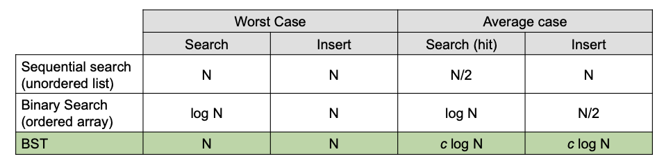

# symbol table
- abstract data type to handle key-value pairs
  - also known as `associative array`, `dictionary` or `map`
- basic operations
  - `put(key, value)`: insert a value with a specified key
  - `get(key)`: given a key, search for the corresponding value
- common assumptions
  - keys are unique
  - values are not `null`
  - keys have a total order relation:
    - antisymmetry: if $a \leq b$ and $b \leq a$ then $a = b$
    - transitivity: if $a \leq b$ and $b \leq c$ then $a \leq c$
    - totality: $a \leq b$ or $b \leq a$
  
## elementary implementation of symbol table
### linked list & sequential search
- data structure: unordered linked list of key-value pairs
- `get(key)`: scan through the list until a matching key is found
- `put(key, value)`: scan through the list
  - if a matching key is found, replace the associated value
  - if a matching key is not found, add the `(key, value)` pair to the front of the list
- cost: $N$ for both `get` and `put`
### ordered array & binary search
- data structure: ordered array of keys, plus another array of their associated values
- `get(key)`: binary search on `Keys[]`, then lookup in `Values[]`
- `put(key, value)`: binary search on `Keys[]`
  - if a matching key is found, replace the associated value
  - if a matching key is not found, use insertion sort (need to shift all greater key/value pairs over)
- cost: $\log N$ for `get`, $N$ for `put`

# binary search tree
- a tree is a non-linear abstract data type that can be either:
  - empty
  - a tree consisting of one node called the root, and zero or one or more disjoint (sub)trees, called children
- a binary tree is a tree where each node has at most two children (referred to as left child and right child)
- a binary tree is in `symmetric order` if each node has a key, and every node's key is:
  - larger than all keys in its left subtree
  - smaller than all keys in its right subtree
> - a binary search tree is a binary tree in symmetric order
## BST implementation
- `node` object contains
  - `key`
  - `value`
  - link to `left` node
  - link to `right` node
- `get(key)`:
  - if `key == node.key`, hit
  - if `key < node.key`, go left
  - if `key > node.key`, go right
- `put(key, value)`:
  - if `key == node.key`, update `node.value = value`
  - if `key < node.key`, go left
  - if `key > node.key`, go right
  - if `null`, insert new node
## BST pseudocode
```py
class Node: 

    def __init__(self, key, value):
        self.key = key
        self.value = value
        self.left = None
        self.right = None

    def get(self, key):
        if self.key == key:
            return self.value
        elif key < self.key amd self.left:
            reutrn self.left.get(key)
        elif key > self.key and self.right:
            return self.right.get(key)
        else:
            return None
        
    def put(self, key, value):
        if key == self.key:
            self.value = value
        elif key < self.key:
            if self.left is None:
                self.left = Node(key, value)
            else:
                self.left.put(key, value)
        elif key > self.key:
            if self.right is None:
                self.right = Node(key, value)
            else:
                self.right.put(key, value)
```

## BST analysis
- cost (number of compare operations)
  - `get`: $1 + D(t)$ (depth of tree)
  - `put`: $1 + D(t)$ (depth of tree)
- tree shape depends on order of insertion
  - may BSTs correspond to the same set of keys


Based on your PDF slides, here is the completion of your revision guide, covering the extended API, Deletion, 2-3 Trees, and Red-Black BSTs.

---

## BST Implementation of Ordered Operations
- **Min**: Smallest key. Found by traversing to the left-most node.
- **Max**: Largest key. Found by traversing to the right-most node.
- **Floor**: Largest key $\leq$ a given key.
- **Ceiling**: Smallest key $\geq$ a given key.
- **In-order Traversal**: Yields keys in ascending order.
  1. Traverse left subtree.
  2. Enqueue/Process current key.
  3. Traverse right subtree.

### Extended API Cost Comparison
| Operation | Unordered List | Sorted Array | BST (average) |
| :--- | :--- | :--- | :--- |
| **Search (get)** | $N$ | $\lg N$ | $\lg N$ |
| **Insert (put)** | $N$ | $N$ | $\lg N$ |
| **Min/Max** | $N$ | $1$ | $\lg N$ |
| **Floor/Ceiling** | $N$ | $\lg N$ | $\lg N$ |
| **Delete** | $N$ | $N$ | $\lg N$ |

---

## BST Implementation of Delete
### Delete Minimum
- **Traverse**: Go left until finding a node with a `null` left link.
- **Replace**: Replace that node with its own right child.
- **Pseudocode**:
```py
def delMin(node):
    if node.left is None:
        return node.right
    node.left = delMin(node.left)
    return node
```

### Hibbard Deletion
To delete a node with a specific key:
- **Case 0 (No children)**: Set parent link to `null`.
- **Case 1 (1 child)**: Replace parent link with the link to the child.
- **Case 2 (2 children)**: 
  1. Find successor $x$ of node $t$ (the minimum key in $t$'s right subtree).
  2. Delete the minimum key in $t$'s right subtree (which is $x$).
  3. Put $x$ in $t$'s spot.

---

# Balanced Search Tree: 2-3 Search Tree
- A tree where each node is either:
  - **2-node**: One key, two children (smaller keys left, larger keys right).
  - **3-node**: Two keys, three children (smaller left, middle between the two keys, larger right).
- **Invariants**:
  - **Symmetric order**: In-order traversal yields keys in ascending order.
  - **Perfect balance**: Every path from the root to a `null` link has the same length.

### 2-3 Tree Operations
- **Search**: Compare key against those in a node; follow the associated interval link recursively.
- **Insertion**:
  - Into a **2-node**: Transform the 2-node into a 3-node.
  - Into a **3-node**: Create a temporary 4-node, move the middle key into the parent, and split the remaining keys into two 2-nodes. Repeat up the tree as necessary.

### Performance
- **Tree Height**: 
  - Worst case: $\lg N$ (all 2-nodes).
  - Best case: $\log_3 N \approx 0.63 \lg N$ (all 3-nodes).
- **Guaranteed Logarithmic Performance**: $c \lg N$ for all operations.

---

# Red-Black Binary Search Tree (LLRB)
- **Key Idea**: Represent a 2-3 tree as a standard BST by using "internal" red links to connect two 2-nodes to represent a single 3-node.
- **Definition of Left-Leaning Red-Black (LLRB) BST**:
  - Every path from root to `null` has the same number of **black links** (perfect black balance).
  - No node has two red links connected to it.
  - Red links **lean left**.

### Supporting Operations
- **Left Rotation**: Orient a temporary right-leaning red link to lean left.
- **Right Rotation**: Orient a left-leaning red link to temporarily lean right (used during balancing).
- **Color Flip**: Recolor to split a temporary 4-node (both children are red).

### LLRB Pseudocode (Insert)
```py
def put(n, key, value):
    if n is None: return Node(key, value, RED)

    # Standard BST insertion logic here...

    # 1. Right child red, left child black -> rotate left
    if isRed(n.right) and not isRed(n.left): n = rotateLeft(n)
    # 2. Left child and left-left grandchild red -> rotate right
    if isRed(n.left) and isRed(n.left.left): n = rotateRight(n)
    # 3. Both children red -> flip colors
    if isRed(n.left) and isRed(n.right): flipColors(n)

    return n
```

### Performance Analysis
- Height of LLRB BST is $\leq 2 \lg N$ in the worst case.
- Search/Insert/Delete are all $O(\log N)$.

---

# Final Implementation Summary
| Data Structure | Search (Worst) | Insert (Worst) | Delete (Worst) | Search (Avg) |
| :--- | :--- | :--- | :--- | :--- |
| **Sequential Search** | $N$ | $N$ | $N$ | $N/2$ |
| **Binary Search** | $\lg N$ | $N$ | $N$ | $\lg N$ |
| **BST** | $N$ | $N$ | $N$ | $c \lg N$ |
| **2-3 Tree** | $c \lg N$ | $c \lg N$ | $c \lg N$ | $c \lg N$ |
| **LLRB BST** | $2 \lg N$ | $2 \lg N$ | $2 \lg N$ | $1 \lg N$ |