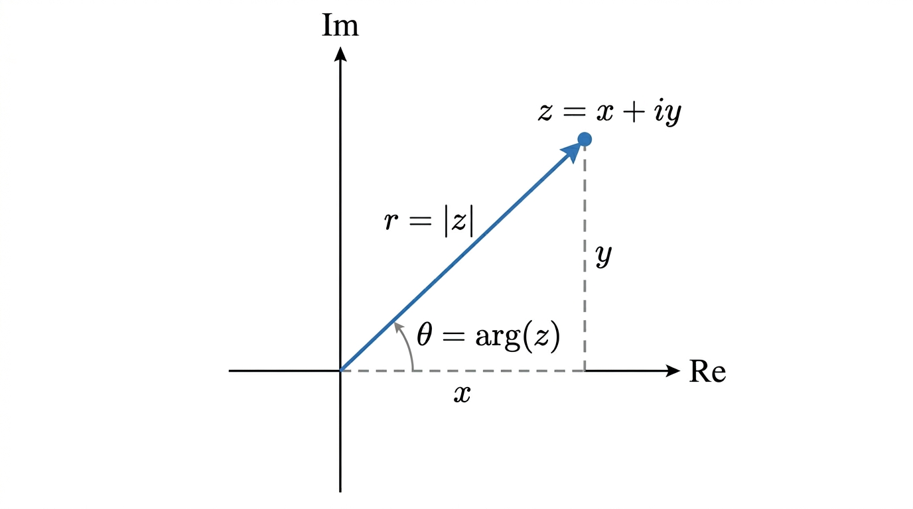
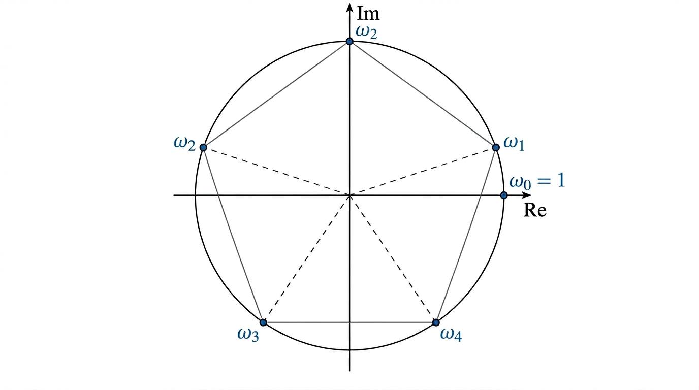

# Complex Numbers

## I. Introduction

**Why complex numbers?** Some polynomial equations (e.g. \(x^2 + 1 = 0\)) have no real solutions. Complex numbers extend \(\mathbb{R}\) so that every polynomial equation has roots.

A complex number has the form:

\[
z = x + iy, \quad x,y \in \mathbb{R}
\]

- **Real part**: \(\text{Re}(z) = x\)
- **Imaginary part**: \(\text{Im}(z) = y\) (this is a *real* number)
- The set of all complex numbers is \(\mathbb{C}\). Note \(\mathbb{R} \subset \mathbb{C}\).

## II. Basic Arithmetic

### Addition

Add real and imaginary parts separately:

\[
(a + bi) + (c + di) = (a+c) + (b+d)i
\]

### Multiplication

Expand using \(i^2 = -1\):

\[
(a + bi)(c + di) = (ac - bd) + (ad + bc)i
\]

### Conjugate

\[
\overline{z} = \overline{x + iy} = x - iy
\]

Key property: \(z \cdot \overline{z} = x^2 + y^2 \in \mathbb{R}\).

### Division

Multiply numerator and denominator by the conjugate of the denominator:

\[
\frac{z_1}{z_2} = \frac{z_1 \cdot \overline{z_2}}{z_2 \cdot \overline{z_2}}
\]

## III. Geometric Representation

A complex number \(z = x + iy\) is a point in the 2D plane (Argand diagram).

**Cartesian form**: \(z = x + iy\)

**Polar form**: \(z = r(\cos\theta + i\sin\theta)\)

- **Modulus** (absolute value): \(|z| = r = \sqrt{x^2 + y^2}\)
- **Argument**: \(\arg(z) = \theta = \arctan(y/x)\)

## IV. Exponential Form

Using Euler's formula \(e^{i\theta} = \cos\theta + i\sin\theta\):

\[
z = re^{i\theta}
\]

Two complex numbers whose arguments differ by \(2\pi\) are equal.

### Key Unit Circle Values

| \(\theta\) | \(\cos\theta\) | \(\sin\theta\) |
|---|---|---|
| \(0\) | \(1\) | \(0\) |
| \(\pi/6\) | \(\sqrt{3}/2\) | \(1/2\) |
| \(\pi/4\) | \(\sqrt{2}/2\) | \(\sqrt{2}/2\) |
| \(\pi/3\) | \(1/2\) | \(\sqrt{3}/2\) |
| \(\pi/2\) | \(0\) | \(1\) |

Derive others by symmetry.

### Operations in Exponential Form

**Multiplication** -- multiply moduli, add arguments:

\[
z_1 z_2 = r_1 r_2 \, e^{i(\theta_1 + \theta_2)}
\]

**Division** -- divide moduli, subtract arguments:

\[
\frac{z_1}{z_2} = \frac{r_1}{r_2} \, e^{i(\theta_1 - \theta_2)}
\]

### Geometric Interpretation

- **Addition**: use Cartesian form -- parallelogram rule (like vector addition)
- **Multiplication**: use exponential form -- rotation by \(\theta_2\) and scaling by \(r_2\)

### Triangle Inequality

\[
|z_1 + z_2| \leq |z_1| + |z_2|
\]

## V. Roots of Unity

Find all \(z\) such that \(z^n = 1\).

Writing \(z = re^{i\theta}\), we need \(r^n = 1\) and \(n\theta = 2k\pi\).

So \(r = 1\) and \(\theta = \frac{2k\pi}{n}\) for \(k = 0, 1, \ldots, n-1\).

The \(n\) roots of unity are:

\[
\omega_k = e^{2ik\pi/n}, \quad k = 0, 1, \ldots, n-1
\]

**Geometric interpretation**: the \(n\)-th roots of unity are equally spaced points on the unit circle, subdividing it into \(n\) equal arcs.

## VI. Solving Complex Equations

**General approach**: write \(z = re^{i\theta}\), substitute into the equation, then equate moduli and arguments separately.

**Example**: Solve \(|z|^2 = z + \overline{z}\).

Write \(z = x + iy\). Then \(x^2 + y^2 = 2x\), giving a circle of centre \((1,0)\) and radius \(1\).

**Example**: Solve \(z^2 = w\) for given \(w = Re^{i\phi}\).

Solutions: \(z = \sqrt{R}\, e^{i(\phi/2 + k\pi)}\) for \(k = 0, 1\). Squaring doubles the argument.

## Exam Checklist

- [ ] Convert between Cartesian, polar, and exponential forms
- [ ] Perform arithmetic (add, multiply, divide) in both forms
- [ ] Find modulus and argument
- [ ] Compute \(n\)-th roots of unity
- [ ] Solve equations in \(\mathbb{C}\) by separating modulus and argument
- [ ] Know unit circle values for standard angles
