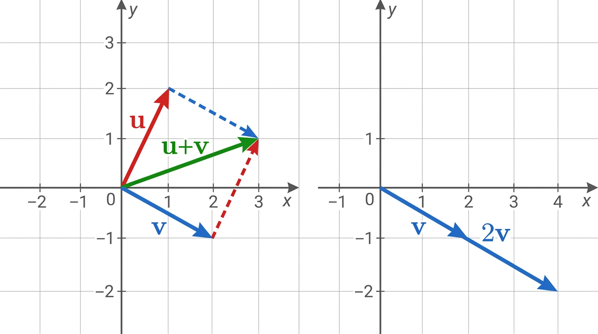

# Vector Spaces

## I. Introduction

Vectors are objects that can be **added** together and **scaled** by numbers. Intuitively, arrows in a plane that can be moved freely.

## II. Definition & Linearity

A **\(\mathbb{K}\)-vector space** \(V\) (where \(\mathbb{K}\) is a field, typically \(\mathbb{R}\) or \(\mathbb{C}\)) satisfies:

1. **Vector addition** is commutative, associative, has a zero vector \(\mathbf{0}\), and every vector has an additive inverse
2. **Scalar multiplication** distributes over addition, is associative, and \(1 \cdot \mathbf{v} = \mathbf{v}\)

### Key Vocabulary

| Term | Definition |
|---|---|
| **Colinear** | \(\mathbf{u} = a\mathbf{v}\) for some scalar \(a\) |
| **Linear combination** | \(a_1\mathbf{u}_1 + a_2\mathbf{u}_2 + \cdots + a_n\mathbf{u}_n\) |
| **Span** of \(S\) | Set of all linear combinations of vectors in \(S\) |
| **Subspace** | Subset \(U \subseteq V\) that is itself a vector space under the same operations |

### Examples

- \(\mathbb{R}^2\): pairs \(\begin{pmatrix} x \\ y \end{pmatrix}\) with component-wise addition and scalar multiplication
- \(\mathbb{K}_n[X]\): polynomials of degree \(\leq n\) (addition of polynomials, scalar multiplication of coefficients)

## III. Vectors of Real Numbers

\(\mathbb{R}^n\) is a vector space for any \(n \geq 1\). A vector is an \(n\)-tuple \(\begin{pmatrix} x_1 \\ \vdots \\ x_n \end{pmatrix}\).

- \(\mathbb{R}^2\): vectors in the 2D plane
- \(\mathbb{R}^3\): vectors in 3D space

## IV. Linear Independence

Vectors \(\mathbf{v}_1, \ldots, \mathbf{v}_n\) are **linearly independent** if:

\[
a_1\mathbf{v}_1 + a_2\mathbf{v}_2 + \cdots + a_n\mathbf{v}_n = \mathbf{0} \implies a_1 = a_2 = \cdots = a_n = 0
\]

Equivalently: no vector in the family can be written as a linear combination of the others.

### How to Check

Set up the equation \(a_1\mathbf{v}_1 + \cdots + a_n\mathbf{v}_n = \mathbf{0}\), solve the resulting system -- if the only solution is all scalars zero, the vectors are independent.

### Basis

A **basis** of \(V\) is a family \(S = (\mathbf{u}_1, \ldots, \mathbf{u}_n)\) such that:

1. \(\text{span}(S) = V\) (every vector is a linear combination of basis vectors)
2. The vectors are linearly independent (no redundancy)

The **dimension** of \(V\) is the size of any basis.

**Canonical basis** of \(\mathbb{R}^n\): the standard unit vectors \(\mathbf{e}_1, \ldots, \mathbf{e}_n\).

**Coordinates**: the coefficients when a vector is expressed as a linear combination of basis vectors. Changing the basis changes the coordinates.

**Example**: \(\mathbb{K}_2[X]\) has basis \(\{1, X, X^2\}\), so \(\dim = 3\). The polynomial \(3X^2 + 2X - 1\) has coordinates \((-1, 2, 3)\) in this basis.

## V. Linear Mappings

A mapping \(f: V \to W\) is **linear** if:

\[
f(a\mathbf{u} + b\mathbf{v}) = af(\mathbf{u}) + bf(\mathbf{v})
\]

Consequence: \(f(\mathbf{0}) = \mathbf{0}\).

### Examples in \(\mathbb{R}^2\)

- Reflections (e.g. vertical symmetry: \((x,y) \mapsto (-x,y)\))
- Rotations
- Scaling
- Projections

An **endomorphism** is a linear map \(f: V \to V\).

Composition of linear maps is linear: if \(f: U \to V\) and \(g: V \to W\) are linear, so is \(g \circ f: U \to W\).

### Kernel & Image

| | Definition | Properties |
|---|---|---|
| **Kernel** \(\ker(f)\) | \(\{\mathbf{v} \in V : f(\mathbf{v}) = \mathbf{0}\}\) | Always contains \(\mathbf{0}\); is a subspace of \(V\) |
| **Image** \(\text{Im}(f)\) | \(\{f(\mathbf{v}) : \mathbf{v} \in V\}\) | Subspace of \(W\) |

**Rank-Nullity Theorem**: \(\dim(\ker f) + \dim(\text{Im}\, f) = \dim V\).

**To find \(\ker(f)\)**: solve \(f(\mathbf{v}) = \mathbf{0}\).

**To find \(\text{Im}(f)\)**: find which vectors can be written as \(f(\mathbf{v})\) for some \(\mathbf{v}\) -- compute images of basis vectors and take their span.

## Exam Checklist

- [ ] Verify vector space axioms for a given set
- [ ] Determine linear independence (set up and solve the system)
- [ ] Find a basis and dimension
- [ ] Express a vector in a given basis (find coordinates)
- [ ] Check if a map is linear
- [ ] Compute kernel and image of a linear map
