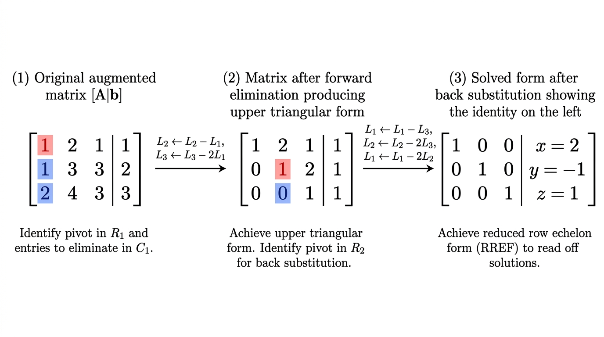

# Matrices

## I. Introduction

A **matrix** represents a linear map. An \(m \times n\) matrix \(M\) corresponds to a linear map \(f: \mathbb{R}^n \to \mathbb{R}^m\).

Each **column** of \(M\) is the image of the corresponding basis vector of \(\mathbb{R}^n\), expressed in the basis of \(\mathbb{R}^m\).

**Example**: Vertical symmetry in \(\mathbb{R}^2\):

\[
f\begin{pmatrix}x\\y\end{pmatrix} = \begin{pmatrix}-x\\y\end{pmatrix} \implies M = \begin{pmatrix}-1 & 0\\0 & 1\end{pmatrix}
\]

## II. Matrices and Linear Maps

For vector spaces \(V\) (dim \(m\)) and \(W\) (dim \(n\)):

- Every linear map \(f: W \to V\) corresponds to an \(m \times n\) matrix
- \(\ker(M) = \ker(f)\), \(\text{Im}(M) = \text{Im}(f)\)
- Different bases give different matrices for the same linear map

## III. Matrix Arithmetic

### Notation

- \(m_{ij}\) = entry in row \(i\), column \(j\)
- \(\mathcal{M}_{m,n}(\mathbb{R})\) = set of \(m \times n\) real matrices

### Transpose

Swap rows and columns: \((M^T)_{ij} = m_{ji}\).

### Addition & Scalar Multiplication

Entry-wise operations. This makes \(\mathcal{M}_{m,n}(\mathbb{R})\) a vector space.

### Matrix Multiplication

Sizes must match: \((m \times k) \cdot (k \times n) = (m \times n)\).

Entry \((i,j)\) of the product:

\[
(MQ)_{ij} = \sum_{\ell=1}^{k} m_{i\ell} \cdot q_{\ell j}
\]

**Key properties**:

- \(MQ\) represents the composition \(f \circ g\) when \(M \leftrightarrow f\), \(Q \leftrightarrow g\)
- **Associative**: \((AB)C = A(BC)\)
- **Not commutative**: \(AB \neq BA\) in general
- **Identity matrix** \(I\): ones on diagonal, zeros elsewhere; \(MI = IM = M\)

## IV. Matrix Inversion

An \(n \times n\) matrix \(M\) is **invertible** if there exists \(M^{-1}\) such that \(MM^{-1} = M^{-1}M = I\).

The following are **equivalent**:

- \(M\) is invertible
- Columns of \(M\) are linearly independent
- Rows of \(M\) are linearly independent
- \(\ker(M) = \{\mathbf{0}\}\)
- \(\det(M) \neq 0\)

Only **square matrices** can be inverted.

## V. Linear Systems

A system of \(n\) linear equations in \(n\) unknowns can be written as \(A\mathbf{x} = \mathbf{b}\).

If \(A\) is invertible, the solution is \(\mathbf{x} = A^{-1}\mathbf{b}\).

### Gaussian Elimination

**Step 1** -- Forward elimination (produce upper triangular form):

Allowed row operations:

1. Swap two rows
2. Multiply a row by a non-zero scalar
3. Add a scalar multiple of one row to another

**Step 2** -- Back substitution:

Starting from the last row, substitute known values upward to solve for all variables.

## VI. Determinant

The **determinant** \(\det(A)\) tells whether \(A\) is invertible: \(\det(A) \neq 0 \iff A\) is invertible.

### 2x2 Case

\[
\det\begin{pmatrix}a & b\\c & d\end{pmatrix} = ad - bc
\]

### General \(n \times n\) Case (Cofactor Expansion)

1. **Minor** \(M_{ij}\): determinant of the matrix with row \(i\) and column \(j\) removed
2. **Cofactor** \(C_{ij} = (-1)^{i+j} M_{ij}\)
3. Expand along any row \(i\) or column \(j\):

\[
\det(A) = \sum_{j=1}^{n} a_{ij} C_{ij} \quad \text{(row expansion)}
\]

**Tips**:

- Choose a row/column with zeros to reduce computation
- Determinant of a **triangular matrix** = product of diagonal entries

### Properties

- \(\det(MN) = \det(M) \cdot \det(N)\)
- \(\det(M^T) = \det(M)\)
- \(\det(M^{-1}) = 1/\det(M)\)
- The determinant is independent of the choice of basis

### Geometric Interpretation

\(|\det(M)|\) equals the volume of the parallelepiped spanned by the column vectors.

## Exam Checklist

- [ ] Construct a matrix from a linear map (use images of basis vectors)
- [ ] Multiply matrices (check size compatibility)
- [ ] Determine invertibility (check columns/determinant/kernel)
- [ ] Solve linear systems via Gaussian elimination
- [ ] Compute determinants using cofactor expansion
- [ ] Apply determinant properties
