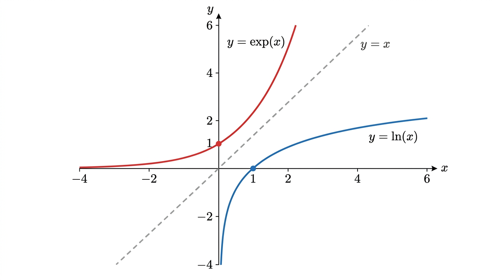
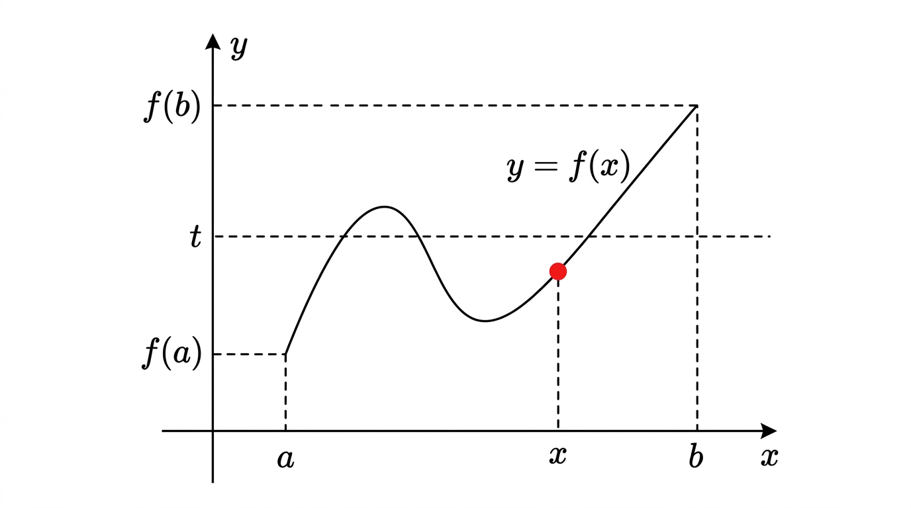

# Continuous Functions

## I. Functions & Classic Functions

A function \(f: A \to B\) maps each element of \(A\) to an element of \(B\). In practice, most functions are \(f: \mathbb{R} \to \mathbb{R}\), with graph \(\{(x, f(x))\}\).

### Trigonometric Functions

Defined via the **unit circle**: for angle \(\theta\) (in radians), the point on the unit circle has coordinates \((\cos\theta, \sin\theta)\).

**Radians**: the angle \(\theta\) equals the arc length on the unit circle.

| \(\theta\) | \(0\) | \(\pi/6\) | \(\pi/4\) | \(\pi/3\) | \(\pi/2\) | \(\pi\) |
|---|---|---|---|---|---|---|
| \(\cos\theta\) | \(1\) | \(\sqrt{3}/2\) | \(\sqrt{2}/2\) | \(1/2\) | \(0\) | \(-1\) |
| \(\sin\theta\) | \(0\) | \(1/2\) | \(\sqrt{2}/2\) | \(\sqrt{3}/2\) | \(1\) | \(0\) |

### Exponential & Logarithm

**Exponential** \(e^x\):

- \(e^{x+y} = e^x \cdot e^y\), \(e^0 = 1\)
- Only function \(a^x\) equal to its own derivative
- \(e \approx 2.71828\), \(e^x > 0\) for all \(x\)

**Natural logarithm** \(\ln x\):

- Inverse of \(e^x\): \(\ln(e^x) = x\)
- \(\ln(ab) = \ln a + \ln b\), \(\ln(a/b) = \ln a - \ln b\)
- \(\ln 1 = 0\), \(\ln e = 1\)
- Defined only for \(x > 0\)
- Any exponent: \(a^x = e^{x \ln a}\), so \(\ln(a^x) = x \ln a\)

## II. Limits

**Intuition**: as \(x\) approaches some value, \(f(x)\) approaches a value (both possibly infinite).

**Notation**: \(\displaystyle\lim_{x \to a} f(x) = l\) or \(f(x) \to l\) as \(x \to a\).

### Four Cases

| | \(f(x) \to b\) (finite) | \(f(x) \to \infty\) |
|---|---|---|
| \(x \to a\) (finite) | Case 1 | Case 2 |
| \(x \to \infty\) | Case 3 | Case 4 |

### Formal Definitions

**Case 4** (\(x \to \infty, f(x) \to \infty\)): For every \(d\), there exists \(c\) such that \(x > c \implies f(x) > d\).

**Case 1** (\(x \to a, f(x) \to b\)): For every \(\varepsilon > 0\), there exists \(\delta > 0\) such that \(|x - a| < \delta \implies |f(x) - b| < \varepsilon\).

### Limit Arithmetic

When limits exist and are finite:

\[
\lim(f \pm g) = \lim f \pm \lim g, \quad \lim(fg) = \lim f \cdot \lim g, \quad \lim(f/g) = \lim f / \lim g
\]

Rules for infinity: \(\infty + \infty = \infty\), \(\infty \times \infty = \infty\), \(c/\infty = 0\), etc.

### Indeterminate Forms

\[
\infty - \infty, \quad \frac{0}{0}, \quad \frac{\infty}{\infty}, \quad 0 \times \infty, \quad 1^\infty, \quad 0^0, \quad \infty^0
\]

These require further analysis to resolve.

## III. Little-o and Big-O Notation

**Little-o**: \(f(x) = o(g(x))\) near \(b\) means \(\displaystyle\lim_{x \to b} \frac{f(x)}{g(x)} = 0\). ("$f$ is negligible compared to $g$")

**Big-O**: \(f(x) = O(g(x))\) near \(b\) means \(\frac{f(x)}{g(x)}\) is bounded near \(b\). ("$f$ grows no faster than $g$")

\(f = o(g) \implies f = O(g)\) (but not conversely).

**For polynomials**: \(P(x) = a_n x^n + \cdots + a_0\) satisfies \(P(x) = O(x^n)\), and \(\displaystyle\lim_{x \to \pm\infty} P(x) = \lim_{x \to \pm\infty} a_n x^n\).

## IV. Continuity

\(f\) is **continuous** at \(a\) if:

\[
\lim_{x \to a} f(x) = f(a)
\]

In practice, continuous = "graph is an unbroken curve".

**Algebraic closure**: if \(f, g\) are continuous, then so are \(f+g\), \(f-g\), \(f \cdot g\), \(f/g\) (where \(g \neq 0\)), and \(f \circ g\).

Both \(e^x\) and \(\ln x\) are continuous on their domains.

## V. Intermediate Value Theorem (IVT)

**Theorem**: If \(f\) is continuous on \([a, b]\) and \(t\) is between \(f(a)\) and \(f(b)\), then there exists \(x \in (a, b)\) such that \(f(x) = t\).

**Application**: Prove existence of roots.

**Example**: Show \(\exists\, x \in \mathbb{R}\) such that \(x^3 + x + 1 = 0\).

- \(f(x) = x^3 + x + 1\) is continuous
- \(f(x) \to +\infty\) as \(x \to +\infty\), \(f(x) \to -\infty\) as \(x \to -\infty\)
- So there exist \(a, b\) with \(f(a) < 0 < f(b)\)
- By IVT, \(\exists\, x\) with \(f(x) = 0\)

## Exam Checklist

- [ ] Evaluate limits (apply arithmetic rules, handle indeterminate forms)
- [ ] Know key trig values from the unit circle
- [ ] Properties of \(\exp\) and \(\ln\)
- [ ] Verify continuity at a point
- [ ] Apply the IVT to prove existence of solutions
- [ ] Use big-O/little-o for comparing growth rates
