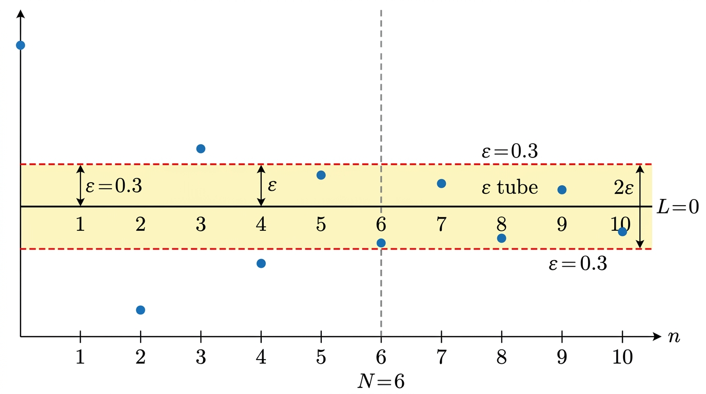

# Sequences and Series

## I. Sequences

A **sequence** is an ordered list of numbers \((u_n)_{n \geq 0}\).

### Classic Sequences

**Arithmetic sequence**: \(u_{n+1} = u_n + d\) (constant increment \(d\)).

\[
u_n = u_0 + nd
\]

**Geometric sequence**: \(u_{n+1} = r \cdot u_n\) (constant ratio \(r\)).

\[
u_n = u_0 \cdot r^n
\]

### Variation

- **Increasing**: \(u_{n+1} \geq u_n\) for all \(n\)
- **Decreasing**: \(u_{n+1} \leq u_n\) for all \(n\)
- **Monotone**: increasing or decreasing

## II. Convergence

\((u_n)\) **converges** to \(l\) if the terms become arbitrarily close to \(l\) for large \(n\).

**Formal definition**: for every \(\varepsilon > 0\), there exists \(N\) such that \(n > N \implies |u_n - l| < \varepsilon\).

### Key Convergence Results

| Sequence | Converges? | Limit |
|---|---|---|
| \(1/n\) (harmonic) | Yes | \(0\) |
| Arithmetic (\(d \neq 0\)) | No | -- |
| Geometric (\(|r| < 1\)) | Yes | \(0\) |
| Geometric (\(r = 1\)) | Yes | \(u_0\) (constant) |
| Geometric (\(|r| > 1\)) | No | -- |

### Recursive Sequences

Defined by a recurrence \(u_{n+1} = f(u_n)\) and initial value(s). Convergence depends on properties of \(f\).

### Asymptotic Behaviour

Comparing sequences near infinity:

- \(u_n = o(v_n)\): \(u\) is negligible compared to \(v\) (\(\lim u_n/v_n = 0\))
- \(u_n = O(v_n)\): \(u\) doesn't grow faster than \(v\) (\(u_n/v_n\) is bounded)

### Important Theorems

**Monotone Convergence Theorem**: A monotone sequence converges iff it is bounded.

**Squeeze Theorem**: If \(a_n \leq u_n \leq b_n\) and \(\lim a_n = \lim b_n = l\), then \(\lim u_n = l\).

## III. Series

A **series** is the sum of terms of a sequence. The **partial sum**:

\[
S_n = \sum_{k=0}^{n} u_k
\]

A series **converges** if \((S_n)\) converges.

### Classic Sums

**Sum of first \(n\) integers**:

\[
\sum_{k=1}^{n} k = \frac{n(n+1)}{2}
\]

**Arithmetic series**:

\[
\sum_{k=0}^{n} (u_0 + kd) = (n+1)u_0 + d\frac{n(n+1)}{2}
\]

**Geometric series** (partial sum):

\[
\sum_{k=0}^{n} r^k = \frac{1 - r^{n+1}}{1 - r} \quad (r \neq 1)
\]

### Convergence of Geometric Series

If \(|r| < 1\), the geometric series converges:

\[
\sum_{k=0}^{\infty} r^k = \frac{1}{1 - r}
\]

**Zeno's paradox**: \(\sum_{k=1}^{\infty} (1/2)^k = 1\). The arrow reaches the target!

### Harmonic Series

\(\displaystyle\sum_{k=1}^{\infty} \frac{1}{k}\) **diverges** (grows to \(\infty\), albeit slowly).

The **alternating harmonic series** \(\displaystyle\sum_{k=1}^{\infty} \frac{(-1)^{k+1}}{k}\) converges (to \(\ln 2\)).

### Absolute Convergence

A series is **absolutely convergent** if \(\sum |u_k|\) converges. Absolute convergence implies convergence (but not conversely -- e.g. the alternating harmonic series).

### D'Alembert's Ratio Test

Consider the ratio \(\displaystyle\rho = \lim_{n \to \infty} \left|\frac{u_{n+1}}{u_n}\right|\):

| \(\rho\) | Conclusion |
|---|---|
| \(\rho < 1\) | Absolutely convergent |
| \(\rho > 1\) | Divergent |
| \(\rho = 1\) | Inconclusive |

**Example**: \(\sum 1/n!\) -- ratio is \(1/(n+1) \to 0 < 1\), so converges absolutely.

## Exam Checklist

- [ ] Identify arithmetic/geometric sequences and write closed-form expressions
- [ ] Apply the formal definition of convergence
- [ ] Use the Monotone Convergence and Squeeze Theorems
- [ ] Compute partial sums of arithmetic and geometric series
- [ ] Determine convergence of geometric series (\(|r| < 1\))
- [ ] Apply D'Alembert's ratio test
- [ ] Distinguish convergence vs absolute convergence
