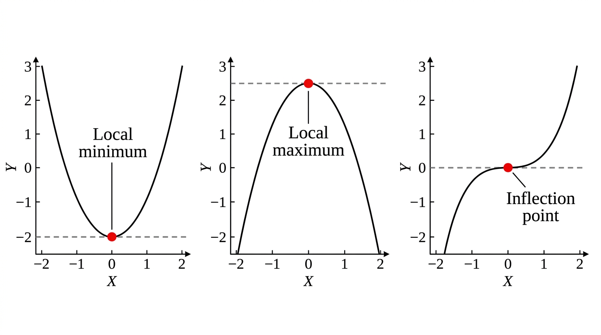

# Differential Calculus

## I. Introduction

Differential calculus studies **infinitesimal variations** of functions.

- 1st derivative = rate of change (speed)
- 2nd derivative = rate of change of the rate (acceleration)

## II. Differentiation

### Definition

The **derivative** of \(f\) at \(a\) is:

\[
f'(a) = \lim_{h \to 0} \frac{f(a+h) - f(a)}{h}
\]

If this limit exists, \(f\) is **differentiable** at \(a\). Geometrically, \(f'(a)\) is the **slope of the tangent** to the graph at \(a\).

### Notation

- \(f'\) or \(\frac{df}{dx}\) or \(f^{(1)}\)
- Second derivative: \(f''\) or \(\frac{d^2f}{dx^2}\) or \(f^{(2)}\)
- **Antiderivative/primitive**: if \(F' = f\), then \(F\) is a primitive of \(f\)

### Classic Derivatives

| \(f(x)\) | \(f'(x)\) |
|---|---|
| \(x^p\) (any \(p \in \mathbb{R}\)) | \(px^{p-1}\) |
| \(e^x\) | \(e^x\) |
| \(\ln x\) | \(1/x\) |
| \(\sin x\) | \(\cos x\) |
| \(\cos x\) | \(-\sin x\) |
| constant \(c\) | \(0\) |

### Combination Rules

| Rule | Formula |
|---|---|
| Constant multiple | \((cf)' = cf'\) |
| Sum | \((f+g)' = f' + g'\) |
| Product | \((fg)' = f'g + fg'\) |
| Quotient | \((f/g)' = \frac{f'g - fg'}{g^2}\) |
| **Chain rule** (composition) | \((f \circ g)' = (f' \circ g) \cdot g'\) |

The chain rule is essential. For \(f(g(x))\):

\[
\frac{d}{dx} f(g(x)) = f'(g(x)) \cdot g'(x)
\]

**Important special case**: if \(f(x) = e^{g(x)}\), then \(f'(x) = g'(x) \cdot e^{g(x)}\).

### Differentiability vs Continuity

**Theorem**: Differentiable \(\implies\) Continuous (but not conversely -- angular points are continuous but not differentiable).

### Variations

- \(f'(x) > 0\) on interval \(I\) \(\implies\) \(f\) increasing on \(I\)
- \(f'(x) < 0\) on interval \(I\) \(\implies\) \(f\) decreasing on \(I\)

## III. Key Theorems

### L'Hopital's Rule

For indeterminate forms \(\frac{0}{0}\) or \(\frac{\infty}{\infty}\):

\[
\lim_{x \to c} \frac{f(x)}{g(x)} = \lim_{x \to c} \frac{f'(x)}{g'(x)}
\]

(provided the right-hand limit exists and \(g'(x) \neq 0\) near \(c\)).

**Example**: \(\displaystyle\lim_{x \to \infty} \frac{x}{e^x} = \lim_{x \to \infty} \frac{1}{e^x} = 0\).

### Mean Value Theorem

If \(f\) is continuous on \([a,b]\) and differentiable on \((a,b)\), then \(\exists\, c \in (a,b)\):

\[
f'(c) = \frac{f(b) - f(a)}{b - a}
\]

Geometric interpretation: somewhere between \(a\) and \(b\), the tangent is parallel to the secant line.

## IV. Stationary Points

A point \(x\) is **stationary** if \(f'(x) = 0\).

### Second Derivative Test

| \(f'(x) = 0\) and... | Type |
|---|---|
| \(f''(x) > 0\) | Local **minimum** |
| \(f''(x) < 0\) | Local **maximum** |
| \(f''(x) = 0\) | Inconclusive (could be inflection point) |

### Procedure

1. Compute \(f'(x)\) and solve \(f'(x) = 0\)
2. Compute \(f''(x)\) and evaluate at each stationary point
3. Classify as local min/max/inconclusive

## V. Differential Equations

Equations involving functions and their derivatives.

### \(f' = f\)

Solutions: \(f(x) = Ce^x\) for any constant \(C\).

### First-Order Homogeneous Linear ODE

\[
f'(x) = a(x) \cdot f(x)
\]

Let \(A(x)\) be a primitive of \(a(x)\). Then all solutions are:

\[
f(x) = C \cdot e^{A(x)}
\]

**Example**: Solve \(f'(x) = (2x+1)f(x)\).

Primitive of \(2x+1\) is \(x^2 + x\). General solution: \(f(x) = Ce^{x^2+x}\).

### Initial Conditions

Use an initial value \(f(x_0) = y_0\) to determine the constant \(C\).

**Example**: \(f'(x) = (2x+1)f(x)\), \(f(0) = 3\). Then \(3 = Ce^0 = C\), so \(f(x) = 3e^{x^2+x}\).

## Exam Checklist

- [ ] Compute derivatives from first principles (limit definition)
- [ ] Know and apply all classic derivatives
- [ ] Use the chain rule, product rule, quotient rule
- [ ] Apply L'Hopital's rule for indeterminate limits
- [ ] Find and classify stationary points using the second derivative test
- [ ] Solve first-order homogeneous linear ODEs
- [ ] Apply initial conditions to find particular solutions
