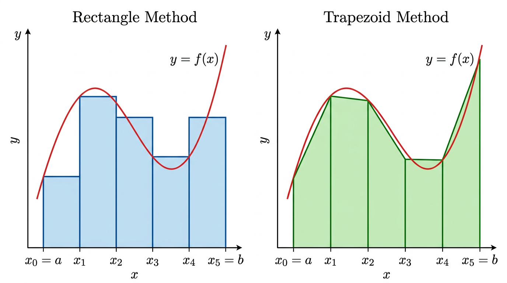

# Integral Calculus

## I. Introduction

Integration computes the **area under a curve** -- the continuous analogue of a sum.

For \(f(x) = 2x\), the area under the curve from \(0\) to \(x\) is \(x^2\). Note \(\frac{d}{dx}(x^2) = 2x\) -- integration and differentiation are inverse operations.

## II. Primitives (Antiderivatives)

If \(F'(x) = f(x)\), then \(F\) is a **primitive** (antiderivative) of \(f\).

Primitives are unique **up to a constant**: if \(F\) is a primitive of \(f\), so is \(F + c\) for any \(c \in \mathbb{R}\).

### Classic Primitives

| \(f(x)\) | Primitive \(F(x) + c\) |
|---|---|
| \(x^n\) (\(n \neq -1\)) | \(\frac{x^{n+1}}{n+1}\) |
| \(1/x\) | \(\ln|x|\) |
| \(e^x\) | \(e^x\) |
| \(\cos x\) | \(\sin x\) |
| \(\sin x\) | \(-\cos x\) |
| \(e^{ax}\) | \(\frac{1}{a}e^{ax}\) |
| \(\cos(ax)\) | \(\frac{1}{a}\sin(ax)\) |
| \(\sin(ax)\) | \(-\frac{1}{a}\cos(ax)\) |

Always add the **integration constant** \(+c\) when finding primitives.

## III. Definite Integrals

\[
\int_a^b f(x)\,dx = F(b) - F(a)
\]

where \(F\) is any primitive of \(f\). The constant cancels out.

Below the \(x\)-axis, area is measured as **negative**.

### Fundamental Properties

- **Linearity**: \(\int_a^b (f + g) = \int_a^b f + \int_a^b g\) and \(\int_a^b \alpha f = \alpha \int_a^b f\)
- **Additivity**: \(\int_a^b f + \int_b^c f = \int_a^c f\)
- **Orientation**: \(\int_a^b f = -\int_b^a f\)
- If \(f(x) \geq 0\) on \([a,b]\), then \(\int_a^b f \geq 0\)
- If \(f(x) \geq 0\) on \([a,b]\) and \(\int_a^b f = 0\), then \(f = 0\) on \([a,b]\)

## IV. Integration by Parts

From the product rule \((fg)' = f'g + fg'\):

\[
\int_a^b f'(x)g(x)\,dx = \big[f(x)g(x)\big]_a^b - \int_a^b f(x)g'(x)\,dx
\]

**Strategy**: choose which factor to differentiate and which to integrate such that the new integral is simpler.

**Example**: \(\int_0^\pi x\cos x\,dx\)

- Let \(g(x) = x\) (differentiate: \(g' = 1\)), \(f'(x) = \cos x\) (integrate: \(f = \sin x\))
- \(= [x\sin x]_0^\pi - \int_0^\pi \sin x\,dx = 0 - [-\cos x]_0^\pi = -(1-(-1)) = -2\)

## V. Integration by Substitution

From the chain rule \(\frac{d}{dx}F(g(x)) = f(g(x)) \cdot g'(x)\):

\[
\int_a^b f(g(x)) \cdot g'(x)\,dx = \int_{g(a)}^{g(b)} f(u)\,du \quad \text{where } u = g(x)
\]

**Key steps**:

1. Identify \(u = g(x)\) such that \(g'(x)\) appears in the integrand
2. Compute \(du = g'(x)\,dx\)
3. Update the bounds: \(a \mapsto g(a)\), \(b \mapsto g(b)\)
4. Integrate in terms of \(u\)

**Example**: \(\int_0^1 2x(x^2+1)^3\,dx\)

- Let \(u = x^2 + 1\), \(du = 2x\,dx\)
- Bounds: \(x=0 \Rightarrow u=1\), \(x=1 \Rightarrow u=2\)
- \(= \int_1^2 u^3\,du = [u^4/4]_1^2 = 4 - 1/4 = 15/4\)

## VI. Numerical Methods

When the function's expression is unknown, approximate the integral by:

- **Rectangles**: subdivide \([a,b]\), sum rectangle areas. Refine by increasing subdivisions.
- **Trapezoids**: use trapeziums for better accuracy with the same number of subdivisions.

## VII. Improper Integrals

Integrals over infinite intervals or with unbounded integrands, defined as limits.

\[
\int_a^{\infty} f(x)\,dx = \lim_{t \to \infty} \int_a^t f(x)\,dx
\]

### Convergence of \(\int_1^\infty 1/x^p\,dx\)

| \(p\) | Near \(\infty\) |
|---|---|
| \(p > 1\) | Converges (to \(\frac{1}{p-1}\)) |
| \(p \leq 1\) | Diverges |

### Convergence of \(\int_0^1 1/x^p\,dx\)

| \(p\) | Near \(0\) |
|---|---|
| \(p < 1\) | Converges |
| \(p \geq 1\) | Diverges |

Intuition: near \(\infty\), higher powers flatten faster (integrable). Near \(0\), lower powers flatten faster (integrable).

Note: \(1/x\) is neither integrable near \(0\) nor near \(\infty\).

## VIII. Series and Integrals

Series and integrals can be compared using inequalities. For a decreasing function \(f\):

\[
\int_{n}^{n+1} f(x)\,dx \leq f(n) \leq \int_{n-1}^{n} f(x)\,dx
\]

Summing these gives bounds relating partial sums to integrals. This technique shows, for example, that the divergence of the harmonic series is connected to the divergence of \(\int 1/x\).

## Exam Checklist

- [ ] Find primitives using the standard table
- [ ] Compute definite integrals via the Fundamental Theorem
- [ ] Apply integration by parts (choose factors wisely)
- [ ] Apply substitution (identify \(u\), update bounds)
- [ ] Determine convergence of improper integrals using the \(1/x^p\) criteria
- [ ] Compare series and integrals for convergence arguments
