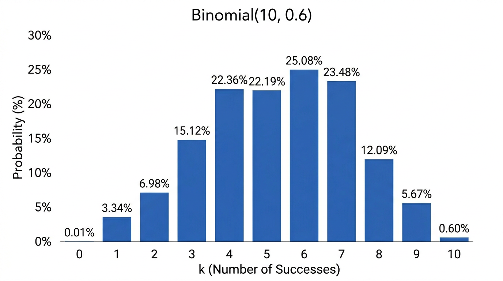
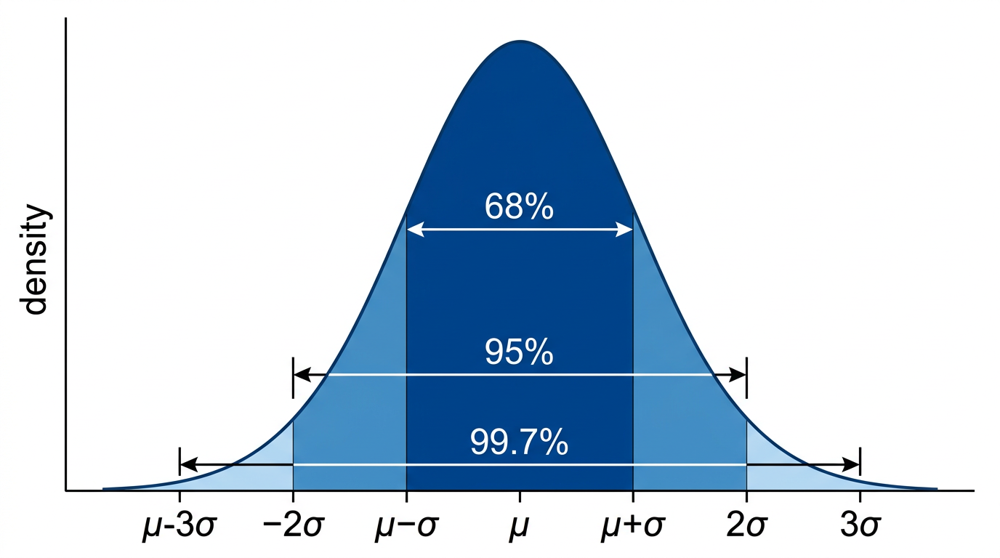

# Probabilities

## I. Introduction

Probability theory provides mathematical tools to model random processes, measure event likelihood, and work with random variables and distributions.

## II. Events

- **Sample space** \(\Omega\): the set of all possible outcomes of a random process
- **Event**: any subset of \(\Omega\)

**Example** (rolling a die): \(\Omega = \{1,2,3,4,5,6\}\), event "even result" = \(\{2,4,6\}\).

### Operations on Events

Events are sets, so use set operations:

| Operation | Meaning |
|---|---|
| \(A \cap B\) | Both \(A\) and \(B\) occur |
| \(A \cup B\) | \(A\) or \(B\) (or both) occur |
| \(\overline{A}\) (complement) | \(A\) does not occur |
| \(A \cap B = \emptyset\) | \(A\) and \(B\) are disjoint (mutually exclusive) |

## III. Probability Laws

A **probability law** \(\Pr\) satisfies:

1. \(\Pr(A) \geq 0\) for all events \(A\)
2. \(\Pr(\Omega) = 1\)
3. If \(A \cap B = \emptyset\), then \(\Pr(A \cup B) = \Pr(A) + \Pr(B)\) (**additivity**)

**Consequences**:

- \(\Pr(\overline{A}) = 1 - \Pr(A)\)
- \(\Pr(\emptyset) = 0\)
- \(A \subseteq B \implies \Pr(A) \leq \Pr(B)\)

### Discrete Probabilities

If \(\Omega\) is countable, probability is a sum:

\[
\Pr(A) = \sum_{\omega \in A} \Pr(\{\omega\})
\]

**Equiprobable** (uniform) case: \(\Pr(A) = \frac{|A|}{|\Omega|}\).

### Continuous Probabilities

If \(\Omega\) is uncountable (e.g. an interval), probability is an integral:

\[
\Pr(A) = \int_A f(x)\,dx
\]

where \(f\) is a **probability density function**.

## IV. Conditional Probabilities

The probability of \(A\) given \(B\):

\[
\Pr(A \mid B) = \frac{\Pr(A \cap B)}{\Pr(B)}
\]

### Bayes' Theorem

\[
\Pr(A \mid B) = \frac{\Pr(B \mid A) \cdot \Pr(A)}{\Pr(B)}
\]

### Law of Total Probability

\[
\Pr(B) = \Pr(B \mid A)\Pr(A) + \Pr(B \mid \overline{A})\Pr(\overline{A})
\]

### Independence

Events \(A\) and \(B\) are **independent** if:

\[
\Pr(A \cap B) = \Pr(A) \cdot \Pr(B)
\]

Equivalently, \(\Pr(A \mid B) = \Pr(A)\) and \(\Pr(B \mid A) = \Pr(B)\).

## V. Random Variables

A **random variable** \(X\) maps outcomes to numerical values.

### Bernoulli(\(p\))

Two outcomes: \(X = 1\) with probability \(p\), \(X = 0\) with probability \(1-p\).

### Binomial(\(n, p\))

Number of successes in \(n\) independent Bernoulli trials:

\[
\Pr(X = k) = \binom{n}{k} p^k (1-p)^{n-k}
\]

Binomial\((n,p)\) = sum of \(n\) independent Bernoulli\((p)\).

### Expected Value (Mean)

\[
E(X) = \sum_k k \cdot \Pr(X = k)
\]

Properties: \(E(X + Y) = E(X) + E(Y)\) (always, even if not independent).

| Distribution | \(E(X)\) |
|---|---|
| Bernoulli\((p)\) | \(p\) |
| Binomial\((n,p)\) | \(np\) |

### Variance

\[
\text{Var}(X) = E\big[(X - E(X))^2\big] = E(X^2) - [E(X)]^2
\]

Measures spread around the mean.

| Distribution | \(\text{Var}(X)\) |
|---|---|
| Bernoulli\((p)\) | \(p(1-p)\) |
| Binomial\((n,p)\) | \(np(1-p)\) |

## VI. The Normal Distribution

A continuous distribution with pdf:

\[
f(x) = \frac{1}{\sigma\sqrt{2\pi}} \exp\left(-\frac{(x-\mu)^2}{2\sigma^2}\right)
\]

- \(\mu\) = mean (centre of the bell curve)
- \(\sigma\) = standard deviation (width)

Probabilities are computed as integrals (use a calculator/table).

Many real-world phenomena are well-modelled by normal distributions.

## Exam Checklist

- [ ] Identify sample space and events for a given problem
- [ ] Apply probability axioms and consequences
- [ ] Compute conditional probabilities using Bayes' theorem
- [ ] Apply the law of total probability
- [ ] Determine independence of events
- [ ] Compute \(\Pr(X=k)\) for Binomial distributions
- [ ] Calculate expected value and variance
- [ ] Set up and evaluate normal distribution probabilities
