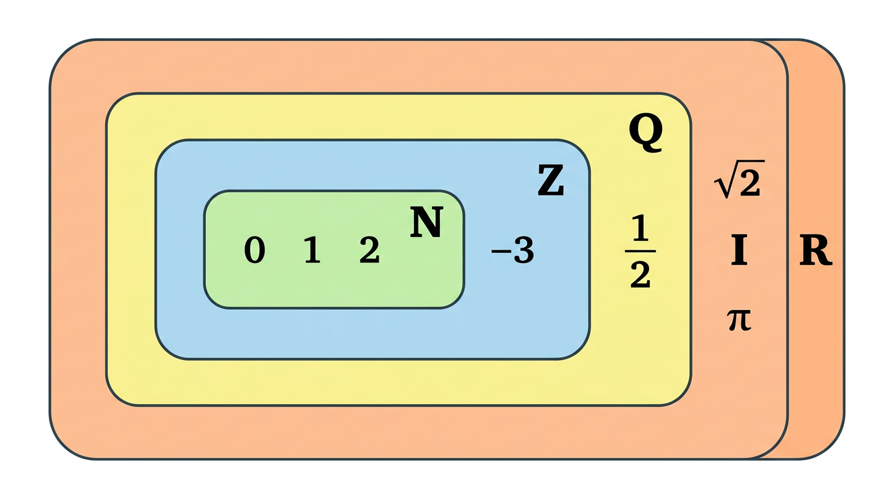
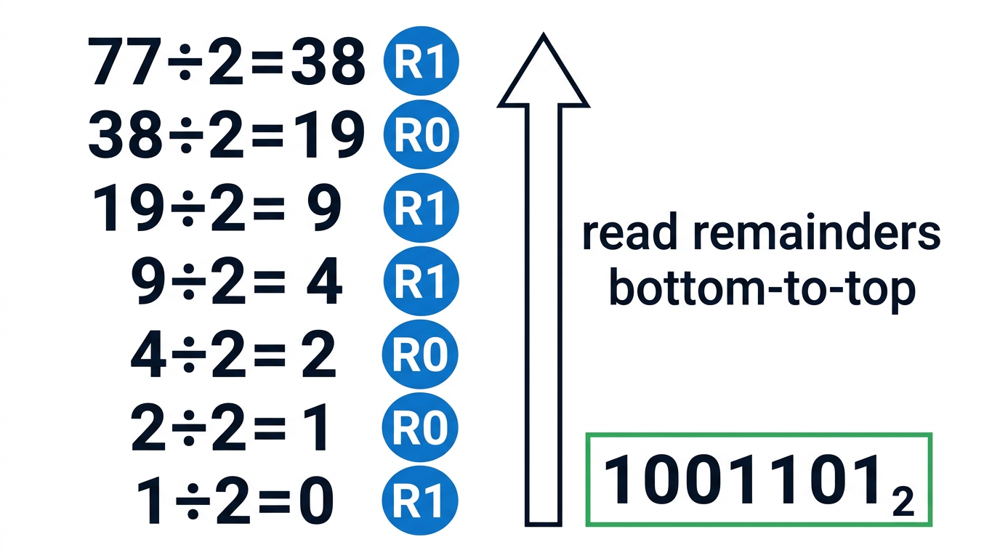

# Numbers

> COMP0147 Discrete Mathematics — UCL Year 1

## Number Sets

| Set | Name | Description |
|-----|------|-------------|
| \(\mathbb{N}\) | Naturals | \(\{0, 1, 2, 3, \ldots\}\) |
| \(\mathbb{Z}\) | Integers | \(\{\ldots, -2, -1, 0, 1, 2, \ldots\}\) |
| \(\mathbb{Q}\) | Rationals | \(\{p/q : p,q \in \mathbb{Z}, q \neq 0\}\) |
| \(\mathbb{I}\) | Irrationals | \(\mathbb{R} \setminus \mathbb{Q}\) |
| \(\mathbb{R}\) | Reals | All points on the number line |

Hierarchy: \(\mathbb{N} \subset \mathbb{Z} \subset \mathbb{Q} \subset \mathbb{R}\), and \(\mathbb{R} = \mathbb{Q} \cup \mathbb{I}\).

## Natural Numbers & Peano Axioms

- **N1:** \(0 \in \mathbb{N}\)
- **N2:** Every \(n \in \mathbb{N}\) has a unique successor \(S(n) \in \mathbb{N}\)
- **N3:** There is no \(n\) with \(S(n) = 0\) (0 is not a successor)
- **N4:** \(S(m) = S(n) \Rightarrow m = n\) (successor is injective)
- **N5 (Induction):** If a set contains 0 and is closed under successor, it equals \(\mathbb{N}\)

## Representations

### Decimal (base 10)

A natural number \(n\) is written as \(d_k d_{k-1} \ldots d_1 d_0\) meaning \(n = \sum_{i=0}^{k} d_i \cdot 10^i\).

### Binary (base 2)

\(n = \sum_{i=0}^{k} b_i \cdot 2^i\) where each \(b_i \in \{0, 1\}\).

### Decimal → Binary Conversion

Repeatedly divide by 2, record remainders bottom-to-top.

Example: \(13 \to\) 13÷2=6 r **1**, 6÷2=3 r **0**, 3÷2=1 r **1**, 1÷2=0 r **1** → \(1101_2\).

## Integers

\(\mathbb{Z} = \mathbb{N} \cup \{-n : n \in \mathbb{N}, n \neq 0\}\). Every natural is an integer; integers add additive inverses.

## Real Numbers

Every real number \(x\) can be written as an infinite sum: the integer part plus a (possibly infinite) decimal expansion \(x = a_0.a_1 a_2 a_3 \ldots = a_0 + \sum_{i=1}^{\infty} a_i \cdot 10^{-i}\).

## Rationals

A rational number is \(p/q\) with \(p, q \in \mathbb{Z}\), \(q \neq 0\).

**Equivalence:** \(\frac{p}{q} = \frac{r}{s}\) iff \(ps = qr\).

**Simplified form:** \(\frac{p}{q}\) is in lowest terms when \(\gcd(p, q) = 1\).

**Theorem:** \(x \in \mathbb{Q}\) if and only if its decimal representation is eventually periodic (repeating).

## Irrationals

**Theorem:** \(\sqrt{2}\) is irrational.

*Proof (by contradiction):* Suppose \(\sqrt{2} = p/q\) with \(\gcd(p,q) = 1\). Then \(2q^2 = p^2\), so \(p^2\) is even, hence \(p\) is even. Write \(p = 2k\). Then \(2q^2 = 4k^2\), so \(q^2 = 2k^2\), hence \(q\) is even. Both \(p, q\) even contradicts \(\gcd(p,q) = 1\). ∎

## Key Facts

- \(\mathbb{R} = \mathbb{Q} \cup \mathbb{I}\) (disjoint union)
- Between any two rationals there exists an irrational
- Between any two irrationals there exists a rational
- \(\pi\) is transcendental (not a root of any polynomial with integer coefficients)
- Sum of two rationals is rational
- Sum of a rational and an irrational is irrational
- It is unknown whether \(\pi + e\) is rational
