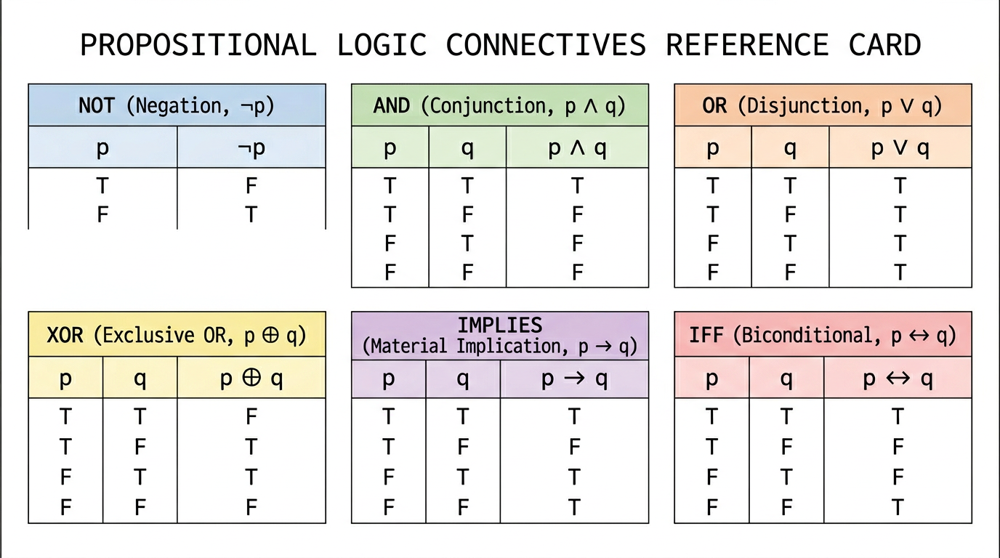
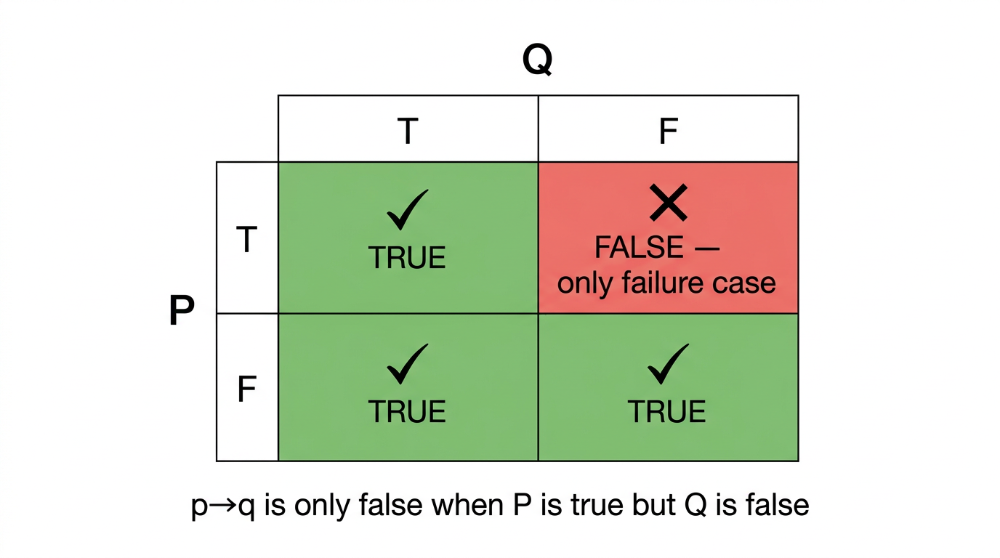

# Propositional Logic

> COMP0147 Discrete Mathematics — UCL Year 1

## Propositions

A **proposition** is a declarative sentence that is either true (T) or false (F), not both.

**Propositional variables:** \(p, q, r, \ldots\) stand for propositions.

## Logical Connectives

### Negation \(\neg p\)

| \(p\) | \(\neg p\) |
|:-----:|:----------:|
| T | F |
| F | T |

### Conjunction \(p \land q\)

| \(p\) | \(q\) | \(p \land q\) |
|:-----:|:-----:|:-------------:|
| T | T | T |
| T | F | F |
| F | T | F |
| F | F | F |

### Disjunction \(p \lor q\) (inclusive or)

| \(p\) | \(q\) | \(p \lor q\) |
|:-----:|:-----:|:------------:|
| T | T | T |
| T | F | T |
| F | T | T |
| F | F | F |

### Exclusive Or \(p \oplus q\)

| \(p\) | \(q\) | \(p \oplus q\) |
|:-----:|:-----:|:--------------:|
| T | T | F |
| T | F | T |
| F | T | T |
| F | F | F |

### Implication \(p \to q\)

| \(p\) | \(q\) | \(p \to q\) |
|:-----:|:-----:|:-----------:|
| T | T | T |
| T | F | F |
| F | T | T |
| F | F | T |

Only false when \(p\) is true and \(q\) is false. Equivalent to \(\neg p \lor q\).

### Biconditional \(p \leftrightarrow q\)

| \(p\) | \(q\) | \(p \leftrightarrow q\) |
|:-----:|:-----:|:----------------------:|
| T | T | T |
| T | F | F |
| F | T | F |
| F | F | T |

True when \(p\) and \(q\) have the same truth value. Equivalent to \((p \to q) \land (q \to p)\).

## Related Conditionals

Given \(p \to q\):

| Name | Form | Relation |
|------|------|----------|
| **Converse** | \(q \to p\) | Not equivalent to original |
| **Contrapositive** | \(\neg q \to \neg p\) | Equivalent to original |
| **Inverse** | \(\neg p \to \neg q\) | Equivalent to converse |

## Operator Precedence (highest → lowest)

\(\neg\) > \(\land\) > \(\lor\) > \(\to\) > \(\leftrightarrow\)

## Bitwise Operators

Apply AND, OR, XOR position-by-position on bit strings.

Example: \(1101 \text{ AND } 1011 = 1001\), \(1101 \text{ OR } 1011 = 1111\), \(1101 \text{ XOR } 1011 = 0110\).

## Classifications

| Type | Definition |
|------|-----------|
| **Tautology** | Always true for all truth assignments |
| **Contradiction** | Always false for all truth assignments |
| **Contingency** | Neither tautology nor contradiction |

## Logical Equivalence

\(p \equiv q\) means \(p \leftrightarrow q\) is a tautology (same truth value in every row).

## Important Equivalences

| Law | Equivalence |
|-----|-------------|
| **Identity** | \(p \land T \equiv p\), \(p \lor F \equiv p\) |
| **Domination** | \(p \lor T \equiv T\), \(p \land F \equiv F\) |
| **Idempotent** | \(p \lor p \equiv p\), \(p \land p \equiv p\) |
| **Double Negation** | \(\neg(\neg p) \equiv p\) |
| **Commutative** | \(p \lor q \equiv q \lor p\), \(p \land q \equiv q \land p\) |
| **Associative** | \((p \lor q) \lor r \equiv p \lor (q \lor r)\), same for \(\land\) |
| **Distributive** | \(p \lor (q \land r) \equiv (p \lor q) \land (p \lor r)\), \(p \land (q \lor r) \equiv (p \land q) \lor (p \land r)\) |
| **De Morgan's** | \(\neg(p \land q) \equiv \neg p \lor \neg q\), \(\neg(p \lor q) \equiv \neg p \land \neg q\) |
| **Absorption** | \(p \lor (p \land q) \equiv p\), \(p \land (p \lor q) \equiv p\) |
| **Negation** | \(p \lor \neg p \equiv T\), \(p \land \neg p \equiv F\) |

## Conditional / Biconditional Equivalences

- \(p \to q \equiv \neg p \lor q\)
- \(p \to q \equiv \neg q \to \neg p\) (contrapositive)
- \(\neg(p \to q) \equiv p \land \neg q\)
- \(p \leftrightarrow q \equiv (p \to q) \land (q \to p)\)
- \(p \leftrightarrow q \equiv \neg p \leftrightarrow \neg q\)
- \(\neg(p \leftrightarrow q) \equiv p \oplus q\)

## Constructing New Equivalences

Use a **chain of equivalences**: start with one side, apply known equivalences step-by-step until you reach the other side.

\[
A \equiv A_1 \equiv A_2 \equiv \cdots \equiv B
\]

Each step must cite a named law. This is the standard method for showing two compound propositions are logically equivalent without truth tables.
