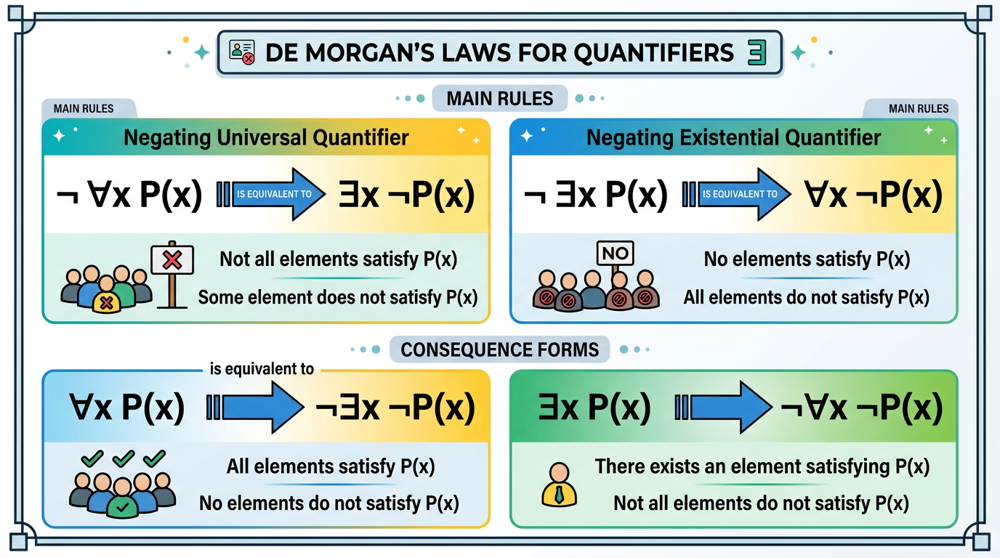

# First-Order Logic

> COMP0147 Discrete Mathematics — UCL Year 1

## Predicates

A **predicate** (propositional function) is a sentence with variables that becomes a proposition when each variable is given a value.

- \(P(x)\): unary (1-ary) predicate
- \(Q(x, y)\): binary (2-ary) predicate
- In general: \(R(x_1, \ldots, x_n)\) is an n-ary predicate

## Domain / Universe of Discourse

The set of all possible values a variable can take. Must be specified (or clear from context) for quantified statements to have a truth value.

## Universal Quantifier \(\forall\)

\(\forall x\, P(x)\): "for every \(x\) in the domain, \(P(x)\) is true."

True iff \(P(x)\) holds for **every** element in the domain.

**Restricted form:** \(\forall x \in S,\, P(x)\) is shorthand for \(\forall x\, (x \in S \to P(x))\).

## Existential Quantifier \(\exists\)

\(\exists x\, P(x)\): "there exists an \(x\) in the domain such that \(P(x)\) is true."

True iff \(P(x)\) holds for **at least one** element in the domain.

**Restricted form:** \(\exists x \in S,\, P(x)\) is shorthand for \(\exists x\, (x \in S \land P(x))\).

## Quantifiers with Restricted Domains

- \(\forall x < 0\!: P(x)\) means \(\forall x\, (x < 0 \to P(x))\)
- \(\exists y > 0\!: P(y)\) means \(\exists y\, (y > 0 \land P(y))\)

Key difference: universal uses \(\to\), existential uses \(\land\).

## Precedence

Quantifiers \(\forall\) and \(\exists\) bind **tighter** than all propositional connectives.

\(\forall x\, P(x) \lor Q(x)\) means \((\forall x\, P(x)) \lor Q(x)\) — use parentheses to clarify: \(\forall x\, (P(x) \lor Q(x))\).

## Bound vs Free Variables

- A variable is **bound** if it is within the scope of a quantifier
- A variable is **free** if it is not bound
- A well-formed sentence has no free variables

Example: In \(\forall x\, (P(x) \land Q(y))\), \(x\) is bound and \(y\) is free.

## De Morgan's Laws for Quantifiers

| Negation | Equivalent |
|----------|-----------|
| \(\neg \forall x\, P(x)\) | \(\exists x\, \neg P(x)\) |
| \(\neg \exists x\, P(x)\) | \(\forall x\, \neg P(x)\) |

"Not all satisfy P" = "some don't satisfy P."
"None satisfies P" = "all fail to satisfy P."

## Nested Quantifiers

Order matters when mixing \(\forall\) and \(\exists\):

| Statement | Meaning |
|-----------|---------|
| \(\forall x\, \forall y\, P(x,y)\) | For every pair, P holds |
| \(\exists x\, \exists y\, P(x,y)\) | Some pair exists where P holds |
| \(\forall x\, \exists y\, P(x,y)\) | For each \(x\), there is a (possibly different) \(y\) |
| \(\exists y\, \forall x\, P(x,y)\) | There is a single \(y\) that works for all \(x\) |

In general: \(\forall x\, \exists y\, P(x,y) \not\equiv \exists y\, \forall x\, P(x,y)\). The second is stronger.

## Negation of Nested Quantifiers

Push \(\neg\) inward, flipping each quantifier:

\[
\neg \forall x\, \exists y\, P(x,y) \;\equiv\; \exists x\, \forall y\, \neg P(x,y)
\]

## Universal Conditional Propositions

The standard form: \(\forall x\, (P(x) \to Q(x))\) — "every \(x\) satisfying \(P\) also satisfies \(Q\)."

**Negation:** \(\neg \forall x\, (P(x) \to Q(x)) \equiv \exists x\, (P(x) \land \neg Q(x))\).

## Vacuous Truth

If \(P(x)\) is false for all \(x\) in the domain, then \(\forall x\, (P(x) \to Q(x))\) is **vacuously true** regardless of \(Q\).

Example: "All unicorns can fly" is true if there are no unicorns.

## Translating Natural Language

Strategy:
1. Identify the domain
2. Identify predicates
3. Determine quantifier structure
4. Write the formula
5. Verify by reading it back in English

Common pattern: "Every student who studies passes" → \(\forall x\, (\text{Student}(x) \land \text{Studies}(x) \to \text{Passes}(x))\).
