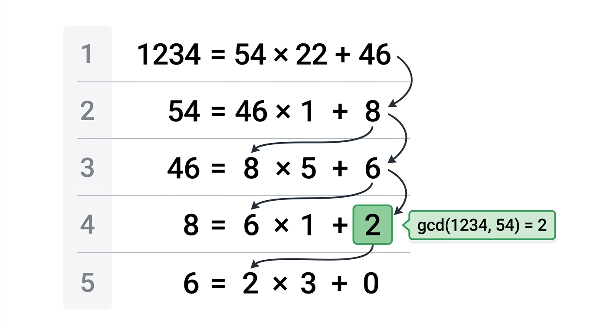

# Modular Arithmetic and Primes

> COMP0147 Discrete Mathematics — UCL Year 1

## Euclid's Division Theorem

For \(a, b \in \mathbb{Z}\) with \(b \neq 0\), there exist **unique** \(q, r \in \mathbb{Z}\) such that:

\[
a = bq + r, \quad 0 \le r < |b|
\]

\(q\) is the **quotient**, \(r\) is the **remainder**.

## Parity

- **Even:** \(a = 2k\) for some \(k \in \mathbb{Z}\)
- **Odd:** \(a = 2k + 1\) for some \(k \in \mathbb{Z}\)

Every integer is either even or odd (not both).

## Divisibility

\(a \mid b\) ("a divides b") means \(b = ac\) for some \(c \in \mathbb{Z}\).

Properties: if \(a \mid b\) and \(a \mid c\), then \(a \mid (b + c)\) and \(a \mid (bk)\) for any \(k \in \mathbb{Z}\).

## Equivalence Relations (Recap)

A relation \(\sim\) on a set \(S\) is an **equivalence relation** if it is:

1. **Reflexive:** \(a \sim a\) for all \(a\)
2. **Symmetric:** \(a \sim b \Rightarrow b \sim a\)
3. **Transitive:** \(a \sim b\) and \(b \sim c \Rightarrow a \sim c\)

The **equivalence class** of \(a\) is \([a] = \{x \in S : x \sim a\}\). Equivalence classes partition \(S\).

## Congruence Modulo \(n\)

For \(n \ge 1\):

\[
a \equiv b \pmod{n} \iff n \mid (a - b)
\]

This is an equivalence relation on \(\mathbb{Z}\). The equivalence class of \(a\) is \(\bar{a} = \{a + kn : k \in \mathbb{Z}\}\).

## \(\mathbb{Z}_n\)

\(\mathbb{Z}_n = \{\bar{0}, \bar{1}, \ldots, \overline{n-1}\}\) — the set of equivalence classes mod \(n\).

**Arithmetic in \(\mathbb{Z}_n\):**
- \(\bar{a} + \bar{b} = \overline{a + b}\)
- \(\bar{a} \cdot \bar{b} = \overline{a \cdot b}\)

**Properties:** associativity, commutativity, additive identity \(\bar{0}\), additive inverse \(\overline{-a} = \overline{n - a}\), distributivity.

## Divisibility Tests

| Divisor | Test |
|---------|------|
| **3** | Sum of digits divisible by 3 |
| **9** | Sum of digits divisible by 9 |
| **11** | Alternating sum of digits \((d_0 - d_1 + d_2 - \cdots)\) divisible by 11 |

These follow from \(10 \equiv 1 \pmod{3}\), \(10 \equiv 1 \pmod{9}\), \(10 \equiv -1 \pmod{11}\).

## Binary Exponentiation (Computing \(a^k \mod n\))

To compute \(a^k \mod n\):

1. Write \(k\) in binary: \(k = b_m b_{m-1} \ldots b_1 b_0\)
2. Start with result \(= 1\)
3. For each bit from left to right: square the result (mod \(n\)), then if the bit is 1, multiply by \(a\) (mod \(n\))

This uses \(O(\log k)\) multiplications instead of \(k\).

## Prime Numbers

\(p > 1\) is **prime** if its only positive divisors are 1 and \(p\). Otherwise \(p\) is **composite**.

Note: 1 is neither prime nor composite.

## GCD and the Euclidean Algorithm

\(\gcd(a, b)\) is the largest positive integer dividing both \(a\) and \(b\).

**Algorithm:** repeatedly apply division:

\[
a = bq_1 + r_1, \quad b = r_1 q_2 + r_2, \quad r_1 = r_2 q_3 + r_3, \quad \ldots
\]

until \(r_k = 0\). Then \(\gcd(a, b) = r_{k-1}\) (the last nonzero remainder).

**Correctness Lemma:** If \(a = bg + s\) then \(\gcd(a, b) = \gcd(b, s)\).

## Extended Euclidean Algorithm

Finds \(\alpha, \beta \in \mathbb{Z}\) such that:

\[
\alpha a + \beta b = \gcd(a, b)
\]

Method: work backwards through the Euclidean algorithm, expressing each remainder as a linear combination of \(a\) and \(b\).

## Fundamental Lemma

If \(\gcd(a, b) = 1\) (coprime), then:
- \(b \mid ac \Rightarrow b \mid c\)
- \(a \mid t\) and \(b \mid t \Rightarrow ab \mid t\)

## Fundamental Property of Primes

If \(p\) is prime and \(p \mid ab\), then \(p \mid a\) or \(p \mid b\).

Extends by induction: if \(p \mid a_1 a_2 \cdots a_n\), then \(p \mid a_i\) for some \(i\).

## Fundamental Theorem of Arithmetic

Every integer \(n > 1\) can be written **uniquely** (up to order) as a product of primes:

\[
n = p_1^{e_1} p_2^{e_2} \cdots p_k^{e_k}, \quad p_1 < p_2 < \cdots < p_k
\]

Proof has two parts:
1. **Existence:** by strong induction — if \(n\) is composite, \(n = ab\) with \(1 < a, b < n\), apply induction to \(a\) and \(b\)
2. **Uniqueness:** using the Fundamental Property of Primes

## Sieve of Eratosthenes

Algorithm to find all primes up to \(N\):

1. List integers from 2 to \(N\)
2. Starting from 2, mark all multiples of the current prime as composite
3. Move to the next unmarked number (it is prime)
4. Repeat until you've processed all numbers up to \(\sqrt{N}\)

All remaining unmarked numbers are prime.
