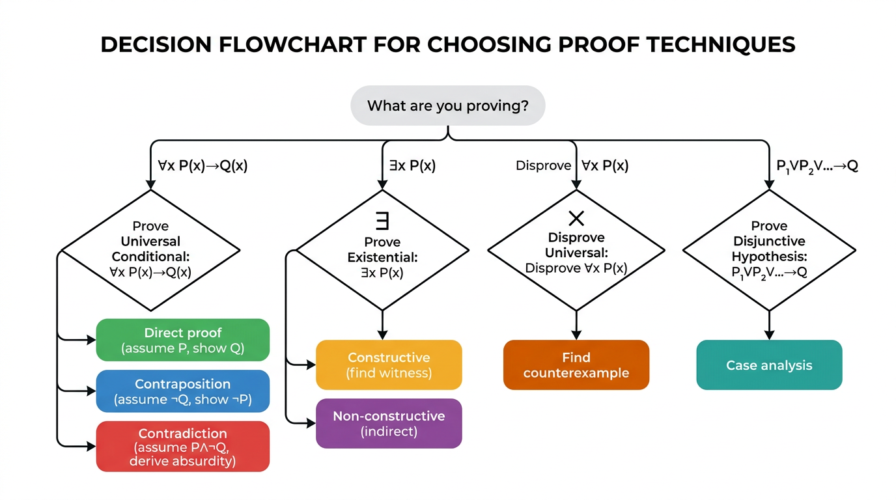

# Proofs

> COMP0147 Discrete Mathematics — UCL Year 1

## Evidence vs Proof

Examples are **not** proofs. A pattern holding for many cases does not guarantee it holds universally.

- **Euler's conjecture** (1769): \(a^4 + b^4 + c^4 = d^4\) has no positive integer solutions — disproved in 1988 by an explicit counterexample.
- \(p(n) = n^2 + n + 41\) is prime for \(n = 0, 1, \ldots, 39\) but \(p(40) = 41^2\) is composite.

## Proof Techniques Overview

| Technique | When to use |
|-----------|------------|
| **Direct** | Assume hypothesis, derive conclusion |
| **Contraposition** | Prove \(\neg Q \to \neg P\) instead of \(P \to Q\) |
| **Contradiction** | Assume negation, derive absurdity |
| **Counterexample** | Disprove a universal claim with one instance |
| **Case analysis** | Split into exhaustive cases, prove each |
| **Existence (constructive)** | Exhibit a specific witness |
| **Existence (non-constructive)** | Show existence without finding the witness |

## How to Write a Proof

1. **State** the theorem clearly
2. **Delimit** scope: "Proof." at the start, "QED" / \(\square\) at the end
3. Each step must follow logically from previous steps, axioms, or known results

## Direct Proof

Form: prove \(\forall x \in D\, (P(x) \to Q(x))\).

Method: Let \(x\) be arbitrary. Assume \(P(x)\). Derive \(Q(x)\).

**Example:** If \(n\) is odd, then \(n^2\) is odd.

*Proof.* Let \(n\) be odd, so \(n = 2k + 1\) for some \(k \in \mathbb{Z}\). Then \(n^2 = (2k+1)^2 = 4k^2 + 4k + 1 = 2(2k^2 + 2k) + 1\), which is odd. \(\square\)

## Proof by Contraposition

To prove \(P \to Q\), instead prove \(\neg Q \to \neg P\) (logically equivalent).

**Example:** If \(n^2\) is odd, then \(n\) is odd.

*Proof (by contraposition).* Suppose \(n\) is even, i.e., \(n = 2k\). Then \(n^2 = 4k^2 = 2(2k^2)\), which is even. So \(n^2\) not odd \(\Rightarrow\) \(n\) not odd. \(\square\)

## Proof by Contradiction

To prove \(P\), assume \(\neg P\) and derive a contradiction.

**Example:** \(\sqrt{2}\) is irrational.

*Proof.* Suppose for contradiction that \(\sqrt{2} = p/q\) with \(p, q \in \mathbb{Z}\), \(q \neq 0\), and \(\gcd(p, q) = 1\). Then \(2q^2 = p^2\), so \(p^2\) is even, hence \(p\) is even. Write \(p = 2m\). Then \(2q^2 = 4m^2\), so \(q^2 = 2m^2\), hence \(q\) is even. But then \(\gcd(p, q) \ge 2\), contradicting \(\gcd(p, q) = 1\). \(\square\)

## Proof by Counterexample

To disprove \(\forall x\, P(x)\), find a single \(x_0\) with \(\neg P(x_0)\).

**Example:** Disprove "for all \(n \ge 0\), \(p(n) = n^2 + n + 41\) is prime."

*Counterexample:* \(p(40) = 40^2 + 40 + 41 = 1681 = 41^2\). \(\square\)

## Proof by Case Analysis

To prove \(P \to Q\), write \(P\) as \(P_1 \lor P_2 \lor \cdots \lor P_n\) (exhaustive cases), then prove \(P_i \to Q\) for each \(i\).

**Example:** \(\min(x, y) + \max(x, y) = x + y\).

*Proof.*
- **Case 1:** \(x \le y\). Then \(\min = x\), \(\max = y\), sum \(= x + y\). ✓
- **Case 2:** \(x > y\). Then \(\min = y\), \(\max = x\), sum \(= y + x = x + y\). ✓

Cases are exhaustive, so the result holds. \(\square\)

## Proof of Equivalence

To prove \(P_1 \iff P_2 \iff \cdots \iff P_n\), prove a circular chain of implications:

\[
P_1 \to P_2 \to \cdots \to P_n \to P_1
\]

This requires \(n\) implications instead of \(\binom{n}{2}\).

## Existence Proofs

### Constructive

Directly exhibit a witness satisfying the property.

**Example:** There exists a positive integer expressible as the sum of two cubes in two different ways.

*Proof.* \(1729 = 10^3 + 9^3 = 12^3 + 1^3\). \(\square\)

### Non-constructive

Show something must exist without finding it explicitly.

**Example:** There exist irrational numbers \(x, y\) such that \(x^y\) is rational.

*Proof.* Consider \(\sqrt{2}^{\sqrt{2}}\). Either it is rational (take \(x = y = \sqrt{2}\)) or it is irrational. In the latter case, take \(x = \sqrt{2}^{\sqrt{2}}\) and \(y = \sqrt{2}\): then \(x^y = (\sqrt{2}^{\sqrt{2}})^{\sqrt{2}} = \sqrt{2}^2 = 2\), which is rational. Either way, such \(x, y\) exist. \(\square\)

## Common Errors

- **Arguing from examples:** showing a pattern for specific values is not a proof for all cases
- **Jumping to conclusions:** skipping logical steps or assuming what needs to be proved
- **Circular reasoning:** using the conclusion (or an equivalent statement) in the proof
- **Confusing a statement with its converse:** \(P \to Q\) does not imply \(Q \to P\)
