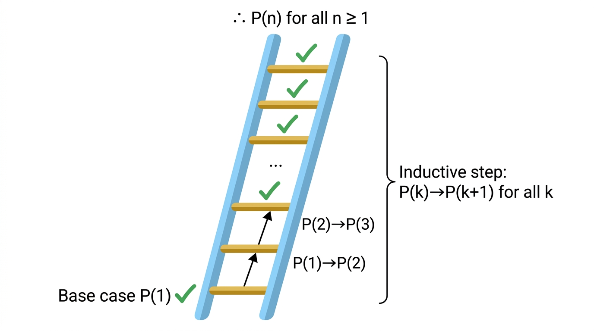
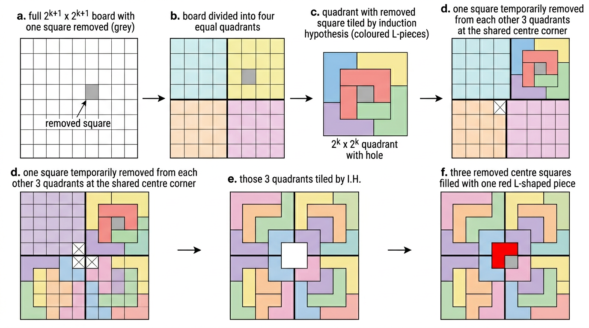
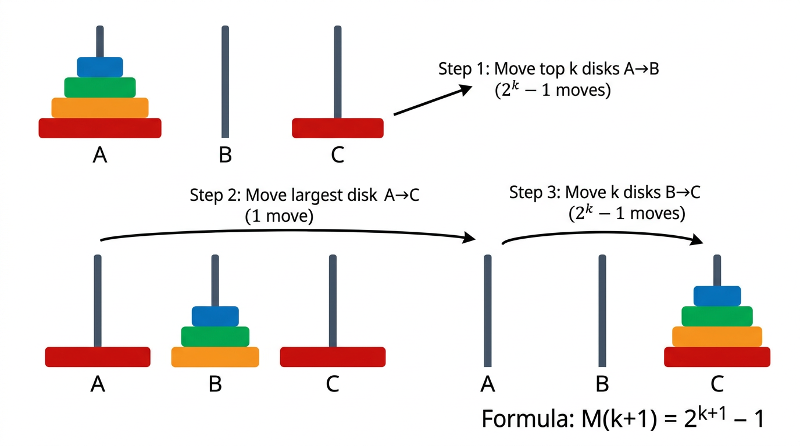

# Induction

> COMP0147 Discrete Mathematics — UCL Year 1

## Principle of Mathematical Induction

To prove \(\forall n \geq b,\; P(n)\), show:

1. **Base step:** \(P(b)\) is true.
2. **Inductive step:** \(\forall k \geq b,\; P(k) \rightarrow P(k+1)\).

Formally:

\[
\bigl[P(b) \;\wedge\; \forall k \geq b\,(P(k) \rightarrow P(k+1))\bigr] \;\longrightarrow\; \forall n \geq b,\; P(n)
\]

**Ladder analogy:** if you can reach step 1, and from any step \(k\) you can always reach step \(k+1\), then you can reach every step.

## Induction Hypothesis (I.H.)

In the inductive step, the assumption that \(P(k)\) holds (for an arbitrary \(k \geq b\)) is called the **induction hypothesis**. You must clearly *use* it when proving \(P(k+1)\).

## Proof Template

1. State \(P(n)\) explicitly.
2. **Base step:** Verify \(P(b)\).
3. **Inductive hypothesis:** Assume \(P(k)\) for an arbitrary \(k \geq b\).
4. **Inductive goal:** State what \(P(k+1)\) says.
5. **Inductive step:** Prove \(P(k+1)\) using the I.H.
6. **Conclusion:** By induction, \(\forall n \geq b,\; P(n)\).

## Canonical Examples

### Sum of first \(n\) naturals

\(P(n)\!: 1 + 2 + \cdots + n = \dfrac{n(n+1)}{2}\).

- Base: \(P(1)\!: 1 = 1(2)/2\). ✓
- I.H.: Assume \(1 + \cdots + k = k(k+1)/2\).
- I.S.: \(1 + \cdots + k + (k+1) = \frac{k(k+1)}{2} + (k+1) = \frac{(k+1)(k+2)}{2}\). ✓

### Sum of first \(n\) odd integers

\(P(n)\!: 1 + 3 + 5 + \cdots + (2n-1) = n^2\).

- Base: \(P(1)\!: 1 = 1^2\). ✓
- I.S.: Add \((2(k+1)-1) = 2k+1\) to both sides of I.H.: \(k^2 + 2k + 1 = (k+1)^2\). ✓

### \(n^3 - n\) divisible by 3

- Base: \(P(0)\!: 0^3 - 0 = 0\), divisible by 3. ✓
- I.S.: \((k+1)^3 - (k+1) = (k^3 - k) + 3k^2 + 3k\). By I.H. \(k^3-k\) is divisible by 3, and \(3k^2+3k\) clearly is. ✓

### A set with \(n\) elements has \(2^n\) subsets

- Base: \(P(0)\!: |\mathcal{P}(\varnothing)| = 1 = 2^0\). ✓
- I.S.: Let \(|A| = k+1\), pick any \(a \in A\). Subsets of \(A\) either contain \(a\) or don't — each group bijects with subsets of \(A \setminus \{a\}\), which has \(2^k\) subsets by I.H. Total: \(2 \cdot 2^k = 2^{k+1}\). ✓

## Cool Examples

### L-shaped tiling of a \(2^n \times 2^n\) board

**Claim:** A \(2^n \times 2^n\) board with one square removed can be tiled by L-shaped trominoes.

- Base: \(n=1\): \(2\times2\) board minus one square is an L-tromino. ✓
- I.S.: Divide the \(2^{k+1}\times 2^{k+1}\) board into four \(2^k\times 2^k\) quadrants. The removed square lies in one quadrant; place one tromino at the centre covering one square from each of the other three quadrants. Now each quadrant is a \(2^k\times 2^k\) board with one square removed — tile by I.H. ✓

### Tower of Hanoi

**Claim:** Minimum moves to transfer \(n\) discs = \(2^n - 1\).

- Base: \(n=1\): 1 move = \(2^1-1\). ✓
- I.S.: Move top \(k\) discs (\(2^k-1\) moves by I.H.), move the largest disc (1 move), move \(k\) discs back (\(2^k-1\) moves). Total: \(2^{k+1}-1\). ✓

### Odd pie fight

In a pie fight among an odd number \(\geq 3\) of people, where everyone throws at the nearest person (ties broken arbitrarily), at least one person is unhit. Proved by strong induction on the number of participants.

## When to Use Induction

Induction **proves** properties — it doesn't **discover** them. You need to already have a conjecture (e.g. a closed-form formula) before applying induction.
